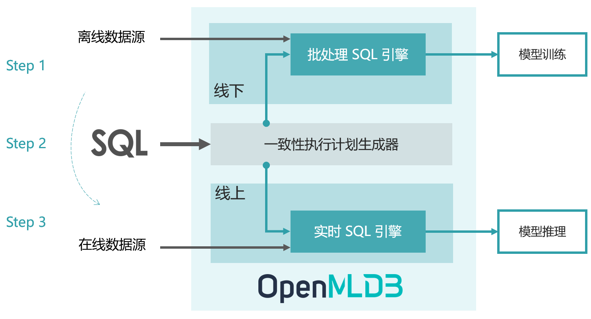

# 简介

OpenMLDB 是一个开源机器学习数据库，提供线上线下一致的生产级特征平台。

## 设计理念

在人工智能工程化落地过程中，企业的数据和工程化团队 95% 的时间精力会耗费在数据处理、数据校验等相关工作上。
为了解决该痛点，头部企业会花费上千小时自研数据与特征平台，来解决诸如线上线下一致性、数据穿越、特征回填、高并发低延迟等工程挑战；其他中小企业则需要购买价格昂贵的 SaaS 服务。

OpenMLDB 致力于解决 AI 工程化落地的数据治理难题，并且已经在上百个企业级人工智能场景中得到落地。OpenMLDB 优先开源了特征数据治理能力、依托 SQL 的开发能力等，旨在为企业级机器学习应用提供线上线下计算一致、高性能低门槛的生产级特征平台。

## 生产级机器学习特征平台

在机器学习的多数应用场景中，如：实时的个性化推荐、风控、反欺诈等场景，为了获得高业务价值的模型，对实时特征计算有较高的要求。但是，由数据科学家所构建的特征计算脚本（一般基于 Python 开发），并不能满足低延迟、高吞吐、高可用等生产级要求，因而无法直接上线。为了在生产环境中上线特征脚本用于模型推理，并且满足实时计算的性能要求，往往需要工程化团队进行代码重构和优化。那么，由于两个团队、两套系统参与了从离线开发到部署上线的全流程，线上线下一致性校验成为一个必不可少的步骤，但其往往需要耗费大量的沟通成本、开发成本和测试成本。

OpenMLDB 基于线上线下一致性的理念设计架构，目标是优化特征平台从开发到部署的流程，实现**开发即上线**，从而降低人工智能的落地成本。

OpenMLDB 完成从特征的离线开发到上线部署，只需要以下三个步骤：
1. 使用 SQL 进行离线特征脚本开发，用于模型训练。
2. SQL 特征脚本一键部署上线，由线下模式切换为线上模式。
3. 接入实时数据，进行线上实时特征计算，用于模型推理。

上图展示了 OpenMLDB 的抽象架构，包含了四个重要的设计组件：

- 统一的 **SQL** 编程语言
- 具备毫秒级延迟的高性能**实时 SQL 引擎**
- 基于 [OpenMLDB Spark 发行版](../tutorial/openmldbspark_distribution.md)的**批处理 SQL 引擎**
- 串联实时和批处理 SQL 引擎，保证线上线下一致性的**一致性执行计划生成器**

关于 OpenMLDB 的设计核心理念和详细架构，请参考 OpenMLDB 开发团队博客[实时特征计算平台架构方法论和实践](https://go005qabor.feishu.cn/docs/doccnMxkNQBh49KipaVmYr0xAjf)。

## 四大核心特性

- **线上线下一致性：** 离线和实时特征计算引擎使用统一的执行计划生成器，线上线下计算一致性得到了天然的保证。
- **毫秒级超低延迟的实时 SQL 引擎**：线上实时 SQL 引擎基于完全自研的高性能时序数据库，对于实时特征计算可以达到毫秒级别的延迟，性能远超流行商业内存数据库（可参考 VLDB 上第四范式联合发表的[论文](http://vldb.org/pvldb/vol14/p799-chen.pdf)），充分满足高并发、低延迟的实时计算性能需求。
- **基于 SQL 定义特征：** 基于 SQL 进行特征定义和管理，并且针对特征计算，对标准 SQL 进行了增强，引入了诸如 `LAST JOIN` 和 `WINDOW UNION` 等定制化语法和功能扩充。
- **生产级特性：** 为大规模企业应用而设计，整合诸多生产级特性，包括分布式存储和计算、灾备恢复、高可用、可无缝扩缩容、可平滑升级、可监控、异构内存架构支持等。

## 常见问题 (FAQ)

 **主要使用场景是什么？**

   目前主要面向人工智能应用，提供高效的线上线下一致性的特征平台，特别针对实时特征需求做了深度优化，达到毫秒级的计算延迟。此外，OpenMLDB 本身也包含了一个高效且功能完备的时序数据库，使用于金融、IoT、数据标注等领域。

 **OpenMLDB 是如何发展起来的？**
   
   OpenMLDB 起源于领先的人工智能平台提供商[第四范式](https://www.4paradigm.com/)的商业软件。其研发团队在 2021 年将商业产品中作为特征工程的核心组件进行了抽象、增强、以及社区友好化，将它们形成了一个系统的开源产品，以帮助更多的企业低成本实现人工智能转型。在开源之前，OpenMLDB 已经作为第四范式的商业化组件之一在上百个场景中得到了部署和上线。
   
 **OpenMLDB 是否是一个 feature store？**
   
   OpenMLDB 认为是目前普遍定义的 feature store 类产品的一个超集。除了可以同时在线下和线上供给正确的特征以外，其主要优势在于提供毫秒级的实时特征。我们看到，今天在市场上大部分的 feature store 是将离线异步计算好的特征同步到线上，但是并不具备毫秒级的实时特征计算能力。而保证线上线下一致性的高性能实时特征计算，正是 OpenMLDB 所擅长的场景。
   
 **OpenMLDB 为什么选择 SQL 作为开发语言？**
   
   SQL 具备表达语法简洁且功能强大的特点，选用 SQL 和数据库开发体验一方面降低开发门槛，另一方面更易于跨部门之间的协作和共享。此外，基于 OpenMLDB 的实践经验表明，经过优化过的 SQL 在特征计算的表达上功能完备，已经经历了长时间的实践考验。

## 学术论文

* Cheng Chen, Jun Yang, Mian Lu, Taize Wang, Zhao Zheng, Yuqiang Chen, Wenyuan Dai, Bingsheng He, Weng-Fai Wong, Guoan Wu, Yuping Zhao, and Andy Rudoff. *[Optimizing in-memory database engine for AI-powered on-line decision augmentation using persistent memory](http://vldb.org/pvldb/vol14/p799-chen.pdf)*. International Conference on Very Large Data Bases (VLDB) 2021.

