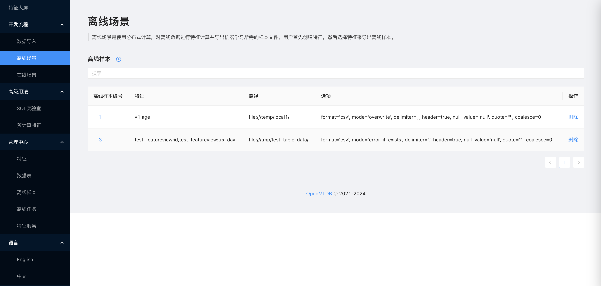

# 离线场景

## 介绍

用户可以在此界面完成所有跟离线场景有关的需求，功能包括：

* 创建离线样本
* 查看离线样本
* 删除离线样本

离线场景下所有导出任务都使用分布式计算，读取离线数据后进行特征抽取并导出成离线样本文本，使用开源的机器学习训练框架即可使用。

## 创建离线样本

用户点击创建按钮，可以创建和导出一次离线样本，用户只需要选择需要导出的特征和导出路径即可，选择的特征要求可参考[在线场景文档](./online_scenario.md)。

除了基础参数，用户点击“更多选项”，还可以指定导出任务的 Spark 资源参数、导出的样本文件格式、导出模式等等。

## 查看离线样本

用户点击离线样本的编号，可以查看离线样本的详情信息，包括样本的导出路径、导出时间、导出模式、导出样本的文件格式等等，也可以查看关联的离线任务的状态和日志，只有离线任务执行成功过才可以开始使用离线样本文件。

## 删除离线样本

在离线样本列表有“删除”按钮，用户点击并确认后可以删除离线样本的记录，注意这里不会删除实际的样本文件，用户如果需要可以手动到导出路径处删除。删除操作同样时不可撤回，请谨慎操作。
