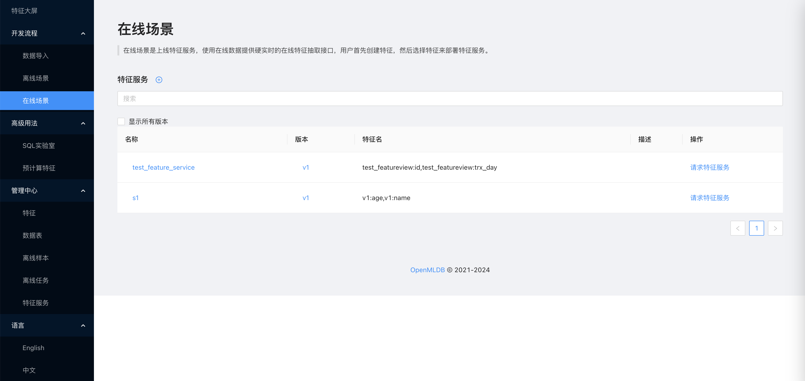
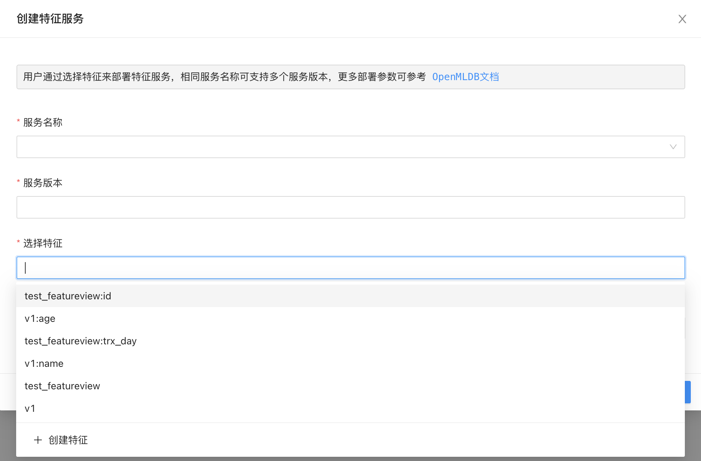
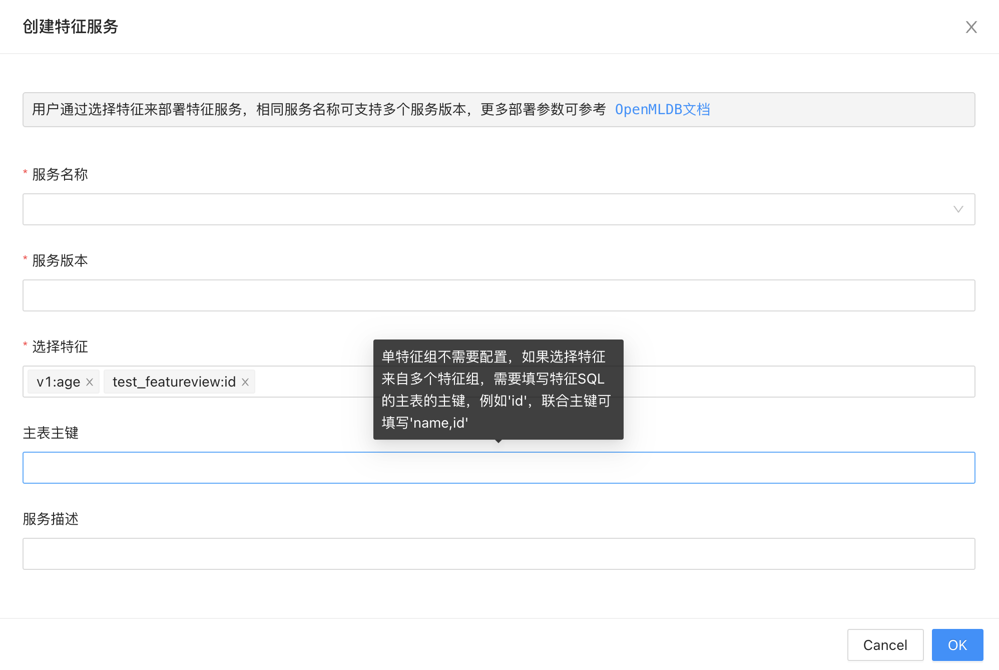
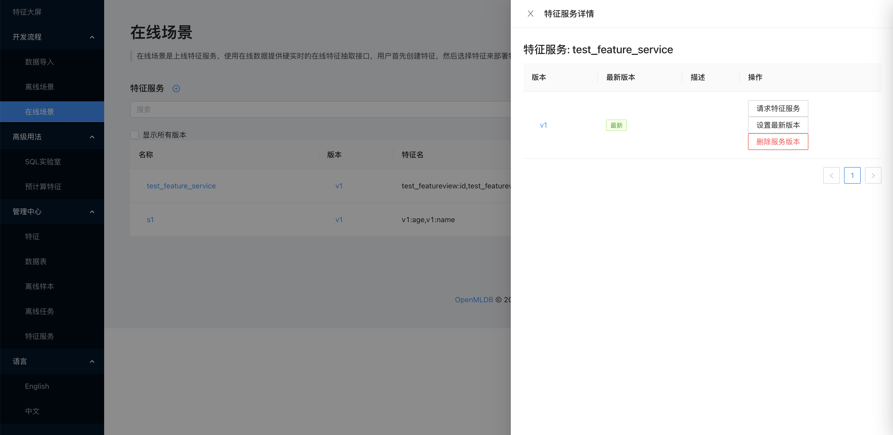
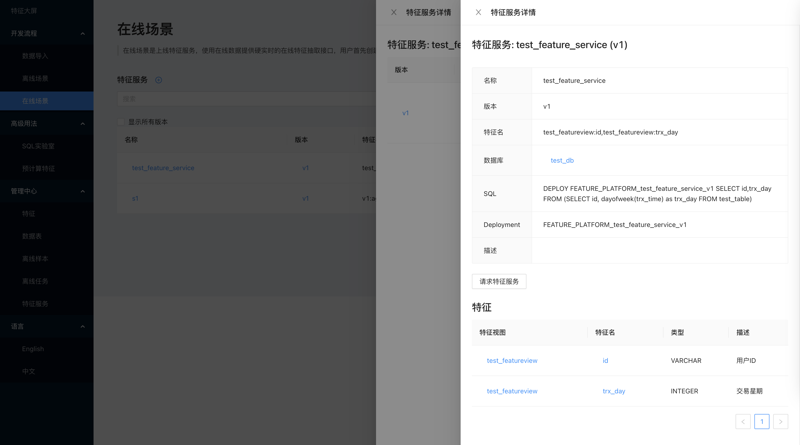
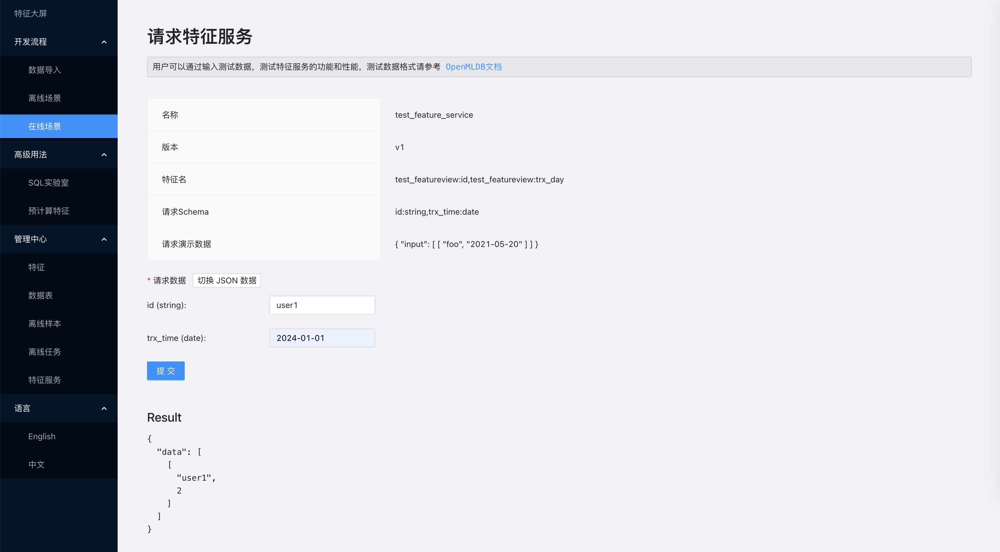

# 在线场景

## 介绍

用户可以在此界面完成所有跟在线场景有关的需求，功能包括：

* 创建特征服务
* 查看特征服务
* 设置服务版本
* 请求特征服务
* 删除特征服务

## 创建特征服务

用户点击创建按钮，可以创建一个特征服务，需要填写特征服务名称（可重复）和服务版本，两者可以确定一个上线的服务实例，然后选择对应的特征。

选择特征时，可以直接选择特征视图名称，这样会自动包含特征视图内所有特征，也可以选择特征视图下某个特征，如果两者都选会自动合并而不会输出重复特征。

如果用户选择的特征来自于不同的特征视图，还需要填写一个主表主键，首先所有选择的特征视图必须有相同的主表，这里填写的就是相同主表的一个主键，可以是某一列的名称也可以是联合主键，必须保证主键的值在主表内是唯一的，否则上线后 SQL 合并会有计算错误。

## 查看特征服务

用户点击特征服务名称，可以查看当前特征服务的详细信息，包括所有的服务版本。

如果点击对应的服务版本，还可以查看对应服务版本的详细信息，包括上线部署使用的 SQL 语句，服务关联的特征列表以及依赖的数据表等。

## 设置服务版本

在特征服务详情页，用户可以设置当前服务版本为最新版本。

注意，多个服务版本可以同时对外提供服务，如果用户请求特征服务的时候不指定服务版本，则会自动请求到最新版本。如果期望客户端不感知后端升级自动使用新版本特征服务，可以使用此功能，但需要保证不同版本特征服务返回结果一致。

## 请求特征服务

点击“请求特征服务”按钮，可以请求当前特征服务，并返回特征服务返回的结果。

这里提供表单模式和 JSON 模式，用户可以直接填写表单内容来请求特征服务，也可以参考上面提供的 JSON 示例来请求特征服务。如果使用 JSON 模式可以一次性请求多行数据，并且请求格式于 OpenMLDB APIServer 线上服务要求的格式一致。

## 删除特征服务

在特征服务列表页有“删除服务版本“按钮，每次只能删除一个版本，如果需要删除多个版本，需要多次点击所有服务版本的删除按钮。

注意，删除操作无法撤回，请务必谨慎操作。
