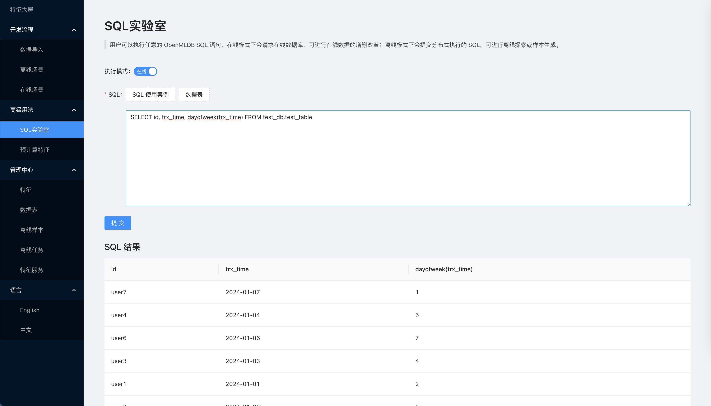

# SQL 实验室

## 介绍

SQL 实验室提供了 OpenMLDB SQL 语句的调试和执行功能，方便用户执行任意 SQL 操作并调试特征抽取的 SQL 语句。

## 在线模式

在线模式下会请求在线数据库，可进行在线数据的增删改查。

在线模式下查询结果会直接返回到前端暂时，注意避免因为超时或数据量太大导致的执行失败问题。

如果用户的 SQL 执行错误，可以通过返回的错误信息进行调试和排查。

## 离线模式

离线模式下会提交分布式执行的SQL，可进行离线探索或样本生成。

离线模式则会返回离线任务信息，可以点击任务ID查看任务的详情和日志。
