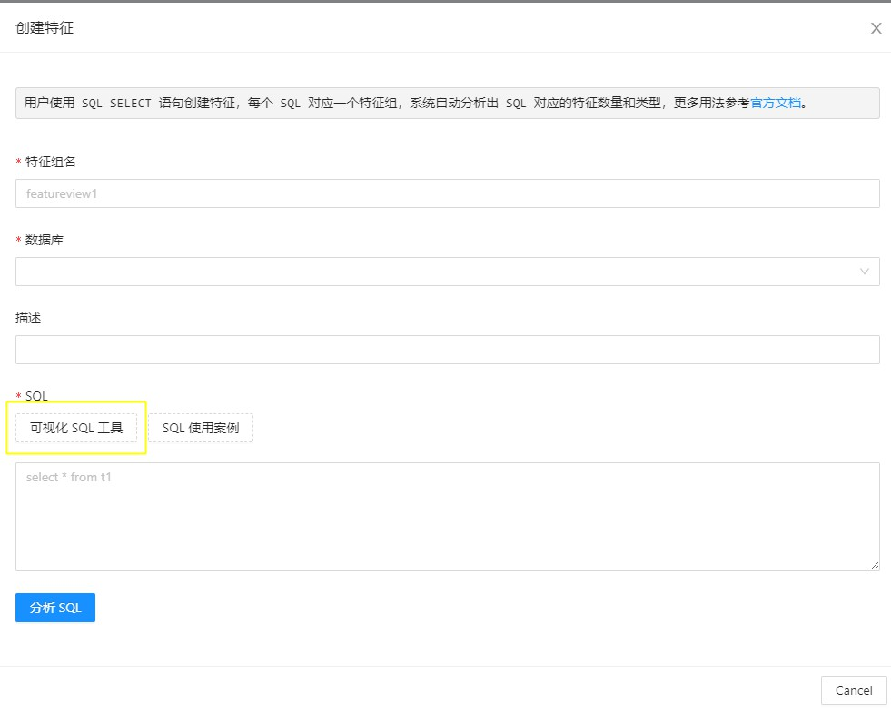
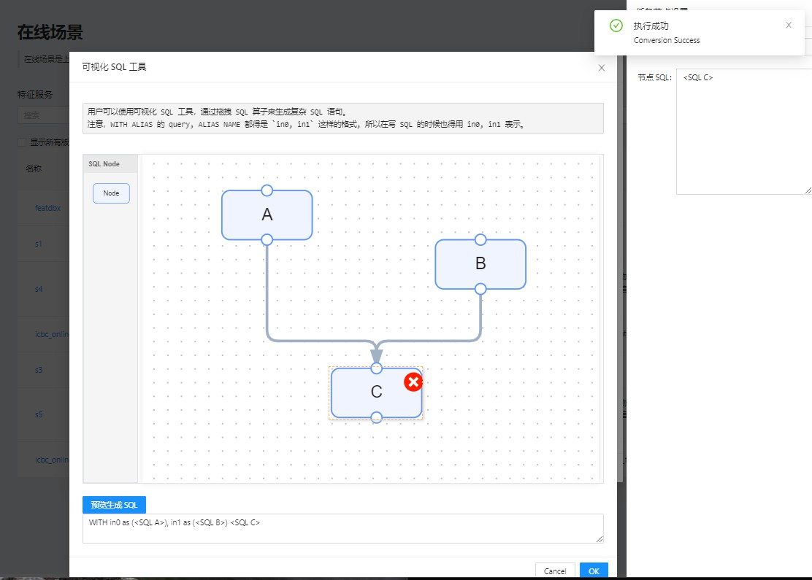

# 可视化 SQL 工具

## 介绍

由于OpenMLDB目前仅支持单条SQL语句生成特征组，我们提供了一个可视化的SQL工具，来方便用户通过拖拉拽SQL算子将多条SQL语句通过`WITH`语句生成一条复杂的SQL语句。

## 使用

可视化SQL工具的入口在创建特征页面中，如下图所示：

使用SQL工具拖拽算子、连接、填入SQL后，可点击“预览生成SQL”生成对应的复杂SQL。如下图所示：

