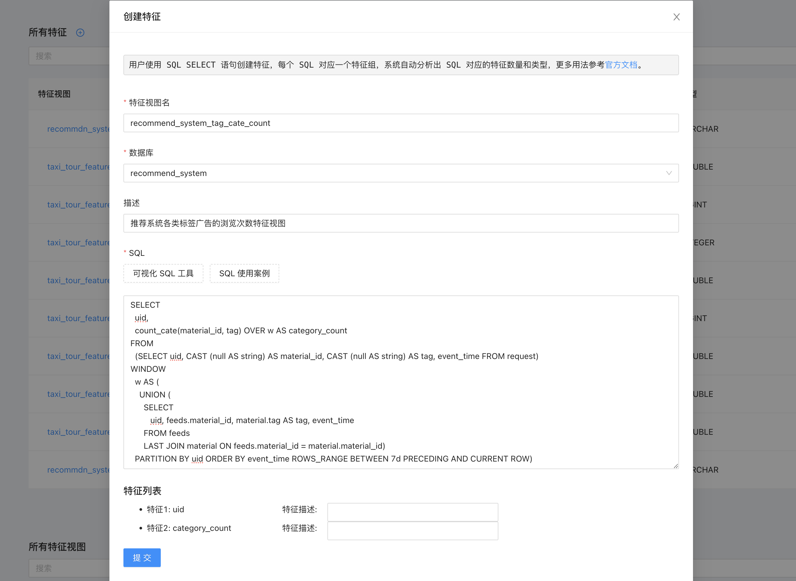
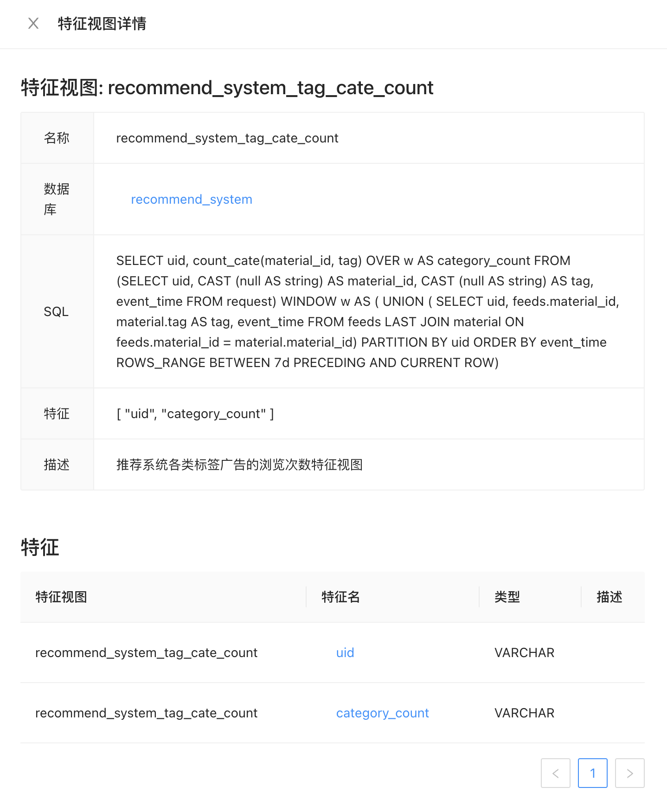
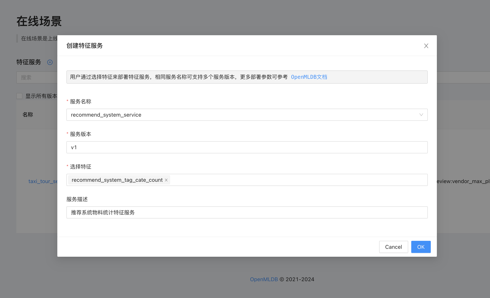
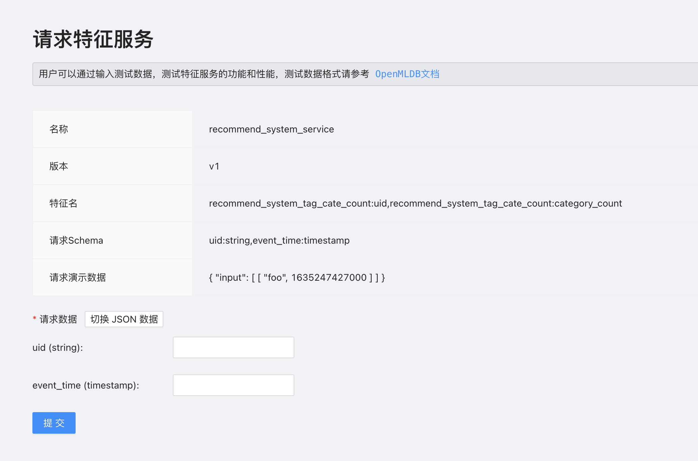

# 电商推荐系统物料统计场景

## 场景介绍

在常见的电商推荐系统中，需对每次推荐请求前的特定时间段内(近7天)，用户对各类标签广告的浏览次数进行精确统计，这些统计数据将被反馈给推荐系统，以便进行更深入的规则分析和判断。

## 场景数据

这里准备3张数据表，首先是请求数据表，用户通过 ID 以及请求时间查询当前窗口所需的特征。

```
CREATE TABLE recommend_system.request (uid string, event_time timestamp)
```

然后是曝光表，需要提供用户 ID 以及物料 ID 信息，为了简化把其他无关的列都去掉。

```
CREATE TABLE recommend_system.feeds (uid string, material_id string, event_time timestamp)
```

最后是物料表，主要包含物料基本信息，包括本场景需要统计的物料类型等，同样简化把无关的字段先去掉。

```
CREATE TABLE recommend_system.material (material_id string, tag string);
```

## 特征设计

根据场景的背景描述，只需要提取用户 ID 以及物料的不同标签出现的次数即可，使用以下的 OpenMLDB SQL 进行特征抽取。

```
SELECT 
  uid, 
  count_cate(material_id, tag) OVER w AS category_count
FROM
  (SELECT uid, CAST (null AS string) AS material_id, CAST (null AS string) AS tag, event_time FROM request) 
WINDOW 
  w AS ( 
    UNION (
      SELECT
         uid, feeds.material_id, material.tag AS tag, event_time
      FROM feeds 
      LAST JOIN material ON feeds.material_id = material.material_id)
  PARTITION BY uid ORDER BY event_time ROWS_RANGE BETWEEN 7d PRECEDING AND CURRENT ROW)
```

可以参考下面的逻辑来理解 SQL 语句的含义：

1. 将曝光表与物料表进行 Join 操作，这样拼接后的表就可以获得物料的标签类型等需要的属性。
2. 对请求表进行拓展，增加 material_id 和 tag 列并使用 null 值填充，这样方便后续与第一步的输出表进行 Union 操作。
3. 使用 Window Union 将第一步和第二步的表进行 Union 操作，这样就得到了一个完整的表，然后基于这个完整表进行窗口操作和查询操作。注意，这里使用 Window Union 而不是 Join + Window 是为了避免 Left Join 可能一行数据产生多行样本，而使用 Last Join 则可能导致副表只能拼接一行数据。
4. 最后使用 count_cate 函数对物料标签进行计数，得到特征。

## 实现流程

### 1. 数据导入

首先创建数据库和数据表，为了方便上线这里把索引也提前加上了。

```
CREATE DATABASE recommend_system;

CREATE TABLE recommend_system.request (uid string, event_time timestamp, INDEX(key=uid, TS=event_time));

CREATE TABLE recommend_system.feeds (uid string, material_id string, event_time timestamp, INDEX(key=uid, TS=event_time));

CREATE TABLE recommend_system.material (material_id string, tag string);
```

因为实际数据需要脱敏，用户可以根据实际情况进行测试数据的导入，本文只演示特征上线流程。

### 2. 定义特征

使用前面介绍的 SQL 语句定义特征。

```
SELECT 
  uid, 
  count_cate(material_id, tag) OVER w AS category_count
FROM
  (SELECT uid, CAST (null AS string) AS material_id, CAST (null AS string) AS tag, event_time FROM request) 
WINDOW 
  w AS ( 
    UNION (
      SELECT
         uid, feeds.material_id, material.tag AS tag, event_time
      FROM feeds 
      LAST JOIN material ON feeds.material_id = material.material_id)
  PARTITION BY uid ORDER BY event_time ROWS_RANGE BETWEEN 7d PRECEDING AND CURRENT ROW)
```

在前端页面创建特征，并自动分析出需要创建的两个特征。



创建成功后可以通过特征视图查看详情。



### 3. 特征上线

在在线场景页面，选择需要上线的特征，并确认创建。



特征服务上线成功后，就可以通过输入请求数据进行在线请求测试了。



## 总结

对于推荐系统模型来说，特征工程是非常重要的一环，FeatInsight 提供了一个简单快速的特征管理和特征上线流程，帮助用户快速上线特征，提升推荐系统的效果，对于更复杂的特征也都可以使用 SQL 来描述和上线。

