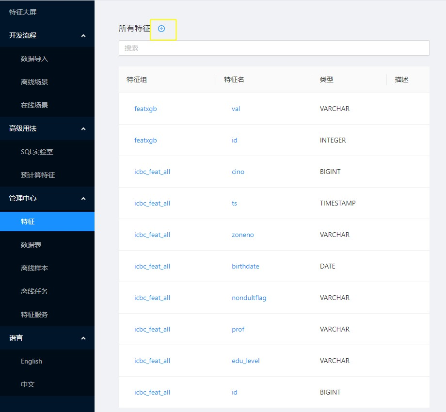
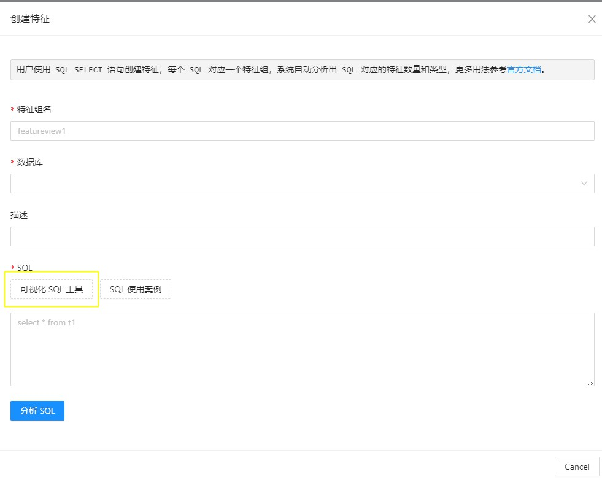
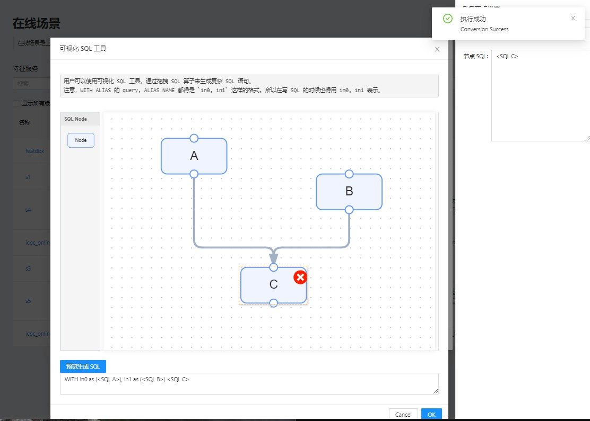

# 功能详解

特征平台支持在线场景和离线场景的使用。基本使用流程如下：

1. 使用任意网页浏览器访问特征平台服务地址 http://127.0.0.1:8888/ 。
2. 导入数据：使用 SQL 命令或前端表单进行创建数据库、创建数据表、导入在线数据和导入离线数据等操作。
3. 创建特征：使用 SQL 语句来定义特征视图，特征平台将使用 SQL 编译器进行特征分析并创建对应的特征。
4. 离线场景：选择想要导入的特征，可以同时选择不同特征视图的特征，并使用分布式计算把样本文件导入到本地或分布式存储。
5. 在线场景：选择想要上线的特征，一键发布成在线特征抽取服务，然后可使用 HTTP 客户端进行请求和返回在线特征抽取结果。

以下我们将逐一介绍每个模块的具体信息和使用方法。

## 数据导入

特征平台的数据导入功能包含以下几个功能操作：

1. 创建数据库：创建新的数据库。同时可查看已创建的数据库及详情。
2. 创建数据表：用户可以选择手动创建，或者通过SQL、parquet或hive方式创建数据表。同时可查看已创建的数据库及包含的数据表。
3. 导入数据：用户可根据不同在离线需求导入对应数据。
	-- 在线数据：用户可选择使用SQL导入，或者通过parquet、csv或hive方式导入。也可手动插入单行数据到在线数据库中。
	-- 离线数据：用户可选择使用SQL导入，或者通过parquet、csv或hive方式导入。主要区别为OpenMLDB执行模式不同。

## 创建特征

数据准备完成后，用户可选择在线或离线场景创建特征。用户可从“管理中心-特征-所有特征”处点加号创建新的特征，如下图所示。或者从在离线场景的“选择特征”处创建特征。

用户需要填写特征视图名，数据库名，和SQL语句。可查看“SQL使用案例”和使用“[可视化SQL工具](#可视化sql工具)”方便SQL的填写。每个SQL对应一个特征视图，点击”分析SQL”，系统将会自动分析出 SQL 对应的特征数量和类型。点击“提交”完成特征视图的创建。

## 离线场景使用流程

离线场景是使用分布式计算，对离线数据进行特征计算并导出机器学习所需的样本文件。在完成数据导入和特征创建之后，用户可以选择特征来导出离线样本。

## 在线场景使用流程

在线场景是上线特征服务，使用在线数据提供硬实时的在线特征抽取接口。在完成数据导入和特征创建之后，用户可以选择特征来创建特征服务。

同时此界面提供特征服务测试功能，用户可使用该界面进行测试。

## 高级用法

### SQL实验室

SQL实验室提供OpenMLDB SQL语句的执行能力。 在线模式下会请求在线数据库，可进行在线数据的增删改查。
离线模式下会提交分布式执行的SQL，可进行离线探索或样本生成。

### 预计算特征

用户可以通过预计算把特征值直接存入OpenMLDB在线表中，然后访问在线表数据进行读写特征。如果需要实现更复杂的特征计算逻辑，可以通过命令行或SDK来编写OpenMLDB SQL实现。

### 可视化SQL工具

由于OpenMLDB目前仅支持单条SQL语句生成特征组，我们提供了一个可视化的SQL工具，来方便用户通过拖拉拽SQL算子将多条SQL语句通过`WITH`语句生成一条复杂的SQL语句。

可视化SQL工具的入口在创建特征页面中，如下图所示：

使用SQL工具拖拽算子、连接、填入SQL后，可点击“预览生成SQL”生成对应的复杂SQL。如下图所示：

### 管理中心

特征平台提供了对于数据表，特征，任务以及服务的管理功能。用户可以在管理中心查看和管理相关资源。目前支持查看和管理的资源如下：
- 特征：查看目前已创建的特征视图以及其中的单个特征。具体信息包括名称、对应数据库、SQL、依赖表等。
- 数据表：查看目前已创建的数据库及数据表。数据表的具体信息包括schema、关联特征视图、关联特征服务等。
- 离线样本：查看已导出的离线样本信息。具体信息包括特征名、导出路径、SQL、相关联的离线任务状态、日志等。
- 离线任务：查看运行中/已运行的离线任务。具体信息包括任务类型、状态、运行日志等。
- 特征服务：查看已上线的特征服务。具体信息包括版本、特征名、SQL、Deployment、相关联的特征及依赖表等。并提供服务测试界面。