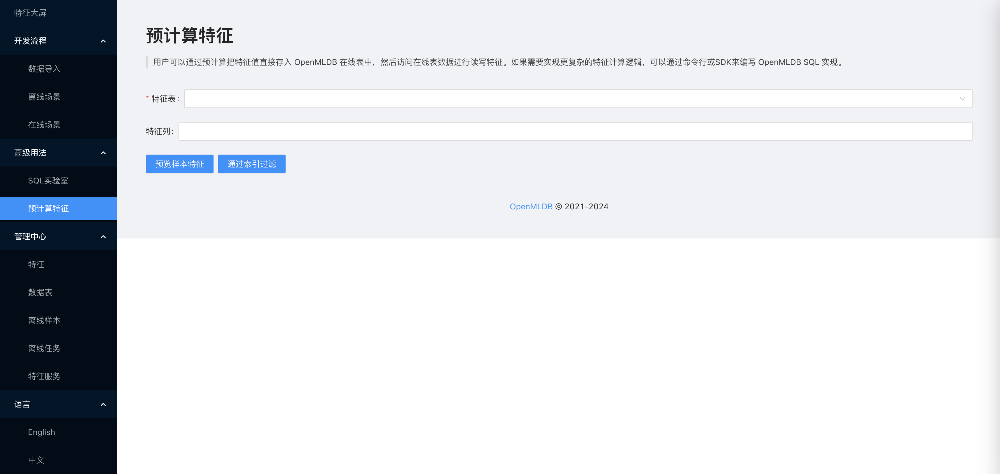
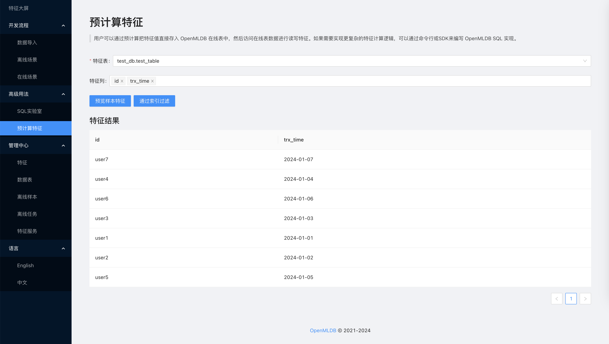
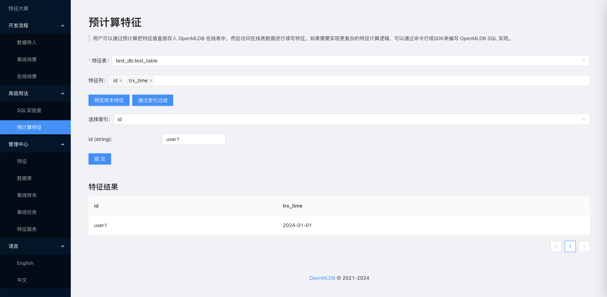

# 预计算特征

## 介绍

用户可以通过预计算把特征值直接存入OpenMLDB在线表中，然后访问在线表数据进行读写特征。

OpenMLDB 提供了类似 Redis 的内存数据索引查询功能，可以快速高效得提取预先计算好的特征值，这个功能也和传统 Feature Store 的在线存储实现类似，但如果特征抽取逻辑修改了也需要在外部的预计算逻辑上提前修改。

## 预览样本特征

用户可以直接选择特征表，然后选择需要提取的特征列，点击“预览样本特征”即可进行特征的预览。

注意，如果需要实现更复杂的特征计算逻辑，例如对特征列进行表达式计算，可以通过命令行或 SDK 来编写 OpenMLDB SQL 实现。

## 通过索引过滤

用户除了预览随机的样本特征，还可以通过数据表的索引来检索。首先选择表内包含的索引，如果想通过其他索引方式查询则可以使用 SQL 来创建新的索引，然后根据索引填写对应的值，这样就可以实现精确的预计算特征检索了。

