# 数据导入

## 介绍

OpenMLDB 特征平台在前端支持数据导入相关功能，功能如下：

* 数据库管理
  * 创建数据库
  * 查看数据库
  * 删除数据库
* 数据表管理
  * 创建数据表
  * 查看数据表
  * 删除数据表
* 数据导入
  * 在线数据导入
  * 离线数据导入

用户可以在此页面完成特征工程需要的所有在线和离线数据表的创建和导入。

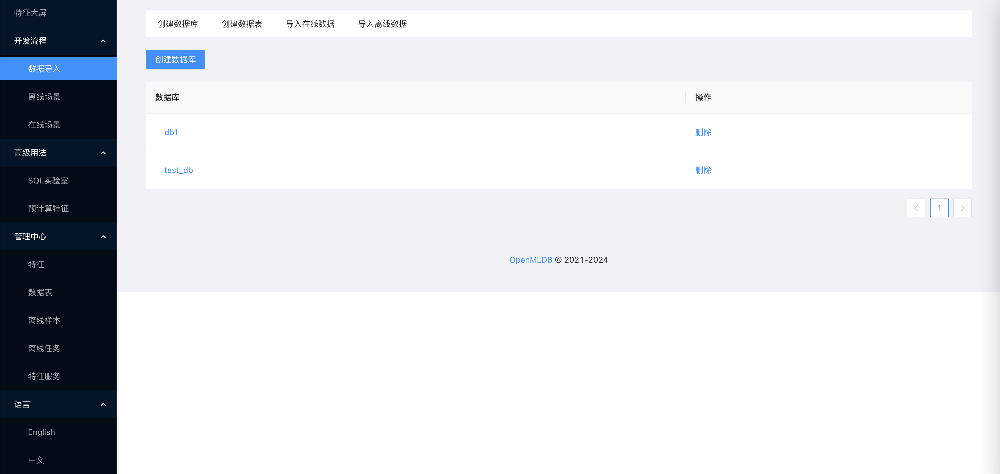

## 创建数据库

在创建数据库页面，可以通过点击“创建数据库”按钮来创建新的数据库，只需要输入不重复的数据库名即可。

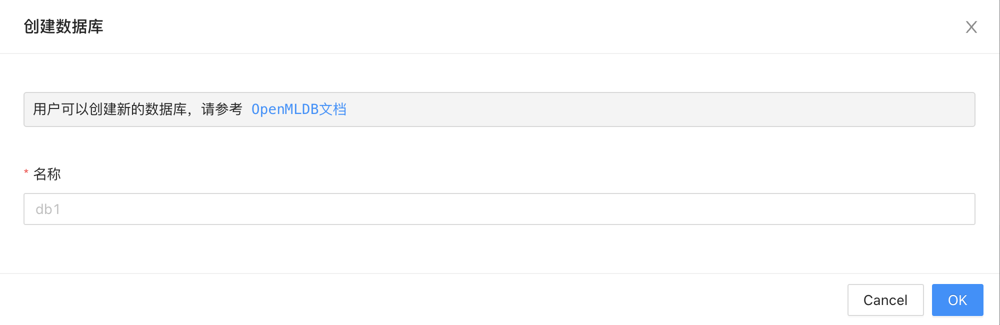

在同一个页面展示了 OpenMLDB 的所有数据库列表，可以通过列表来查看数据库名称和执行删除操作。

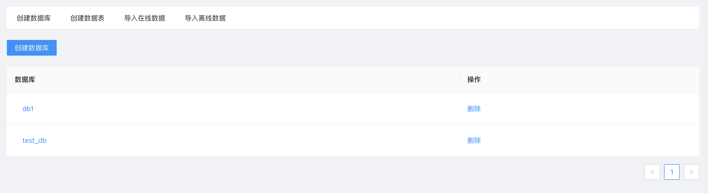

点击数据库名称，还可以查看数据库内详情，包括该数据库下所有数据表，还能进一步点击查看数据表详情。

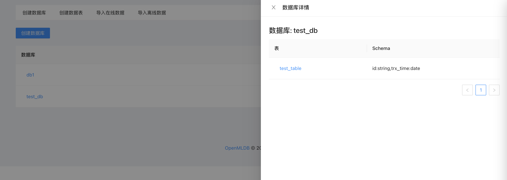

## 创建数据表

在创建数据表页面，包含了“创建数据表”、“使用 SQL 创建表”、“使用 Parquet 创建表”和“使用 Hive 创建表”四种功能。

选择“创建数据表”按钮，只需要填写表名以及每一列的字段名和类型即可，简单易用但限制是无法直接指定索引。

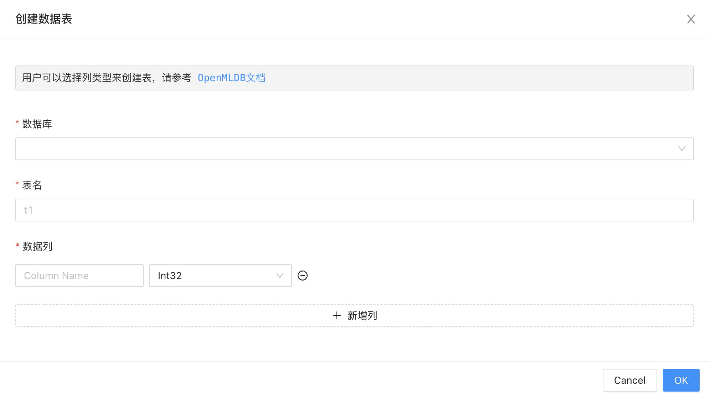

选择“使用 SQL 创建表”按钮，用户可以输入 SQL 语句来创建数据表，灵活性最强并且可以指定索引。

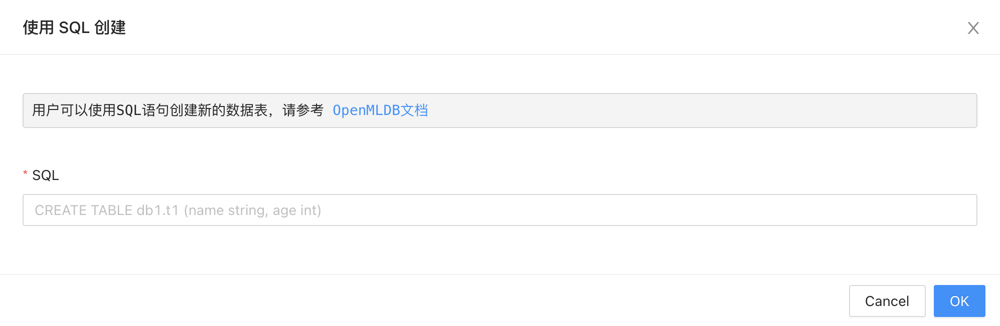

选择“使用 Parquet 创建表”按钮，用户可以输入 Parquet 文件路径来创建数据表，同样无法指定索引。

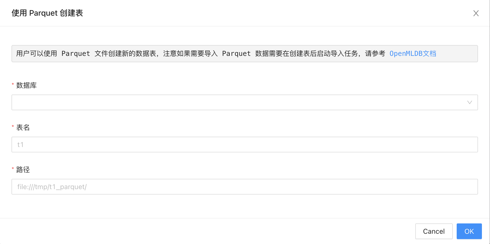

选择“使用 Hive 创建表”按钮，用户可以输入 Hive 表名来创建数据表，同样无法指定索引。

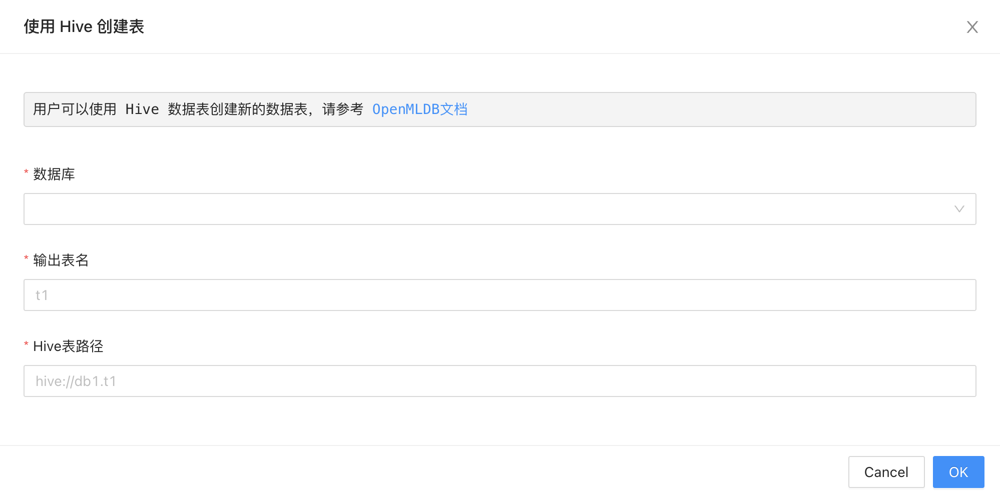

在同一个页面展示了 OpenMLDB 的所有数据表列表，可以通过列表来查看数据表名称和执行删除操作。

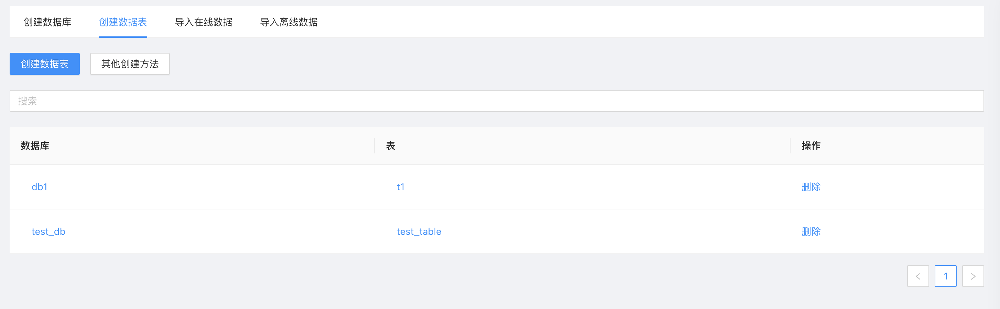

点击数据库名称，可以参看数据库详情，点击数据表名称，则查看数据表的详情信息，并且可以在详情页快速预览在线表的数据。

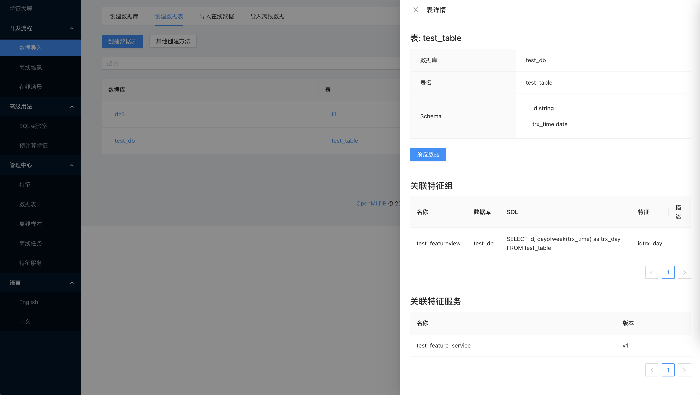

## 导入在线数据

在导入在线表页面，包含了“使用 SQL 导入”、“插入单行数据”、“使用 Parquet 导入”、“使用 CSV 导入”和“使用 Hive 导入”的五种功能。

选择“使用 SQL 导入”， 用户可以执行任意的“INSERT”或“LOAD DATA”语句来导入数据。

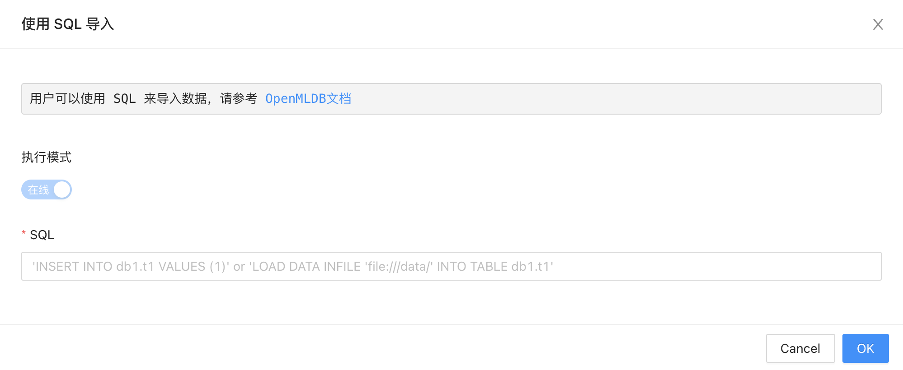

选择“插入单行数据”，用户可以手动输入单行数据来导入数据。

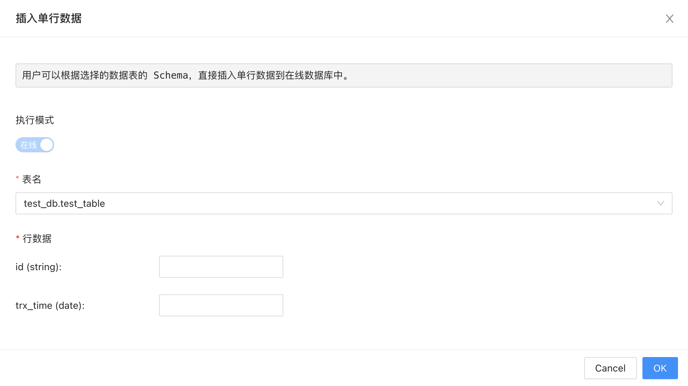

选择“使用 Parquet 导入”，用户可以输入 Parquet 文件路径来导入数据。

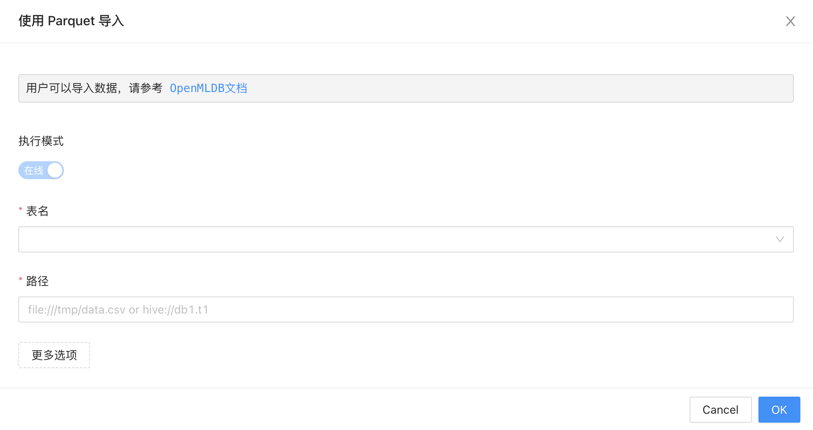

选择”使用 CSV 导入”，用户可以输入 CSV 文件路径来导入数据。

选择“使用 Hive 导入”，用户可以输入 Hive 表名来导入数据。

## 导入离线数据

导入离线数据功能和导入在线数据功能类似，但暂时不支持插入单行离线数据，并且所有的导入任务都会切换到离线模式执行。

在导入离线表页面，包含了“使用 SQL 导入”、“使用 Parquet 导入”、“使用 CSV 导入”和“使用 Hive 导入”的四种功能。

选择“使用 SQL 导入”， 用户可以执行任意的“INSERT”或“LOAD DATA”语句来导入数据。

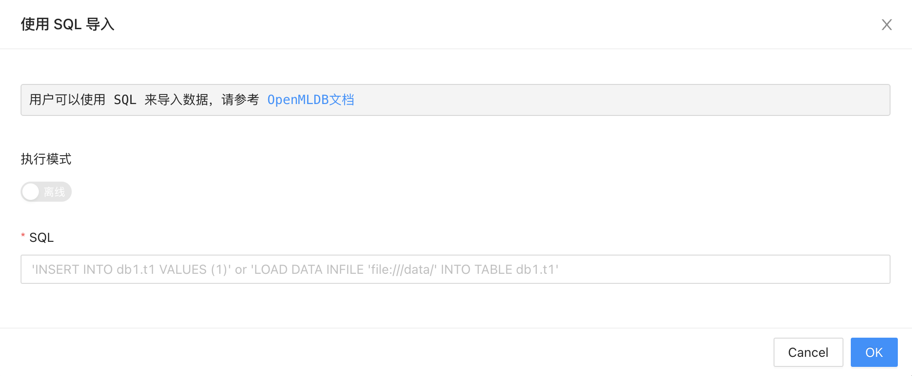

选择“使用 Parquet 导入”，用户可以输入 Parquet 文件路径来导入数据。

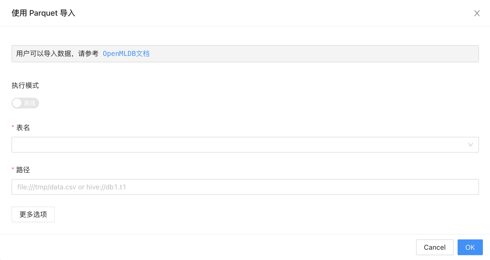

选择”使用 CSV 导入”，用户可以输入 CSV 文件路径来导入数据。

选择“使用 Hive 导入”，用户可以输入 Hive 表名来导入数据。

