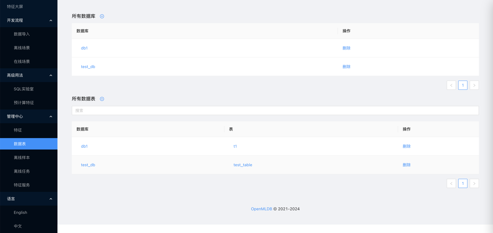
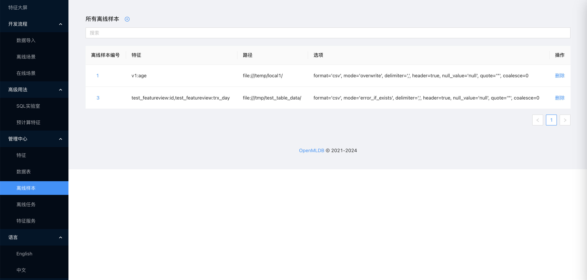
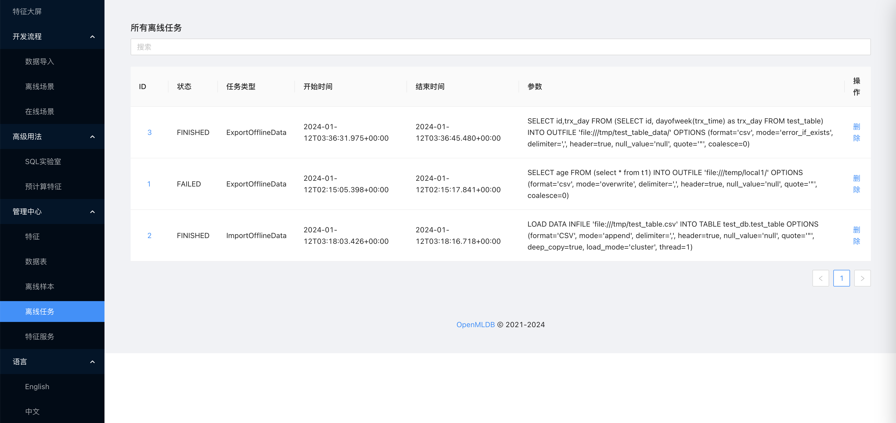
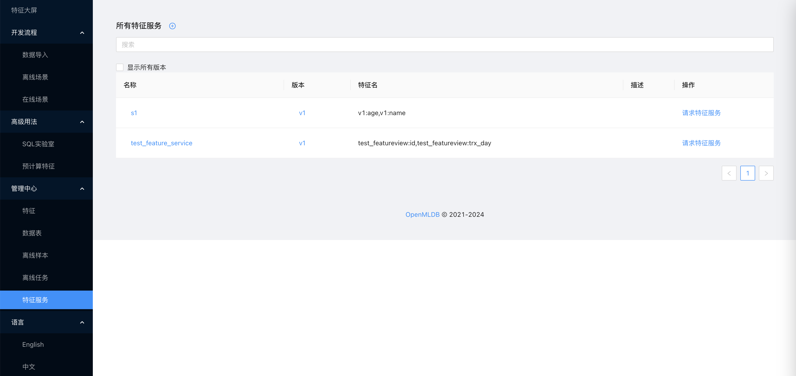

# 管理中心

## 介绍

OpenMLDB 特征平台提供了对于数据表，特征，任务以及服务的管理功能，用户可以在管理中心查看和管理相关资源。

目前支持查看和管理的资源如下：

* 特征：查看目前已创建的特征视图以及其中的单个特征。具体信息包括名称、对应数据库、SQL、依赖表等。
* 数据表：查看目前已创建的数据库及数据表。数据表的具体信息包括schema、关联特征视图、关联特征服务等。
* 离线样本：查看已导出的离线样本信息。具体信息包括特征名、导出路径、SQL、相关联的离线任务状态、日志等。
* 离线任务：查看运行中/已运行的离线任务。具体信息包括任务类型、状态、运行日志等。
* 特征服务：查看已上线的特征服务。具体信息包括版本、特征名、SQL、Deployment、相关联的特征及依赖表等。并提供服务测试界面。

## 特征管理

## 数据表管理

## 离线样本管理

## 离线任务管理

## 特征服务管理

