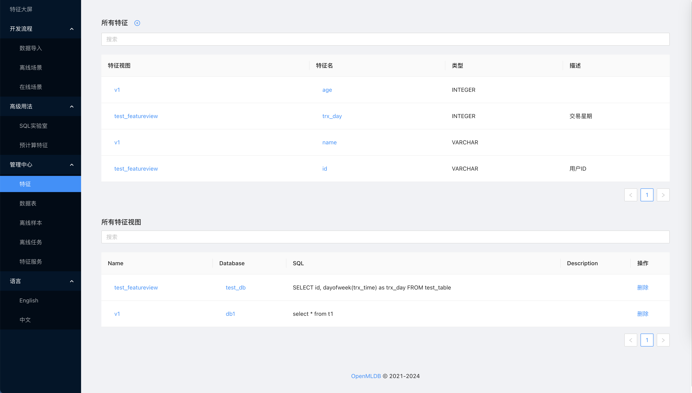
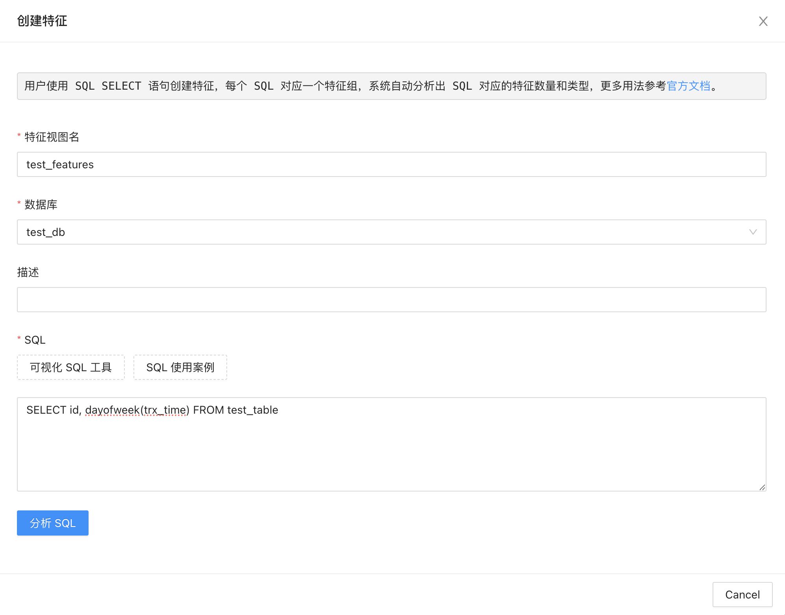
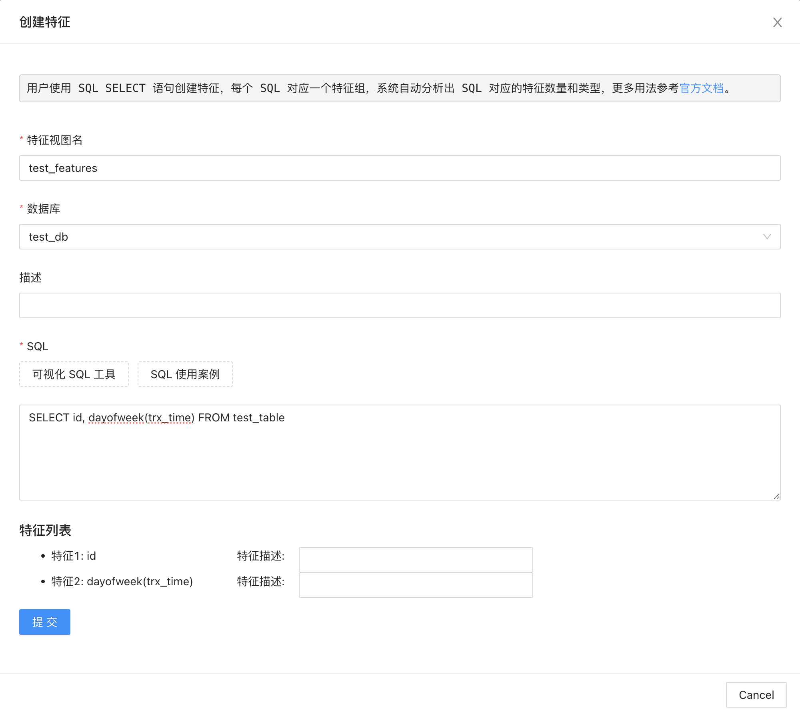
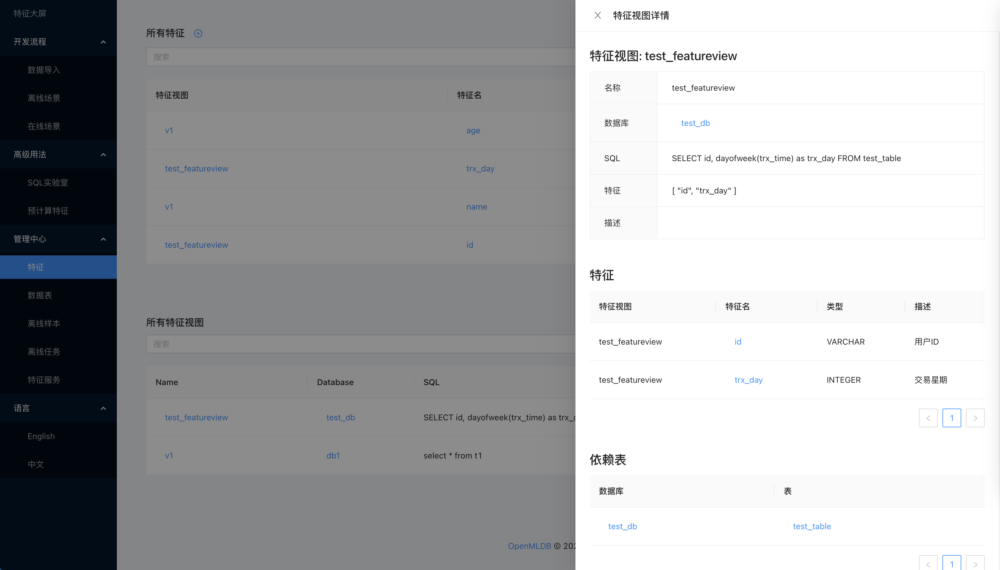
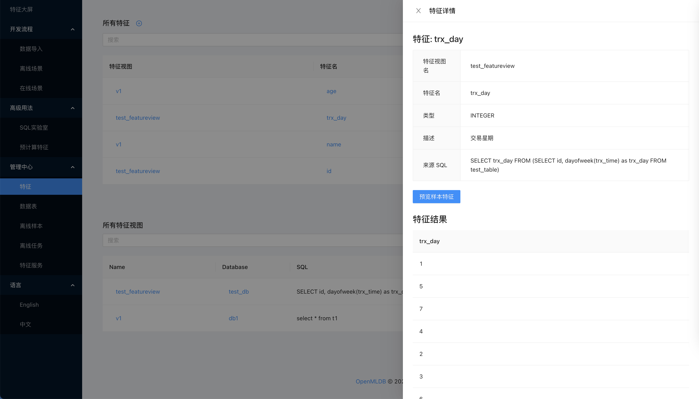
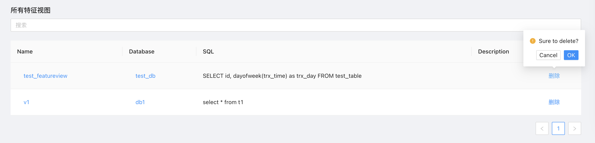

# 特征管理

## 介绍

OpenMLDB 提供完备的特征生命周期管理功能，包含的功能如下：

* 创建
  * 创建特征视图
  * 自动创建特征视图包含的特征
* 查看
  * 查看特征视图详情
  * 查看特征详情
  * 预览样本特征
* 删除
  * 删除特征视图
  * 自动删除特征视图包含的特征

## 创建

用户想要创建特征，首先要创建一个特征视图，也就是用 SQL 定义的一组特征。

在特征页面，点击创建按钮，可以填写特征视图的名称，选择默认的数据库，然后填写要抽取特征的 SQL 语句，如果不了解 SQL 语法可点击旁边的“SQL 使用案例”来参考。

填写完成后需要点击“分析 SQL”，这一步会对 SQL 语法进行校验，并且检查 SQL 语句是否符合上线需求。校验成功后会自动分析出 SQL 对应的特征数量和类型，用户可以在创建前给每个特征添加特征描述，方便后期检索。

如果用户填写了错误的 SQL 语句，会提示“执行失败”，用户可以通过日志查看错误信息，并且修改 SQL 保证分析成功后才能创建。

## 查看

成功创建特征后，用户可以在所有特征列表和以及所有特征视图列表中查看系统中所有特征的详情信息。

点击特征视图的名称，可以查看特征视图的详情信息，包括创建时指定的 SQL 语句，以及关联的特征列表，还有依赖的数据表等。

点击特征的名称，则可以查看特征的详细信息，包括特征所在的特征视图，提取单个特征自动生成的 SQL 语句，以及可以快速预览样本特征。

## 删除

在特征视图列表中，有“删除”按钮，用户点击确认后可以删除对应的特征视图，并且自动删除特征视图包含的特征。注意删除操作一旦执行就无法撤回，请谨慎操作。

