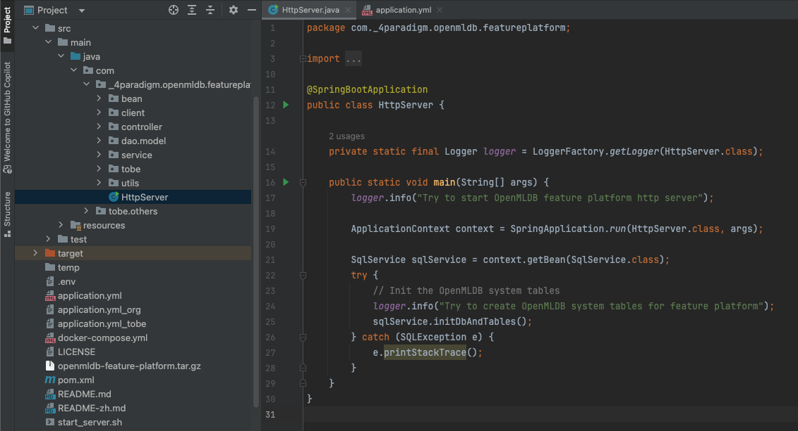

# 源码编译

## 介绍

通过源码编译 OpenMLDB 特征平台，可以按需使用特定源码功能，本文档提供源码编译的完整流程。

## 下载源码

下载项目源码。

```
git clone https://github.com/4paradigm/feature-platform
```

## 编译源码

进入项目根目录，执行以下命令编译前端和后端代码。

```
cd ./feature-platform/frontend/
npm run build

cd ../
mvn clean package
```

## 启动服务

部署 OpenMLDB 集群并配置好配置文件后，可以使用下面命令启动服务。

```
./start_server.sh
```

## 使用 IDE 开发

如果使用 IDE 开发，修改 `application.yml` 配置文件，找到 `HtttpServer.java` 类直接启动即可。


