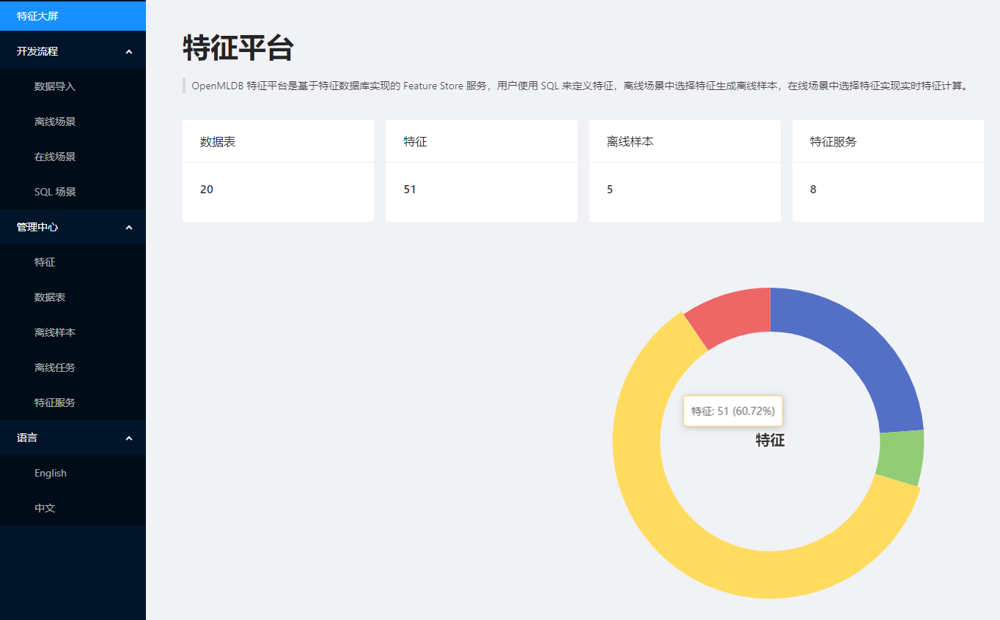

# 简介

OpenMLDB 特征平台是一个先进的特征存储(Feature Store)服务，基于 [OpenMLDB](https://github.com/4paradigm/OpenMLDB) 实现高效的特征管理和编排。 

使用简便的 UI 界面，用户可以进行机器学习特征开发的全流程，包括数据的导入、查看、编辑，特征的生成、存储、管理等。 在离线场景中，用户可以选择特征生成离线样本用于后续的机器学习开发；在在线场景中，用户可以选择特征创建特征服务，实现实时特征计算。

OpenMLDB 特征平台的主要目的是解决在机器学习项目中常见的问题，包括：

- 特征工程自动化：为特征提取、转换、组合和选择提供工具和自动化功能，帮助数据科学家更高效地进行特征工程。
- 特征重用和共享：特征平台允许共享和重复使用已开发特征，提高开发效率和模型的一致性。
- 版本控制：对特征进行跟踪和管理，包括不同版本的特征，方便追溯特征的演化历史和对模型性能的影响。
- 数据一致性和可靠性：确保在训练和推理过程中使用的特征数据的一致和可靠。

## 主要功能

目前，OpenMLDB 特征平台包括以下几个主要功能：

- 特征存储：用于存储原始特征数据和派生特征数据的存储系统。
- 特征工程和预处理功能：用于自动化特征处理和工程化的工具和功能。
- 离线场景：使用分布式计算，对离线数据进行特征计算并导出机器学习所需的样本文件。同时提供离线样本，离线任务管理功能。
- 在线场景：上线特征服务，使用在线数据提供硬实时的在线特征抽取接口。
- SQL实验室：可以执行任意的 OpenMLDB SQL 语句，在线模式下会请求在线数据库，可进行在线数据的增删改查；离线模式下会提交分布式执行的 SQL，可进行离线探索或样本生成。
- 预计算特征：用户可以通过预计算把特征值直接存入 OpenMLDB 在线表中，然后访问在线表数据进行读写特征。

## 核心概念

* 特征：通过对原始数据进行特征抽取得到的可直接用于模型训练和推理的数据
* 特征视图：通过单个SQL计算语句定义的一组特征
* 数据表：在OpenMLDB中数据表包括能实时查询的在线存储以及支持分布式的离线存储
* 在线场景：通过上线特征服务，使用在线数据提供硬实时的在线特征抽取接口
* 离线场景：使用分布式计算，对离线数据进行特征计算并导出机器学习所需的样本文件
* 在线离线一致性：通过相同的SQL定义可保证在线场景和离线场景计算的特征结果一致
