# 快速入门

本文将介绍如何快速入门 OpenMLDB 特征平台，基于一个 SQL 示例来演示如何使用特征平台。

安装部署可参考 [OpenMLDB 部署文档](../../../deploy/index.rst) 和 [OpenMLDB 特征平台部署文档](./install/index.rst)。

## 使用流程

特征平台的基本使用流程包括以下几个步骤：

1. 导入数据：使用SQL命令或前端表单进行创建数据库、创建数据表、导入在线数据和导入离线数据等操作。
2. 创建特征：使用SQL语句来定义特征视图，特征平台使用SQL编译器进行特征分析并创建对应的特征。
3. 离线场景：选择想要导入的特征，可以同时选择不同特征视图的特征，并使用分布式计算把样本文件导入到本地或分布式存储。
4. 在线场景：选择想要上线的特征，一键发布成在线特征抽取服务，然后可使用HTTP客户端进行请求和返回在线特征抽取结果。

### 1. 导入数据

首先创建数据库`test_db`表，和数据表`test_table`，可以直接执行 SQL 来创建。

```
CREATE DATABASE test_db;

CREATE TABLE test_db.test_table (id STRING, trx_time DATE);
```

也可以在特征平台的“数据导入”前端页面直接创建。

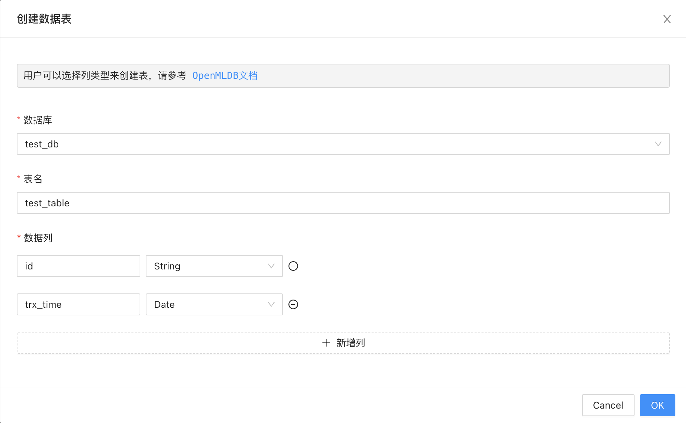

为了测试方便，我们准备一个 CSV 文件并保存到 `/tmp/test_table.csv`。

```
id,trx_time
user1,2024-01-01
user2,2024-01-02
user3,2024-01-03
user4,2024-01-04
user5,2024-01-05
user6,2024-01-06
user7,2024-01-07
```

在线数据可以使用 `LOAD DATA` 或 `INSERT` 命令来导入，这里演示通过点击 “使用 CSV 导入” 来执行。

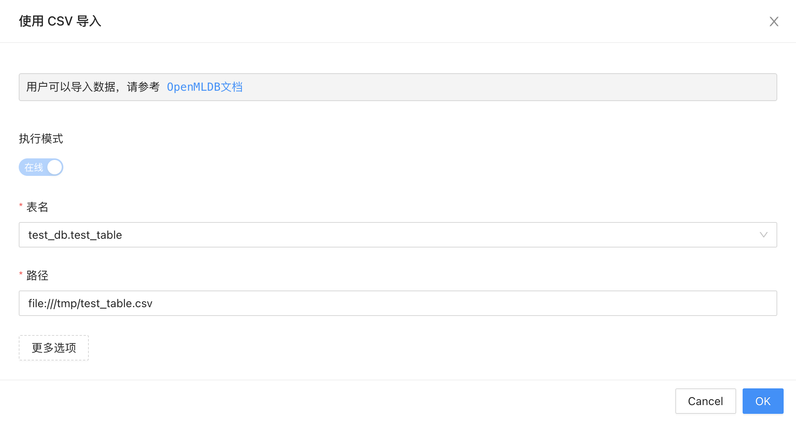

通过前端页面可以预览已导入的在线数据。

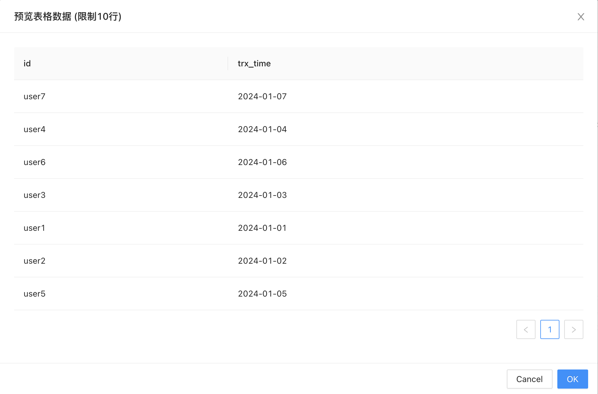

离线数据也可以使用 `LOAD DATA` 命令或前端选择“使用 CSV 导入”来执行。

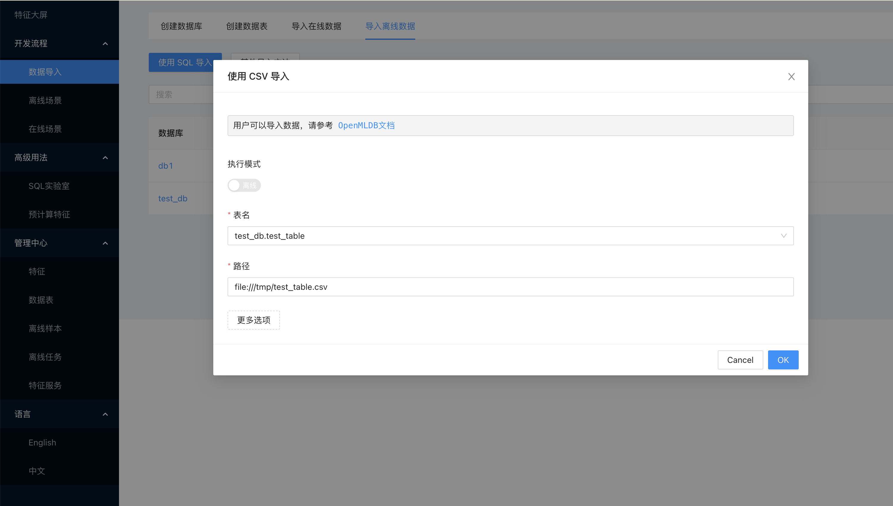

等待半分钟后导入任务完成，可以查看任务的状态以及日志。

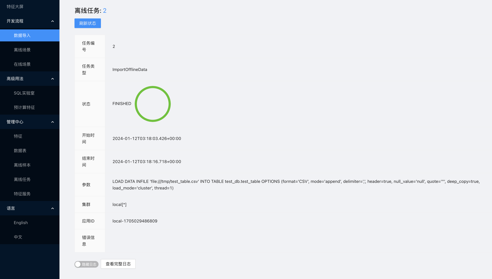

### 2. 创建特征

数据导入完成后，可以开始创建特征，本示例使用 SQL 来创建两个基本特征。

```
SELECT id, dayofweek(trx_time) as trx_day FROM test_table
```

在”特征“页面选择“创建特征”，填写特征组名称以及 SQL 语句。

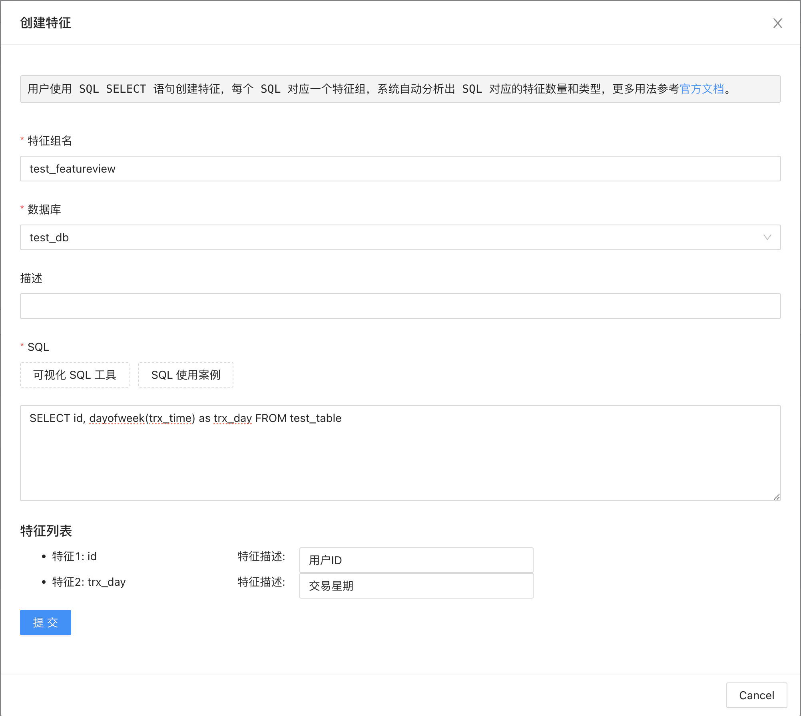

创建完成后，可以在“特征”页面查看成功创建的特征。

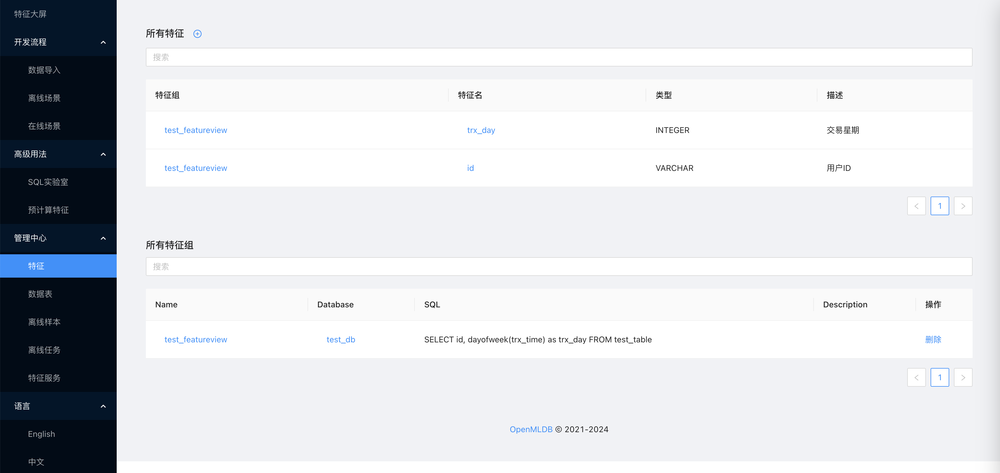

点击特征名称，进入特征详情页，可以查看特征基础信息，并提供特征预览功能。

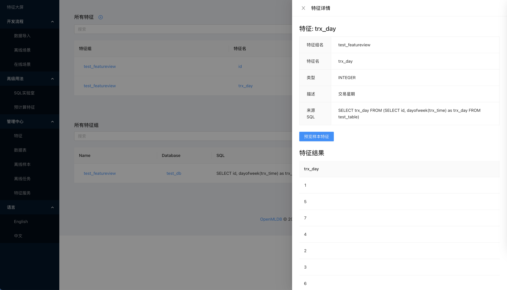

### 3. 生成离线样本

在“离线场景”页面，可以选择导出离线样本，只要选择刚创建好的特征和提供导出路径即可，前端还提供了“更多选项”可以选择到处格式、运行参数等。

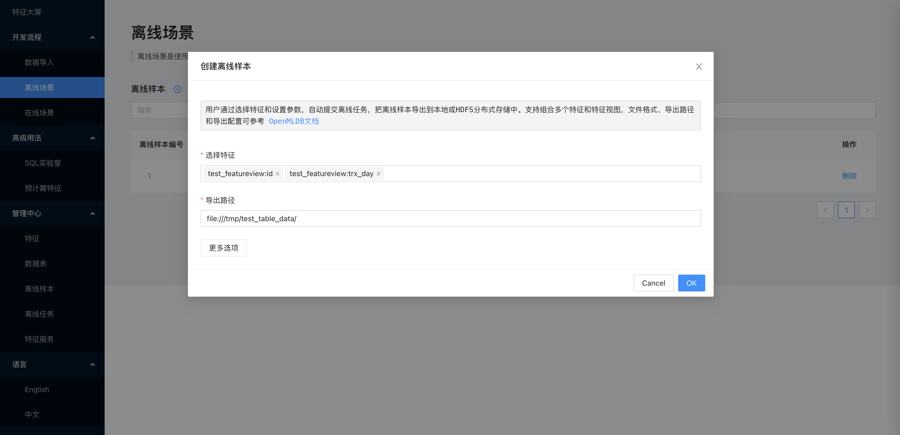

提交导出任务后，可以在“离线样本”详情页查看导出信息，大概半分钟后成功完成。

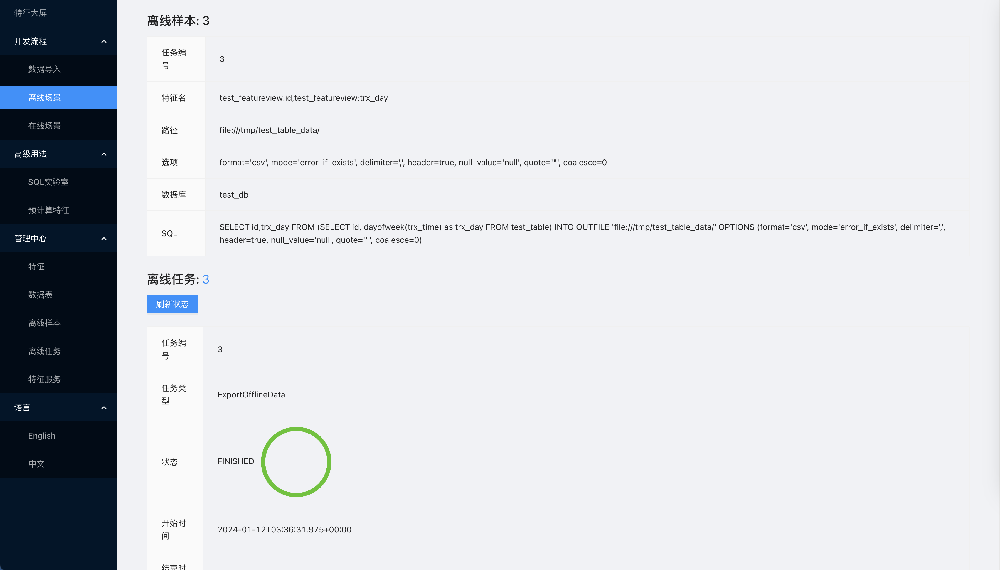

在本地即可查看导出的样本文件内容。为了验证 OpenMLDB 特征平台提供的在线离线一致性，可记录离线特征结果，并于后面的在线特征计算做比较。

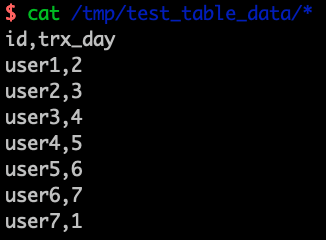

### 4. 创建在线服务

在“特征服务”页面可以选择创建特征服务，同样是之需要选择上线的特征，以及提供特征服务名称和版本即可。

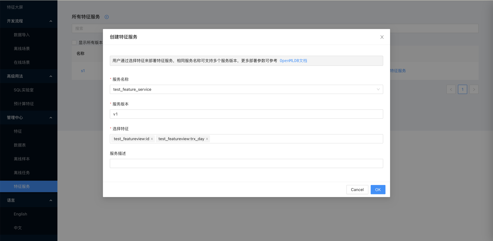

创建成功后，可以在特征服务详情页查看到服务的基本信息，上线包含的特征列表，以及依赖数据表的血缘关系等。

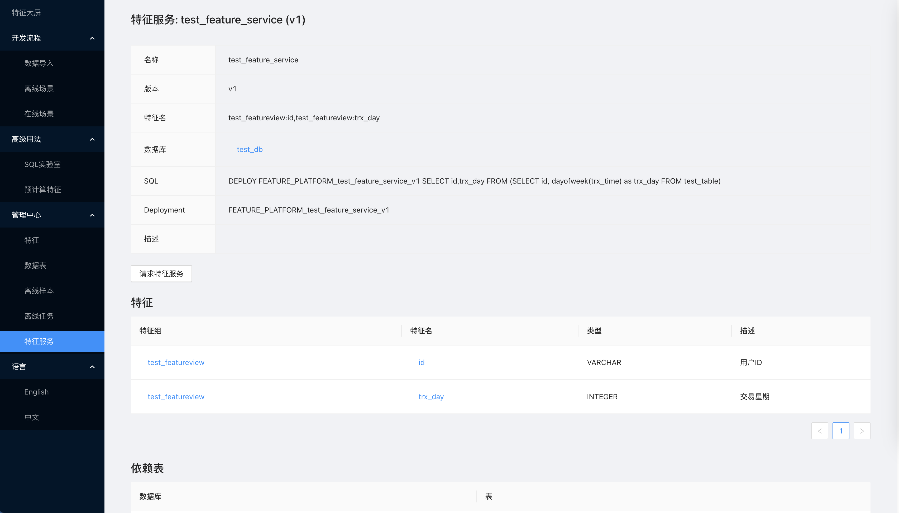

最后通过“请求特征服务”页面，我们可以输入测试数据进行在线特征计算，并且和离线样本的特征结果进行比对。

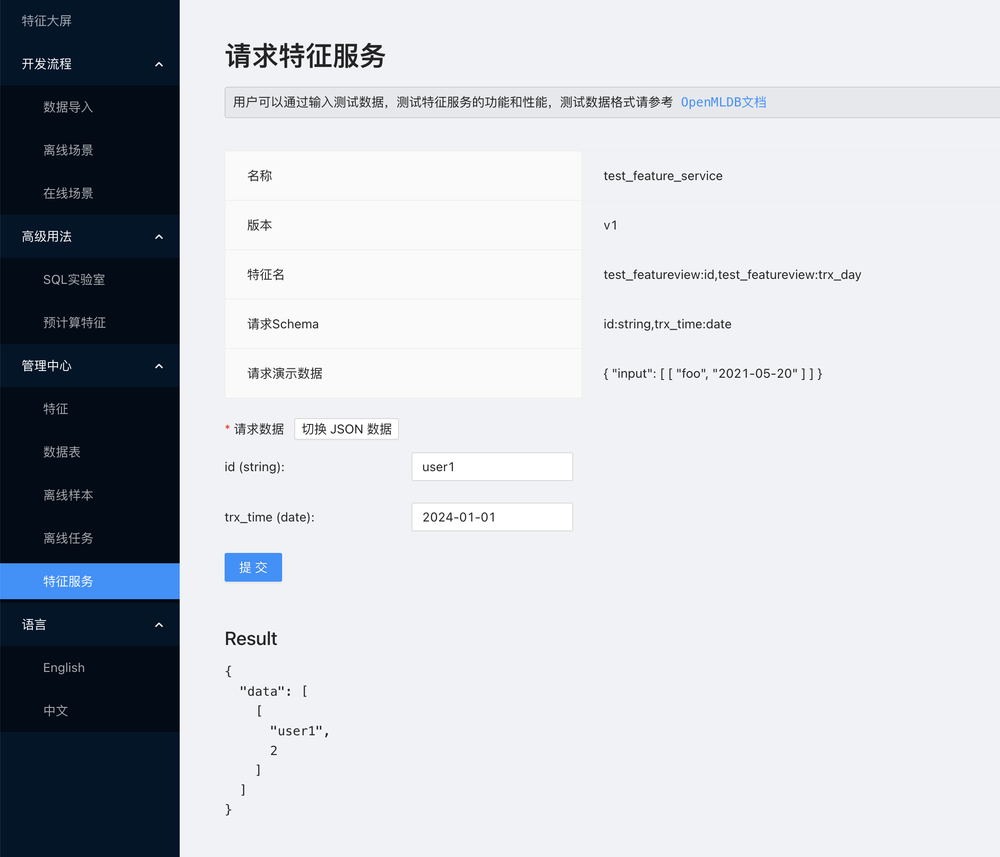

## 总结

本示例演示了使用 OpenMLDB 特征平台的完整流程，通过编写简单的 SQL 即可实现在线和离线的特征定义，通过选择不同的特征，甚至是组合不同特征组的特征，即可实现快速的特征复用和上线，并且对比离线和在线的计算结果验证了特征计算的一致性。
