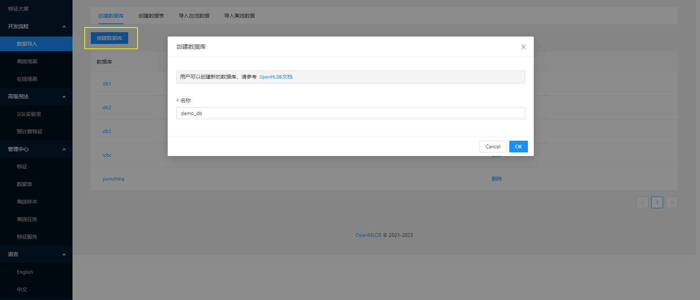
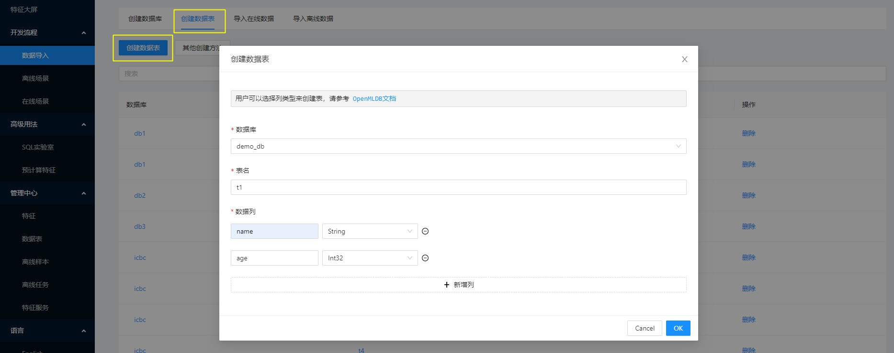

# 快速入门

## 安装部署

首先部署 OpenMLDB 集群，参考[部署文档](https://openmldb.ai/docs/zh/main/quickstart/openmldb_quickstart.html#id3)。

然后部署 OpenMLDB 特征平台，下载 Jar 文件。

```
wget https://openmldb.ai/download/feature-platform/openmldb-feature-platform-0.8-SNAPSHOT.jar
```

准备配置文件并命名为 `application.yml`。

```
server:
  port: 8888
 
openmldb:
  zk_cluster: 127.0.0.1:2181
  zk_path: /openmldb
  apiserver: 127.0.0.1:9080
```

启动特征平台服务。

```
java -jar ./openmldb-feature-platform-0.8-SNAPSHOT.jar
```

## 使用流程

特征平台的基本使用流程包括以下的几个步骤：

1. 导入数据：使用SQL命令或前端表单进行创建数据库、创建数据表、导入在线数据和导入离线数据等操作。
2. 创建特征：使用SQL语句来定义特征视图，特征平台使用SQL编译器进行特征分析并创建对应的特征。
3. 离线场景：选择想要导入的特征，可以同时选择不同特征视图的特征，并使用分布式计算把样本文件导入到本地或分布式存储。
4. 在线场景：选择想要上线的特征，一键发布成在线特征抽取服务，然后可使用HTTP客户端进行请求和返回在线特征抽取结果。
5. 

### 导入数据

1. 创建数据库： 创建新的数据库`demo_db`



2. 创建数据表：选择`demo_db`,创建新的数据表`t1`，并且添加数据列`name`和`age`，选择对应数据类型。



### 创建特征

### 生成离线样本

### 创建在线服务