# 出租车行程时间预测场景

## 场景介绍

场景来自 Kaggle 的 [New York City Taxi Trip Duration](https://www.kaggle.com/c/nyc-taxi-trip-duration/overview)， 对纽约市出租车公司的行程时间进行预测，预测的输入为出发地经纬度、目的地经纬度、出发时间、天气情况等，需要抽取特征最终预测出行程时间。

## 特征设计

特征设计参考 [出租车行程时间预测 (OpenMLDB + LightGBM)](../../../use_case/taxi_tour_duration_prediction.md)，使用下面的 OpenMLDB SQL 进行特征工程和数据导出。

```
SELECT
  trip_duration,
  passenger_count,
  sum(pickup_latitude) OVER w AS vendor_sum_pl,
  max(pickup_latitude) OVER w AS vendor_max_pl,
  min(pickup_latitude) OVER w AS vendor_min_pl,
  avg(pickup_latitude) OVER w AS vendor_avg_pl,
  sum(pickup_latitude) OVER w2 AS pc_sum_pl,
  max(pickup_latitude) OVER w2 AS pc_max_pl,
  min(pickup_latitude) OVER w2 AS pc_min_pl,
  avg(pickup_latitude) OVER w2 AS pc_avg_pl,
  count(vendor_id) OVER w2 AS pc_cnt,
  count(vendor_id) OVER w AS vendor_cnt
FROM t1
WINDOW 
  w AS (PARTITION BY vendor_id ORDER BY pickup_datetime ROWS_RANGE BETWEEN 1d PRECEDING AND CURRENT ROW),
  w2 AS (PARTITION BY passenger_count ORDER BY pickup_datetime ROWS_RANGE BETWEEN 1d PRECEDING AND CURRENT ROW)
```

## 实现流程

### 1. 数据导入

创建测试数据库 `taxi_trip_duration` 和测试数据表 `t1`。

```
CREATE DATABASE taxi_trip_duration;

CREATE TABLE taxi_trip_duration.t1 (id string, vendor_id int, pickup_datetime timestamp, dropoff_datetime timestamp, passenger_count int, pickup_longitude double, pickup_latitude double, dropoff_longitude double, dropoff_latitude double, store_and_fwd_flag string, trip_duration int);
```

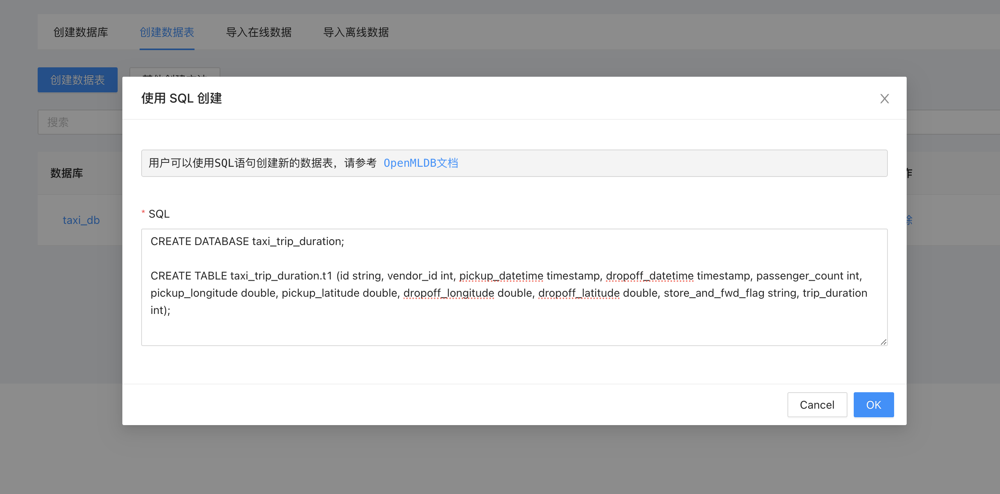

注意，在 OpenMLDB 0.8.4及前序版本不支持自动创建索引，因此需要在创建表时添加索引。

```
CREATE TABLE taxi_trip_duration.t1(id string, vendor_id int, pickup_datetime timestamp, dropoff_datetime timestamp, passenger_count int, pickup_longitude double, pickup_latitude double, dropoff_longitude double, dropoff_latitude double, store_and_fwd_flag string, trip_duration int, INDEX(KEY=vendor_id, TS=pickup_datetime), INDEX(KEY=passenger_count, TS=pickup_datetime));
```

然后从 Kaggle 下载数据集进行导入数据，下载命令如下。

```
kaggle competitions download -c nyc-taxi-trip-duration
```

下载后解压得到 `train.csv` 文件，放在 `/tmp/train.csv` 路径下，在前端页面选择“使用 CSV 导入”在线数据。

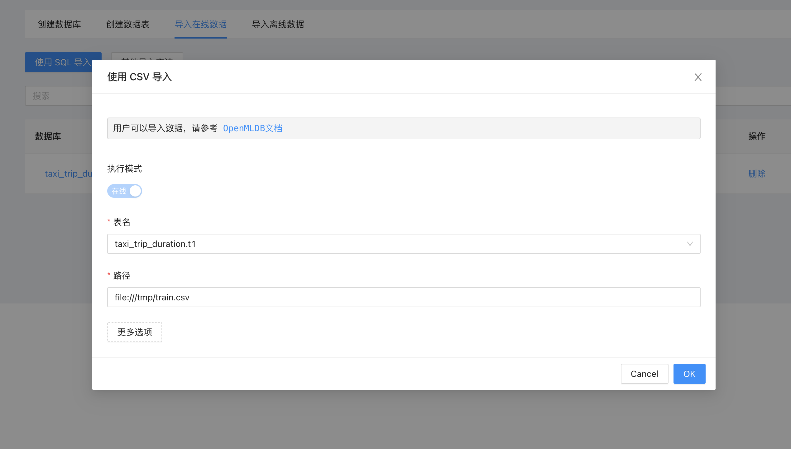

导入成功后，可以预览在线表数据。

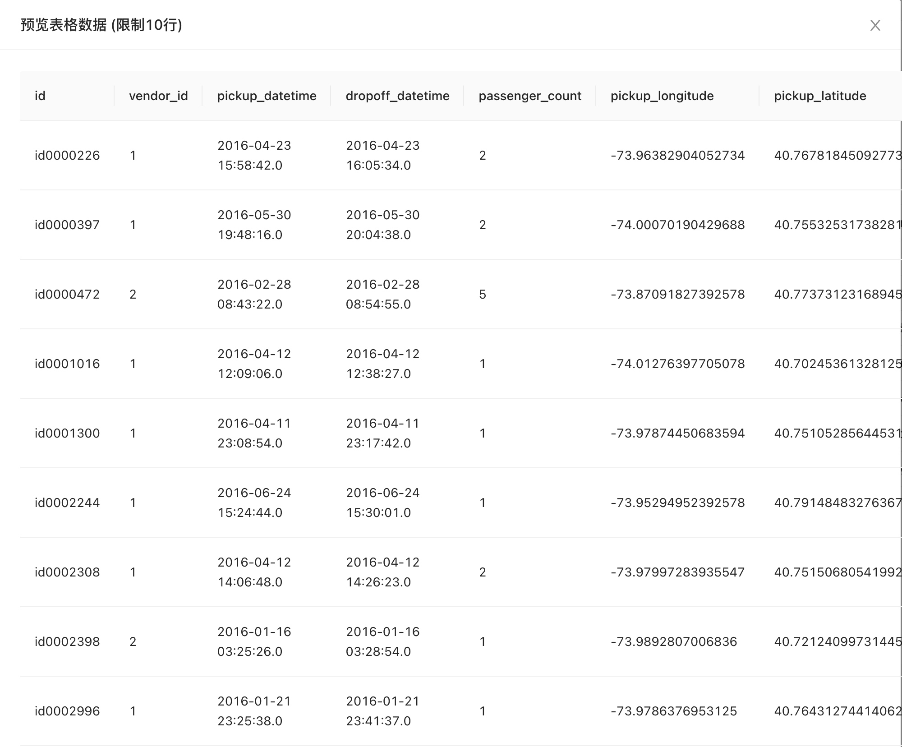

然后进行离线的数据导入，同样在前端页面选择“使用 CSV 导入”操作即可。

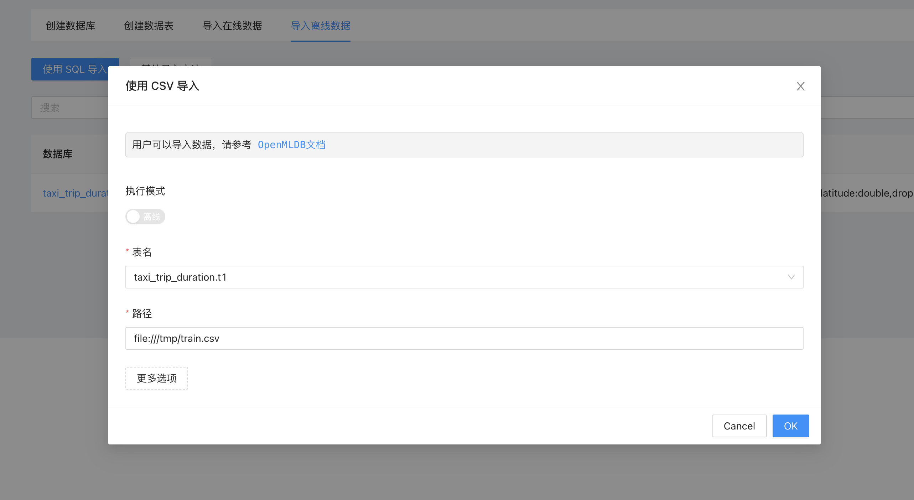

### 2. 创建特征

根据前面设计的 SQL 语句，我们选择创建一个特征组，创建时会”分析 SQL“，并且根据 SQL 自动分析出创建的特征列表。

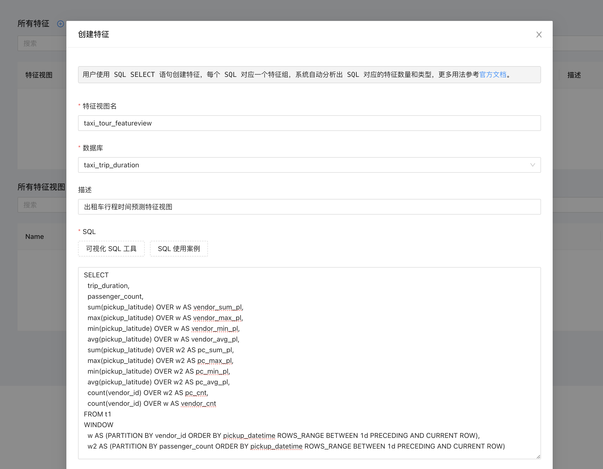

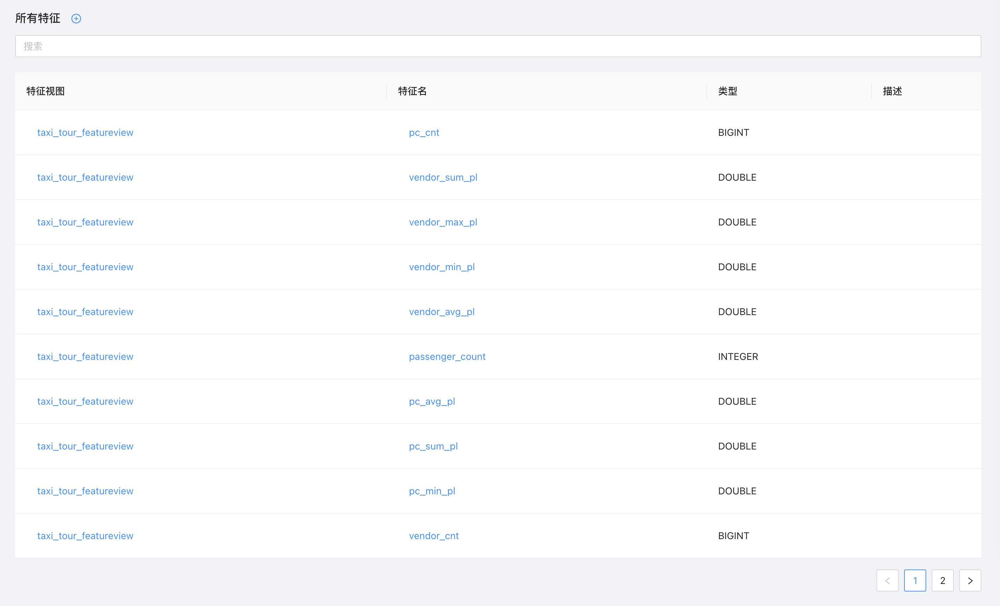

### 3. 离线场景

在离线场景，我们选择刚生成的特征视图的所有特征，把离线样本导出到本地进行模型训练。

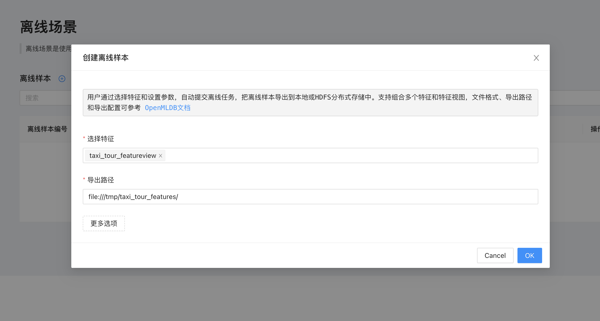

离线任务执行成功后，可以查看本地路径 `/tmp/taxi_tour_features/`，发现特征数据已经计算出来，并且导出到本地可以直接给模型训练使用。模型训练可参考[出租车行程时间预测 (OpenMLDB + LightGBM)](../../../use_case/taxi_tour_duration_prediction.md)。

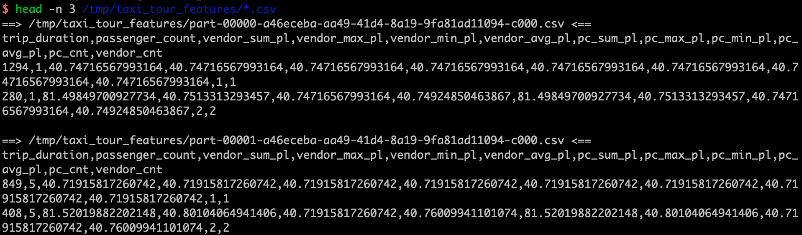

### 4. 在线场景

通过离线场景验证特征 SQL 正确后，可通过在线场景把特征上线成特征服务。

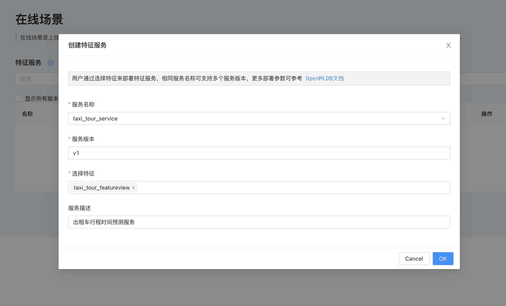

创建成功后，可以查看特征服务的详情页面。

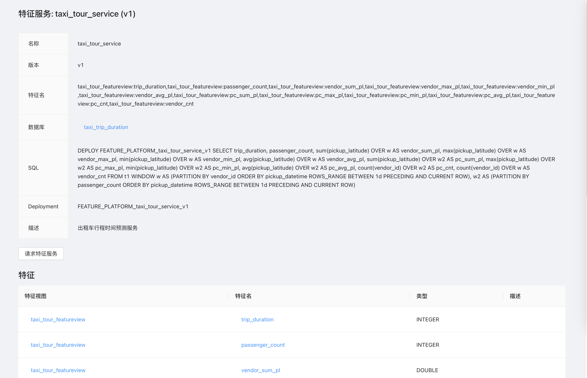

最后可以在请求页面进行在线测试，并且验证在线离线特征结果是否一致。

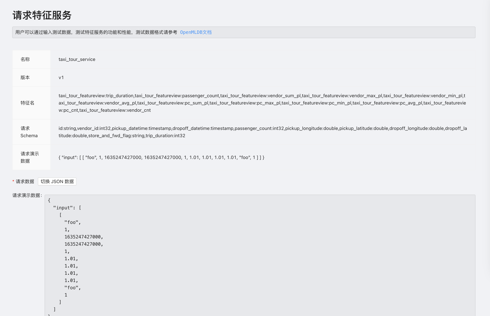

## 总结

使用 OpenMLDB 特征平台实现出租车行程时间预测场景，整个过程非常简单且步骤清晰，相比于使用 OpenMLDB 命令行工具更加直观，而且只需要有浏览器就可以操作，免去科学家搭建环境的麻烦，在线调试特征以及特征复用也更加简单。

