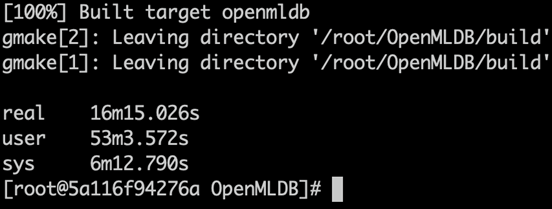
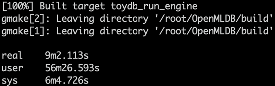
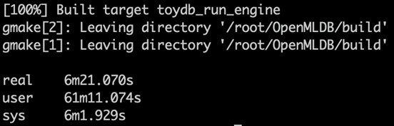

# 十分钟掌握分布式数据库开发：OpenMLDB 开发者镜像详解

OpenMLDB 是一款国产的、开源的、面向时序数据的分布式内存数据库系统，它专注于高性能、高可靠性和易扩展性，适用于海量时序数据的处理以及在线特征的实时计算。在大数据和机器学习的浪潮中，OpenMLDB 以其强大的数据处理能力和高效的机器学习支持，在开源数据库领域崭露头角。

OpenMLDB 的核心存储和 SQL 引擎就包含超过36万行 C++ 代码及海量的 C 头文件代码，为了进一步降低项目编译门槛，提升开发者的工作效率，我们特别推出了一个全新设计的 OpenMLDB Docker 镜像，让开发者在任何操作系统平台（包括Linux、MacOS、Windows等）都可以通过离线的方式快速从头编译此数据库源码，只需十分钟就可以参与成为分布式数据库的开发者。

## 使用方法

目前镜像已经托管到阿里云镜像仓库，国内开发者也可以快速下载使用。
使用镜像流程如下：

1. 启动容器：通过 Docker 命令启动容器，这将会进入一个包含 OpenMLDB 源码和所有依赖的环境。
```Bash
docker run -it registry.cn-beijing.aliyuncs.com/openmldb/openmldb-build bash
```

2. 编译 OpenMLDB：在容器内部，可以直接进入到 OpenMLDB 的源码目录，运行编译脚本。
```Bash
cd OpenMLDB
make
```

3. 安装 OpenMLDB, 默认安装到${PROJECT_ROOT}/openmldb
```Bash
make install
```

4. 部署与测试：编译完成后，可以根据需要进行部署和测试，所有必要的工具和依赖都已经准备就绪。

## 编译速度
OpenMLDB 默认关闭了并发编译，如果编译机器的资源足够，可以通过编译参数 NPROC 来启用并发编译功能。
多线程编译示例如下：

1. 四核编译
```Bash
make NPROC=4
```


2. 八核编译
```Bash
make NPROC=8
```


3. 十六核编译
```Bash
make NPROC=16
```


## 镜像亮点
1.  快速上手：省略了复杂的环境搭建步骤，使开发者在不同操作系统平台上都能直接进入开发状态。
2.  环境统一：无论是个人开发还是团队协作，Docker 镜像确保每位成员都在一致的环境中进行开发，有效避免了“在我机器上能运行”的问题。
3.  便于分享：镜像可以轻松共享给团队其他成员或在社区中分发，加速 OpenMLDB 的普及和应用。
4.  完整的 OpenMLDB 环境：该镜像预装了 OpenMLDB 的完整源码，使开发者可以轻松地探索和修改OpenMLDB源码以及贡献代码至 OpenMLDB 社区。
5.  离线编译与部署能力：通过预下载 OpenMLDB 所需的第三方库，使得该镜像能够在完全离线的环境中对OpenMLDB 进行编译和部署，极大地提高了在网络受限环境下的工作效率，提高了开发的灵活性和可行性。
6.  编译效率：由于所有的依赖都已经被内置在镜像中，这避免了长时间的依赖下载和安装过程，使得编译过程变得更加迅速。

这款专为 OpenMLDB 离线构建定制的 Docker 镜像，不仅简化了开发者的入门流程，还为项目的编译、部署和测试提供了强大支持。期待这一工具能够帮助更多开发者和企业更高效地利用 OpenMLDB，在源码级别掌控 OpenMLDB 的编译和开发能力，并推动 OpenMLDB 在金融风控、推荐系统、量化交易等行业生态中的有进一步发展和应用。


