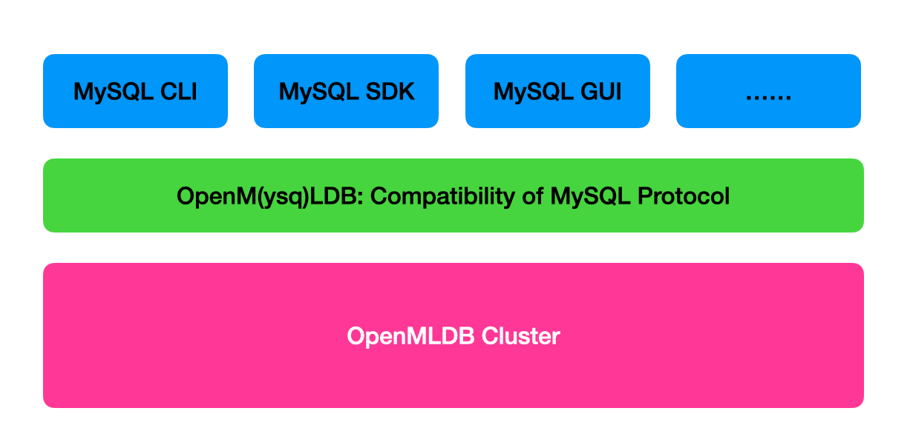

# 超高性能数据库 OpenM(ysq)LDB：无缝兼容 MySQL 协议 和多语言 MySQL 客户端

## OpenM(ysq)LDB 项目介绍
OpenM(ysq)LDB 是高性能时序数据库 OpenMLDB 的全新服务模块，OpenMLDB 中 “ML” 既是 Machine Learning 的缩写，也可以是 MySQL 的缩写，通过此模块用户可以直接使用 MySQL 命令行客户端或多种编程语言的 MySQL SDK，从而实现 OpenMLDB 数据库特有的在线离线特征计算功能。

OpenMLDB 是基于 C++ 和 LLVM 实现的分布式高性能内存时序数据库，在架构设计和实现逻辑上与专注于单机的关系型数据库 MySQL 有很大区别，并且 OpenMLDB 更加适用于金融风控、推荐系统等硬实时在线特征计算场景中。由于二者都提供标准的 ANSI SQL 接口，OpenMLDB 通过兼容 MySQL 协议，让客户直接使用熟悉的 MySQL 客户端，甚至在Java、Python 等 SDK 编程中也不需要修改业务代码，可直接用 MySQL 库来访问 OpenMLDB 数据以及执行特殊的 OpenMLDB SQL 特征抽取语法。

## 使用方法
请参照[官方文档 - 快速入门](../app_ecosystem/open_mysql_db/quickstart.md)。

## MySQL 协议兼容原理
MySQL（包括后续 MariaDB 版本）的协议都是公开可读的，OpenM(ysq)LDB 在服务端完全实现并兼容了 MySQL  的协议，并且通过 OpenMLDB 的 SDK 来管理后端访问分布式 OpenMLDB 集群的连接，从而实现与各种 MySQL 客户端的兼容访问。

目前 OpenM(ysql)LDB 通过长连接的维护客户端与 OpenMLDB 的交互，保证每个连接都有唯一的客户端对象访问 OpenMLDB 集群，相同连接的所有 SQL 查询都不需要额外初始化，并且在连接关闭后自动释放资源，服务本身占用的开销几乎可以忽略不计，性能与直连 OpenMLDB 也可以保持一致。

更多使用文档可参考[官方文档](../app_ecosystem/open_mysql_db/index.rst)。

## 总结
OpenM(ysql)LDB 是 OpenMLDB 项目的一次大胆的尝试，在 0.1.5 到 0.8.5 一共39个版本发布后，在不断的功能完善和 SQL 语法兼容以后，终于实现了完全兼容 MySQL 协议的功能，在保证了基本的 SQL 查询功能外还提供了比 MySQL 更高性能的底层存储实现和 AI 能力拓展。从此以后，MySQL / MariaDB 用户可以无缝地切换他们的数据库存储引擎，不同编程语言的开发者也可以直接使用已有成熟的 MySQL SDK，使用 OpenMLDB 服务的门槛极度降低，为所有 DBA 或数据开发者提供向 AI 转型的“捷径”。

注意，目前测试 MySQL Workbench 暂无法使用 OpenM(ysql)LDB，相关测试工作仍在进行中，感兴趣的开发者可以在 Github 上持续关注此项目的开发进展。
