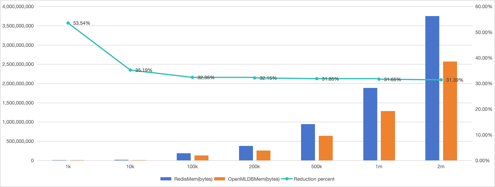

# OpenMLDB vs Redis 内存占用量测试报告

## 背景

OpenMLDB 是一款开源的高性能全内存 SQL 数据库，在时序数据存储、实时特征计算等方面都有很多创新和优化。Redis 是业界最流行的内存存储数据库，广泛应用于缓存等高性能在线场景。虽然二者应用场景不尽相同，但作为都是使用内存作为存储介质的数据库，希望通过对相同数据行数下的内存占用量进行测试对比，让客户直观了解二者在内存资源上的消耗占比。

## 测试环境

本次测试基于物理机部署（40C250G * 3），硬件信息如下。

| 硬件      | 配置                                      |
| --------- | ----------------------------------------- |
| CPU       | Intel(R) Xeon(R) CPU E5-2630 v4 @ 2.20GHz |
| Processor | 40 Cores                                  |
| Memory    | 250 G                                     |
| Storage   | HDD 7.3T * 4                              |

软件版本具体如下。

| 对比产品   | 版本  | 部署模式               | 内存统计方式                 |
| --------- | ----- | --------------------- | --------------------------- |
| OpenMLDB  | 0.8.5 | 集群模式(2 tablets)    | 内置命令（show table status）|
| Redis     | 7.2.4 | 单机模式               | 内置命令（info）             |

## 测试方法
使用 Java 开发测试工具，使用OpenMLDB Java SDK 和 Jedis，分别向 OpenMLDB 和 Redis 插入相同的数据，对比两者的内存占用情况。因为两者支持的数据类型和数据存储方式的不同，实际数据插入方式有一定的差异。因为特征数据都是有时序的，为了尽可能贴近用户的实际使用情况，我们设计了两种测试方式。

### 方法一：随机生成数据数据集
设计每一个测试数据集都有 m 个 key作为主键，每个 key 可能有 n 个不同的 value（模拟时序性）。简单起见，这里 value 就只用 1 个字段表示，可以通过配置参数分别控制 key 和 value 字段长度。对应到 OpenMLDB，创建一个包含（ key，value）两列数据的测试表，以每一个 key:value 作为一条数据，插入测试表中。对应到 Redis，以每个 key 作为键，以这个 key 对应的多个 value 组合为 zset，存储到 Redis 中。

#### 举例
计划测试 100万（记为1M）个 key，每个 key 对应有 100 条时序数据。则实际存储时，OpenMLDB 中存储的实际数据量为  1M * 100 = 100M，即 1 亿条数据。而 Redis 中，则是存储 1M 个键，每个 key 对应的 value 为包含 100 个成员的 zset。

#### 可配置参数

| 配置项              | 说明                                          | 默认值      | 
| ------------------ | -------------------------------------------- | --------------------------------- |
| KEY_LENGTH         | key 的长度                                    | 50                                |
| VALUE_LENGTH       | 单个 value 的长度                             | 100                               |
| VALUE_PER_KEY      | 每个 key 对应的 value 个数                    | 5                                  |
| TOTAL_KEY_NUM      | 想要测试的 key 数量。解析为列表，依次循环进行测试 | 1000,10000,100000,500000,1000000  |
| REDIS_HOST_PORT    | redis 的连接参数                              | 127.0.0.1:6379                    |
| OPENMLDB_TABLE_NAME| OpenMLDB 的测试表名                           | test_db                           |
| ZK_CLUSTER         | zk 的连接参数                                 | 127.0.0.1:2181                    |
| ZK_PATH            | zk path                                      | /openmldb                         |

#### 操作步骤（复现路径）
1. 部署 OpenMLDB 和 Redis：部署可以使用容器化部署或者使用软件包在物理机上直接部署，经过对比，两者无明显差异。下边以容器化部署为例进行举例描述。
    - OpenMLDB：
        - 镜像：`docker pull 4pdosc/openmldb:0.9.1`
        - 文档：https://openmldb.ai/docs/zh/main/quickstart/openmldb_quickstart.html
    - Redis：
        - 镜像：`docker pull redis:7.2.4`
        - 文档：https://hub.docker.com/_/redis
2. 拉取[测试代码](https://github.com/4paradigm/OpenMLDB/tree/main/benchmark)
3. 修改配置
    - 配置文件：`src/main/resources/memory.properties` -- [[link](https://github.com/4paradigm/OpenMLDB/blob/main/benchmark/src/main/resources/memory.properties)]
    - 配置说明：必须确认`REDIS_HOST_PORT`和`ZK_CLUSTE`配置与实际测试环境一致， 其它配置为测试数据量相关配置，请按需配置。注意：如果数据量过大，测试耗时会比较长。
4. 运行测试：【github benchmark Readme 中相关路径】
5. 查看输出结果

### 方法二：使用开源数据集TalkingData
为了使结果更具说服力，覆盖更多的数据类型，也便于复现和对比结果，我们也设计使用开源数据集进行测试。数据集为OpenMLDB 典型案例 [TalkingData（广告欺诈检测数据集）](https://openmldb.ai/docs/zh/main/use_case/talkingdata_demo.html)。这里使用 TalkingData 的 train 数据集，其获取方式如下：
  - 采样数据：[OpenMLDB 中的典型案例使用的采样数据](https://github.com/4paradigm/OpenMLDB/blob/main/demo/talkingdata-adtracking-fraud-detection/train_sample.csv)
  - 全量数据：[kaggle](https://www.kaggle.com/c/talkingdata-adtracking-fraud-detection/data)

 方法一略有不同，TalkingData 数据集包含多列数据，包含字符串、数字和时间类型。为了让存储和使用更符合实际应用场景，这里设计使用TalkingData的 ip 列作为 key 进行存储。对应到 OpenMLDB 中，即创建一个和 TalkingData数据集对应的数据表，为 ip 列创建索引（OpenMLDB 默认为第一列创建索引）。对应到 Redis，以 ip 为键，以其他列数据的 JSON 字符串组成 zset 进行存放（TalkingData作为时序数据，存在多行数据具有相同 ip 的情况）。

 #### 举例

| ip    | app    | device| os     | channel | click_time          | is_attributed |
| ----- | ------ | ----- | ------ | ------- | ------------------- | ------ |
| 925   | 15     | 1     | 13     | 245     | 7/11/2017 16:14     | 0      |
| 925   | 18     | 1     | 19     | 107     | 8/11/2017 2:30      | 0      |
| 925   | 24     | 2     | 13     | 178     | 8/11/2017 10:33     | 0      |
| 925   | 21     | 1     | 26     | 128     | 7/11/2017 5:50      | 0      |
| 925   | 14     | 2     | 41     | 467     | 8/11/2017 15:09     | 0      |
| 944   | 2      | 1     | 6      | 377     | 8/11/2017 2:35      | 0      |
| 944   | 18     | 1     | 13     | 439     | 8/11/2017 22:21     | 0      |
| 944   | 12     | 1     | 19     | 481     | 7/11/2017 23:17     | 0      |
| 960   | 15     | 1     | 19     | 430     | 8/11/2017 4:32      | 0      |
| 973   | 12     | 1     | 13     | 178     | 9/11/2017 2:35      | 0      |

#### 可配置参数

| 配置项             | 说明              | 默认值            |
| ----------------- | ----------------- | ----------------- |
| REDIS_HOST_PORT   | redis 的连接参数   | 127.0.0.1:6379    |
| ZK_CLUSTER        | zk 的连接参数      | 127.0.0.1:2181    |
| ZK_PATH           | zk path           | /openmldb         |

#### 操作步骤（复现路径）
1. 部署 OpenMLDB 和 Redis：同方法一，这里不再重复。
2. 拉取[测试代码](https://github.com/4paradigm/OpenMLDB/tree/main/benchmark)
3. 修改配置
    - 配置文件：`src/main/resources/memory.properties` -- [[link](https://github.com/4paradigm/OpenMLDB/blob/main/benchmark/src/main/resources/memory.properties)]
    - 配置说明：
        - 确认`REDIS_HOST_PORT`和`ZK_CLUSTER`配置与实际测试环境一致;
        - 修改`TALKING_DATASET_PATH`(默认使用 `resources/data/talking_data_sample.csv`)

4. 获取测试数据文件并放到`resources/data`目录下，和`TALKING_DATASET_PATH`配置路径一致
5. 运行测试：【github benchmark Readme 中相关路径】
6. 查看输出结果

## 测试结果

### 随机数据集测试结果

| Key 数据量  | RedisMem (bytes) | OpenMLDBMem (bytes) | Reduction percent* |
|------------| ---------------- | ----------------- | ------------------ |
| 1k         |     2,769,280 |        1,286,704 |             53.54% |
| 10k        |    19,864,176 |       12,873,424 |             35.19% |
| 100k       |   190,316,568 |      128,754,536 |             32.35% |
| 200k       |   379,537,928 |      257,521,192 |             32.15% |
| 500k       |   944,725,616 |      643,863,920 |             31.85% |
| 1m         | 1,884,007,736 |    1,287,708,720 |             31.65% |
| 2m         | 3,753,713,064 |    2,575,360,296 |             31.39% |

在前述实验条件下，存储同样数量的数据，OpenMLDB（内存表模式）的内存使用量相对于 Redis 少 30% 以上。

### TalkingData 数据集测试结果

| Dataset                   | 数据量（条）  | RedisMem (bytes) | OpenMLDBMem (bytes) | Reduction percent |
|---------------------------| ------------ | ---------------- | ------------------- | ----------------- |
| talking-data-train-sample |       10,000 |       9,272,328 |          2,339,699 |            74.77% |
| talking-data-train-sample |      100,000 |      48,501,288 |         15,624,290 |            74.77% |
| talking-data-train-sample |    1,000,000 |     215,323,024 |        105,722,441 |            50.90% |
| talking-data-train-sample |   10,000,000 |   1,897,343,984 |      1,008,276,458 |            46.86% |
| talking-data-train        |  184,903,890 |  34,071,049,864 |     18,513,271,540 |            45.66% |

得益于 OpenMLDB 对数据的压缩效果，在 TalkingData train数据集上， 截取小批量数据时，OpenMLDB 相对于 Redis的内存使用量，大幅降低 74.77%。随着测试用数据量的增加，因为TalkingData train 数据集本身的特点， 向 Redis 中存储时，存在大量的重复 key 的情况，OpenMLDB 相对于 Redis 的存储优势有所减小。直到将TalkingData train 数据集全部存入数据库，OpenMLDB 相对于 Redis，内存减少 45.66%。

## 结论
在开源数据集 TalkingData 上，存储相同量级的数据，OpenMLDB 相对于 Redis，内存使用量减少45.66%。即便是 在纯字符串数据集上，OpenMLDB 相对于 Redis 也能减少 30% 以上的内存占用。

由于 OpenMLDB 采用了紧凑的行编码格式，各种数据类型在存储相同数据量时都得到了优化。这种优化不仅在全内存数据库中减少了内存占用，降低了服务成本，而且通过与主流内存数据库 Redis 进行存储测试比较，进一步展示了 OpenMLDB 项目在内存占用和服务总体成本（TCO）中拥有更优势的表现。