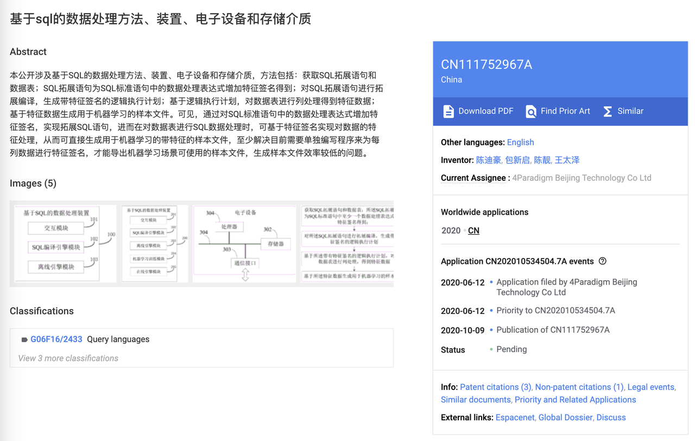

# OpenMLDB 新功能介绍：特征签名，让 SQL 完成特征工程全流程

## 背景

时间回溯到2020年，第四范式的特征引擎团队提交并通过了一项发明专利[《基于SQL的数据处理方法、装置、电子设备和 存储介质》](https://patents.google.com/patent/CN111752967A/zh)，这项专利创新性地把 SQL 数据处理语言和机器学习的特征签名结合起来，极大拓展了 SQL 语句的功能边界。



当时市面上还没有任何一种 SQL 数据库或 OLAP 引擎支持这种语法，而第四范式的机器学习平台上也只能用自定义的 DSL 领域描述语言来实现特征签名功能。

终于在 v0.9.0 版本迭代后， OpenMLDB 新增了特征签名功能，支持输出为 CSV、LIBSVM 等格式的样本，可以直接对接机器学习的训练或预估，同时保障了离线和在线的一致性。

## 特征签名和标签签名

OpenMLDB 的特征签名功能是在标准 SQL 的基础上，基于一系列 OpenMLDB 定制的 UDF 实现的，目前OpenMLDB支持以下几种签名函数：

- `continuous(column)` 表示 column 是一个连续特征，column 可以是任意数值类型。
- `discrete(column[, bucket_size])` 表示 column 是一个离散特征，column 可以是 bool 类型，整数类型，日期与时间类型。 `bucket_size` 是可选参数，用于设置分桶数量，在没有指定 `bucket_size` 时，值域是 int64 类型的全部取值范围。
- `binary_label(column)` 表示 column 是一个二分类标签， column 必须是 bool 类型。
- `multiclass_label(column)` 表示 column 是多分类标签， column 可以是 bool 类型或整数类型。
- `regression_label(column)` 表示 column 是回归标签， column 可以是任意数值类型。

这些函数必须配合样本格式函数 csv 或 libsvm 使用，而不能单独使用。csv 和 libsvm可以接收任意数量的参数，每个参数都需要经过 continuous 等函数来确定如何签名。OpenMLDB 会合理处理空数据和错误数据，保留最大的样本信息量。

## 使用示例
首先参照[快速入门](https://openmldb.ai/docs/zh/main/tutorial/standalone_use.html)获取镜像并启动 OpenMLDB 服务端和客户端。

```bash
docker run -it 4pdosc/openmldb:0.9.2 bash
/work/init.sh
/work/openmldb/sbin/openmldb-cli.sh
```

在 OpenMLDB 客户端中创建数据库并导入数据。

```sql
--OpenMLDB CLI
CREATE DATABASE demo_db;
USE demo_db;
CREATE TABLE t1(id string, vendor_id int, pickup_datetime timestamp, dropoff_datetime timestamp, passenger_count int, pickup_longitude double, pickup_latitude double, dropoff_longitude double, dropoff_latitude double, store_and_fwd_flag string, trip_duration int);
SET @@execute_mode='offline';
LOAD DATA INFILE '/work/taxi-trip/data/taxi_tour_table_train_simple.snappy.parquet' INTO TABLE t1 options(format='parquet', header=true, mode='append');
```

使用命令 `SHOW JOBS` 查看任务运行状态，等待任务运行成功后，进行特征工程并导出 CSV 格式的训练数据。

当前版本的 OpenMLDB 不支持过长的列名，所以通过 `SELECT csv(...) AS instance` 指定样本的列名是必要的。

```sql
--OpenMLDB CLI
USE demo_db;
SET @@execute_mode='offline';
WITH t1 as (SELECT trip_duration,
        passenger_count,
        sum(pickup_latitude) OVER w AS vendor_sum_pl,
        count(vendor_id) OVER w AS vendor_cnt,
    FROM t1
    WINDOW w AS (PARTITION BY vendor_id ORDER BY pickup_datetime ROWS_RANGE BETWEEN 1d PRECEDING AND CURRENT ROW))
SELECT csv(
    regression_label(trip_duration),
    continuous(passenger_count),
    continuous(vendor_sum_pl),
    continuous(vendor_cnt),
    discrete(vendor_cnt DIV 10)) AS instance
FROM t1 INTO OUTFILE '/tmp/feature_data_csv' OPTIONS(format='csv', header=false, quote='');
```

如果需要 LIBSVM 格式的训练数据，仅需要将 `SELECT csv(...)` 改为 `SELECT libsvm(...)` 函数，需要注意的是 OPTIONS 中仍然使用 csv 格式，因为导出的数据实际上只有一列，而这一列已经包含了完整的 libsvm 格式的样本。

此外 libsvm 函数会从 1 开始对连续特征和已知分桶数量的离散特征进行编号，因此在指定分桶数量后，可以保证不同列对应的特征编码范围没有冲突。如果不指定离散特征的分桶数量，一些样本的特征签名会有小概率发生冲突。

```sql
--OpenMLDB CLI
USE demo_db;
SET @@execute_mode='offline';
WITH t1 as (SELECT trip_duration,
        passenger_count,
        sum(pickup_latitude) OVER w AS vendor_sum_pl,
        count(vendor_id) OVER w AS vendor_cnt,
    FROM t1
    WINDOW w AS (PARTITION BY vendor_id ORDER BY pickup_datetime ROWS_RANGE BETWEEN 1d PRECEDING AND CURRENT ROW))
SELECT libsvm(
    regression_label(trip_duration),
    continuous(passenger_count),
    continuous(vendor_sum_pl),
    continuous(vendor_cnt),
    discrete(vendor_cnt DIV 10, 100)) AS instance
FROM t1 INTO OUTFILE '/tmp/feature_data_libsvm' OPTIONS(format='csv', header=false, quote='');
```

## 总结
特征签名通过将 SQL 与机器学习相结合，简化了数据处理流程，使得特征工程更加高效和一致。这一创新扩展了 SQL 的功能边界，支持输出多种格式的数据样本，直接对接机器学习训练和预测，提高了数据处理的灵活性和精度，对数据科学和工程实践具有重要意义。

OpenMLDB 引入签名功能进一步缩小了特征工程和机器学习框架的距离，通过 OpenMLDB 统一签名样本，可以进一步提高全流程的离线在线一致性，降低维护变更成本。后续 OpenMLDB 将添加更多的签名函数，包括 onehot 编码以及特征交叉等，使样本特征数据中的信息更容易被机器学习框架充分利用。

