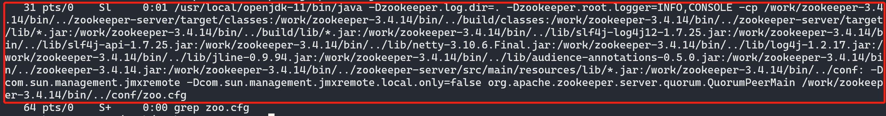

# 安装部署

## 软硬件要求

### 操作系统

发行的预编译包支持：CentOS 7.x, Ubuntu 20.04, SUSE 12 SP3, macOS 12。对于其他操作系统发行版本，预编译包未做充分测试，无法保证其完全兼容。你可以尝试 [从源码编译](compile.md)，来支持其他的操作系统。

### 第三方组件依赖

如果需要部署 ZooKeeper 和 TaskManager，则需要有 Java 运行环境。

### 硬件

* CPU：
  * x86 CPU，推荐 不少于 4 核
  * 如果使用预编译包，则需要支持 AVX2 指令集；否则请从 [源码编译](compile.md)
  * 内存：推荐至少 8 GB；如果业务场景数据量较大，推荐 128 GB 或者以上
* 其他硬件：无特殊需求，但磁盘以及网络的性能，均可能会影响 OpenMLDB 的延迟和吞吐性能表现。

## 部署包

### 下载/源码编译

如果你的操作系统可以直接运行预编译包，则可以从以下地址下载：

- GitHub release 页面：https://github.com/4paradigm/OpenMLDB/releases
- 镜像站点（中国）：http://43.138.115.238/download/

其中预编译包和可支持的操作系统的对应关系为：

- `openmldb-x.x.x-linux.tar.gz`: CentOS 7.x, Ubuntu 20.04, SUSE 12 SP3
- `openmldb-x.x.x-darwin.tar.gz`: macOS 12

如果用户的操作系统不在列表，或者期望从源代码编译，则参考我们的 [源码编译文档](compile.md)。

### Linux 平台预测试

由于 Linux 平台的多样性，发布包可能在你的机器上不兼容，请先通过简单的运行测试。比如，下载预编译包 `openmldb-0.7.3-linux.tar.gz` 以后，运行：

```
tar -zxvf openmldb-0.7.3-linux.tar.gz
./openmldb-0.7.3-linux/bin/openmldb --version
```

结果应显示该程序的版本号，类似

```
openmldb version 0.7.3-xxxx
Debug build (NDEBUG not #defined)
```

如果未运行成功，则需要通过源码编译 OpenMLDB。

## 配置环境

为了保证部署的正确性和稳定性，建议进行如下的系统配置操作。以下操作假设在 Linux 系统下命令。

### 配置 coredump 文件大小限制和最多文件打开数目
```bash
ulimit -c unlimited
ulimit -n 655360
```

通过`ulimit`命令配置的参数，只对当前session有效，如果希望持久化配置，需要在`/etc/security/limits.conf`添加如下配置：
```bash
*       soft    core    unlimited
*       hard    core    unlimited
*       soft    nofile  655360
*       hard    nofile  655360
```

### 关闭操作系统 swap

查看当前系统swap是否关闭

```bash
$ free
              total        used        free      shared  buff/cache   available
Mem:      264011292    67445840     2230676     3269180   194334776   191204160
Swap:             0           0           0
```

如果swap一项全部为0表示已经关闭，否则运行下面命令关闭swap

```
swapoff -a
```

### 关闭 THP(Transparent Huge Pages)

使用如下命令，查看THP是否关闭

```
$ cat /sys/kernel/mm/transparent_hugepage/enabled
always [madvise] never
$ cat /sys/kernel/mm/transparent_hugepage/defrag
[always] madvise never
```

如果上面两个配置中 `never` 没有被选中（`[never]`），则需要使用如下命令进行配置：

```bash
echo 'never' > /sys/kernel/mm/transparent_hugepage/enabled
echo 'never' > /sys/kernel/mm/transparent_hugepage/defrag
```

查看是否设置成功，如下所示：

```bash
$ cat /sys/kernel/mm/transparent_hugepage/enabled
always madvise [never]
$ cat /sys/kernel/mm/transparent_hugepage/defrag
always madvise [never]
```

注：以上三项也可以通过脚本一键修改，参考[修改机器环境配置](#修改机器环境配置-可选)

### 时间和时区设置

OpenMLDB 数据过期删除机制依赖于系统时钟, 如果系统时钟不正确会导致过期数据没有删掉或者删掉了没有过期的数据。

### 网络白名单

OpenMLDB 集群的服务组件之间需要保证网络连通。客户端到 OpenMLDB 集群则分为两种情况：

- Client（CLI 以及 SDKs）连接到 OpenMLDB 集群，除了与 ZooKeeper 的连通，还需要保证和Nameserver/TabletServer/TaskManager的连通

- 如果服务仅使用 APIServer 进行通信，那么客户端只需保证能访问 APIServer 端口

## 部署高可用集群

在生产环境中，我们建议部署具备高可用能力的 OpenMLDB 集群。关于高可用部署架构，请参照我们推荐的 [高可用部署最佳实践](../maintain/backup.md)。

## 守护进程启动方式

OpenMLDB 提供了两种启动模式：普通和守护进程启动。守护进程额外提供了一层保护，在服务进程意外退出的情况下，可以自动重新启动。关于守护进程启动：

- 守护进程并非系统服务，如果守护进程意外推出，将会失去守护作用。
- 每一个服务进程均有一个关联的独立的守护进程。
- 守护进程如果被 `SIGKILL` 信号杀死，则关联的被守护进程不会退出。此时如果想恢复正常的守护进程启动方式，需要把关联的进程杀掉，再以守护进程方式启动。
- 守护进程如果被非 `SIGKILL` 信号杀死，则守护进程退出时也会把相关联的进程同时退出。

如果想要使守护进程模式启动，请使用`bash bin/start.sh start <component> mon`或者`sbin/start-all.sh mon`的方式启动。守护进程模式中，`bin/<component>.pid`将是 mon 进程的 pid，`bin/<component>.pid.child` 为组件真实的 pid。


## 部署方式一：一键部署（推荐）
OpenMLDB集群版需要部署ZooKeeper、NameServer、TabletServer、TaskManager等模块。其中ZooKeeper用于服务发现和保存元数据信息。NameServer用于管理TabletServer，实现高可用和failover。TabletServer用于存储数据和主从同步数据。APIServer是可选的，如果要用http的方式和OpenMLDB交互需要部署此模块。TaskManager 用于管理离线 job。我们提供了一键部署脚本，可以简化手动在每台机器上下载和配置的复杂性。

**注意:** 同一台机器部署多个组件时，一定要部署在不同的目录里，便于单独管理。尤其是部署TabletServer，一定不能重复使用目录，避免数据文件和日志文件冲突。

### 环境要求

- 部署机器（执行部署脚本的机器）可以免密登录其他部署节点
- 部署机器安装 `rsync` 工具
- 部署机器安装 Python3
- 部署Zookeeper和TaskManager的机器安装 JRE (Java Runtime Environment)

### 下载OpenMLDB发行版

```
wget https://github.com/4paradigm/OpenMLDB/releases/download/v0.7.3/openmldb-0.7.3-linux.tar.gz
tar -zxvf openmldb-0.7.3-linux.tar.gz
cd openmldb-0.7.3-linux
```

### 环境配置
环境变量定义在`conf/openmldb-env.sh`，如下表所示：

| 环境变量                              | 默认值                                | 定义                                                                      |
|-----------------------------------|------------------------------------|-------------------------------------------------------------------------|
| OPENMLDB_VERSION                  | 0.7.3                              | OpenMLDB版本                                                              |
| OPENMLDB_MODE                     | standalone                         | standalone或者cluster                                                     |
| OPENMLDB_HOME                     | 当前发行版的根目录                          | openmldb发行版根目录                                                          |
| SPARK_HOME                        | $OPENMLDB_HOME/spark               | openmldb spark发行版根目录，如果该目录不存在，自动从网上下载                                   |
| OPENMLDB_TABLET_PORT              | 10921                              | TabletServer默认端口                                                              |
| OPENMLDB_NAMESERVER_PORT          | 7527                               | NameServer默认端口                                                          |
| OPENMLDB_TASKMANAGER_PORT         | 9902                               | taskmanager默认端口                                                         |
| OPENMLDB_APISERVER_PORT           | 9080                               | APIServer默认端口                                                           |
| OPENMLDB_USE_EXISTING_ZK_CLUSTER  | false                              | 是否使用已经部署的ZooKeeper集群。如果是`false`，会在部署脚本里自动启动ZooKeeper集群                  |
| OPENMLDB_ZK_HOME                  | $OPENMLDB_HOME/zookeeper           | ZooKeeper发行版根目录                                                         |
| OPENMLDB_ZK_CLUSTER               | 自动从`conf/hosts`中的`[zookeeper]`配置获取 | ZooKeeper集群地址                                                           |
| OPENMLDB_ZK_ROOT_PATH             | /openmldb                          | OpenMLDB在ZooKeeper的根目录                                                  |
| OPENMLDB_ZK_CLUSTER_CLIENT_PORT   | 2181                               | ZooKeeper client port, 即zoo.cfg里面的clientPort                            |
| OPENMLDB_ZK_CLUSTER_PEER_PORT     | 2888                               | ZooKeeper peer port，即zoo.cfg里面这种配置server.1=zoo1:2888:3888中的第一个端口配置      |
| OPENMLDB_ZK_CLUSTER_ELECTION_PORT | 3888                               | ZooKeeper election port, 即zoo.cfg里面这种配置server.1=zoo1:2888:3888中的第二个端口配置 |

### 节点配置
节点配置文件为`conf/hosts`，示例如下：
```bash
[tablet]
node1:10921 /tmp/openmldb/tablet
node2:10922 /tmp/openmldb/tablet

[nameserver]
node3:7527

[apiserver]
node3:9080

[taskmanager]
node3:9902

[zookeeper]
node3:2181:2888:3888 /tmp/openmldb/zk-1
```

配置文件分为四个区域，以`[]`来识别：

- `[tablet]`：配置部署TabletServer的节点列表
- `[nameserver]`：配置部署NameServer的节点列表
- `[apiserver]`：配置部署APIServer的节点列表
- `[taskmanager]`：配置部署TaskManager的节点列表
- `[zookeeper]`：配置部署ZooKeeper的节点列表

每个区域的节点列表，每一行代表一个节点，每行格式为`host:port WORKDIR`。
对于`[zookeeper]`, 会有额外端口参数，包括follower用来连接leader的`zk_peer_port`和用于leader选择的`zk_election_port`，
其格式为`host:port:zk_peer_port:zk_election_port WORKDIR`。

每一行节点列表，除了`host`是必须的，其他均为可选，如果没有提供，会使用默认配置，默认配置参考`conf/openmldb-env.sh`。

```{warning}
如果在不同机器上部署多个 TaskManager，其 `offline.data.prefix` 配置的路径，这些机器必须可以访问，建议配置hdfs路径。
```

### 修改机器环境配置 (可选)
```
bash sbin/init_env.sh
```
说明:
- 需要用root用户执行此脚本。执行其他脚本不需要root
- 此脚本只修改limit配置，关闭swap和关闭THP

### 部署

```bash
sbin/deploy-all.sh
```
该脚本会把相关的文件分发到`conf/hosts`里面配置的机器上，同时根据`conf/hosts`和`conf/openmldb-env.sh`
的配置，对相关组件的配置做出相应的更新。

如果希望为每个节点添加一些额外的相同的定制化配置，可以在执行deploy脚本之前，修改`conf/xx.template`的配置，
这样在分发配置文件的时候，每个节点都可以用到更改后的配置。
重复执行`sbin/deploy-all.sh`会覆盖上一次的配置。

### 启动服务

普通模式启动：

```bash
sbin/start-all.sh
```
或者，使用守护进程模式启动：

```bash
sbin/start-all.sh mon
```

该脚本会把 `conf/hosts` 里面配置的所有服务启动起来。启动完成以后，可以通过辅助脚本启动 CLI （`sbin/openmldb-cli.sh`），来验证集群是否正常启动。

```{tip}
start-all.sh 是一个非常有用的工具。除了在部署阶段可以使用，也可以在运维阶段用于启动某一个下线的 OpenMLDB 进程。比如某一个 tablet 进程意外下线，你可以直接执行 start-all.sh。该脚本对于已经启动的进程不会产生副作用，对于已配置、但是未启动的进程，将会自动进行启动。
```
### 停止服务
如果需要停止所有服务，可以执行以下脚本：
```bash
sbin/stop-all.sh
```


## 部署方式二：手动部署
OpenMLDB集群版需要部署ZooKeeper、NameServer、TabletServer、TaskManager等模块。其中ZooKeeper用于服务发现和保存元数据信息。NameServer用于管理TabletServer，实现高可用和failover。TabletServer用于存储数据和主从同步数据。APIServer是可选的，如果要用http的方式和OpenMLDB交互需要部署此模块。TaskManager用于管理离线job。

**注意 1:** 同一台机器部署多个组件时，一定要部署在不同的目录里，便于单独管理。尤其是部署TabletServer，一定不能重复使用目录，避免数据文件和日志文件冲突。

**注意 2:** 下文均使用常规后台进程模式启动组件，如果想要使守护进程模式启动组件，请使用命令格式如 `bash bin/start.sh start <component> mon`。

### 部署 ZooKeeper
ZooKeeper 要求版本在 3.4 到 3.6 之间, 建议部署3.4.14版本。如果已有可用ZooKeeper集群可略过此步骤。如果想要部署ZooKeeper集群，参考[这里](https://zookeeper.apache.org/doc/r3.4.14/zookeeperStarted.html#sc_RunningReplicatedZooKeeper)。本步骤只演示部署standalone ZooKeeper。

**1. 下载ZooKeeper安装包**

```
wget https://archive.apache.org/dist/zookeeper/zookeeper-3.4.14/zookeeper-3.4.14.tar.gz
tar -zxvf zookeeper-3.4.14.tar.gz
cd zookeeper-3.4.14
cp conf/zoo_sample.cfg conf/zoo.cfg
```

**2. 修改配置文件**
打开文件`conf/zoo.cfg`修改`dataDir`和`clientPort`。
```
dataDir=./data
clientPort=7181
```

**3. 启动ZooKeeper**
```
bash bin/zkServer.sh start
```

启动成功将如下图所示，有`STARTED`提示。


通过`ps f|grep zoo.cfg`也可以看到ZooKeeper进程正在运行。



```{attention}
如果发现ZooKeeper进程启动失败，请查看当前目录的zookeeper.out日志。
```

**4. 记录ZooKeeper服务地址与连接测试**

后续TabletServer、NameServer与TaskManager连接ZooKeeper，均需要配置这个ZooKeeper服务地址。跨主机访问ZooKeeper服务需要使用公网IP（这里我们假设为`172.27.128.33`，实际请获得你的ZooKeeper部署机器IP），又由第二步填写的`clientPort`，可知ZooKeeper服务地址为`172.27.128.33:7181`。

你可以使用`zookeeper-3.4.14/bin/zkCli.sh`来进行连接ZooKeeper的测试，仍在`zookeeper-3.4.14`目录中运行
```
bash bin/zkCli.sh -server 172.27.128.33:7181
```
可以进入zk客户端程序，如下图所示，有`CONNECTED`提示。


输入`quit`回车或`Ctrl+C`退出zk客户端。

### 部署 TabletServer

注意，TabletServer 至少需要部署两台，否则会出错无法正确完成部署。

**1. 下载OpenMLDB部署包**

```
wget https://github.com/4paradigm/OpenMLDB/releases/download/v0.7.3/openmldb-0.7.3-linux.tar.gz
tar -zxvf openmldb-0.7.3-linux.tar.gz
mv openmldb-0.7.3-linux openmldb-tablet-0.7.3
cd openmldb-tablet-0.7.3
```
**2. 修改配置文件`conf/tablet.flags`**
```bash
# 可以在示例配置文件的基础上，进行修改
cp conf/tablet.flags.template conf/tablet.flags
```
```{attention}
注意，配置文件是`conf/tablet.flags`，不是其他配置文件。启动多台TabletServer时（多TabletServer目录应该独立，不可共享），依然是修改该配置文件。
```
* 修改`endpoint`。`endpoint`是用冒号分隔的部署机器IP/域名和端口号（endpoint不能用0.0.0.0和127.0.0.1，必须是公网IP）。
* 修改`zk_cluster`为已经启动的zk服务地址(见[ZooKeeper启动步骤](#4-记录ZooKeeper服务地址与连接测试))。如果zk服务是集群，可用逗号分隔，例如，`172.27.128.33:7181,172.27.128.32:7181,172.27.128.31:7181`。
* 修改`zk_root_path`，本例中使用`/openmldb_cluster`。注意，**同一个集群下的组件`zk_root_path`是相同的**。所以本次部署中，各个组件配置的`zk_root_path`都为`/openmldb_cluster`。
```
--endpoint=172.27.128.33:9527
--role=tablet

# if tablet run as cluster mode zk_cluster and zk_root_path should be set
--zk_cluster=172.27.128.33:7181
--zk_root_path=/openmldb_cluster
```
**注意：**
* 如果endpoint配置项使用的是域名, 所有使用openmldb client的机器都得配上对应的host. 不然会访问不到

**3. 启动服务**

```
bash bin/start.sh start tablet
```
启动后应有`success`提示，如下所示。
```
Starting tablet ...
Start tablet success
```

通过`ps f | grep tablet`查看进程状态。


通过`curl http://<tablet_ip>:<port>/status`也可以测试TabletServer是否运行正常。

```{attention}
如果发现TabletServer启动失败，或进程运行一阵子后就退出了，可以检查该TabletServer启动目录下的`logs/tablet.WARNING`，更详细可以检查`logs/tablet.INFO`。如果是IP地址已被使用，请自行更改TabletServer的endpoint端口，再次启动。启动前请保证启动目录中没有`db  logs  recycle`三个目录。可以使用命令删除 `rm -rf db logs recycle`，以防止遗留的文件与日志对当前的判断造成干扰。如果无法解决，请联系开发社区，并提供日志。
```
**4. 重复以上步骤部署多个TabletServer**

```{important}
集群版的TabletServer数量必须2台及以上，如果只有1台TabletServer，启动NameServer将会failed。NameServer的日志(logs/nameserver.WARNING)中会包含"is less then system table replica num"的日志。
```

在另一台机器启动下一个TabletServer只需在该机器上重复以上步骤。如果是在同一个机器上启动下一个TabletServer，请保证是在另一个目录中，不要重复使用已经启动过TabletServer的目录。

比如，可以再次解压压缩包（不要cp已经启动过TabletServer的目录，启动后的生成文件会造成影响），并命名目录为`openmldb-tablet-0.7.3-2`。

```
tar -zxvf openmldb-0.7.3-linux.tar.gz
mv openmldb-0.7.3-linux openmldb-tablet-0.7.3-2
cd openmldb-tablet-0.7.3-2
```

再修改配置并启动。注意，TabletServer如果都在同一台机器上，请使用不同端口号，否则日志(logs/tablet.WARNING)中将会有"Fail to listen"信息。

**注意:**
* 服务启动后会在bin目录下产生tablet.pid文件, 里边保存启动时的进程号。如果该文件内的pid正在运行则会启动失败

### 部署 NameServer
```{attention}
请保证所有TabletServer已经启动成功，再部署NameServer，不能更改部署顺序。
```
**1. 下载OpenMLDB部署包**
````
wget https://github.com/4paradigm/OpenMLDB/releases/download/v0.7.3/openmldb-0.7.3-linux.tar.gz
tar -zxvf openmldb-0.7.3-linux.tar.gz
mv openmldb-0.7.3-linux openmldb-ns-0.7.3
cd openmldb-ns-0.7.3
````
**2. 修改配置文件conf/nameserver.flags**
```bash
# 可以在示例配置文件的基础上，进行修改
cp conf/nameserver.flags.template conf/nameserver.flags
```
```{attention}
注意，配置文件是`conf/nameserver.flags`，不是其他配置文件。启动多台NameServert时（多NameServer目录应该独立，不可共享），依然是修改该配置文件。
```
* 修改`endpoint`。`endpoint`是用冒号分隔的部署机器IP/域名和端口号（endpoint不能用0.0.0.0和127.0.0.1，必须是公网IP）。
* 修改`zk_cluster`为已经启动的zk服务地址(见[ZooKeeper启动步骤](#4-记录ZooKeeper服务地址与连接测试))。如果zk服务是集群，可用逗号分隔，例如，`172.27.128.33:7181,172.27.128.32:7181,172.27.128.31:7181`。
* 修改`zk_root_path`，本例中使用`/openmldb_cluster`。注意，**同一个集群下的组件`zk_root_path`是相同的**。所以本次部署中，各个组件配置的`zk_root_path`都为`/openmldb_cluster`。
```
--endpoint=172.27.128.31:6527
--zk_cluster=172.27.128.33:7181
--zk_root_path=/openmldb_cluster
```

**3. 启动服务**
```
bash bin/start.sh start nameserver
```

启动后应有`success`提示，如下所示。
```
Starting nameserver ...
Start nameserver success
```

同样可以通过`curl http://<ns_ip>:<port>/status`检测NameServer是否正常运行。

**4. 重复上述步骤部署多个NameServer**

NameServer 可以只存在一台，如果你需要高可用性，可以部署多 NameServer。

在另一台机器启动下一个 NameServer 只需在该机器上重复以上步骤。如果是在同一个机器上启动下一个 NameServer，请保证是在另一个目录中，不要重复使用已经启动过 namserver 的目录。

比如，可以再次解压压缩包（不要cp已经启动过 namserver 的目录，启动后的生成文件会造成影响），并命名目录为`openmldb-ns-0.7.3-2`。

```
tar -zxvf openmldb-0.7.3-linux.tar.gz
mv openmldb-0.7.3-linux openmldb-ns-0.7.3-2
cd openmldb-ns-0.7.3-2
```
然后再修改配置并启动。

**注意:**
* 服务启动后会在bin目录下产生`namserver.pid`文件, 里边保存启动时的进程号。如果该文件内的pid正在运行则会启动失败
* 请把所有 TabletServer 部署完再部署 NameServer

**5. 检查服务是否启动**

```{attention}
必须部署了至少一个NameServer，才可以使用以下方式查询到**当前**集群已启动的服务组件。
```

```bash
echo "show components;" | ./bin/openmldb --zk_cluster=172.27.128.33:7181 --zk_root_path=/openmldb_cluster --role=sql_client
```

结果**类似**下图，可以看到你已经部署好了的所有TabletServer和NameServer。
```
 ------------------- ------------ --------------- -------- ---------
  Endpoint            Role         Connect_time    Status   Ns_role
 ------------------- ------------ --------------- -------- ---------
  172.27.128.33:9527  tablet       1665568158749   online   NULL
  172.27.128.33:9528  tablet       1665568158741   online   NULL
  172.27.128.31:6527  nameserver   1665568159782   online   master
 ------------------- ------------ --------------- -------- ---------
```

### 部署 APIServer

APIServer负责接收http请求，转发给OpenMLDB集群并返回结果。它是无状态的。APIServer并不是OpenMLDB必须部署的组件，如果不需要使用http接口，可以跳过本步骤，进入下一步[部署TaskManager](#部署TaskManager)。

运行前需确保OpenMLDB集群的TabletServer和NameServer进程已经启动（TaskManager不影响APIServer的启动），否则APIServer将初始化失败并退出进程。

**1. 下载OpenMLDB部署包**

```
wget https://github.com/4paradigm/OpenMLDB/releases/download/v0.7.3/openmldb-0.7.3-linux.tar.gz
tar -zxvf openmldb-0.7.3-linux.tar.gz
mv openmldb-0.7.3-linux openmldb-apiserver-0.7.3
cd openmldb-apiserver-0.7.3
```

**2. 修改配置文件conf/apiserver.flags**
```bash
# 可以在示例配置文件的基础上，进行修改
cp conf/apiserver.flags.template conf/apiserver.flags
```

* 修改`endpoint`。`endpoint`是用冒号分隔的部署机器IP/域名和端口号（endpoint不能用0.0.0.0和127.0.0.1，必须是公网IP）。
* 修改`zk_cluster`为已经启动的zk服务地址(见[ZooKeeper启动步骤](#4-记录ZooKeeper服务地址与连接测试))。如果zk服务是集群，可用逗号分隔，例如，`172.27.128.33:7181,172.27.128.32:7181,172.27.128.31:7181`。
* 修改`zk_root_path`，本例中使用`/openmldb_cluster`。注意，**同一个集群下的组件`zk_root_path`是相同的**。所以本次部署中，各个组件配置的`zk_root_path`都为`/openmldb_cluster`。

```
--endpoint=172.27.128.33:8080
--zk_cluster=172.27.128.33:7181
--zk_root_path=/openmldb_cluster
```

**注意：**

* 如果http请求并发度较大，可自行调大APIServer的线程数，`--thread_pool_size`，默认为16，重启生效。

**3. 启动服务**

```
bash bin/start.sh start apiserver
```

启动后应有`success`提示，如下所示。
```
Starting apiserver ...
Start apiserver success
```

```{attention}
APIServer是非必需组件，所以不会出现在`show components;`中。
```

可以通过`curl http://<apiserver_ip>:<port>/status`检测 APIServer 是否正常运行，更推荐通过执行sql的方式来测试是否正常：
```
curl http://<apiserver_ip>:<port>/dbs/foo -X POST -d'{"mode":"online","sql":"show components;"}'
```
结果中应该有已启动的所有TabletServer和NameServer的信息。

### 部署TaskManager

TaskManager 可以只存在一台，如果你需要高可用性，可以部署多 TaskManager ，需要注意避免IP端口冲突。如果 TaskManager 主节点出现故障，从节点将自动恢复故障取代主节点，客户端无需任何修改可继续访问 TaskManager 服务。

**1. 下载 OpenMLDB 部署包和面向特征工程优化的 Spark 发行版**

Spark发行版：
```shell
wget https://github.com/4paradigm/spark/releases/download/v3.2.1-openmldb0.7.3/spark-3.2.1-bin-openmldbspark.tgz
# 中国镜像地址：http://43.138.115.238/download/v0.7.3/spark-3.2.1-bin-openmldbspark.tgz
tar -zxvf spark-3.2.1-bin-openmldbspark.tgz 
export SPARK_HOME=`pwd`/spark-3.2.1-bin-openmldbspark/
```

OpenMLDB部署包：
```
wget https://github.com/4paradigm/OpenMLDB/releases/download/v0.7.3/openmldb-0.7.3-linux.tar.gz
tar -zxvf openmldb-0.7.3-linux.tar.gz
mv openmldb-0.7.3-linux openmldb-taskmanager-0.7.3
cd openmldb-taskmanager-0.7.3
```

**2. 修改配置文件conf/taskmanager.properties**
```bash
# 可以在示例配置文件的基础上，进行修改
cp conf/taskmanager.properties.template conf/taskmanager.properties
```

* 修改`server.host`。host是部署机器的IP/域名。
* 修改`server.port`。port是部署机器的端口号。
* 修改`zk_cluster`为已经启动的zk集群地址。IP为zk所在机器的IP, port为zk配置文件中clientPort配置的端口号. 如果zk是集群模式用逗号分割, 格式为ip1:port1,ip2:port2,ip3:port3。
* 如果和其他OpenMLDB共用zk需要修改zookeeper.root_path。
* 修改`batchjob.jar.path`为BatchJob Jar文件路径，如果设置为空会到上一级lib目录下寻找。如果使用Yarn模式需要修改为对应HDFS路径。
* 修改`offline.data.prefix`为离线表存储路径，如果使用Yarn模式需要修改为对应HDFS路径。
* 修改`spark.master`为离线任务运行模式，目前支持local和yarn模式。
* 修改`spark.home`为Spark环境路径，如果不配置或配置为空则使用`SPARK_HOME`环境变量的配置。也可在配置文件中设置，路径为绝对路径。

```
server.host=172.27.128.33
server.port=9902
zookeeper.cluster=172.27.128.33:7181
zookeeper.root_path=/openmldb_cluster
batchjob.jar.path=
offline.data.prefix=file:///tmp/openmldb_offline_storage/
spark.master=local
spark.home=
```
```{attention}
分布式部署的集群，请不要使用客户端本地文件作为源数据导入，推荐使用hdfs路径。

`spark.master=yarn`时，**必须**使用hdfs路径。
`spark.master=local`时，如果一定要是有本地文件，可以将文件拷贝至TaskManager运行的主机上，使用TaskManager主机上的绝对路径地址。

离线数据量较大时，也推荐`offline.data.prefix`使用hdfs，而不是本地file。
```

**3. 启动服务**
```
bash bin/start.sh start taskmanager
```

`ps f|grep taskmanager`应运行正常，`curl http://<taskmanager_ip>:<port>/status`可以查询到taskmanager进程状态。

```{note}
TaskManager的日志分为TaskManager进程日志和每个离线命令的job日志。默认路径为<启动目录>/taskmanager/bin/logs，其中：
- taskmanager.log/.out为TaskManager进程日志，如果TaskManager进程退出，请查看这个日志。
- job_x_error.log为单个job的运行日志，job_x.log为单个job的print日志（如果是异步select，结果将打印在此处）。如果离线任务失败，例如job 10失败，可通过`SHOW JOBLOG 10;`来获取日志信息。如果版本较低不支持JOBLOG，**请到TaskManager所在机器上**找到对应的日志job_10.log和job_10_error.log。
```

**4. 检查服务是否启动**

```bash
$ ./bin/openmldb --zk_cluster=172.27.128.33:7181  --zk_root_path=/openmldb_cluster --role=sql_client
> show components;
```
结果应类似下表，包含所有集群的组件（APIServer除外）。
```
 ------------------- ------------ --------------- -------- ---------
  Endpoint            Role         Connect_time    Status   Ns_role
 ------------------- ------------ --------------- -------- ---------
  172.27.128.33:9527  tablet       1665568158749   online   NULL
  172.27.128.33:9528  tablet       1665568158741   online   NULL
  172.27.128.31:6527  nameserver   1665568159782   online   master
  172.27.128.33:9902  taskmanager  1665649276766   online   NULL
 ------------------- ------------ --------------- -------- ---------
```

在sql client中，可以通过执行以下sql命令，读写简单的表测试一下集群功能是否正常。（为了简单起见，这里只测试在线部分）
```
create database simple_test;
use simple_test;
create table t1(c1 int, c2 string);
set @@execute_mode='online';
Insert into t1 values (1, 'a'),(2,'b');
select * from t1;
```
