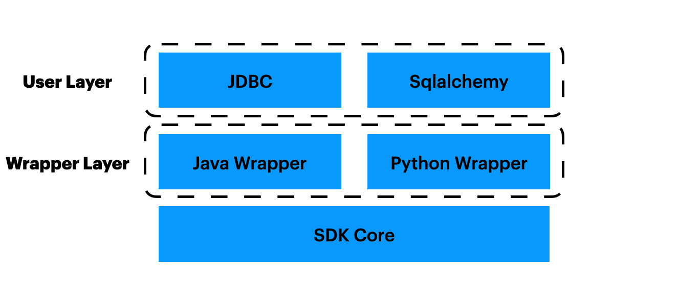

# SDK 开发指南

## 概述

OpenMLDB的SDK，可以分为几层，如图所示。我们将从下层往上依次介绍。


### SDK核心层
最下层是SDK核心层，具体实现为[SQLClusterRouter](https://github.com/4paradigm/OpenMLDB/blob/b6f122798f567adf2bb7766e2c3b81b633ebd231/src/sdk/sql_cluster_router.h#L110)，它是client的最小实现。通过正确的配置后，使用`SQLClusterRouter`的方法可以完成对OpenMLDB集群的所有操作。

开发者需要注意，它的方法中最核心的三个方法。
1. [ExecuteSQL](https://github.com/4paradigm/OpenMLDB/blob/b6f122798f567adf2bb7766e2c3b81b633ebd231/src/sdk/sql_cluster_router.h#L160)，支持执行所有sql，包括DDL，DML，DQL等等。
2. [ExecuteSQLParameterized](https://github.com/4paradigm/OpenMLDB/blob/b6f122798f567adf2bb7766e2c3b81b633ebd231/src/sdk/sql_cluster_router.h#L166)，支持参数化的sql形式。
3. [ExecuteSQLRequest](https://github.com/4paradigm/OpenMLDB/blob/b6f122798f567adf2bb7766e2c3b81b633ebd231/src/sdk/sql_cluster_router.h#L156)，这是OpenMLDB特有的[Request模式](../tutorial/modes.md#4-在线请求模式)，不是普通sql，因此需要一个专用的方法。

其他方法，比如CreateDB/DropDB/DropTable，由于历史原因，还没有及时删除，开发者不需要关心。

### Wrapper层
由于SDK核心层的实现较复杂，我们提供Java和Python SDK的时候，没有选择从零开发，而是使用Java和Python调用**SDK核心层**。具体来说，我们使用swig做了一层wrapper。

Java Wrapper具体实现为[SqlClusterExecutor](https://github.com/4paradigm/OpenMLDB/blob/main/java/openmldb-jdbc/src/main/java/com/_4paradigm/openmldb/sdk/impl/SqlClusterExecutor.java)。可以看到，它仅仅是对`sql_router_sdk`调用的简单封装，比如，对输入类型的转换，对返回结果的封装，对返回错误的封装。

Python Wrapper具体实现为[OpenMLDBSdk](https://github.com/4paradigm/OpenMLDB/blob/main/python/openmldb/sdk/sdk.py)。和Java Wrapper类似，它也只是简单的封装。

### 用户层
Wrapper层是可以直接使用的，但不够方便。所以，我们再提供了一层，Java/Python SDK的用户层。

Java用户层，支持了Java中比较流行的JDBC，具体实现见[jdbc](https://github.com/4paradigm/OpenMLDB/tree/main/java/openmldb-jdbc/src/main/java/com/_4paradigm/openmldb/jdbc)，使得用户可以使用JDBC协议来访问OpenMLDB，降低接入成本。

Python用户层，则是支持Python中比较流行的sqlalchemy，具体实现见[sqlalchemy_openmldb](https://github.com/4paradigm/OpenMLDB/blob/main/python/openmldb/sqlalchemy_openmldb)与[dbapi](https://github.com/4paradigm/OpenMLDB/blob/main/python/openmldb/dbapi)，同样可以降低用户的接入成本。

## 补充

我们希望增加更易用的C++ SDK。显然，我们不需要Wrapper层。
所以，理论上讲，开发者只需要用户层的设计与实现，实现中调用SDK核心层。

但考虑到代码复用，可能会一定程度地改动SDK核心层的代码，或者是调整SDK核心代码结构（比如，暴露SDK核心层的部分头文件等）。

## SDK核心层-细节介绍

由于历史原因，SQLClusterRouter的创建方式有多种。下面一一介绍。
首先是使用两种Option创建，分别会创建连接Cluster和Standalone两种OpenMLDB服务端。
```
    explicit SQLClusterRouter(const SQLRouterOptions& options);
    explicit SQLClusterRouter(const StandaloneOptions& options);
```
这两种常见方式，不会暴露元数据相关的DBSDK，通常给普通用户使用。Java与Python SDK底层也是使用这两种方式。

第三种是基于DBSDK创建：
```
    explicit SQLClusterRouter(DBSDK* sdk);
```
DBSDK有分为Cluster和Standalone两种，因此也可连接两种OpenMLDB服务端。
这种方式方便用户额外地读取操作元数据，否则DBSDK在SQLClusterRouter内部不会对外暴露。

例如，由于CLI可以直接通过DBSDK获得nameserver等元数据信息，我们在启动ClusterSQLClient或StandAloneSQLClient时是先创建DBSDK再创建SQLClusterRouter。

## Java Test

如果希望只在submodule中测试，可能会需要其他submodule依赖，比如openmldb-spark-connector依赖openmldb-jdbc。你需要先install编译好的包
```
# make jsdk.so and mvn package
make SQL_JAVASDK_ENABLE=ON
cd java
mvn install -DskipTests=true -Dscalatest.skip=true -Dwagon.skip=true -Dmaven.test.skip=true -Dgpg.skip
```
然后再
```
mvn test -pl openmldb-spark-connector -Dsuites="com._4paradigm.openmldb.spark.TestWrite local"
```

```{warning}
如果你实时改动了代码，由于本地仓库存在之前的代码编译的jar包，会导致无法测试最新代码。请谨慎使用`-pl`写法。
```

如果只想运行java测试：
```
mvn test -pl openmldb-jdbc -Dtest="SQLRouterSmokeTest"
mvn test -pl openmldb-jdbc -Dtest="SQLRouterSmokeTest#AnyMethod"
```

### batchjob test

batchjob测试可以使用以下方式:
```
$SPARK_HOME/bin/spark-submit --master local --class com._4paradigm.openmldb.batchjob.ImportOfflineData --conf spark.hadoop.hive.metastore.uris=thrift://localhost:9083 --conf spark.openmldb.zk.root.path=/openmldb --conf spark.openmldb.zk.cluster=127.0.0.1:2181 openmldb-batchjob/target/openmldb-batchjob-0.6.5-SNAPSHOT.jar load_data.txt true
```

或者拷贝编译好的openmldb-batchjob jar包到OpenMLDB集群的taskmanager `lib`，然后使用客户端或Taskmanager Client发送命令测试。

支持hive数据源时，注意需要metastore服务。本地测试时，可以在hive目录中启动，默认地址为`thrift://localhost:9083`。
```
bin/hive --service metastore
```
