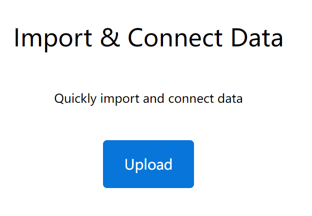
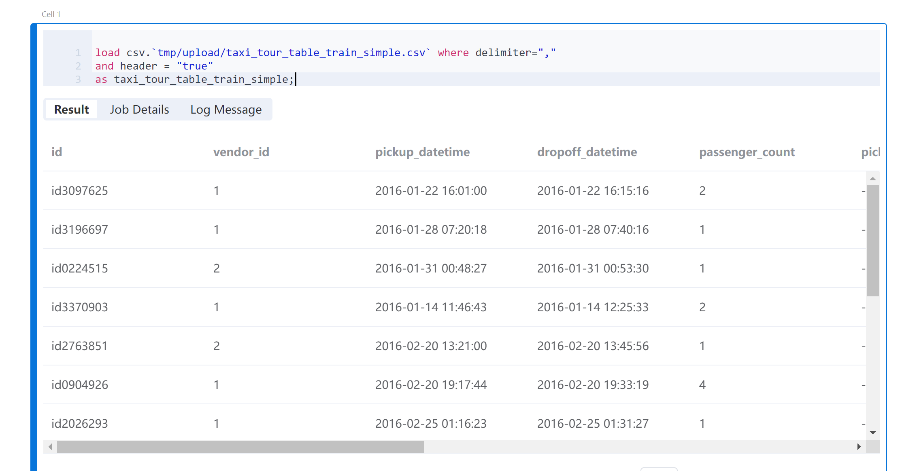

# Byzer

本文示范如何使用[OpenMLDB](https://github.com/4paradigm/OpenMLDB)和 [Byzer](https://www.byzer.org/home) 联合完成一个完整的机器学习应用。OpenMLDB在本例中接收Byzer发送的指令和数据，完成数据的实时特征计算，并经特征工程处理后的数据集返回Byzer，供其进行后续的机器学习训练和预测。

## 1. 准备工作

### 1.1 安装 OpenMLDB 引擎

1. 本例推荐使用运行在Docker容器中的OpenMLDB集群版。安装步骤详见[OpenMLDB快速上手](../zh/quickstart/openmldb_quickstart.md)。
1. 本例中，Byzer引擎虽然在同一主机上，但需要从容器外部访问OpenMLDB服务，所以需要暴露OpenMLDB集群的服务端口，推荐使用`--network host`的方式，具体详见[IP配置文档-CLI/SDK->容器onebox](../reference/ip_tips.md#clisdk容器-onebox)。
1. 为了简单起见，我们使用file形式导入导出OpenMLDB集群数据，所以需要Byzer和OpenMLDB共享文件路径，这里我们将`/mlsql/admin`映射为`/byzermnt`，与OpenMLDB交互的SQL命令中使用`/byzermnt`开头作为文件路径。
1. 我们还需要在OpenMLDB集群中创建名为`db1`的数据库，接下来在Byzer中使用这一数据库（目前不能在Byzer中执行，Byzer连接OpenMLDB必须指定可使用的db）。

执行命令如下：
```
docker run --network host -dit --name openmldb -v /mlsql/admin/:/byzermnt 4pdosc/openmldb:0.8.0 bash
docker exec -it openmldb bash
/work/init.sh
echo "create database db1;" | /work/openmldb/bin/openmldb --zk_cluster=127.0.0.1:2181 --zk_root_path=/openmldb --role=sql_client
exit # 退出容器
```

### 1.2 安装 Byzer 引擎和Byzer Notebook

本例使用[Byzer All In One部署](https://docs.byzer.org/#/byzer-lang/zh-cn/installation/server/byzer-all-in-one-deployment)和[Byzer Notebook二进制安装](https://docs.byzer.org/#/byzer-notebook/zh-cn/installation/install_uninstall)的方式安装Byzer组件。

```{note}
如果你只需要离线安装OpenMLDB插件，也可以使用[Sandbox容器化部署](https://docs.byzer.org/#/byzer-lang/zh-cn/installation/containerized-deployment/sandbox-standalone)一键式启动，并离线安装OpenMLDB插件。

如果你使用VSCode，也可以选择[VSCode中的Byzer插件](https://docs.byzer.org/#/byzer-lang/zh-cn/installation/vscode/byzer-vscode-extension-installation)。插件内置Byzer All In One，无需手动安装。

其他部署方式详见[Byzer 引擎部署指引](https://docs.byzer.org/#/byzer-lang/zh-cn/installation/README)。
```

1. 安装Byzer All In One
```
wget https://download.byzer.org/byzer/2.3.0/byzer-lang-all-in-one-linux-amd64-3.1.1-2.3.0.tar.gz
tar -zxvf byzer-lang-all-in-one-linux-amd64-3.1.1-2.3.0.tar.gz 
cd byzer-lang-all-in-one-linux-amd64-3.1.1-2.3.0
# 如果有java(jdk8以上)环境，可跳过两步export
export JAVA_HOME=$(pwd)/jdk8
export PATH=$JAVA_HOME/bin:$PATH
./bin/byzer.sh start
```
可以`http://<ip>:9003/`访问。

1. 安装Byzer Notebook。由于Byzer Notebook [需要mysql](https://docs.byzer.org/#/byzer-notebook/zh-cn/installation/prerequisites)，如果你没有mysql引擎，可以通过docker方式启动一个mysql引擎。
```
docker run -d --name mysql -e MYSQL_ROOT_PASSWORD=root -e MYSQL_ROOT_HOST=% -p 3306:3306 byzer/mysql:8.0-20.04_beta
wget https://download.byzer.org/byzer-notebook/1.2.3/Byzer-Notebook-1.2.3.tar.gz
tar -zxvf Byzer-Notebook-1.2.3.tar.gz
cd Byzer-Notebook-1.2.3
./bin/bootstrap.sh start
```
可以`http://<ip>:9002/`访问，用户名密码admin/admin，其界面如下。本文使用 Byzer Notebook 进行演示。


### 1.3  Byzer OpenMLDB 插件

本例需要使用 Byzer 提供的[OpenMLDB 插件](https://github.com/byzer-org/byzer-extension/tree/master/byzer-openmldb)完成与 OpenMLDB 的消息传递。我们可以在Byzer Notebook中安装，创建一个Notebook，然后添加Cell并执行：
```
!plugin app add - "byzer-openmldb-3.0";
```

运行Cell后，会下载插件包并安装，需要等待一定的时间。
```{note}
若未成功安装，或下载太慢，可以手动下载jar包再以[离线方式](https://docs.byzer.org/#/byzer-lang/zh-cn/extension/installation/offline_install)安装配置。
```

### 1.3 准备数据集

本文使用的是Kaggle出租车行车时间数据集，为了演示方便，我们只使用一部分数据，可以从[此处](https://openmldb.ai/download/taxi_tour_table_train_simple.csv)下载，然后在Byzer Notebook中进行upload。



upload后可以在Byzer Notebook的Data Catalog-File System中查看到该文件。
```{note}
若你想要使用全量数据集，可以从以下网址获得：[Kaggle出租车行车时间预测问题](https://www.kaggle.com/c/nyc-taxi-trip-duration/overview)。将数据集下载到本地后，需要将其导入Byzer Notebook。
```
## 2. 机器学习全流程

Byzer Notebook中创建一个Notebook，便可以开始编写机器学习全流程。完整Notebook见[]()

### 2.1 检查源数据

[1.3 准备数据集](#13-准备数据集)已经将源数据导入到File System，路径为`tmp/upload`。使用Byzer Lang的`load`命令加载该数据。

```sql
load csv.`tmp/upload/taxi_tour_table_train_simple.csv` where delimiter=","
and header = "true"
as taxi_tour_table_train_simple;
```
运行Cell后，可以看到数据的预览结果。


### 2.2 OpenMLDB 创建表并导入数据

使用插件连接 OpenMLDB 引擎。由于OpenMLDB集群和Byzer部署在同一主机，我们可以使用本地地址`127.0.0.1:2181`来访问OpenMLDB。在Byzer Notebook中运行该代码块前，请确保OpenMLDB引擎已启动。

```sql
run command as FeatureStoreExt.`` where
zkAddress="127.0.0.1:2181"
and zkPath="/openmldb"
and `sql-0`='''
SET @@execute_mode='offline';
'''
and `sql-1`='''
SET @@sync_job=true;
'''
and `sql-2`='''
SET @@job_timeout=20000000;
'''
and `sql-3`='''
CREATE TABLE IF NOT EXISTS t1(id string, vendor_id int, pickup_datetime timestamp, dropoff_datetime timestamp, passenger_count int, pickup_longitude double, pickup_latitude double, dropoff_longitude double, dropoff_latitude double, store_and_fwd_flag string, trip_duration int);
'''
and `sql-4`='''
LOAD DATA INFILE '/byzermnt/tmp/upload/taxi_tour_table_train_simple.csv'
INTO TABLE t1 options(format='csv',header=true,mode='overwrite');
'''
and db="db1"
and action="ddl";
```
任务完成后Result应有`FINISHED`的提示，如果是`FAILED`，请进入openmldb容器检查job日志。

### 2.3 进行离线特征计算

这一步骤通常需要特征设计，本例跳过设计阶段，直接使用[OpenMLDB + LightGBM：出租车行程时间预测](../use_case/taxi_tour_duration_prediction.md)2.3节中设计好的特征进行离线特征计算，并将处理后的数据集导出为本地parquet文件（推荐使用parquet，csv load需要额外的schema）。

```sql
run command as FeatureStoreExt.`` where
zkAddress="127.0.0.1:2181"
and zkPath="/openmldb"
and `sql-0`='''
SET @@execute_mode='offline';
'''
and `sql-1`='''
SET @@sync_job=true;
'''
and `sql-2`='''
SET @@job_timeout=20000000;
'''
and `sql-3`='''
SELECT trip_duration, passenger_count,
sum(pickup_latitude) OVER w AS vendor_sum_pl,
max(pickup_latitude) OVER w AS vendor_max_pl,
min(pickup_latitude) OVER w AS vendor_min_pl,
avg(pickup_latitude) OVER w AS vendor_avg_pl,
sum(pickup_latitude) OVER w2 AS pc_sum_pl,
max(pickup_latitude) OVER w2 AS pc_max_pl,
min(pickup_latitude) OVER w2 AS pc_min_pl,
avg(pickup_latitude) OVER w2 AS pc_avg_pl ,
count(vendor_id) OVER w2 AS pc_cnt,
count(vendor_id) OVER w AS vendor_cnt
FROM t1 
WINDOW w AS (PARTITION BY vendor_id ORDER BY pickup_datetime ROWS_RANGE BETWEEN 1d PRECEDING AND CURRENT ROW),
w2 AS (PARTITION BY passenger_count ORDER BY pickup_datetime ROWS_RANGE BETWEEN 1d PRECEDING AND CURRENT ROW) INTO OUTFILE '/byzermnt/tmp/feature_data' OPTIONS(mode='overwrite', format='parquet');
'''
and db="db1"
and action="ddl";
```
任务完成后Result应有`FINISHED`的提示，如果是`FAILED`，请进入openmldb容器检查job日志。刷新Byzer Notebook的Data Catalog可以看到生成的特征文件路径，File System中的`tmp/feature_data`。

### 2.4 Byzer 中加载数据并向量化

将上一步生成的特征数据load到Byzer环境中：
```sql
load parquet.`tmp/feature_data` as feature_data;
```

将所有int 类型字段都转化为 double。

```
select *, 
cast(passenger_count as double) as passenger_count_d,
cast(pc_cnt as double) as pc_cnt_d,
cast(vendor_cnt as double) as vendor_cnt_d
from feature_data
as new_feature_data;
```

接着把所有字段合并成一个向量。

```sql
select vec_dense(array(
passenger_count_d,
vendor_sum_pl,
vendor_max_pl,
vendor_min_pl,
vendor_avg_pl,
pc_sum_pl,
pc_max_pl,
pc_min_pl,
pc_avg_pl,
pc_cnt_d,
vendor_cnt
)) as features,cast(trip_duration as double) as label
from new_feature_data
as training_table;

```

### 2.5 模型训练

使用Byzer Lang的`train`命令和其[内置的线性回归算法](https://docs.byzer.org/#/byzer-lang/zh-cn/ml/algs/linear_regression)训练模型，并将训练好的模型保存到/model/taxi-trip路径下。

```sql
train training_table as LinearRegression.`/model/taxi-trip` where
keepVersion="true"
and evaluateTable="training_table"
and `fitParam.0.labelCol`="label"
and `fitParam.0.featuresCol`= "features"
and `fitParam.0.maxIter`="50";
```

```{note}
可以使用`!show et/params/LinearRegression;`命令查看Byzer内置的线性回归模型的相关参数。 
```

### 2.6 特征部署

使用`DEPLOY`（必须在在线模式下）将特征计算SQL部署到OpenMLDB上（与离线特征计算SQL一致），这里命名为d1。
```{note}
`DEPLOY`的deployment名字不可重复，如果`DEPLOY`成功后，还需要再次更改，请更换deployment名字，或者删除deployment d1后再`DEPLOY`。
```

```sql
run command as FeatureStoreExt.`` where
zkAddress="127.0.0.1:2181"
and zkPath="/openmldb"
and `sql-0`='''
SET @@execute_mode='online';
'''
and `sql-1`='''
DEPLOY d1 SELECT trip_duration, passenger_count,
sum(pickup_latitude) OVER w AS vendor_sum_pl,
max(pickup_latitude) OVER w AS vendor_max_pl,
min(pickup_latitude) OVER w AS vendor_min_pl,
avg(pickup_latitude) OVER w AS vendor_avg_pl,
sum(pickup_latitude) OVER w2 AS pc_sum_pl,
max(pickup_latitude) OVER w2 AS pc_max_pl,
min(pickup_latitude) OVER w2 AS pc_min_pl,
avg(pickup_latitude) OVER w2 AS pc_avg_pl ,
count(vendor_id) OVER w2 AS pc_cnt,
count(vendor_id) OVER w AS vendor_cnt
FROM t1 
WINDOW w AS (PARTITION BY vendor_id ORDER BY pickup_datetime ROWS_RANGE BETWEEN 1d PRECEDING AND CURRENT ROW),
w2 AS (PARTITION BY passenger_count ORDER BY pickup_datetime ROWS_RANGE BETWEEN 1d PRECEDING AND CURRENT ROW);
'''
and db="db1"
and action="ddl";
```

### 2.7 导入在线数据

在线实时预测通常需要将近期的历史数据导入到在线存储中，除了数据文件导入，生产环境中也可以接入实时数据源。本例为了简单起见，直接导入原始数据集（实时预测是使用新的实时数据作为请求，所以不会出现“预测训练用的特征数据”的情况）。

```sql
run command as FeatureStoreExt.`` where
zkAddress="127.0.0.1:2181"
and zkPath="/openmldb"
and `sql-0`='''
SET @@execute_mode='online';
'''
and `sql-1`='''
SET @@sync_job=true;
'''
and `sql-2`='''
SET @@job_timeout=20000000;
'''
and `sql-3`='''
LOAD DATA INFILE '/byzermnt/tmp/upload/taxi_tour_table_train_simple.csv'
INTO TABLE t1 options(format='csv',mode='append');
'''
and db="db1"
and action="ddl";
```

### 2.8 模型部署

将之前保存的、训练好的模型注册为一个可以直接使用的函数。

```sql
register LinearRegression.`/model/taxi-trip` as taxi_trip_model_predict;
```

### 2.9 实时预测测试

通常来讲，实时特征预测是实时数据驱动的，本例为了方便演示，仍然在Notebook中进行“实时特征计算+预测”，并且使用[Python环境](https://docs.byzer.org/#/byzer-lang/zh-cn/python/env)来进行实时特征计算，可以使用requirements文件：
```
pyarrow==4.0.1
ray[default]==1.8.0
aiohttp==3.7.4
pandas>=1.0.5; python_version < '3.7'
pandas>=1.2.0; python_version >= '3.7'
requests
matplotlib~=3.3.4
uuid~=1.30
pyjava
protobuf==3.20.0 # 新增，如果protobuf版本过高会有import ray的错误
```
```
pip install -r requirements.txt
```

通过构造一条“实时数据”，用http请求OpenMLDB计算出实时特征，并将其保存为文件，再加载到Byzer环境中。
```
!python env "PYTHON_ENV=:";
!python conf "runIn=driver";
!python conf "schema=file";
run command as Ray.`` where 
inputTable="command"
and outputTable="test_feature"
and code='''
import numpy as np
import os
import pandas as pd
import ray
import requests
import json
from pyjava.api.mlsql import RayContext,PythonContext

ray_context = RayContext.connect(globals(),None)

resp = requests.post('http://127.0.0.1:9080/dbs/db1/deployments/d1', json=json.loads('{"input":[["id0376262", 1, 1467302350000, 1467304896000, 2, -73.873093, 40.774097, -73.926704, 40.856739, "N", 1]], "need_schema":true}'))

res = json.loads(resp.text)["data"]
schema_names = [(col["name"], col["type"]) for col in res["schema"]]
df = pd.DataFrame.from_records(np.array([tuple(res["data"][0])], dtype=schema_names))
df.to_parquet('/mlsql/admin/tmp/test_feature.parquet')

context.build_result([])
''';
```

处理后的在线数据的所有int类型字段转成double。

```sql
select *, 
cast(passenger_count as double) as passenger_count_d,
cast(pc_cnt as double) as pc_cnt_d,
cast(vendor_cnt as double) as vendor_cnt_d
from feature_data_test
as new_feature_data_test;
```

再进行向量化。

```sql
select vec_dense(array(
passenger_count_d,
vendor_sum_pl,
vendor_max_pl,
vendor_min_pl,
vendor_avg_pl,
pc_sum_pl,
pc_max_pl,
pc_min_pl,
pc_avg_pl,
pc_cnt_d,
vendor_cnt
)) as features
from new_feature_data_test
as testing_table;
```

使用处理后的测试集进行预测，结果即为预测的`trip_duration`。

```sql
select taxi_trip_model_predict(testing_table) as predict_label;
```
