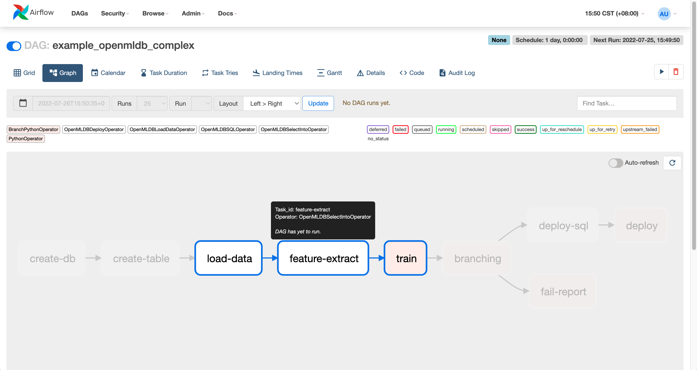
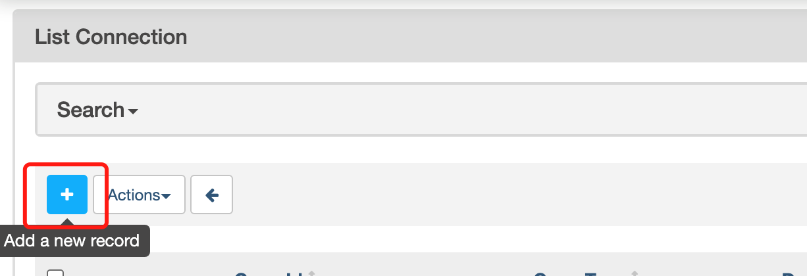

# Airflow 
我们提供了[Airflow OpenMLDB Provider](https://github.com/4paradigm/OpenMLDB/tree/main/extensions/airflow-provider-openmldb)，使得在Airflow DAG中能更容易地使用OpenMLDB。

本案例将通过 Airflow 编排[TalkingData](talkingdata_demo)的训练与上线过程。

## TalkingData DAG

Airflow中需要编写DAG文件，本案例使用example中的[example_openmldb_complex.py](https://github.com/4paradigm/OpenMLDB/blob/main/extensions/airflow-provider-openmldb/openmldb_provider/example_dags/example_openmldb_complex.py)。



DAG流程如上图所示，首先建表，然后进行离线数据导入与特征抽取，如果训练的模型效果良好(auc>=99.0)，就进行SQL和模型的上线。反之，则报告失败。

在接下来的演示中，可以将这个DAG直接导入Airflow并运行。

## 演示

我们导入上述的DAG完成TalkingData Demo中的特征计算与上线，并使用TalkingData Demo的predict server来进行上线后的实时推理测试。

### 0 准备

#### 0.1 下载DAG

除了DAG文件，还需要训练的脚本，所以我们提供了[下载包](https://openmldb.ai/download/airflow_demo/airflow_demo_files.tar.gz)，可以直接下载。如果想要使用最新版本，请在[github example_dags](https://github.com/4paradigm/OpenMLDB/tree/main/extensions/airflow-provider-openmldb/openmldb_provider/example_dags)中获取。

```
wget https://openmldb.ai/download/airflow_demo/airflow_demo_files.tar.gz
tar zxf airflow_demo_files.tar.gz
ls airflow_demo_files
```
#### 0.2 启动镜像

我们推荐使用docker镜像直接启动OpenMLDB，并在docker内部安装启动Airflow。

登录Airflow Web需要对外端口，所以此处暴露容器的端口。并且直接将上一步下载的文件映射到`/work/airflow/dags`，接下来Airflow将加载此文件夹的DAG。

```
docker run -p 8080:8080 -v `pwd`/airflow_demo_files:/work/airflow_demo_files -it 4pdosc/openmldb:0.7.3 bash
```

#### 0.3 下载安装Airflow与Airflow OpenMLDB Provider
在docker容器中，执行：
```
pip3 install airflow-provider-openmldb
```
由于airflow-provider-openmldb依赖airflow，所以会一起下载。

#### 0.4 源数据与DAG准备
由于在DAG中导入数据用的文件为`/tmp/train_sample.csv`，所以我们需要将sample数据文件拷贝到tmp目录。Airflow 的DAG文件和DAG中使用的训练脚本也需要拷贝到airflow目录中。
```
cp /work/airflow_demo_files/train_sample.csv /tmp/
mkdir -p /work/airflow/dags
cp /work/airflow_demo_files/example_openmldb_complex.py /work/airflow_demo_files/xgboost_train_sample.py /work/airflow/dags
```

### 1 启动OpenMLDB与Airflow
以下命令将启动OpenMLDB cluster，支持上线并测试的predict server，与Airflow standalone。
```
/work/init.sh
python3 /work/airflow_demo_files/predict_server.py --no-init > predict.log 2>&1 &
export AIRFLOW_HOME=/work/airflow
cd $AIRFLOW_HOME
airflow standalone
```

Airflow standalone运行输出将提示登录用户名和密码，如下图所示。


登录Airflow Web界面 `http://localhost:8080`，并输入用户名和密码。

```{caution}
`airflow standalone`为前台程序，退出即airflow退出。你可以在dag运行完成后再退出airflow进行[第三步————测试](#3-测试)，或者将airflow进程放入后台。
```

### 2 运行DAG
在Airflow Web中点击DAG example_openmldb_complex，可以点击`Code`查看DAG的详情，见下图。


在Code中可以看到使用的`openmldb_conn_id`，如下图所示。DAG不是直接使用OpenMLDB的地址，而是使用connection，所以我们需要新建一个同名的connection。


#### 2.1 创建connection
在管理界面中点击connection。


再添加connection。


Airflow OpenMLDB Provider是连接OpenMLDB Api Server的，所以此处配置中填入OpenMLDB Api Server的地址，而不是zookeeper地址。


创建完成后的connection如下图所示。


#### 2.2 运行DAG
运行dag，即完成一次训练模型、sql部署与模型部署。成功运行的结果，类似下图。


### 3 测试

Airflow如果在容器中是前台运行的，现在可以退出，以下测试将不依赖airflow。

#### 3.1 在线导入
Airflow DAG中完成了SQL和模型的上线。但在线存储中还没有数据，所以我们需要做一次在线数据导入。
```
curl -X POST http://127.0.0.1:9080/dbs/example_db -d'{"mode":"online", "sql":"load data infile \"file:///tmp/train_sample.csv\" into table example_table options(mode=\"append\");"}'
```

这是一个异步操作，但由于数据量小，也会很快完成。通过`SHOW JOBS`也可以查看导入操作的状态。
```
curl -X POST http://127.0.0.1:9080/dbs/example_db -d'{"mode":"online", "sql":"show jobs"}'
```

#### 3.2 预测
执行预测脚本，进行一次预测，预测将使用新部署好的sql与模型。
```
python3 /work/airflow_demo_files/predict.py
```
结果如下所示。


### 非交互式测试

检查DAG是否成功加载：
```
airflow dags list | grep openmldb
```
添加DAG所需使用的connection：
```
airflow connections add openmldb_conn_id --conn-uri http://127.0.0.1:9080
airflow connections list --conn-id openmldb_conn_id
```
DAG测试：
```
airflow dags test example_openmldb_complex 2022-08-25
```
