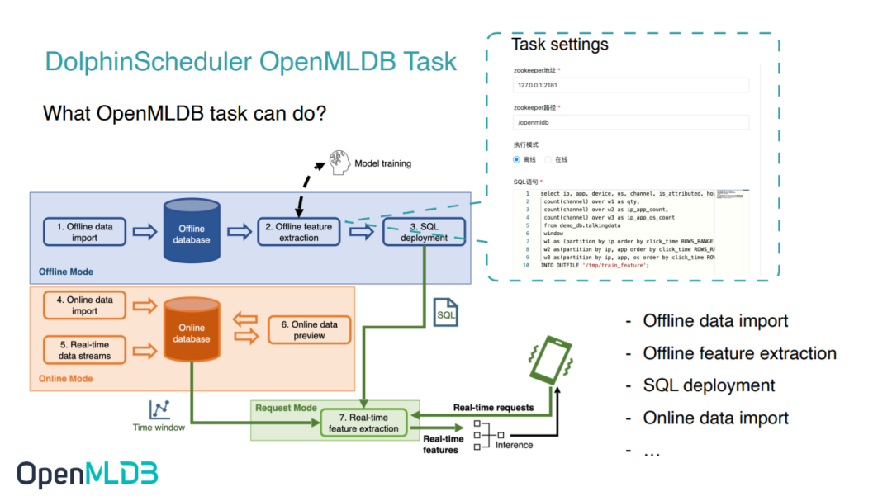
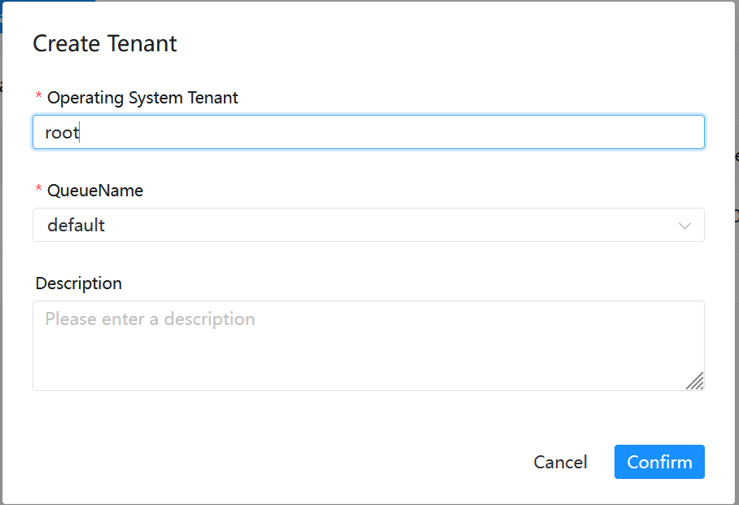
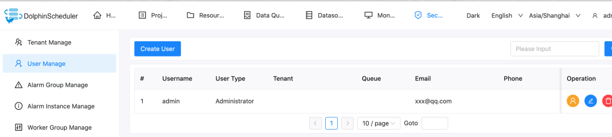
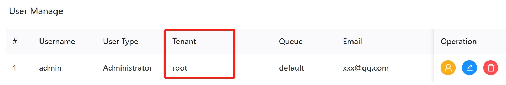
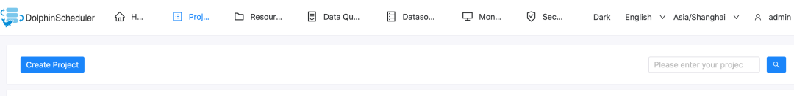
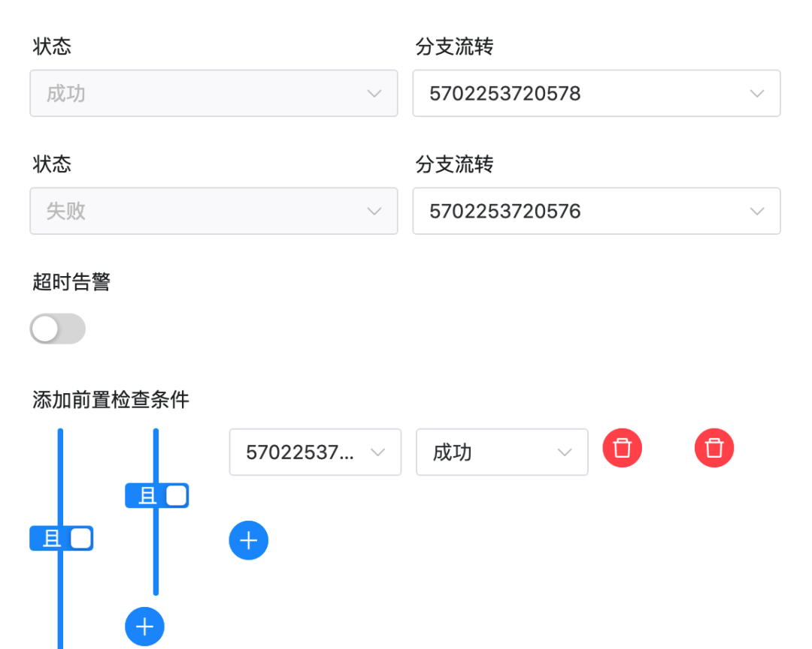
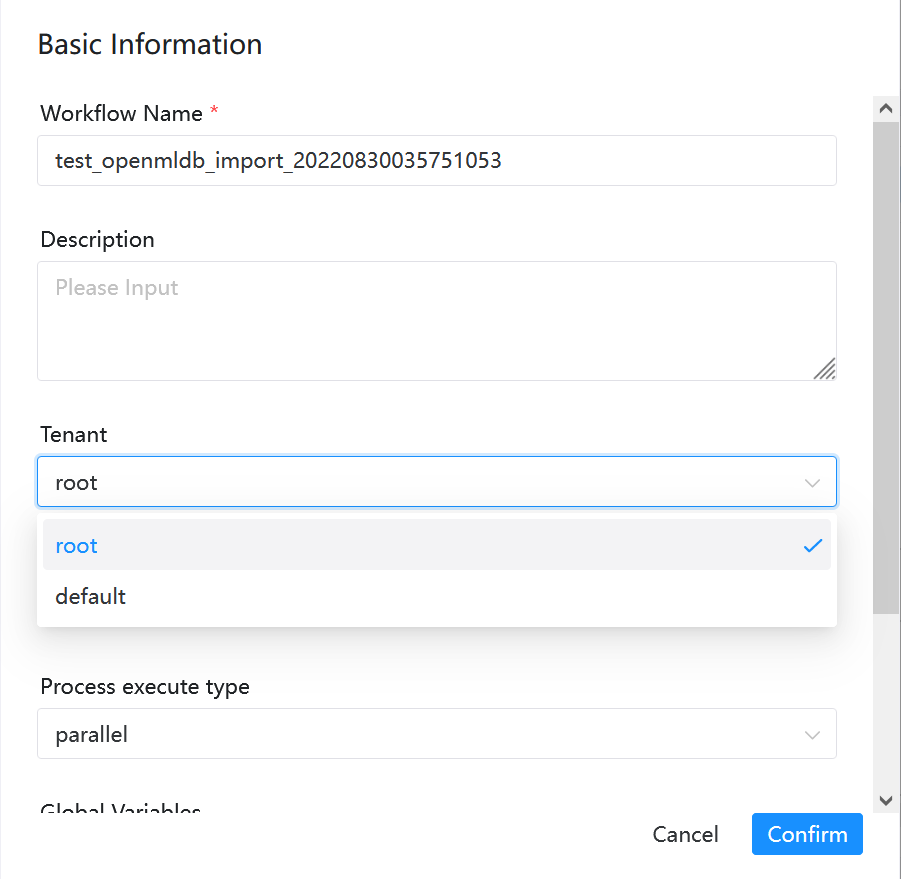
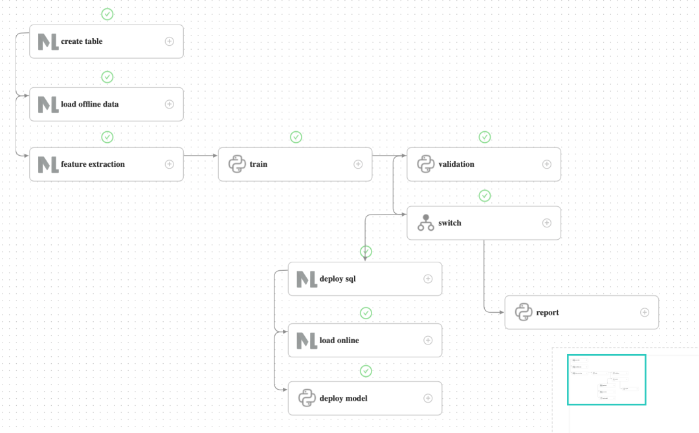

# DolphinScheduler

## 导读
在机器学习从开发到上线的业务闭环中，数据处理、特征开发、模型训练往往要耗费大量的时间和人力。为给 AI 模型构建及应用上线提供便利，简化机器学习建模工程化的流程，我们开发了 DolphinScheduler OpenMLDB Task，将特征平台能力融入 DolphinScheduler 的工作流，链接特征工程与调度环节，打造端到端 MLOps 工作流，帮助开发者专注于业务价值的探索。本文将为大家简要介绍并实际演示 DolphinScheduler OpenMLDB Task 的操作流程。

```{seealso}
详细的OpenMLDB Task信息，请参考[DolphinScheduler OpenMLDB Task 官方文档](https://dolphinscheduler.apache.org/zh-cn/docs/3.1.5/guide/task/openmldb)。
```

## 场景和功能
### DolphinScheduler OpenMLDB Task 为什么诞生


作为提供生产级数据及特征开发全栈解决方案的开源机器学习数据库，OpenMLDB 提升易用性、降低使用门槛的关键点来自上下游的连通。如上图所示，接入数据源可以使得 DataOps 内的数据更加简单轻松地流入 OpenMLDB，而 OpenMLDB 供给的特征也需要顺滑地进入 ModelOps，接受训练。为了减少每个开发者手动完成接入带来的巨大的工作量，提升 OpenMLDB 使用的便捷度，我们也开发了 OpenMLDB 接入 Deployment 和 Monitoring的功能。本次想和大家重点介绍的就是 OpenMLDB 接入 DolphinScheduler 工作流的框架。DolphinScheduler OpenMLDB Task 可以更简单地操作 OpenMLDB，同时 OpenMLDB 任务也被 Workflow 管理，更加自动化。

### DolphinScheduler OpenMLDB Task 可以做什么

OpenMLDB 希望能达成开发即上线的目标，让开发回归本质，而不是在工程化落地中耗费过多心思。通过编写 OpenMLDB Task，我们可以实现 OpenMLDB 的离线导入、特征抽取、SQL 部署上线、在线导入等需求，也可以在DolphinScheduler 中编写一个完整的使用 OpenMLDB 的训练上线流程。



比如我们设想的最简易的用户操作流程，如上图所示，流程中的1-4步正对应离线导入、特征抽取、SQL 部署上线和在线导入，均可以通过 DolphinScheduler OpenMLDB Task 编写。

除了OpenMLDB中的SQL上线，实时预测还需要模型上线。所以接下来，我们将基于 kaggle 比赛中的 TalkingData 广告欺诈检测场景，为大家演示如何使用 DolphinScheduler OpenMLDB Task 编排一个完整的机器学习训练上线的流程。TalkingData 比赛详情见[talkingdata-adtracking-fraud-detection](https://www.kaggle.com/competitions/talkingdata-adtracking-fraud-detection/discussion)。

## 实践演示
### 环境配置

**运行 OpenMLDB 镜像**

测试可以在macOS或Linux上运行，推荐在我们提供的 OpenMLDB 镜像内进行演示测试。我们将在这个容器中启动OpenMLDB和DolphinScheduler，暴露DolphinScheduler的web端口：
```
docker run -it -p 12345:12345 4pdosc/openmldb:0.8.2 bash
```
```{attention}
DolphinScheduler 需要配置租户，是操作系统的用户，并且该用户需要有 sudo 权限。所以推荐在 OpenMLDB 容器内下载并启动 DolphinScheduler。否则，请准备有sudo权限的操作系统用户。
```

由于我们的docker镜像目前没有安装sudo，而DolphinScheduler运行工作流时会使用sudo，所以请在容器中先安装：
```
apt update && apt install sudo
```

DolphinScheduler 运行task使用的sh，而我们的docker默认sh为`dash`，我们将其修改为`bash`：
```
dpkg-reconfigure dash
```
输入`no`。

**源数据准备**

下文使用的工作流会从`/tmp/train_sample.csv`导入数据到OpenMLDB，所以，先将源数据下载到这一地址：
```
curl -SLo /tmp/train_sample.csv https://openmldb.ai/download/dolphinschduler-task/train_sample.csv
```

**运行 OpenMLDB 集群与 Predict Server**

在容器中运行以下命令启动 OpenMLDB cluster：
```
/work/init.sh
```

我们将完成一个导入数据，离线训练，训练成功后模型上线的工作流。模型上线的部分，将发送模型地址给predict server来完成。所以，我们先下载并后台运行predict server：
```
cd /work
curl -SLo predict_server.py https://openmldb.ai/download/dolphinschduler-task/predict_server.py
python3 predict_server.py --no-init > predict.log 2>&1 &
```
```{tip}
如果在“在线预测测试”中返回了错误，请查看日志`/work/predict.log`。
```

**下载并运行 DolphinScheduler**

DolphinScheduler 支持 OpenMLDB Task 的版本为3.1.3及以上，本文使用3.1.5，可以到[官方](https://dolphinscheduler.apache.org/zh-cn/download/3.1.5)下载，或使用镜像网站下载。

启动 DolphinScheduler standalone，步骤如下，更多请参考[官方文档](https://dolphinscheduler.apache.org/zh-cn/docs/3.1.5/guide/installation/standalone)。

```
# 官方
curl -SLO https://dlcdn.apache.org/dolphinscheduler/3.1.5/apache-dolphinscheduler-3.1.5-bin.tar.gz
# 镜像 curl -SLO http://openmldb.ai/download/dolphinschduler-task/apache-dolphinscheduler-dev-3.1.5-bin.tar.gz
tar -xvzf apache-dolphinscheduler-*-bin.tar.gz
cd apache-dolphinscheduler-*-bin
sed -i s#/opt/soft/python#/usr/bin/python3#g bin/env/dolphinscheduler_env.sh
./bin/dolphinscheduler-daemon.sh start standalone-server
```

```{hint}
DolphinScheduler的官方release版本中，<3.1.3的旧版本里OpenMLDB Task存在问题，无法直接使用，如果使用旧版本，可联系我们提供对应版本的OpenMLDB Task修复版。3.1.3及以后的版本已经修复了这个问题，可以使用官方release版本。

在其他版本的DolphinScheduler中，`bin/env/dolphinscheduler_env.sh`可能变化，如果`bin/env/dolphinscheduler_env.sh`中不存在`PYTHON_HOME`，需要追加配置，可使用命令`echo "export PYTHON_HOME=/usr/bin/python3" >> bin/env/dolphinscheduler_env.sh`修改。
```

浏览器访问地址 http://localhost:12345/dolphinscheduler/ui 即可登录系统UI（默认配置即可跨主机访问，但需确保IP连接畅通）。默认的用户名和密码是 admin/dolphinscheduler123。

```{note}
DolphinScheduler 的 worker server 需要 OpenMLDB Python SDK, DolphinScheduler standalone 的 worker 即本机，所以只需在本机安装OpenMLDB Python SDK。我们的OpenMLDB镜像中已经安装了。如果你在别的环境中，请安装openmldb sdk：`pip3 install openmldb`。
```

**下载工作流配置**

工作流可以手动创建，为了简化演示，我们直接提供了 json 工作流文件，[点击下载](http://openmldb.ai/download/dolphinschduler-task/workflow_openmldb_demo.json)。稍后可以直接上传到 DolphinScheduler 环境中，并做简单的修改（见下文的演示），即可完成全工作流。

请注意，不是下载到容器中，而是下载到你使用的浏览器主机。之后将在web页面中完成上传。

### Demo 演示

#### 步骤1：初始配置

在 DolphinScheduler Web中创建租户，进入租户管理界面，填写**有 sudo 权限的操作系统用户**，queue 可以使用 default。docker容器内可直接使用root用户。



再绑定租户到用户，简单起见，我们直接绑定到 admin 用户。进入用户管理页面，点击编辑admin用户。



绑定后，用户状态类似下图。


#### 步骤2：创建工作流
DolphinScheduler 中，需要先创建项目，再在项目中创建工作流。

所以，首先创建一个test项目，如下图所示，点击创建项目并进入项目。




进入项目后，导入下载好的工作流文件。如下图所示，在工作流定义界面点击导入工作流。


导入后，工作流列表中将出现该工作流，类似下图。


点击该工作流名字，可查看工作流的详细内容，如下图所示。


**注意**，此处需要一点修改，因为导入工作流后task 的 ID 会有变化。特别的，switch task 中的上游和下游 id 都不会存在，需要手动改一下。



如上图所示，switch task中的设置中有不存在的id。请将成功和失败的“分支流转”和“前置检查条件”修改为当前工作流的task。
正确结果如下图所示：


修改完成后，直接保存该工作流。导入的工作流中 tenant 默认会是 default，也是**可以运行**的。如果你想指定自己的租户，请在保存工作流时选择租户，如下图所示。



#### 步骤3：上线运行工作流

工作流保存后，需要先上线再运行。上线后，运行按钮才会点亮。如下图所示。


点击运行后，等待工作流完成。可在工作流实例(Workflow Instance)界面，查看工作流运行详情，如下图所示。


为演示成功上线的流程，validation 并未进行实际验证，直接返回验证成功并流入deploy分支。运行 deploy 的分支，deploy  sql 及之后的 task 都成功后，predict server 接收到最新的模型。

```{note}
如果工作流实例(Workflow Instance)出现`Failed`标识，请点击该实例名，跳转到详细页面，查看是哪一个Task执行出错。双击该Task，并点击右上角“查看日志”，可以查看到详细的错误信息。

`load offline data`，`feture extraction`与`load online`可能出现DolphinScheduler 中显示task运行成功，但实际在OpenMLDB中任务执行失败。进而可能导致`train`任务报错，没有源特征数据可以concatenate的错误（Traceback `pd.concat`）。

出现这类问题时，请在OpenMLDB中查询下各个任务的真正状态，可直接运行
`echo "show jobs;" | /work/openmldb/bin/openmldb --zk_cluster=127.0.0.1:2181 --zk_root_path=/openmldb --role=sql_client`。如果某个任务状态是`FAILED`，请查询该任务的日志，方法见[任务日志](../../quickstart/beginner_must_read.md#离线)。
```

#### 步骤4：在线预测测试
predict server同时提供了在线预测服务，通过`curl /predict`请求。我们简单地构造一个实时请求，发送至predict server。
```
curl -X POST 127.0.0.1:8881/predict -d '{"ip": 114904,
       "app": 11,
       "device": 1,
       "os": 15,
       "channel": 319,
       "click_time": 1509960088000,
       "is_attributed": 0}'
```
返回结果如下：


#### 补充

如果重复运行工作流，`deploy sql` task 可能因deployment`demo`已存在而失败，请在再次运行工作流前，在docker容器中删除该deployment：
```
/work/openmldb/bin/openmldb --zk_cluster=127.0.0.1:2181 --zk_root_path=/openmldb --role=sql_client --database=demo_db --interactive=false --cmd="drop deployment demo;"
```

可通过以下命令确认deployment是否已经删除：
```
/work/openmldb/bin/openmldb --zk_cluster=127.0.0.1:2181 --zk_root_path=/openmldb --role=sql_client --database=demo_db --interactive=false --cmd="show deployment demo;"
```

重启DolphinScheduler server（注意这样重启会清空元数据，需要重新配置环境与创建工作流）：
```
./bin/dolphinscheduler-daemon.sh stop standalone-server
./bin/dolphinscheduler-daemon.sh start standalone-server
```

如果想要保留元数据，请参考[伪集群部署](https://dolphinscheduler.apache.org/zh-cn/docs/3.1.5/guide/installation/pseudo-cluster)配置数据库。
