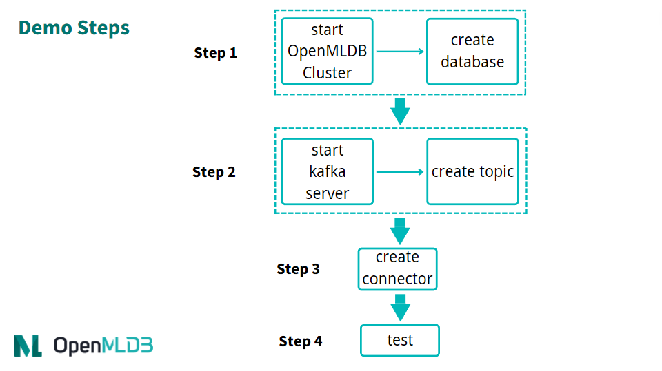

# Kafka

## 简介
Apache Kafka是一个事件流平台。它可以作为OpenMLDB的在线数据源，将实时的数据流导入到OpenMLDB在线。了解更多Kafka，请参考官网[https://kafka.apache.org/](https://kafka.apache.org/)。我们开发了连接OpenMLDB的Kafka Connector，可以无障碍地将Kafka和OpenMLDB连接起来。在这篇文档中，你将学习到这个connector的概念与使用方法。

注意，为了使演示更简单，本文中将使用Kafka Connect standalone模式来启动connector。该connector是完全可以用distributed模式来启动。

```{seealso}
OpenMLDB Kafka Connector实现见[extensions/kafka-connect-jdbc](https://github.com/4paradigm/OpenMLDB/tree/main/extensions/kafka-connect-jdbc)。关于特性、配置和开发等说明，见[开发指南](https://github.com/4paradigm/OpenMLDB/blob/main/extensions/kafka-connect-jdbc/DEVELOP.md)。
```

## 功能增强

- Auto Schema

OpenMLDB Kafka Connector 支持在无schema registry的情况下，自动使用OpenMLDB的表schema来解析message，因此，message可以是简单的json格式的数据map。详细配置和格式见[Auto Schema](https://github.com/4paradigm/OpenMLDB/blob/main/extensions/kafka-connect-jdbc/DEVELOP.md#auto-schema)。

Auto Schema开启后，0.8.5以前的版本要求message包含schema中的所有列，timestamp和date列仅支持整型。0.8.5及之后的版本支持message仅导入部分列，其他列将填入default值，timestamp和date列也可支持字符串年月日时分秒格式。

- Topic Table Mapping

OpenMLDB Kafka Connector 支持topic到table的mapping，比`table.name.format`配置更灵活，配置方式见[Topic Table Mapping](https://github.com/4paradigm/OpenMLDB/blob/main/extensions/kafka-connect-jdbc/DEVELOP.md#topic-table-mapping)。

此功能可独立使用，如果此项为空，则使用`table.name.format`规则。`table.name.format`的规则是，将`${topic}`替换为topic名字，默认配置为`${topic}`，即表和topic同名。更复杂的例子是，format配置为`kafka_${topic}`，topic名为t1的话，表名将为`kafka_t1`。因此，format配置只适用于表名固定或包含topic名的情况。

## 性能

Kafka利用OpenMLDB Kafka Connector导入数据到OpenMLDB集群，其性能将受Kafka发送端和OpenMLDB接收端共同影响。我们提供单机和集群两种情况下的性能测试报告，见[Kafka Perf Test](https://github.com/vagetablechicken/openmldb-compose?tab=readme-ov-file#performance-test)。

假设topic的数据量足够多，Kafka导入效率基本由Kafka topic的分区数和Connector的task数决定，如果这两者不够大，写入到OpenMLDB的并发度就不够高。task数量较大时，单个Kafka Connect服务也会收到单机物理资源限制，此时需要部署分布式的Kafka Connect，将tasks均匀分散到多台机器上，提高并发度。

观察报告的pqs和latency，单机情况下，机器CPU core 40较充足，Kafka Connector可以配置较多的task，OpenMLDB端的写入QPS单台50k，总计100k。但OpenMLDB内部的写入延迟并未明显提高，只是单机性能有限，使得写入表现如此。集群性能测试也证明了这一点，我们将OpenMLDB集群化后，单机部署Kafka Connect，Kafka topic分区和tasks数改变，QPS不会有明显提高，而分布式部署Kafka Connect后，QPS明显提高。两个Kafka Connect均分78个sink task写入，TabletServer QPS可以达到单台90k，总计180k；三个Kafka Connect均分120个sink task写入，TabletServer QPS可以达到单台100k，总计200k。

## 概览

```{note}
如果你已经熟悉Kafka和OpenMLDB，不想按以下步骤操作，可以参考[OpenMLDB Compose With Kafka](https://github.com/vagetablechicken/openmldb-compose?tab=readme-ov-file#kafka)，使用docker-compose快速启动OpenMLDB和Kafka，此项目还包含写入kafka的测试脚本。单独使用Kafka，可以使用镜像`docker pull ghcr.io/vagetablechicken/kafka-connect:latest`，此镜像已包含OpenMLDB Connector，运行参考[compose.yml](https://github.com/vagetablechicken/openmldb-compose/blob/519387e7ad9a8f0467b51886d5b3f07964150753/compose.yml#L288)。
```

### 下载与准备

- 你需要下载kafka，请点击[kafka官网下载](https://kafka.apache.org/downloads)下载kafka_2.13-3.1.0.tgz。
- 你需要下载connector包以及依赖，请点击[kafka-connect-jdbc-10.5.0-SNAPSHOT-0.8.5.tgz](https://openmldb.ai/download/kafka-connector/kafka-connect-jdbc-10.5.0-SNAPSHOT-0.8.5.tgz)。
- 你需要下载本文中所需要的配置与脚本等文件，请点击[kafka_demo_files.tgz](https://openmldb.ai/download/kafka-connector/kafka_demo_files.tgz)下载。

本文将使用docker方式启动OpenMLDB，所以无需单独下载OpenMLDB。并且，kafka与connector的启动，都可以在同一个容器中进行。

我们推荐你将下载的三个文件包都绑定到文件目录`kafka`。当然，也可以在启动容器后，再进行文件包的下载。我们假设文件包都在`/work/kafka`目录中。
```
docker run -it -v `pwd`:/work/kafka 4pdosc/openmldb:0.9.2 bash
```

### 注意事项

Timestamp列精度为ms，value配置为JsonConvertor，仅支持整型。根据消息的不同，可选配其他Convertor。

Connector可用于较早版本的Kafka Server，例如1.1.1，但注意旧版本的Kafka Broker可能并未默认开启“自动创建topic”，需要开启[此选项](https://kafka.apache.org/documentation/#brokerconfigs_auto.create.topics.enable)。

### 流程

使用connector的简要流程，如下图所示。我们接下来将详细介绍每一步。

整体上，使用流程可以概括为四步：
1. 启动 OpenMLDB 并创建数据库
2. 启动 Kafka 并创建topic
3. 启动 OpenMLDB Kafka Connector
4. 进行测试或者正常使用



## 步骤 1：启动 OpenMLDB 并创建数据库
### 启动 OpenMLDB 集群

在OpenMLDB容器中，启动集群:
```
/work/init.sh
```

```{caution}
目前只有OpenMLDB集群版可以作为sink的接收端，数据只会sink到集群的在线存储中。
```

### 创建数据库
我们可以通过pipe快速创建数据库，而不用登录到客户端CLI： 
```
echo "create database kafka_test;" | /work/openmldb/bin/openmldb --zk_cluster=127.0.0.1:2181 --zk_root_path=/openmldb --role=sql_client
```

## 步骤 2：启动 Kafka 并创建topic
### 启动 Kafka

解压Kafka，然后使用start脚本启动Kafka。
```
cd kafka
tar -xzf kafka_2.13-3.1.0.tgz
cd kafka_2.13-3.1.0
./bin/kafka-server-start.sh -daemon config/server.properties
```

```{note}
OpenMLDB服务已经使用了端口2181启动zookeeper，Kafka不用再次启动zookeeper。所以，此处只需要启动server。
```

你可以检查一下Kafka是否正常运行，可以使用`ps`。如果启动失败，请检查日志`logs/server.log`。
```
ps axu|grep kafka
```

### 创建topic

我们创建一个名为`topic1`的topic。注意，topic名字中尽量不要出现特殊字符。
```
./bin/kafka-topics.sh --create --topic topic1 --bootstrap-server localhost:9092
```
可以`describe`一下topic，确认是否正常。
```
./bin/kafka-topics.sh --describe --topic topic1 --bootstrap-server localhost:9092
```


## 步骤 3：启动 Connector

首先，解压`/work/kafka`中的connector和kafka_demo_files包。
```
cd /work/kafka
tar zxf kafka-connect-jdbc-10.5.0-SNAPSHOT-0.8.5.tgz
tar zxf kafka_demo_files.tgz
```
启动connector，需要kafka_demo_files中的两个配置文件，并将connector插件放入正确位置。

第一个配置文件是 connect worker 的配置`connect-standalone.properties`，重点配置是“插件目录”，请确认此配置项如下所示：
```
plugin.path=/usr/local/share/java
```

Connector 以及运行它所需要的所有依赖包，都需要放入这个目录。命令如下：
```
mkdir -p /usr/local/share/java
cp -r /work/kafka/kafka-connect-jdbc /usr/local/share/java/
```

第二个配置文件是连接 OpenMLDB 的 Sink Connector 配置 `openmldb-sink.properties`，如下所示：
```
name=test-sink
connector.class=io.confluent.connect.jdbc.JdbcSinkConnector
tasks.max=1
topics=topic1 
connection.url=jdbc:openmldb:///kafka_test?zk=127.0.0.1:2181&zkPath=/openmldb
auto.create=true
value.converter=org.apache.kafka.connect.json.JsonConverter
value.converter.schemas.enable=true
```
连接配置中，需要填写正确的OpenMLDB url地址。该connector接收topic1的消息，并且会自动创建表(auto.create)。我们在 connector 配置`openmldb-sink.properties`中设置value的converter，当然你也可以在 connect worker的`connect-standalone.properties`中设置默认的converter，connector中无需额外配置。

```{tip}
配置项详情见Kafka文档[Configuring Connectors](https://kafka.apache.org/documentation/#connect_configuring)。

其中，`connection.url`需要配置为正确的OpenMLDB集群地址与database名，要求database必须存在。
`value.converter`等属性也可以在 connector 处配置，将覆盖 connect worker 的默认配置。connector启动后也可以通过HTTP API动态修改属性。
```

下面，使用 Kafka Connector standalone 模式启动 connect worker。
```
cd /work/kafka/kafka_2.13-3.1.0
./bin/connect-standalone.sh -daemon ../kafka_demo_files/connect-standalone.properties ../kafka_demo_files/openmldb-sink.properties
```

确认 connect worker 是否启动，以及 sink task 是否正确连接到 OpenMLDB 集群，可以查看 `logs/connect.log`，正常情况下日志应有 `Executing sink task`。

## 步骤 4：测试
### 发送消息

我们使用Kafka提供的console producer作为测试用的消息发送工具。

由于还没有创建表，我们的消息中应该带有schema，才能帮助Kafka对消息进行解析并写入OpenMLDB。
```
{"schema":{"type":"struct","fields":[{"type":"int16","optional":true,"field":"c1_int16"},{"type":"int32","optional":true,"field":"c2_int32"},{"type":"int64","optional":true,"field":"c3_int64"},{"type":"float","optional":true,"field":"c4_float"},{"type":"double","optional":true,"field":"c5_double"},{"type":"boolean","optional":true,"field":"c6_boolean"},{"type":"string","optional":true,"field":"c7_string"},{"type":"int64","name":"org.apache.kafka.connect.data.Date","optional":true,"field":"c8_date"},{"type":"int64","name":"org.apache.kafka.connect.data.Timestamp","optional":true,"field":"c9_timestamp"}],"optional":false,"name":"foobar"},"payload":{"c1_int16":1,"c2_int32":2,"c3_int64":3,"c4_float":4.4,"c5_double":5.555,"c6_boolean":true,"c7_string":"c77777","c8_date":19109,"c9_timestamp":1651051906000}}
```

更方便的，我们将上述消息保存在文件`kafka_demo_files/message`中，可以直接使用它。用console producer发送该消息给 Kafka。
```
./bin/kafka-console-producer.sh --topic topic1 --bootstrap-server localhost:9092 < ../kafka_demo_files/message
```

```{tip}
如果希望消息中不带schema，但没有Schema Registry等额外组件，可以先在OpenMLDB中创建表，并在connector中配置`auto.schema=true`，详细的配置方法见[kafka connect jdbc文档](https://github.com/4paradigm/OpenMLDB/blob/main/extensions/kafka-connect-jdbc/DEVELOP.md)。目前只支持与JsonConverter搭配使用。
```

### 检查

我们可以在 OpenMLDB 中查询是否插入成功。查询脚本 `kafka_demo_files/select.sql`，内容如下:
```
set @@execute_mode='online';
use kafka_test;
select * from topic1;
```

可以直接运行查询脚本进行查询：
```
/work/openmldb/bin/openmldb --zk_cluster=127.0.0.1:2181 --zk_root_path=/openmldb --role=sql_client < ../kafka_demo_files/select.sql
```


## 调试

### 日志

Kafka server的日志在 `log/server.log`。如果Kafka本身无法工作，请检查此日志。

Connector的日志在 `log/connect.log`。如果producer运行出错或无法在OpenMLDB中查询到数据，请检查此日志。

### 重新初始化

如果在测试中遇到问题，你可以重新初始化环境，更方便重试。

停止Kafka需要kill Kafka的两个daemon进程:
```
ps axu|grep kafka | grep -v grep | awk '{print $2}' | xargs kill -9
```

Kafka的数据也可以删除，参考[TERMINATE THE KAFKA ENVIRONMENT](https://kafka.apache.org/quickstart#quickstart_kafkaterminate):
```
rm -rf /tmp/kafka-logs /tmp/kraft-combined-logs
```

请不要在此处删除 `/tmp/zookeeper`，也不要kill zookeeper进程，因为OpenMLDB也使用了这个zookeeper集群。我们在重新初始化OpenMLDB时，会kill zookeeper并将这个目录删除：
```
/work/init.sh
```
`init.sh`会启动新的OpenMLDB集群，你可以在OpenMLDB创建database，再重新启动Kafka。

## 使用 Kubernetes 部署

OpenMLDB Kafka Connect 服务可以本地部署，也可以使用 Kubernetes 来部署，下面介绍部署需要的配置文件以及部署步骤。

在本地准备上面demo下载的配置文件，建议修改其中的配置项“plugin.path=/tmp”，并且修改OpenMLDB连接的ZK地址。

* connect-standalone.properties
* openmldb-sink.properties

本地准备好配置文件后，使用命令来创建 ConfigMap 。

```
kubectl create configmap openmldb-kafka-connect-configmap --from-file=connect-standalone.properties=connect-standalone.properties --from-file=openmldb-sink.properties=openmldb-sink.properties
```

使用 OpenMLDB 提供的 Dockerfile 来创建镜像，并且把镜像推送到镜像仓库。

```
docker build -t registry.cn-shenzhen.aliyuncs.com/tobe43/openmldb-kafka-connect -f Dockerfile .
```

使用 OpenMLDB 提供的 Yaml 文件来创建 Deployment，可按需修改启动的配置仓库。注意，目前只支持单节点的 Connect 服务，因此 Deployment 的 replicas 配置必须为1。

```
kubectl create -f ./openmldb-kafka-connect-deployment.yaml
```

部署 Deployment 后，可以查看对应 Pod 的运行状态和日志，然后通过发送消息给 Kafka 检查服务功能是否正常。

如果希望访问 Connect 服务的 RESTful 接口，可以参考 OpenMLDB 提供的 Yaml 文件来创建 Service ，默认使用 NodePort 并且在宿主机的 8083 端口可访问对应服务。

```
kubectl create -f ./openmldb-kafka-connect-service.yaml
```