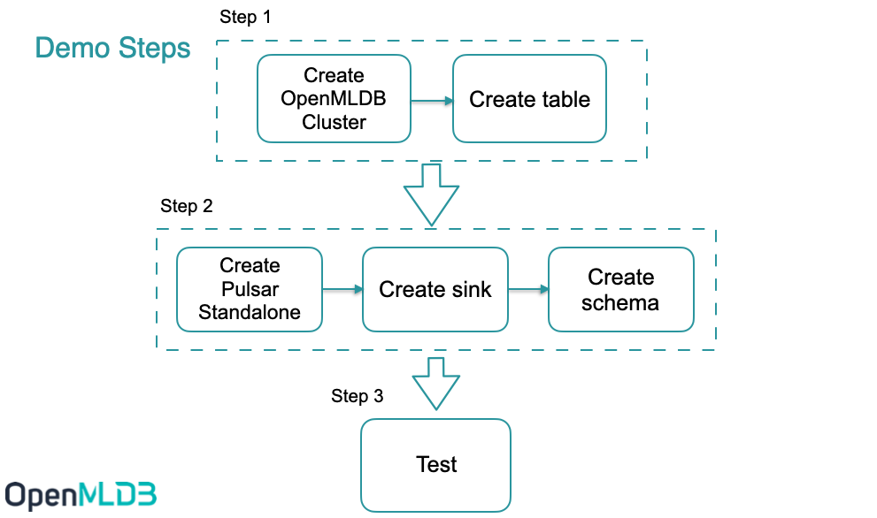
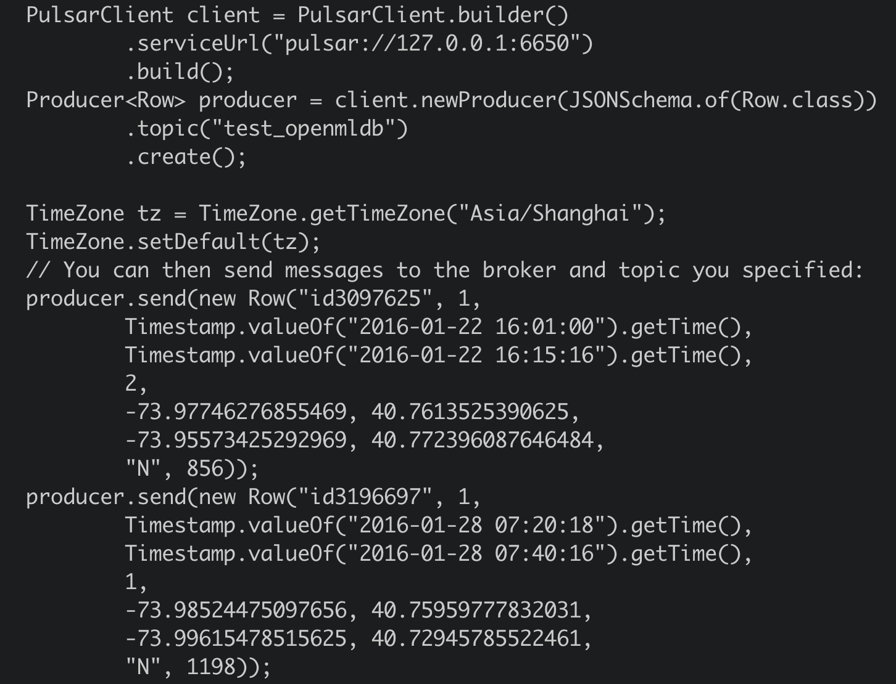

# Pulsar

## 简介
Apache Pulsar是一个云原生的，分布式消息流平台。它可以作为OpenMLDB的在线数据源，将实时的数据流导入到OpenMLDB在线。了解更多Pulsar，请参考官网[https://pulsar.apache.org/](https://pulsar.apache.org/)。我们开发了在Pulsar中使用的OpenMLDB JDBC Connector，可以无障碍地使Pulsar连接到OpenMLDB。在这篇文档中，你将学习到这个connector的概念与使用方法。

注意，为了使演示更简单，本文中将使用Pulsar Standalone，OpenMLDB集群和一个简单JSON消息生产者程序，来演示OpenMLDB JDBC Connector是如何工作的。该connector是完全可以在Pulsar Cluster中正常使用的。

```{seealso}
关于 Pulsar 的 OpenMLDB Connector 的详细信息，也可以参考 Pulsar [官网相关介绍](https://pulsar.apache.org/docs/en/next/io-connectors/#jdbc-openmldb)。
```

## 概览

### 下载

- 你需要下载本文中所需要的所有文件，请点击[files](https://openmldb.ai/download/pulsar-connector/files.tar.gz)下载。文件包括connector包，schema文件，配置文件等等。
- 如果你只想要下载connector包用于自己的项目，请点击[connector snapshot](https://github.com/4paradigm/OpenMLDB/releases/download/v0.4.4/pulsar-io-jdbc-openmldb-2.11.0-SNAPSHOT.nar)。

### 流程

使用connector的简要流程，如下图所示。我们接下来将详细介绍每一步。我们也录制了所有步骤，详情见[terminalizer分享](https://terminalizer.com/view/be2309235671), 你也可以在此下载录制的脚本[demo.yml](https://github.com/vagetablechicken/pulsar-openmldb-connector-demo/blob/main/demo.yml)。

整体上，使用流程可以概括为三步：
1. 在 OpenMLDB 创建相关的数据库和表
2. 在 Pulsar 创建 sink，来把 Pulsar 数据流和 OpenMLDB 连接起来，同时需要在 Pulsar 配置相应的 schema，使得数据流可以正确的被 OpenMLDB 接收并且存入到线上数据库。
3. 进行测试或者正常使用



## 步骤 1：在 OpenMLDB 创建数据库和数据表
### 启动 OpenMLDB 集群
使用Docker可以快速启动OpenMLDB，除此之外，我们还需要创建测试用的表。创建 OpenMLDB 详请可以参考[集群版 OpenMLDB 快速上手](/zh/quickstart/openmldb_quickstart#3-集群版openmldb-快速上手)。
```{caution}
目前只有OpenMLDB集群版可以作为sink的接收端，数据只会sink到集群的在线存储中。
```
我们更推荐你使用‘host network’模式运行docker，以及绑定文件目录‘files’，sql脚本在该目录中。
```
docker run -dit --network host -v `pwd`/files:/work/pulsar_files --name openmldb 4pdosc/openmldb:0.8.3 bash
docker exec -it openmldb bash
```

在OpenMLDB容器中，启动集群:
```
./init.sh
```

```{caution}
在macOS平台上，即使使用host网络，也不支持从容器外部去连接容器内的 OpenMLDB 服务器。但从容器内，去连接别的容器内的OpenMLDB服务，是可行的。
```
### 创建表
我们使用一个脚本快速创建表，脚本内容如下： 
```
create database pulsar_test;
use pulsar_test;
create table connector_test(id string, vendor_id int, pickup_datetime bigint, dropoff_datetime bigint, passenger_count int, pickup_longitude double, pickup_latitude double, dropoff_longitude double, dropoff_latitude double, store_and_fwd_flag string, trip_duration int);
desc connector_test;
```
执行脚本:
```
/work/openmldb/bin/openmldb --zk_cluster=127.0.0.1:2181 --zk_root_path=/openmldb --role=sql_client < /work/pulsar_files/create.sql
```


```{note}
目前，Pulsar中JSONSchema和JDBC base connector都不支持'java.sql.Timestamp'。所以我们使用'long'作为timestamp列的数据类型（在OpenMLDB可以使用long作为时间戳）。
```

## 步骤 2：在 Pulsar 创建 sink 和 schema
### 启动 Pulsar Standalone
使用docker，可以更简单快速的启动Pulsar。我们推荐你使用'host network'来运行docker，这样可以避免诸多容器相关的网络连接问题。而且，我们需要使用pulsar-admin来进行sink创建，这个程序在Pulsar镜像内。所以，我们使用bash运行容器，在容器内部逐一执行命令。此处，也需要绑定'files'文件目录。

```
docker run -dit --network host -v `pwd`/files:/pulsar/files --name pulsar apachepulsar/pulsar:2.9.1 bash
docker exec -it pulsar bash
```
在Pulsar容器中，启动standalone服务端。
```
bin/pulsar-daemon start standalone --zookeeper-port 5181
```
```{note}
OpenMLDB服务已经使用了端口2181，所以此处我们为Pulsar重新设置一个zk端口。我们将使用端口2181来连接OpenMLDB，但Pulsar standalone内的zk端口不会对外造成影响。
```
你可以使用`ps`检查Pulsar是否正常运行，如果启动失败，检查日志`logs/pulsar-standalone-....log`。
```
ps axu|grep pulsar
```

当你启动一个本地standalone集群，会自动创建'pulic/default' namesapce。这个namespace用于开发，参考[pulsar文档](https://pulsar.apache.org/docs/en/2.9.0/standalone/#start-pulsar-standalone).

**我们将在此namespace中创建sink**

```{seealso}
如果你想要在本地直接启动Pulsar，参考[Set up a standalone Pulsar locally](https://pulsar.apache.org/docs/en/standalone/).
```
#### Q&A
Q: 碰到以下问题是什么原因
```
2022-04-07T03:15:59,289+0000 [main] INFO  org.apache.zookeeper.server.NIOServerCnxnFactory - binding to port 0.0.0.0/0.0.0.0:5181
2022-04-07T03:15:59,289+0000 [main] ERROR org.apache.pulsar.zookeeper.LocalBookkeeperEnsemble - Exception while instantiating ZooKeeper
java.net.BindException: Address already in use
```
A: Pulsar需要一个未被使用的端口来启动zk，端口5181页已经被使用，需要再更改一下'--zookeeper-port'的端口号。

Q: 8080端口已被使用？

A: 8080是'webServicePort'默认配置端口，在`conf/standalone.conf`中，可以更换这个端口。但注意，pulsar-admin会使用`conf/client.conf`中的'webServiceUrl'进行连接，也需要同步更改。

Q: 6650端口已被使用？

A: 需要同步更改`conf/standalone.conf`中的'brokerServicePort'和`conf/client.conf`中的'brokerServiceUrl'配置项。

### Connector安装(Optional)
前面的步骤中我们绑定了'files'目录，里面已经提供了connector的nar包。我们可以使用“非内建connector”模式来设置connector(即在sink配置中指定'archive'配置项，将在下一个步骤中描述)。

但如果你希望将OpenMLDB connector作为内建的connector，你需要创建'connectors'目录，并拷贝nar文件到'connectors'目录。
```
mkdir connectors
cp files/pulsar-io-jdbc-openmldb-2.11.0-SNAPSHOT.nar  connectors/
```
如果在Pulsar运行时，你想改变或增加connector，你可以通知Pulsar更新信息：
```
bin/pulsar-admin sinks reload
```

当OpenMLDB connector成为内建connector时，它的sink类型名为'jdbc-openmldb'，你可以直接使用这个类型名来指定使用OpenMLDB connector。

### 创建sink
我们使用'public/default'这个namespace来创建sink, 我们需要一个sink的配置文件, 它在`files/pulsar-openmldb-jdbc-sink.yaml`，内容如下：
```
 tenant: "public"
 namespace: "default"
 name: "openmldb-test-sink"
 archive: "files/pulsar-io-jdbc-openmldb-2.11.0-SNAPSHOT.nar"
 inputs: ["test_openmldb"]
 configs:
     jdbcUrl: "jdbc:openmldb:///pulsar_test?zk=localhost:2181&zkPath=/openmldb"
     tableName: "connector_test"
```
```{note}
'name'：sink名。

'archive'：我们使用'archive'来指定sink connector, 所以这里我们是将OpenMLDB connector当作非内建connector使用。

'input'：可以是多个topic的名字，本文只使用一个。

'config'：用于连接OpenMLDB集群的jdbc配置。
```

接下来，创建这个sink并检查。注意，我们设置的输入topic是'test_openmldb'，后续步骤需要使用到。
```
./bin/pulsar-admin sinks create --sink-config-file files/pulsar-openmldb-jdbc-sink.yaml
./bin/pulsar-admin sinks status --name openmldb-test-sink
```


### 创建 Schema
上传schema到topic 'test_openmldb'，schema类型是JSON格式。后续步骤中，我们将生产一样schema的JSON消息。schema文件是`files/openmldb-table-schema`，内容如下：
```
{
    "type": "JSON",
    "schema":"{\"type\":\"record\",\"name\":\"OpenMLDBSchema\",\"namespace\":\"com.foo\",\"fields\":[{\"name\":\"id\",\"type\":[\"null\",\"string\"],\"default\":null},{\"name\":\"vendor_id\",\"type\":\"int\"},{\"name\":\"pickup_datetime\",\"type\":\"long\"},{\"name\":\"dropoff_datetime\",\"type\":\"long\"},{\"name\":\"passenger_count\",\"type\":\"int\"},{\"name\":\"pickup_longitude\",\"type\":\"double\"},{\"name\":\"pickup_latitude\",\"type\":\"double\"},{\"name\":\"dropoff_longitude\",\"type\":\"double\"},{\"name\":\"dropoff_latitude\",\"type\":\"double\"},{\"name\":\"store_and_fwd_flag\",\"type\":[\"null\",\"string\"],\"default\":null},{\"name\":\"trip_duration\",\"type\":\"int\"}]}",
    "properties": {}
}
```

上传并检查schema的命令，如下所示:
```
./bin/pulsar-admin schemas upload test_openmldb -f ./files/openmldb-table-schema
./bin/pulsar-admin schemas get test_openmldb
```


## 步骤 3：测试
### 发送消息
我们使用两条OpenMLDB镜像中`data/taxi_tour_table_train_simple.csv`的样本数据，作为测试用的消息。数据如下图所示：


#### Java Producer
Producer JAVA代码，详情见[demo producer](https://github.com/vagetablechicken/pulsar-client-java)。核心代码如下：


可以看到，producer将发送两条消息到topic 'test_openmldb'。这之后，Pulsar将读到消息，并将其写入OpenMLDB集群的在线存储中。

程序包在'files'中，你可以直接运行它：
```
java -cp files/pulsar-client-java-1.0-SNAPSHOT-jar-with-dependencies.jar org.example.Client
```

#### Python Producer
Producer也可以使用Python实现，详情见`files/pulsar_client.py`。运行前需要安装pulsar python client：
```
pip3 install pulsar-client==2.9.1
```
运行：
```
python3 files/pulsar_client.py
```

```{note}
已知问题：消息中如果Long类型的value较小，在pulsar function sink的jdbc bindValue阶段，会从JsonRecord中读出java Integer Type的值，从而[setColumnValue](https://github.com/apache/pulsar/blob/82237d3684fe506bcb6426b3b23f413422e6e4fb/pulsar-io/jdbc/core/src/main/java/org/apache/pulsar/io/jdbc/BaseJdbcAutoSchemaSink.java#L170)时对Long类型的列做`statement.setInt`而不是`setLong`。因此，产生`data type not match`的SQLException。
如果想要查看具体哪一列的data type有问题，请打开function的debug level日志，方法见[调试](#调试)。
```

### 检查
#### 在Pulsar中检查
我们可以检查Pulsar中的sink状态：
```
./bin/pulsar-admin sinks status --name openmldb-test-sink 
```

```{note}
"numReadFromPulsar": pulsar发送了2条message到sink实例中。

"numWrittenToSink": sink实例向OpenMLDB写入2条message。
```

#### 在OpenMLDB中检查
我们可以在OpenMLDB在线存储中查询到这些消息数据。查询脚本select.sql内容如下：
```
set @@execute_mode='online';
use pulsar_test;
select *, string(timestamp(pickup_datetime)), string(timestamp(dropoff_datetime)) from connector_test;
```
在OpenMLDB容器中执行脚本:
```
/work/openmldb/bin/openmldb --zk_cluster=127.0.0.1:2181 --zk_root_path=/openmldb --role=sql_client < /work/pulsar_files/select.sql
```


### 调试

如果OpenMLDB没有数据，而sinks status合理，那么sink写入应该出了问题。请查看sink日志，日志地址为`logs/functions/public/default/openmldb-test-sink/openmldb-test-sink-0.log`。如果你使用别的sink name，请定位到正确的sink日志。

Pulsar会重复尝试写入此前没有写入成功的消息，所以，如果你曾发送了错误的消息，即使新消息成功写入，日志中仍然会有错误消息的写入报错。测试中推荐直接truncate topic再测试：
```
./bin/pulsar-admin topics truncate persistent://public/default/test_openmldb
```
如果自命名的sink name，可通过./bin/pulsar-admin topics list public/default查询topic全名。

#### debug日志

如果sink日志信息不足够定位，可以打开debug日志。需要修改配置，并重启sink。`vim conf/functions_log4j2.xml`并做一下修改：

```xml
        <Property>
            <name>pulsar.log.level</name>
            <value>debug</value> <!-- 设置为debug level -->
        </Property>
```
```xml
        <Root>
            <level>${sys:pulsar.log.level}</level> <!-- 此处info改为${sys:pulsar.log.level}或debug -->
            <AppenderRef>
                <ref>${sys:pulsar.log.appender}</ref>
                <level>${sys:pulsar.log.level}</level>
            </AppenderRef>
        </Root>
```

再重新启动sink：
```
./bin/pulsar-admin sinks restart --name openmldb-test-sink
```

#### 重建pulsar
```
bin/pulsar-daemon stop standalone --zookeeper-port 5181
rm -r data logs
bin/pulsar-daemon start standalone --zookeeper-port 5181
```
