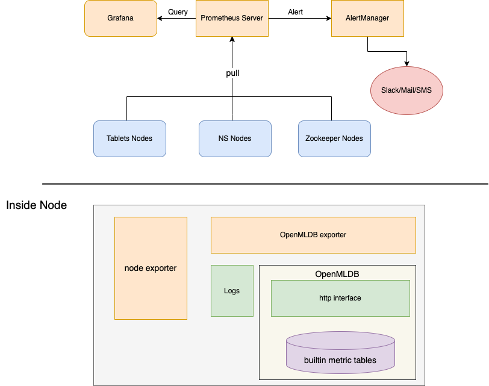

# 监控

## 概述

OpenMLDB 的监控方案如图：



- 使用 [prometheus](https://prometheus.io) 收集监控指标，[grafana](https://grafana.com/oss/grafana/) 可视化指标
- 监控节点内部使用 [node_exporter](https://github.com/prometheus/node_exporter) 暴露机器和操作系统相关指标, OpenMLDB exporter 暴露 OpenMLDB 专属指标

## 状态

**实验性**

- 可运行，不保证后续版本兼容性
- OpenMLDB exporter 实现了基础的监控指标，如 qps, latency
- 源代码路径: [OpenMLDB/monitoring](https://github.com/4paradigm/OpenMLDB/tree/main/monitoring)


## 安装配置 OpenMLDB exporter

### 环境要求

- python3

### 准备

1. 获取 OpenMLDB

   你可以从 [OpenMLDB release](https://github.com/4paradigm/OpenMLDB/releases) 页面下载预编译的安装包，或者从源码编译。

   注意编译时确认开启编译选项: `-DTCMALLOC_ENABLE=ON`, 默认为 `ON`:
   ```sh
   git clone https://github.com/4paradigm/OpenMLDB
   cd OpenMLDB
   make
   make install
   ```
   详见 [compile.md](../deploy/compile.md), OpenMLDB exporter 将安装到 `${project_root}/openmldb/bin/openmldb_exporter.py`

2. 启动 OpenMLDB 组件

   参见 [install_deploy](../deploy/install_deploy.md) 如何启动 OpenMLDB 组件。

   OpenMLDB exporter 要求 OpenMLDB 启动时开启 server status 功能, 即启动时添加启动参数 `--enable_status_service=true`, 请确认安装目录下的 `conf/(tablet|nameserver).flags` 中有 `--enable_status_service=true`。

   默认启动脚本 `bin/start.sh` 开启了 server status, 不需要额外配置。

3. 安装 python 依赖
```sh
pip3 install --user prometheus-client
```

### 部署 OpenMLDB exporter

执行:
```sh
./bin/openmldb_exporter.py --config conf/openmldb_exporter.conf
```

将会启动 openmldb exporter, 并开放 8000 端口。在终端使用 curl 验证进程状态, 会输出 prometheus 监控信息

```sh
curl http://localhost:8000/metrics
```

### 配置文件

Linux conf 文件格式，默认读取当前目录下的 `openmldb_exporter.conf` 文件, 通过 `--config` 参数调整配置文件的路径。 `#` 开头行为注释，有效行格式为 `{key}={value}`, 支持的配置（即 key) 有：

- `port`: exporter 监听端口

   默认: 8000
- `interval`: 从 OpenMLDB 拉取指标的频率

   默认: 15 秒
- `tablet_endpoint`

   默认: 127.0.0.1:9520
- `tablet_log_dir`: tablet server 日志目录

   默认: ''
- `ns_log_dir`: name server 日志目录

   默认: ''

## 部署 node exporter

[node_exporter](https://github.com/prometheus/node_exporter) 是 prometheus 官方实现的暴露系统指标的组件。

进入 [release](https://github.com/prometheus/node_exporter/releases) 页面，下载并解压对应平台的压缩包。例如 linux amd64 平台下:
```sh
curl -SLO https://github.com/prometheus/node_exporter/releases/download/v1.3.1/node_exporter-1.3.1.darwin-amd64.tar.gz
tar xzf node_exporter-1.3.1-*.tar.gz
cd node_exporter-1.3.1-*/

# 启动 node_exporter
./node_exporter
```

## 部署 Prometheus & Grafana

如何安装部署 prometheus, grafana 详见官方文档 [promtheus get started](https://prometheus.io/docs/prometheus/latest/getting_started/) 和 [grafana get started](https://grafana.com/docs/grafana/latest/getting-started/getting-started-prometheus/) 。
OpenMLDB 提供了 prometheus 和 grafana 配置文件以作参考:

- `conf/prometheus_example.yml`: prometheus 配置示例, 注意修改 ’node' 和 'openmldb_exporter' job 中的 target 地址
- `conf/openmldb_dashboard.json`: OpenMLDB metrics 的 grafana dashboard 配置, 分为两步:
   1. 在 grafana data source 页面下，添加启动的 prometheus server 地址作为数据源
   2. 在 dashboard 浏览页面下，点击新建导入一个 dashboard, 上传该 json 配置文件


