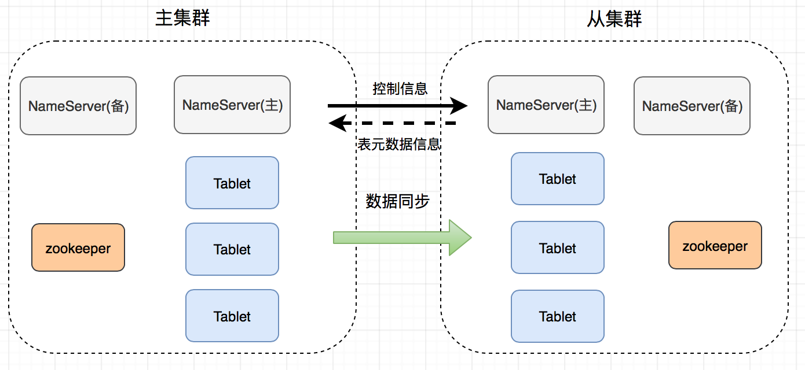
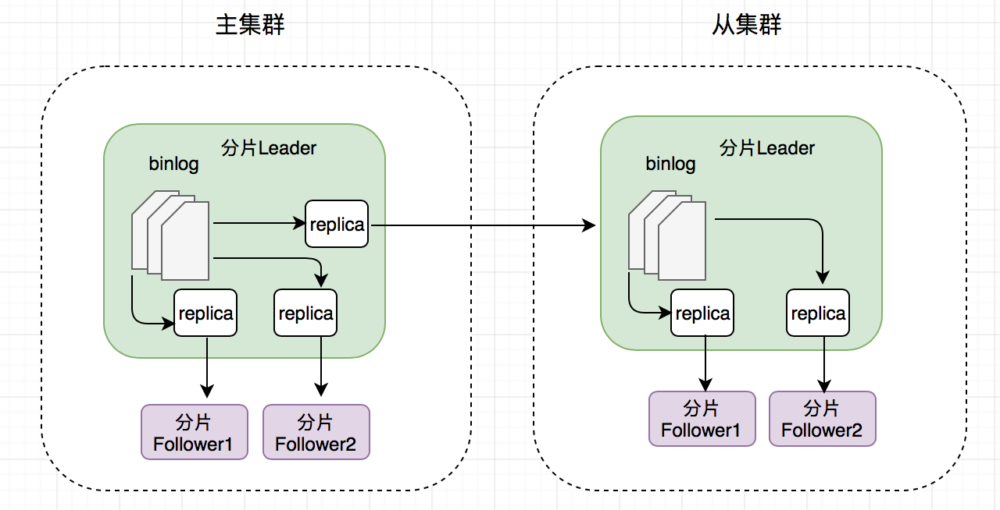
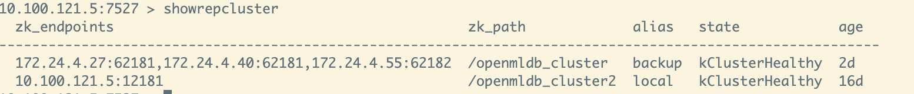
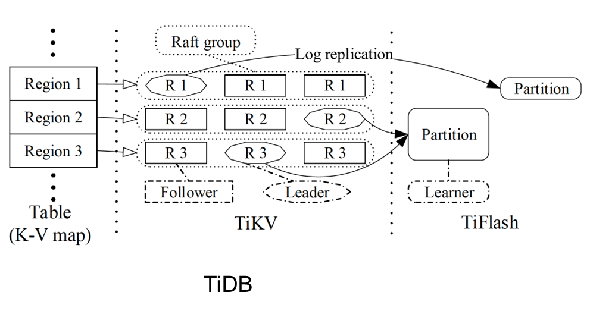
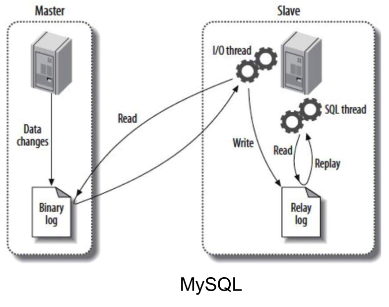

# [Alpha] 跨机房容灾方案

## 背景

在单集群部署环境下，OpenMLDB 具备集群内节点级别的高可用能力。但是当出现某些不可抗拒因素时，比如机房断电或者自然灾害，导致机房或者大部分节点无法正常运转，就会使得该集群状态异常，从而中断在线服务。因此，OpenMLDB 也提供了一个跨机房容灾方案来解决该问题。在该方案中，用户可以在多个异地机房，分别部署独立的 OpenMLDB 集群，并且将这多套 OpenMLDB 集群设置成为主从复制模式。在这种部署架构下，如果主集群无法提供服务，用户可以进行主从切换，从而保证业务不中断。

## 架构

### 名词定义

- 主集群：能支持读写的集群，并且可以给从集群同步数据。一个主集群可以有多个从集群。
- 从集群：只提供读请求的集群，数据和主集群保持一致；可以在需要的时候切换为主集群；可以部署多个。
- 分片 leader：主分片，接收读写数据
- 分片 follower：从分片，只接受分片 leader 同步过来的数据，目前不接受客户端的直接写请求
- offset：本文 offset 特指 OpenMLDB 的 binlog 所保存的数据偏移量，该值越大，说明保存有更多的新鲜数据。

关于名词的进一步解释可以查看 OpenMLDB 的在线模块架构文档：https://openmldb.ai/docs/zh/main/reference/arch/online_arch.html

### 目标

- 主集群支持写操作，主从集群都可以支持读操作
- 一个主集群可以有多个从集群作为备份
- 主集群出现意外不可用时能够手动切换，让其中一个从集群提升为主集群
- 能够自动处理主集群或者从集群内部节点下线不可用（包括 nameserver 和 tablet）的情况

### 技术方案

主从集群的整体技术架构如下图所示：



主从集群之间的同步信息，主要包含数据同步和元信息同步两部分。

**初始状态**

对于主从集群的初始状态，可以为以下状态之一：

- 主集群和从集群的数据均为空
- 主或从集群不为空，主从集群的表名以及 schema 一致，并且主集群 offset 大于等于从集群的 offset，否则会报错。

**元信息同步**

元信息同步发生在主从集群的 nameserver 之间。具体的过程如下：

- 建立好主从关系之后，主集群的 nameserver 会向从集群同步主集群的表信息，从集群创建相应的表。注意，主从集群节点数不需要一致，但是每张表的分片数需要保持一致。
- 主集群的 nameserver 每隔一段时间获取从集群的表拓扑信息

**数据同步**

主从集群之间的数据同步主要通过 binlog 进行，其总体的同步逻辑如下：

- 单集群内部：leader → followers 同步数据
- 主从集群之间：主集群 leader → 从集群 leader 同步数据

下图可视化列举了该同步逻辑和数据流方向。



假设有一个从集群，表为三副本。其具体过程为：主集群分片的 leader 会创建两个 replicator 线程来负责集群内部数据同步，以及 1 个 replicator 线程来负责同步数据到从集群的 leader；从集群的 leader 会创建两个 replicator 线程，分别给从集群内部的 followers 同步数据。

replicator 的具体同步逻辑如下：

- 读取 binlog 并把数据传给 follower
- follower 收到数据，添加到本地 binlog，同时写到本地分片表中

默认情况下，replicator 会不断读取最新的 binlog，如果没有最新数据写入就会等待一小段时间（默认为 100ms），再尝试读取。在同步时效性要求比较高的场景下，可以修改默认配置（参数 `binlog_sync_wait_time`*，*详见文档[配置文件](https://openmldb.ai/docs/zh/main/deploy/conf.html)），减少等待时间，但是可能会增加 CPU 的资源消耗。

**集群内部自动故障转移**

主集群 nameserver 离线：
- 主集群中主 namserver 离线之后，主集群中的备 nameserver 就会升级为主 nameserver，更新从集群中表的拓扑信息到新的主 nameserver
- 主集群中备 nameserver 离线，不做任何操作

从集群 nameserver 离线：
- 从集群中主 nameserver 离线之后，从集群中的备 nameserver 就会升级为主 nameserver。主集群向从集群获取表拓扑信息时，返回错误，主集群就会读取从集群的 ZooKeeper 信息，以获取最新的主 nameserver，然后更新表拓扑信息
- 从集群中备 nameserver 离线之后不做任何操作

主集群 tablet 离线：
- 主集群内做故障转移，相应的分片选出新的 leader
- 新的 leader 重新和从集群中分片所在的 tablet 建立数据同步关系

从集群 tablet 离线：
- 从集群做故障转移，相应的分片选出新的 leader
- 主集群 nameserver 获取从集群表拓扑结构发现已经有变化，删除对应变化分片的数据同步关系并重新建立

**主从集群间手动故障转移**

主集群不可用：
通过运维命令，提升从集群为主集群。同时，业务方的写流量和读流量需要切换到当前的新的主集群下，该流量的切换过程需要由业务方系统来完成。

从集群不可用：
业务方原有在从集群上的读流量（如果有），需要全部切换到主集群下。该流量的切换过程需要由业务方系统来完成。

## 主从集群相关命令

集群启动后默认为主集群。通过命令可以将一个集群添加为另一个集群的从集群，或者进行切换、移除。

**启动 NS client**

主从集群的管理在 NS client 下进行操作，可以使用如下命令启动 NS client。

```Bash
$ ./bin/openmldb --zk_cluster=172.27.2.52:12200 --zk_root_path=/onebox --role=ns_client
```

其中 `zk_cluster` 是 ZooKeeper 地址，`zk_root_path` 是集群在 ZooKeeper 的根路径，`role` 是启动的角色需指定为 `ns_client`

关于 NS client 的更多信息，可以参考[运维 CLI](https://openmldb.ai/docs/zh/main/maintain/cli.html)。

**添加从集群**

可以使用命令 `addrepcluster` 来添加一个从集群，其使用格式为：

```Bash
addrepcluster $zk_cluster_follower $zk_root_path_follower $cluster_alias
```

比如需要添加的从集群的 ZooKeeper 地址为 `10.1.1.1:2181`，OpenMLDB 在该 ZooKeeper 上的根路径为 `10.1.1.2:2181 /openmldb_cluster`，添加以后的从集群别名为 `prod_dc01`，则可以在主集群的 NS client 上执行如下命令进行从集群的添加：

```Bash
addrepcluster 10.1.1.1:2181,10.1.1.2:2181 /openmldb_cluster  prod_dc01
```

**移除从集群**

可以执行命令 `removerepcluster` 来删除一个从集群，比如删除上面添加的从集群 `prod_dc01`：

```Bash
removerepcluster prod_dc01
```

**切换集群角色**

`switchmode` 命令可以修改集群的角色。参数可以为 `leader` 或者 `normal`。如果需要把从集群提升成主集群，参数设置为 leader。如果要修改为普通的集群，参数设置为 normal。

```undefined
switchmode leader
```

**查看从集群**

`showrepcluster` 命令可以查询所有从集群，输出结果类似：



## FAQ

1. **如何解决分布式的“脑裂”问题？**

在分布式环境中，经常会遇到“脑裂”问题。所谓脑裂，简单来说就是在某些非正常状态下（比如由于网络阻塞），两个集群选举出了不同的 leader。Raft 之类的一致性协议能很好的解决类似问题，如要求 leader 必须获取半数以上的投票。而 OpenMLDB 的选主和这些协议不太一样，OpenMLDB 是由 ZooKeeper 和 nameserver 来选主的。节点是否下线通过 ZooKeeper 中 ephemeral node 实现，nameserver 选主的时候从该集群的所有 follower 中选择 offset 最大的一个作为新的 leader，所以本质上来说 OpenMLDB 的主从集群方案不会出现脑裂的问题。

2. **如何判断主集群不可用，需要进行主从切换？**

目前 OpenMLDB 在集群整体不可用的状态上并不会自动判断或自动切换，设计主从集群方案主要是为了应对如机房断电等重大事故。

因此目前需要人为主观去判断主集群是否处于不可用状态，从而需要进行主从切换。造成主集群不可用的常见原因如：整个集群的服务器不可抗拒原因无法访问、ZooKeeper 无法恢复、部分 tablet 下线导致无法恢复或者恢复时间过长等。

3. **是否可能在某些情况下会数据丢失？**

虽然主从集群方案增加了多一层的高可用机制，但是也不能保证数据完全不丢失，以下情况依然会出现数据丢失，相关问题均会在后续版本进行修复或者优化：

- 主集群内部 tablets failover 后，新选出来的 leader 的 offset 比从集群中的 leader 的 offset 小，会造成两者 offset 差值之间的这部分数据丢失
- 主从切换过程中，如果主集群有写流量，那么可能会造成部分未及时从原有主机群同步到从集群的数据丢失
- 从集群表格拓扑发生变化，并且主集群尚未捕获，此时如果执行主从切换，会造成从拓扑结构发生变化到切换成功之间的数据丢失

4. **是否可以支持多个从集群**

一个主集群可以支持多个从集群，只要在主集群上执行添加从集群命令 `addrepcluster` 进行添加即可。

5. **和业界其他主从集群方案的比较？**



列举了两个业界常用数据库作为比较 —— TiDB 和 MySQL，OpenMLDB 的做法和这两个在架构上比较相似。TiDB 将数据从 TiKV 传到 TiFlash 也是通过类似方式完成的，TiFlash 有一个 Learner 的概念类似于 OpenMLDB 从集群的 leader。TiKV 会把数据同步到 Learner 上面，然后再由 Learner 去做集群内的数据同步。MySQL 的主从复制，跟我们做法也是类似的，它也是通过 binlog，将数据定期地同步到从集群上面，从集群再进行 binlog 的集群内读取和同步。

## 开发进度

目前主从集群方案在实验阶段的 alpha 特性，其核心功能都已经开发完毕，并且进行了充分的测试。目前主要遗留问题为：

- SQL 命令目前只有创建表、删除表、以及数据插入操作可以主从集群自动同步，其余命令（比如 SQL 上线，修改 TTL 等）目前尚不支持自动同步，需要手动在主从集群上分别执行。