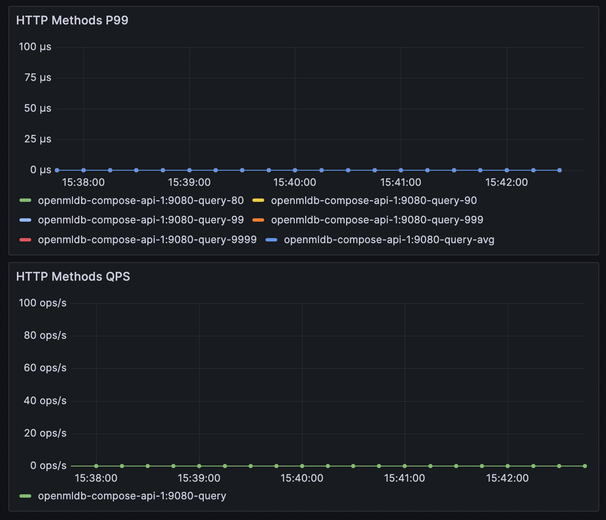
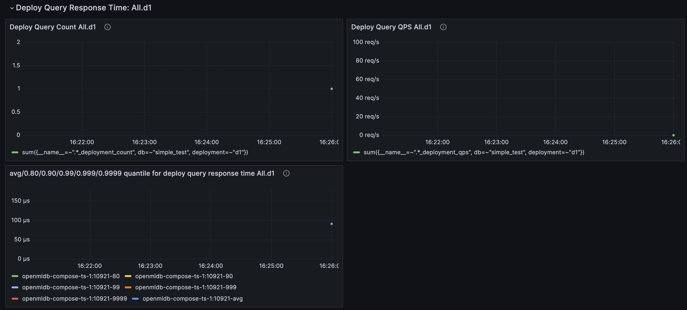

# 性能调优指南

集群的读写可能出现性能问题，本文档将介绍如何进行性能的监控和调优。首先，需要通过监控手段了解集群的性能瓶颈在哪里，然后再根据性能瓶颈进行调优。

## 监控指标采集

如果仅针对于一个阶段的读写性能进行监控和采集数据，那么，你不需要部署完整的监控系统。完整监控参考[监控](./monitoring.md)，这里可以只部署Prometheus和Grafana。

采集目标，即Prometheus的targets配置，可参考以下配置：
```yaml
global:
  scrape_interval:     15s # By default, scrape targets every 15 seconds.

# A scrape configuration containing exactly one endpoint to scrape:
# Here it's Prometheus itself.
scrape_configs:
  # The job name is added as a label `job=<job_name>` to any timeseries scraped from this config.
  - job_name: openmldb_components
    metrics_path: /brpc_metrics
    static_configs:
      - targets:
        - nameserver_ip
        - tablet_ip
        - tablet_ip
        - apiserver_ip
```
`metrics_path`不变，只需修改targets里中的IP，注意**不要**添加TaskManager的IP。

部署完成后，访问Prometheus或Grafana网页，可以看到指标已经被采集。由于只部署了必要的组件，Grafana的界面上可能出现一些无数据的图表，这是正常的。我们只需要保证我们关心的指标有数据即可。

## 写性能调试

观察Grafana中的写性能指标前，需要明确有以下两种写链路：

- Importer(Clients/LoadData) <-> Network <-> Tablet Server
- HTTP Clients <-> Network <-> API Server <-> Network <->Tablet Server 

第一种，以各种方式直接导入数据到OpenMLDB中。三个环节中，网络不可查，导入端种类丰富，很难全部概括，所以，我们先关注TabletServer的性能指标，如果TabletServer表现正常，再检查导入端是否有问题；如果TabletServer端指标不正常，则进行TabletServer的调优。

第二种，借助了APIServer，通过HTTP请求写入数据。这种情况下，先关注APIServer的性能指标，如果APIServer表现正常，再检查导入端是否有问题；如果APIServer端指标不正常，再看是TabletSever端的问题，还是需要进行APIServer的调优。

### TabletServer指标


关注上图中的指标，左图为延时，右图为QPS。这两个指标统计了Put（插入单条数据）在TabletServer中的完整时间。

通常来讲，即使在默认配置下，TabletServer也可以支持很高的写QPS。如果TabletServer负载较低，硬件资源可以支撑默认配置，写延时P99在0.1ms上下，QPS达到单台100k，P99也在1ms左右。写延时P9999可能因为QPS过高而到100ms量级，但占比并不高，如果对突发高延迟不敏感，可以只关注P99。简单来说，100k量级的QPS基本不用担心性能问题。

如果不被其他因素干扰，TabletServer的这两个指标体现了它稳定的写入性能，分以下几种情况讨论：

- 延迟高+QPS高

如果两者都高，可能是QPS过大，导致TabletServer繁忙。需要考虑表是否有热点，QPS是否超出单台承受范围。如果是热点，可能是表分区索引不合理。如果表数据分布均匀，或允许大分片，可以考虑TabletServer配置参数调优（见[调优参数详解](#调优参数详解)），使用更多硬件资源，或增加TabletServer节点，分散写请求。

- 延迟低+QPS低

延迟低即写入表现正常，但QPS很低，可能是导入端并发度不够，或者网络延迟较大，需要对导入端进行性能分析。如果是QPS不差，但并满足你的要求，可以进行TabletServer配置参数调优（见[调优参数详解](#调优参数详解)），或增加TabletServer节点。

- 延迟高+QPS低

QPS低但延迟高是极不合理的，需要具体分析。可能并没有保证没有其他读写干扰，被其他操作抢占了资源。也可能是硬件资源不足，或者TabletServer配置不合理。

### APIServer

通常不推荐使用APIServer进行生产级写入，因为它有两段网络延迟，不适合延迟敏感的场景。但如果你的写入链路中包含APIServer，可以关注APIServer的性能指标。APIServer的性能指标在Grafana中查看，如下图所示，该图表是将所有method放在一起的，只需关注put method的延时和QPS。



APIServer的put指标包含了写请求在APIServer的全流程，包括请求TabletServer与结果返回。如果TabletServer写指标正常，APIServer处的延迟却很高，可能是网络延迟多大。如果APIServer延迟正常，但QPS不满足要求，可以进行配置参数调优（见[调优参数详解](#调优参数详解)），增加单台APIServer的并发处理能力。也可以增加APIServer节点，分散写请求（APIServer节点间没有联系，相互独立，需要写入端自行负载均衡）。

## 读性能调试

我们暂不讨论在线预览模式的读性能，它的范围太大，select语句情况太多，每次返回结果的size也不一定相同。如果单次select返回结果很多，也会导致这一次查询很慢。所以，本章我们只讨论Deployment请求的性能。

Deployment请求的指标在Grafana中查看，如下图所示，关注延时和QPS。在Grafana中每个Deployment单独展示，可以在最上方选择你要查询的Deployment名字，筛选出单独的Deployment，方面查看。



注意，Deployment指标需要打开统计开关，需要执行SQL `SET GLOBAL deploy_stats = 'on';`，还需要进行一次以上的请求后，才会产生该项指标，否则是`no data`。关闭统计开关后，会清空server中的所有deployment指标并停止统计（已被Prometheus抓取的数据不影响）。

一次Deployment带有请求行，请求行不同，也会导致计算中的数据范围不同。为了方便调试，推荐使用同样的请求行反复请求测试。如果QPS并不高，请求延迟仍稳定且慢，需要进行Deployment SQL计算上的测试。它可能是因为某个函数耗时较大，可能是计算较复杂，也可能是请求行恰好需要太多的数据进行聚合计算。如果请求延迟合理但QPS较低，可能是请求端并发不足，如果需要QPS非常大，可能需要TabletServer配置参数调优（见[调优参数详解](#调优参数详解)），增加TabletServer的并发处理能力。

## 调优参数详解

- `thread_pool_size`

TabletServer和APIserver，接收读和写并发请求的能力都被其线程池大小影响，通过配置项`thread_pool_size`来调整，等价于`brpc::ServerOptions.num_threads`，此配置的详细解释见[brpc worker线程数](https://brpc.apache.org/zh/docs/server/basics/#worker%E7%BA%BF%E7%A8%8B%E6%95%B0)。不同的是，并不会自动设置为机器的core数，TabletServer默认在配置文件中配置为24，APIServer在配置文件中不特别配置，使用默认值16。

如果已确认客户端并发足够大，是因为Server处理的线程数不够多，导致的QPS较低，可以适当增加线程数，但不要过大，建议不超过机器的core数。
