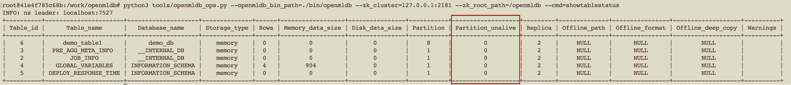

# 运维命令状态

在执行大部分的运维操作以后，可以通过通用的命令组合来观测运维命令执行的结果，以及当前数据库的健康状况。我们可以依次执行 `showopstatus` 以及 `showtablestatus` 命令，来最终确认相关运维命令是否成功完成。

## 步骤一：查看命令状态 `showopstatus`

该命令用于查看特定的运维命令的执行状态。目前在 NS client 所支持的可以通过该命令查看状态的运维命令包括: `addreplica`, `delreplica`, `migrate`, `offlineendpoint`, `recoverendpoint`, `changeleader`, `recovertable`。相关运维命令详情查看文档 [运维 CLI](./cli.md) 。

通过运行 [OpenMLDB 运维工具](./openmldb_ops.md) `openmldb_ops.py` 的 `showopstatus` 命令来查看相关命令的运行状态，比如：

```bash
python tools/openmldb_ops.py --openmldb_bin_path=./bin/openmldb --zk_cluster=127.0.0.1:2181 --zk_root_path=/openmldb --cmd=showopstatus
```

由于运维命令的异步执行，你可能需要运行多次 `showopstatus` 来确认其最终状态。相关命令的状态变化会有三种路径状态：

1. kInited => kDoing => kDone: 命令运行成功
2. kInited => kDoing => kFailed: 命令运行失败
3. kInited => kCanceled: 只有手动运行了 `cancelop` 命令以后才可能会触发

当命令运行状态都变为 `kDone` 以后，说明相关命令运行成功，可以进行下一步使用 `showtablestatus` 命令查看表格状态。

## 步骤二：查看表格状态 `showtablestatus`

当相关运维命令执行成功以后，还需要进一步确认表格状态是否有异常，可以通过 [OpenMLDB 运维工具](./openmldb_ops.md) 的 `showtablestatus` 命令来查看。比如：

```bash
python tools/openmldb_ops.py --openmldb_bin_path=./bin/openmldb --zk_cluster=127.0.0.1:2181 --zk_root_path=/openmldb --cmd=showtablestatus
```

该命令将会输出一系列的表格信息，我们需要关注列 `Partition_unalive`，如果其值为 0，则表示表格状态正常，否则说明有异常发生，如下图。


