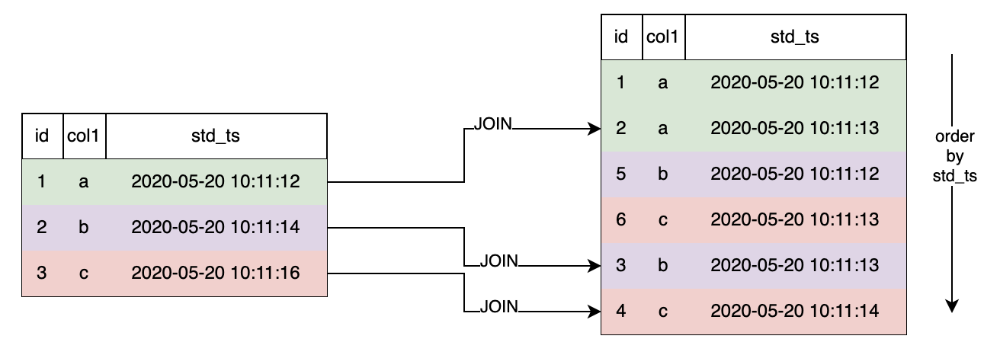

# JOIN Clause

OpenMLDB目前仅支持`LAST JOIN`一种**JoinType**。

LAST JOIN可以看作一种特殊的LEFT JOIN。在满足JOIN条件的前提下，左表的每一行拼接符合条件的最后一行。LAST JOIN分为无排序拼接，和排序拼接。

- 无排序拼接是指：未对右表作排序，直接拼接。
- 排序拼接是指：先对右表排序，然后再拼接。

与LEFT JOIN相同，LAST JOIN也会返回左表中所有行，即使右表中没有匹配的行。
## Syntax

```
JoinClause
         ::= TableRef JoinType 'JOIN' TableRef [OrderClause] 'ON' Expression 
JoinType ::= 'LAST'       
```

## SQL语句模版

```sql
SELECT ... FROM table_ref LAST JOIN table_ref ON expression;
```

## 边界说明

| SELECT语句元素                                 | 离线模式  | 在线预览模式 | 在线请求模式 | 说明                                                                                                                                                                                                 |
| :--------------------------------------------- | --------- | ------------ | ------------ |:---------------------------------------------------------------------------------------------------------------------------------------------------------------------------------------------------|
| JOIN Clause| **``✓``** | **``x``** | **``✓``** | 表示数据来源多个表JOIN。OpenMLDB目前仅支持LAST JOIN。在线请求模式下，需要遵循[在线请求模式下LAST JOIN的使用规范](../deployment_manage/ONLINE_REQUEST_REQUIREMENTS.md#online-serving下last-join的使用规范)                                        |


### 未排序的LAST JOIN 


`LAST JOIN`无排序拼接时，拼接最后一条命中的数据行。
#### 计算逻辑示例


以左表第二行为例，符合条件的右表是无序的，命中条件的有2条，选择最后一条`5, b, 2020-05-20 10:11:12`。最后的拼接结果如下。


```{note}
为了实现上图展示的拼接效果，即使您使用的是离线模式，也请遵循[在线请求模式下LAST JOIN的使用规范](../deployment_manage/ONLINE_SERVING_REQUIREMENTS.md#online-serving下last-join的使用规范)，如下文的SQL样例所示。
否则由于底层存储顺序的不确定，尽管执行结果也是正确的，却可能无法复现上述拼接结果。
```

#### SQL示例
**使用OpenMLDB SQL语句复现上述计算逻辑的过程如下。**

启动单机版OpenMLDB服务端和CLI客户端
```bash
./init.sh standalone
./openmldb/bin/openmldb --host 127.0.0.1 --port 6527
```
建立上述左表t1，插入数据。为了便于查看结果，在col1上建立单列索引，以std_ts作为TS。在本例中也可以不在左表上建立索引，不影响拼接结果。
```sql
>CREATE TABLE t1 (id INT, col1 STRING,std_ts TIMESTAMP,INDEX(KEY=col1,ts=std_ts));
SUCCEED
>INSERT INTO t1 values(1,'a',20200520101112);
SUCCEED
>INSERT INTO t1 values(2,'b',20200520101114);
SUCCEED
>INSERT INTO t1 values(3,'c',20200520101116);
SUCCEED
>SELECT * from t1;
 ---- ------ ----------------
  id   col1   std_ts
 ---- ------ ----------------
  1    a      20200520101112
  2    b      20200520101114
  3    c      20200520101116
 ---- ------ ----------------

3 rows in set
```      

建立上述右表t2，建立索引，插入数据。
```{note}
底层存储顺序不一定与插入顺序一致，而底层存储顺序会影响JOIN时的命中顺序。本例为了便于验证拼接结果，需要实现上图右表的存储顺序。t2必须建立下述索引（注意不能添加TS），且逐条按序插入数据，原因见[列索引](https://openmldb.ai/docs/zh/main/openmldb_sql/ddl/CREATE_TABLE_STATEMENT.html#columnindex)。
```
```sql
>CREATE TABLE t2 (id INT, col1 string,std_ts TIMESTAMP,INDEX(KEY=col1));
SUCCEED
>INSERT INTO t2 values(1,'a',20200520101112);
SUCCEED
>INSERT INTO t2 values(2,'a',20200520101113);
SUCCEED
>INSERT INTO t2 values(3,'b',20200520101113);
SUCCEED
>INSERT INTO t2 values(4,'c',20200520101114);
SUCCEED
>INSERT INTO t2 values(5,'b',20200520101112);
SUCCEED
>INSERT INTO t2 values(6,'c',20200520101113);
SUCCEED
>SELECT * from t2;
 ---- ------ ----------------
  id   col1   std_ts
 ---- ------ ----------------
  2    a      20200520101113
  1    a      20200520101112
  5    b      20200520101112
  3    b      20200520101113
  6    c      20200520101113
  4    c      20200520101114
 ---- ------ ----------------

6 rows in set
```
执行LAST JOIN
```sql
> SELECT * from t1 LAST JOIN t2 ON t1.col1 = t2.col1;
 ---- ------ ---------------- ---- ------ ----------------
  id   col1   std_ts           id   col1   std_ts
 ---- ------ ---------------- ---- ------ ----------------
  1    a      20200520101112   2    a      20200520101113
  2    b      20200520101114   5    b      20200520101112
  3    c      20200520101116   6    c      20200520101113
 ---- ------ ---------------- ---- ------ ----------------

3 rows in set
```
若不在t1上建立索引，拼接结果相同，仅SELECT展示顺序不同。
```sql
> SELECT * from t1 LAST JOIN t2 ON t1.col1 = t2.col1;
 ---- ------ ---------------- ---- ------ ----------------
  id   col1   std_ts           id   col1   std_ts
 ---- ------ ---------------- ---- ------ ----------------
  3    c      20200520101116   6    c      20200520101113
  1    a      20200520101112   2    a      20200520101113
  2    b      20200520101114   5    b      20200520101112
 ---- ------ ---------------- ---- ------ ----------------

3 rows in set
```
```{note}
`LAST JOIN`使用了索引优化：使用`LAST JOIN` 的 condition 和 order by 列寻找最匹配的表索引；如果有index就会使用该index的ts项作为未排序last join隐式使用的order；反之没有index，就使用表的存储顺序。没有索引的表的底层存储顺序是不可预测的。请注意，在建表时若没有显示指出索引的ts项，OpenMLDB会使用该条数据被插入时的时间戳作为ts。
```


### 排序的LAST JOIN
`LAST JOIN`时配置 `Order By` ，则右表按Order排序，拼接最后一条命中的数据行。

#### 计算逻辑示例



以左表第二行为例，符合条件的右表有2条，按`std_ts`排序后，选择最后一条`3, b, 2020-05-20 10:11:13`


最后的拼表结果如上图所示。

#### SQL示例
**使用OpenMLDB SQL语句复现上述计算逻辑的过程如下。**

建立上述左表t1，插入数据。可以不建立索引。
```SQL
>CREATE TABLE t1 (id INT, col1 STRING,std_ts TIMESTAMP);
SUCCEED
>INSERT INTO t1 values(1,'a',20200520101112);
SUCCEED
>INSERT INTO t1 values(2,'b',20200520101114);
SUCCEED
>INSERT INTO t1 values(3,'c',20200520101116);
SUCCEED
>SELECT * from t1;
 ---- ------ ----------------
  id   col1   std_ts
 ---- ------ ----------------
  1    a      20200520101112
  2    b      20200520101114
  3    c      20200520101116
 ---- ------ ----------------

3 rows in set
```
建立上述右表t2，插入数据。可以不建立索引。
```sql
>CREATE TABLE t2 (id INT, col1 string,std_ts TIMESTAMP);
SUCCEED
>INSERT INTO t2 values(1,'a',20200520101112);
SUCCEED
>INSERT INTO t2 values(2,'a',20200520101113);
SUCCEED
>INSERT INTO t2 values(3,'b',20200520101113);
SUCCEED
>INSERT INTO t2 values(4,'c',20200520101114);
SUCCEED
>INSERT INTO t2 values(5,'b',20200520101112);
SUCCEED
>INSERT INTO t2 values(6,'c',20200520101113);
SUCCEED
>SELECT * from t2;
 ---- ------ ----------------
  id   col1   std_ts
 ---- ------ ----------------
  2    a      20200520101113
  1    a      20200520101112
  5    b      20200520101112
  3    b      20200520101113
  6    c      20200520101113
  4    c      20200520101114
 ---- ------ ----------------

6 rows in set
```
执行LAST JOIN
```sql
>SELECT * from t1 LAST JOIN t2 ON t1.col1 = t2.col1;
 ---- ------ ---------------- ---- ------ ----------------
  id   col1   std_ts           id   col1   std_ts
 ---- ------ ---------------- ---- ------ ----------------
  1    a      20200520101112   2    a      20200520101113
  2    b      20200520101114   3    b      20200520101113
  3    c      20200520101116   4    c      20200520101114
 ---- ------ ---------------- ---- ------ ----------------
```


### LAST JOIN 未命中
以下示例展示了当右表没有任何一行数据能与左表中某行匹配时的执行结果。

在[排序的LAST JOIN](#排序的LAST JOIN)中创建的t1表中插入新行并执行LAST JOIN
```sql
>INSERT INTO t1 values(4,'d',20220707111111);
SUCCEED
>SELECT * from t1 LAST JOIN t2 ORDER BY t2.std_ts ON t1.col1 = t2.col1;
 ---- ------ ---------------- ------ ------ ----------------
  id   col1   std_ts           id     col1   std_ts
 ---- ------ ---------------- ------ ------ ----------------
  4    d      20220707111111   NULL   NULL   NULL
  3    c      20200520101116   4      c      20200520101114
  1    a      20200520101112   2      a      20200520101113
  2    b      20200520101114   3      b      20200520101113
 ---- ------ ---------------- ------ ------ ----------------
```
