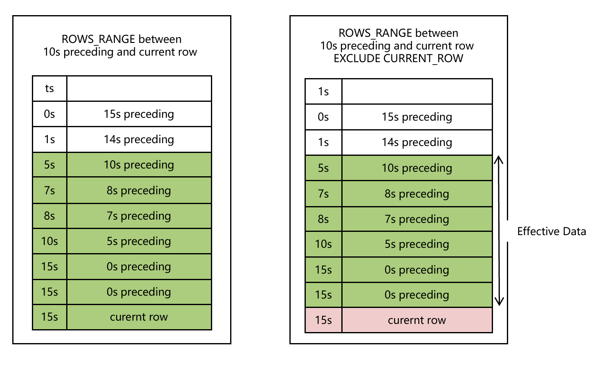

# WINDOW Clause

## Syntax

```sql
WindowClauseOptional
        ::= ( 'WINDOW' WindowDefinition ( ',' WindowDefinition )* )?

WindowDefinition
        ::= WindowName 'AS' WindowSpec

WindowSpec
        ::= '(' WindowSpecDetails ')'

WindowSpecDetails
        ::= [ExistingWindowName] [WindowUnionClause] WindowPartitionClause WindowOrderByClause WindowFrameClause (WindowAttribute)*

WindowUnionClause
        :: = ( 'UNION' TableRefs)

WindowPartitionClause
        ::= ( 'PARTITION' 'BY' ByList )

WindowOrderByClause
        ::= ( 'ORDER' 'BY' ByList )

WindowFrameClause
        ::= ( WindowFrameUnits WindowFrameBounds [WindowFrameMaxSize] )

WindowFrameUnits
        ::= 'ROWS'
          | 'ROWS_RANGE'

WindowFrameBounds
        ::= 'BETWEEN' WindowFrameBound 'AND' WindowFrameBound

WindowFrameBound
        ::= ( 'UNBOUNDED' | NumLiteral | IntervalLiteral ) ['OPEN'] 'PRECEDING'
          | 'CURRENT' 'ROW'

WindowAttribute
        ::= WindowExcludeCurrentTime
          | WindowExcludeCurrentRow
          | WindowInstanceNotInWindow

WindowExcludeCurrentTime
        ::= 'EXCLUDE' 'CURRENT_TIME'

WindowExcludeCurrentRow
        ::= 'EXCLUDE' 'CURRENT_ROW'

WindowInstanceNotInWindow
        :: = 'INSTANCE_NOT_IN_WINDOW'

WindowFrameMaxSize
        :: = 'MAXSIZE' NumLiteral
```

*窗口调用函数*实现了类似于聚合函数的功能。 不同的是，窗口调用函数不需要将查询结果打包成一行输出—在查询输出中，每一行都是分开的。 然而，窗口调用函数可以扫描所有的行，根据窗口调用函数的分组规范(`PARTITION BY`列)， 这些行可能会是当前行所在组的一部分。一个窗口调用函数的语法是下列之一：

```
function_name ([expression [, expression ... ]]) OVER ( window_definition )
function_name ([expression [, expression ... ]]) OVER window_name
function_name ( * ) OVER ( window_definition )
function_name ( * ) OVER window_name
```

## SQL语句模版

- ROWS WINDOW(条数窗口) SQL模版

```sql
SELECT select_expr [, select_expr ...], window_function_name(expr) OVER window_name, ... FROM ... WINDOW AS window_name (PARTITION BY ... ORDER BY ... ROWS BETWEEN ... AND ...)
```

- ROWS RANGE WINDOW(时间窗口) SQL模版

```sql
SELECT select_expr [,select_expr...], window_function_name(expr) OVER window_name, ... FROM ... WINDOW AS window_name (PARTITION BY ... ORDER BY ... ROWS_RANEG BETWEEN ... AND ...)
```

## 快速上手

首先选择窗口类型，按时间，还是按条数划分窗口。

再看窗口想要什么大小，这里要分窗口类型说明：
1. 时间窗口：时间窗口通常使用s, m, h, d等时间单位，如果没有单位，默认为ms。比如：

    [3小时前,当前行] - 3h preceding and current row
    [3小时前，30分钟前] - 3h preceding and 30m preceding

1. 条数窗口：条数不需要单位。比如：
    [10条，当前行] - 10 preceding and current row
    [10条，3条] - 10 preceding and 3 preceding

### 如何推断窗口是什么样的？

首先，先明确是什么执行模式：

离线模式，即批模式，它是对from表的每一行都做一次窗口划分与计算。因此，每一行对应产生一行SQL结果。
请求模式，会带一条请求行，它会将请求行当做from表的数据，只对该行做窗口划分和计算，因此，只产生一行SQL结果。

再看，如何划分窗口：

我们将批模式看作多次请求模式来看待。所以，对一次请求行来说，窗口只可能包含，它自己，与它的partition by列值相等的行（可能的全集）。

partition key相等的所有行，还不是窗口，经由order by列排序后，还需要排除窗口范围以外的数据。比如，10 preceding and current row的条数窗口，就要抛弃10行以外的数据行（第10行包含在窗口内），又因为包括current row，于是窗口一共有11行数据。

* preceding为闭区间，包含该条，开区间使用open preceding

窗口还可以exclude current time，current row等，详情见下文。


## 边界说明

| SELECT语句元素      | 离线模式  | 在线预览模式 | 在线请求模式 | 说明                                                                                                                                                                                                                                                                                          |
|:----------------| --------- | ------------ | ------------ |:--------------------------------------------------------------------------------------------------------------------------------------------------------------------------------------------------------------------------------------------------------------------------------------------|
| WINDOW   Clause | **``✓``** |              | **``✓``**    | 窗口子句用于定义一个或者若干个窗口。窗口可以是有名或者匿名的。用户可以在窗口上调用聚合函数来进行一些分析型计算的操作（```sql agg_func() over window_name```)。在线请求模式下，需要遵循[Online Request下Window的使用规范](../deployment_manage/ONLINE_REQUEST_REQUIREMENTS.md#online-serving下window的使用规范)                                                                  |

## 基本的 WindowSpec 语法元素

### Window Partition Clause 和 Window OrderBy Clause

```sql
WindowPartitionClause
        ::= ( 'PARTITION' 'BY' ByList )

WindowOrderByClause
        ::= ( 'ORDER' 'BY' ByList )            
```

`PARTITION BY`选项将查询的行分为一组进入*partitions*， 这些行在窗口函数中单独处理。`PARTITION BY`和查询级别`GROUP BY` 子句做相似的工作，除了它的表达式只能作为表达式不能作为输出列的名字或数。OpenMLDB要求必须配置`PARTITION BY`。并且目前**仅支持按列分组**，无法支持按运算和函数表达式分组。

`ORDER BY` 选项决定分区中的行被窗口函数处理的顺序。它和查询级别`ORDER BY`子句做相似的工作， 但是同样的它不能作为输出列的名字或数。同样，OpenMLDB要求必须配置`ORDER BY`。并且目前**仅支持按列排序**，无法支持按运算和函数表达式排序。

### Window Frame Clause

```
WindowFrameClause
        ::= ( WindowFrameUnits WindowFrameBounds [WindowFrameMaxSize] )

WindowFrameUnits
        ::= 'ROWS'
          | 'ROWS_RANGE'

WindowFrameBounds
        ::= 'BETWEEN' WindowFrameBound 'AND' WindowFrameBound

WindowFrameBound
        ::= ( 'UNBOUNDED' | NumLiteral | IntervalLiteral ) ['OPEN'] 'PRECEDING'
          | 'CURRENT' 'ROW'
```

共三部分：
1. WindowFrameUnits: 窗口类型
2. WindowFrameBounds: 窗口边界
3. WindowFrameMaxSize (Optional) 窗口最大行数, 见 [Window With MAXSIZE](#4.-window-with-maxsize)

#### Window Frame Units

WindowFrameUnits定义了窗口的框架类型。OpenMLDB支持两类窗口框架：ROWS和ROWS_RANGE。

SQL标准的RANGE类窗口OpenMLDB系统目前暂不支持。他们直接的对比差异如下图所示


- ROWS: 窗口按行划入窗口，根据**条数**滑出窗口
- ROWS_RANGE：窗口按行划入窗口，根据**时间区间**滑出窗口
- RANGE: 窗口按时间粒度划入窗口（一次可能滑入多条同一时刻的数据行），按时间区间滑出窗口

#### Window Frame Bounds

 **WindowFrameBounds**定义了窗口的上界和下界, 用 `BETWEEN .. AND .. ` 的方式串联:

- CURRENT ROW: 表示当前行
- UNBOUNDED PRECEDING: 表示无限制上界
- `expr` PRECEDING
  - 窗口类型为ROWS时，`expr`必须为一个非负整数。它表示边界为当前行往前`expr`行。
  - 窗口类型为ROWS_RANGE时,`expr` 可以为时间区间（例如`10s`, `10m`,`10h`, `10d`)，它表示边界为当前行往前移expr时间段（例如，10秒，10分钟，10小时，10天）
    - 也可以写成正整数，单位为 ms, 例如 `1000` 等价于 `1s`
- OpenMLDB支持默认边界是闭合的。但支持OPEN关键字来修饰边界开区间
- 请注意：标准SQL中，还支持FOLLOWING的边界，当OpenMLDB并不支持。

#### Examples

- **有名窗口（Named Window）**

```SQL
SELECT sum(col2) OVER w1 as w1_col2_sum FROM t1
WINDOW w1 AS (PARTITION BY col1 ORDER BY col5 ROWS BETWEEN 3 PRECEDING AND CURRENT ROW)
```

- **匿名窗口**

```SQL
SELECT id, pk1, col1, std_ts,
sum(col1) OVER (PARTITION BY pk1 ORDER BY std_ts ROWS BETWEEN 1 PRECEDING AND CURRENT ROW) as w1_col1_sum
from t1;
```

- **ROWS 类型窗口**

定义一个ROWS 类型窗口， 窗口范围是前1000行到当前行。
```SQL
SELECT sum(col2) OVER w1 as w1_col2_sum FROM t1
WINDOW w1 AS (PARTITION BY col1 ORDER BY col5 ROWS BETWEEN 1000 PRECEDING AND CURRENT ROW);
```
- **ROWS_RANGE 类型窗口**

定义一个ROWS_RANGE类型窗口，窗口范围是当前行前10s的所有行，以及当前行。
```SQL
SELECT sum(col2) OVER w1 as w1_col2_sum FROM t1
WINDOW w1 AS (PARTITION BY col1 ORDER BY col5 ROWS_RANGE BETWEEN 10s PRECEDING AND CURRENT ROW);
```

## OpenMLDB特有的 WindowSpec 元素

### 1. WINDOW ... UNION

```sql
WindowUnionClause
        :: = ( 'UNION' TableRefs)
```

#### Example
- **基于一张副表的 WINDOW ... UNION**

```SQL
SELECT col1, col5, sum(col2) OVER w1 as w1_col2_sum FROM t1
WINDOW w1 AS (UNION t2 PARTITION BY col1 ORDER BY col5 ROWS_RANGE BETWEEN 10s PRECEDING AND CURRENT ROW);
```


- **基于多张副表的 WINDOW ... UNION**

```SQL
SELECT col1, col5, sum(col2) OVER w1 as w1_col2_sum FROM t1
WINDOW w1 AS (UNION t2, t3 PARTITION BY col1 ORDER BY col5 ROWS_RANGE BETWEEN 10s PRECEDING AND CURRENT ROW);
```


- **带有 INSTANCE_NOT_IN_WINDOW 的 WINDOW ... UNION**

使用 `INSTANCE_NOT_IN_WINDOW` 修饰 window, 样本表除当前行外其他行不进入窗口计算。

```SQL
SELECT col1, col5, sum(col2) OVER w1 as w1_col2_sum FROM t1
WINDOW w1 AS (UNION t2 PARTITION BY col1 ORDER BY col5 ROWS_RANGE BETWEEN 10s PRECEDING AND CURRENT ROW INSTANCE_NOT_IN_WINDOW);
```


- **带有列筛选子查询的 WINDOW ... UNION**

```SQL
SELECT col1, col5, sum(col2) OVER w1 as w1_col2_sum FROM t1
WINDOW w1 AS
(UNION (select c1 as col1, c2 as col2, 0.0 as col3, 0.0 as col4, c5 as col5, "NA" as col6 from t2),
(select c1 as col1, c2 as col2, 0.0 as col3, 0.0 as col4, c5 as col5, "NA" as col6 from t3)
PARTITION BY col1 ORDER BY col5 ROWS_RANGE BETWEEN 10s PRECEDING AND CURRENT ROW);
```

### 2. WINDOW with EXCLUDE CURRENT_TIME

窗口计算时除当前行外其他与当前行的 `ts` 列值相同的行不进入窗口计算。

```
WindowExcludeCurrentTime 
        ::= 'EXCLUDE' 'CURRENT_TIME'  
```
#### Example
- **ROWS 类型窗口，带有 EXCLUDE CURRENT_TIME**

定义一个ROWS 类型窗口，窗口范围是前1000行到当前行。 除了当前行以外窗口内不包含当前时刻的其他数据。

```SQL
SELECT sum(col2) OVER w1 as w1_col2_sum FROM t1
WINDOW w1 AS (PARTITION BY col1 ORDER BY col5 ROWS BETWEEN 1000 PRECEDING AND CURRENT ROW EXCLUDE CURRENT_TIME);
```

- **ROWS_RANGE 类型窗口，带有 EXCLUDE CURRENT_TIME**

定义一个ROWS_RANGE 类型窗口，窗口范围是当前行前10s的所有行，以及当前行。除了当前行以外窗口内不包含当前时刻的其他数据。

```SQL
SELECT sum(col2) OVER w1 as w1_col2_sum FROM t1
WINDOW w1 AS (PARTITION BY col1 ORDER BY col5 ROWS_RANGE BETWEEN 10s PRECEDING AND CURRENT ROW EXCLUDE CURRENT_TIME);
```


### 3. WINDOW with EXCLUDE CURRENT_ROW

当前行不进入窗口计算。

```
WindowExcludeCurrentRow
        ::= 'EXCLUDE' 'CURRENT_ROW'
```

#### Example
- **ROWS_RANGE 类型窗口，带有 EXCLUDE CURRENT_ROW**

```sql
SELECT sum(col2) OVER w1 as w1_col2_sum FROM t1
WINDOW w1 AS (PARTITION BY col1 ORDER BY col5 ROWS_RANGE BETWEEN 10s PRECEDING AND CURRENT ROW EXCLUDE CURRENT_ROW);
```
  

### 4. Window with MAXSIZE

OpenMLDB定义了`MAXSIZE`关键字，来限制有效窗口内最大数据条数。

`MaxSize` 属性仅支持 `ROWS_RANGE` 类型窗口。

```sql
WindowFrameMaxSize
        :: = MAXSIZE NumLiteral
```


#### Example
- **ROWS_RANGE 类型窗口，带有 MAXSIZE 限制**

定义一个 ROWS_RANGE 类型窗口，窗口范围是当前行前10s的所有行，以及当前行。同时限制窗口内数据条数不超过3条。
```sql
SELECT sum(col2) OVER w1 as w1_col2_sum FROM t1
WINDOW w1 AS (PARTITION BY col1 ORDER BY col5 ROWS_RANGE BETWEEN 10s PRECEDING AND CURRENT ROW MAXSIZE 3);
```

```{seealso}
窗口计算可使用的聚合函数，参考[Built-in Functions](../functions_and_operators/Files/udfs_8h.md)
```
