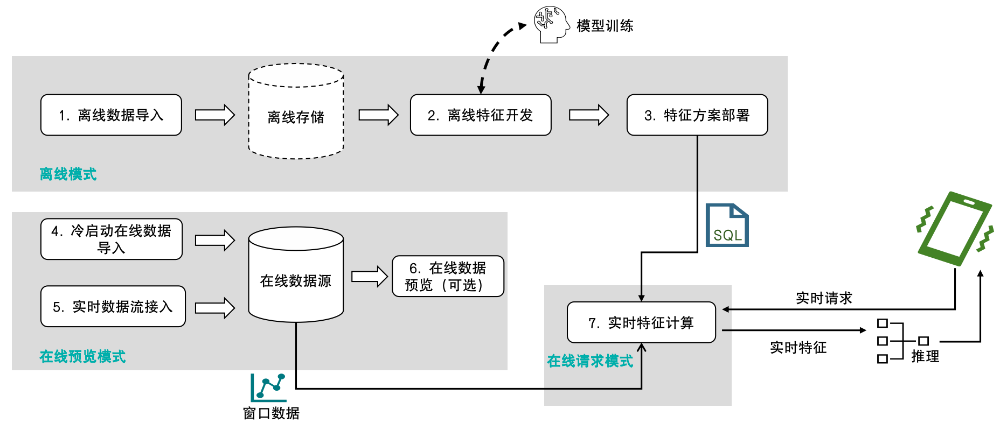

# 使用流程和执行模式

针对特征工程开发全流程，OpenMLDB 在流程不同阶段支持不同的执行模式。本文将介绍使用 OpenMLDB 进行特征工程开发和上线的流程，以及详细介绍流程中不同的执行模式。

## 使用流程概览

下图为使用 OpenMLDB 进行特征工程的开发和上线的典型流程以及流程中使用的执行模式：

1. 离线数据导入：导入离线数据用于离线特征工程开发和调试。
2. 离线特征开发：开发特征工程脚本，调试到效果满意为止。在这个步骤里会涉及机器学习模型的联合调试（比如 XGBoost、LightGBM 等），但本文内容主要集中于与 OpenMLDB 相关的特征工程开发。
3. 特征方案部署：得到满意的特征脚本以后，部署上线。
4. 冷启动在线数据导入：在正式上线之前需要导入在线存储引擎必需的窗口内数据。例如，特征方案是对于过去三个月内的数据做特征聚合计算，那么冷启动就需要导入之前三个月的数据。
5. 实时数据接入：系统上线以后，随着时间推移，需要汇入最新数据来维持窗口计算逻辑，因此需要接入实时数据。
6. 在线数据预览（可选）：通过支持的 SQL 命令进行线上数据的预览检查，该步骤非必需。
7. 实时特征计算：方案部署且数据正确接入后，会得到一个可以响应在线请求的实时特征计算服务。

## 执行模式概览

由于离线和线上场景的操作数据对象不同，其底层的存储和计算节点亦不同。因此，OpenMLDB 内置了几种不同的执行模式来支持完成以上步骤。以下表格总结了各个步骤所使用的执行模式以及开发工具，后面将会详细介绍三种执行模式。

| **步骤**                | **执行模式** | **开发工具**                                                 |
| ----------------------- | ------------ | ------------------------------------------------------------ |
| 1. 离线数据导入         | 离线模式     | OpenMLDB CLI、SDKs                                           |
| 2. 离线特征开发         | 离线模式     | OpenMLDB CLI、SDKs                                           |
| 3. 特征方案部署         | 离线模式     | OpenMLDB CLI、SDKs                                           |
| 4. 冷启动在线数据导入   | 在线预览模式 | OpenMLDB CLI、SDKs、[数据导入工具](https://openmldb.ai/docs/zh/main/tutorial/data_import.html) |
| 5. 实时数据接入         | 在线预览模式 | connectors、SDKs                                             |
| 6. 在线数据预览（可选） | 在线预览模式 | OpenMLDB CLI、SDKs、[数据导出工具](https://openmldb.ai/docs/zh/main/tutorial/data_export.html) |
| 7. 实时特征计算         | 在线请求模式 | CLI (REST APIs)、SDKs                                        |

### 离线模式

OpenMLDB CLI 启动以后的**默认模式为离线模式**。离线数据导入、离线特征开发、特征方案部署上线均在离线模式下执行。离线模式的作用是对离线数据进行管理和计算。涉及的计算节点由针对特征工程优化的 [OpenMLDB Spark 发行版](./openmldbspark_distribution.md)支持，存储节点支持使用 HDFS 等常见存储系统。

离线模式有以下主要特点：

- 离线模式支持大部分 OpenMLDB 提供的 SQL 语法，包括扩展优化的 `LAST JOIN`、`WINDOW UNION` 等复杂 SQL 语法。
- 离线模式中，部分 SQL 命令以异步方式执行，如：`LOAD DATA`、`SELECT` 以及 `SELECT INTO` 命令。其他 SQL 命令均为同步执行。
- 异步执行的 SQL 由内部的 TaskManager 进行管理，可以通过 `SHOW JOBS`、`SHOW JOB`、`STOP JOB` 命令进行查看和管理。

:::{tip}
和很多关系型数据库系统不同，`SELECT` 命令在离线模式下默认为异步执行，如需设置为同步执行，参考[设置离线模式下命令的同步执行](../openmldb_sql/ddl/SET_STATEMENT.md#id4)。在离线特征开发阶段，如果使用异步执行，强烈建议使用 `SELECT INTO` 语句进行开发调试，可以将结果导出到文件，方便查看。
:::

用于特征方案部署的命令 `DEPLOY` 也在离线模式下执行。其规范可以参阅 [OpenMLDB SQL 上线规范和要求](../openmldb_sql/deployment_manage/ONLINE_REQUEST_REQUIREMENTS.md)。

离线模式设置命令 (OpenMLDB CLI)：`SET @@execute_mode='offline'`

### 在线预览模式

冷启动在线数据导入、实时数据接入、以及在线数据预览在在线预览模式下执行。在线预览模式的作用是对线上数据进行管理和预览。线上数据的存储和计算由 tablet 组件支持。

在线预览模式有以下主要特点：

- 在线数据导入 (`LOAD DATA`)，可以选择本地 (load_mode='local') 或者集群 (load_mode='cluster') 导入。本地导入为同步执行，集群导入为异步执行（和离线模式下一样）。其他操作均为同步执行。
- 在线预览模式主要用于有限数据的预览，在 OpenMLDB CLI 或者 SDKs 执行 SELECT 直接查看数据可能出现数据截断；如果数据量较大，建议使用[导出工具](https://openmldb.ai/docs/zh/main/tutorial/data_export.html)查看完整数据。
- 在线预览模式的 SELECT 语句目前不支持 `LAST JOIN` 和 `ORDER BY` 等较复杂的查询，参考 [`SELECT`](https://openmldb.ai/docs/zh/main/openmldb_sql/dql/SELECT_STATEMENT.html)。
- 在线预览模式服务端均为单线程执行 SQL，对于大数据处理，会比较慢，有可能会触发超时，可以通过在客户端配置 `--request_timeout` 来提高超时时间。
- 为了防止影响线上服务，在线预览模式控制了最大访问的条数和不同key的个数，可以通过`--max_traverse_cnt` 和 `--max_traverse_key_cnt` 来设置；
同时，通过 `--scan_max_bytes_size` 来限制结果的大小。详细配置可参考[配置文件](../deploy/conf.md)。

在线预览模式设置命令 (OpenMLDB CLI)：`SET @@execute_mode='online'`

### 在线请求模式

在部署特征脚本以及接入线上数据以后，实时特征计算服务就已经准备就绪，可以通过在线请求模式来进行实时特征抽取。REST APIs 以及 SDK 支持在线请求模式。在线请求模式是 OpenMLDB 特有的支撑线上实时计算的模式，和常见数据库的 SQL 查询非常不同。

在线请求模式需要三个输入：

- SQL 特征脚本，即为特征部署上线过程中所使用的 SQL 脚本，规定了做特征抽取的计算逻辑。
- 在线数据，即为冷启动导入或者实时接入的线上数据。一般为配合 SQL 的窗口计算的最新数据。比如 SQL 脚本的聚合函数会定义一个最近三个月的时间窗口，那么在线存储就需要保留相应的最新三个月数据。
- 实时请求行（a request row），包含了当前正在发生的实时行为，用于实时特征抽取。比如反欺诈场景下的刷卡信息，或者是推荐场景下的搜索关键字等。

基于上述输入，对于每一个实时请求行，在线请求模式都会返回一条特征抽取的结果。其计算逻辑为：请求行会依据 SQL 脚本的逻辑（如 `PARTITION BY`、`ORDER BY` 等）被虚拟地插入在线数据表格的正确位置中，然后只针对该行进行特征聚合计算，返回唯一对应的抽取结果。下图直观地解释了在线请求模式的运算过程。

在线请求模式通过以下方式支持：

- OpenMLDB CLI：不支持
- [REST API](../sdk/rest_api.md)：支持单行或者多行 request rows 的请求
- [Java SDK](../sdk/java_sdk.md)：支持单行或者多行 request rows 的请求
- [Python SDK](../sdk/python_sdk.md)：仅支持单行的 request row 请求
- [C++ SDK](../sdk/cxx_sdk.md)：仅支持单行的 request row 请求
