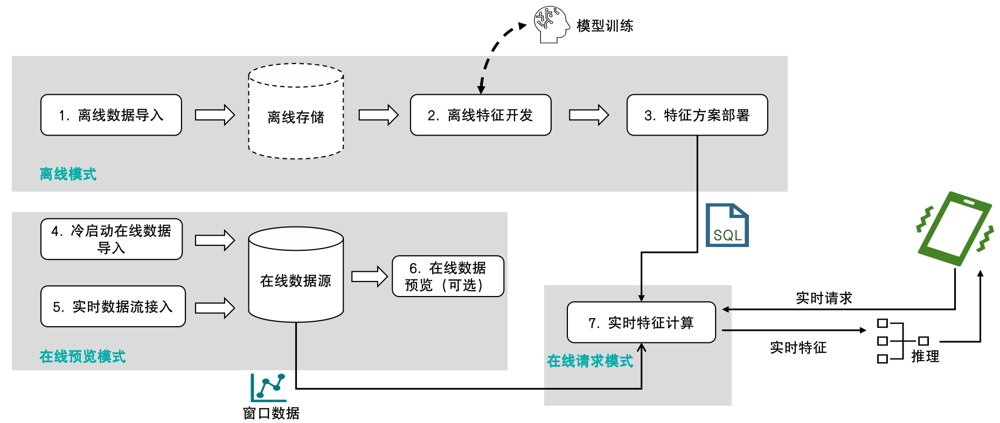
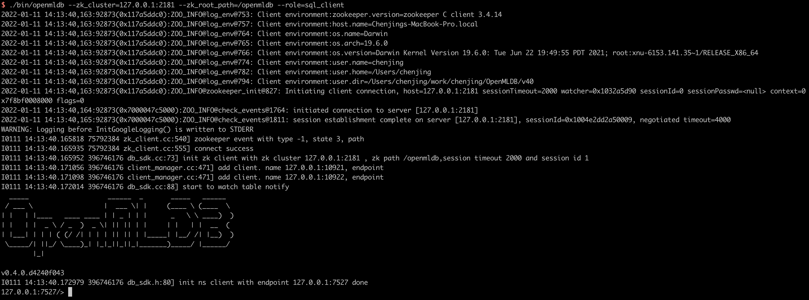
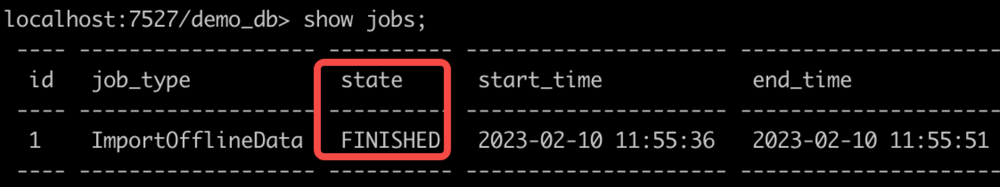

# 快速上手

## 基本概念

OpenMLDB 的主要使用场景为作为机器学习的实时特征平台。其基本使用流程如下图所示：



可以看到，OpenMLDB 会覆盖机器学习的特征计算环节，从离线开发到线上实时请求服务的完整流程。可以参考文档[使用流程和执行模式](concepts/modes.md)来详细了解。本文将按照基本使用流程，逐步演示一个快速上手和了解 OpenMLDB 的例子。

## 准备

本文基于 OpenMLDB CLI 进行开发和部署，首先需要下载样例数据并且启动 OpenMLDB CLI。推荐使用 Docker 镜像来快速体验（注意，由于 Docker 在 macOS 上的一些已知问题，本文的示例程序在 macOS 下可能会碰到无法顺利完成运行的问题。建议在 **Linux 或者 Windows** 下运行）。

- Docker 版本：>= 18.03

### 拉取镜像

在命令行执行以下命令拉取 OpenMLDB 镜像，并启动 Docker 容器：

```bash
docker run -it 4pdosc/openmldb:0.8.1 bash
```

```{note}
成功启动容器以后，本教程中的后续命令默认均在容器内执行。如果你需要从容器外访问容器内的 OpenMLDB 服务端，请参考 [CLI/SDK-容器 onebox 文档](../reference/ip_tips.md#clisdk-容器onebox)。
```

### 下载样例数据

在容器中执行以下命令，下载后续流程中使用的样例数据（**0.7.0 及之后的版本可跳过此步**，数据已经存放在镜像内）：

```bash
curl https://openmldb.ai/demo/data.parquet --output /work/taxi-trip/data/data.parquet
```

### 启动服务端和客户端

启动 OpenMLDB 服务端：

```bash
/work/init.sh
```

启动 OpenMLDB CLI 客户端：

```bash
/work/openmldb/bin/openmldb --zk_cluster=127.0.0.1:2181 --zk_root_path=/openmldb --role=sql_client
```

成功启动 OpenMLDB CLI 后如下图显示：



## 使用流程

参照核心概念，使用 OpenMLDB 的流程一般包含：建立数据库和表、导入离线数据、离线特征计算、SQL 方案上线、导入在线数据、在线实时特征计算六个步骤。

```{note}
以下演示的命令如无特别说明，默认均在 OpenMLDB CLI 下执行。
```

### 步骤 1：创建数据库和表

创建数据库 `demo_db` 和表 `demo_table1`：

```sql
-- OpenMLDB CLI
CREATE DATABASE demo_db;
USE demo_db;
CREATE TABLE demo_table1(c1 string, c2 int, c3 bigint, c4 float, c5 double, c6 timestamp, c7 date);
```

### 步骤 2：导入离线数据

切换到离线执行模式，导入样例数据作为离线数据，用于离线特征计算。

```sql
-- OpenMLDB CLI
USE demo_db;
SET @@execute_mode='offline';
LOAD DATA INFILE 'file:///work/taxi-trip/data/data.parquet' INTO TABLE demo_table1 options(format='parquet', mode='append');
```

注意，`LOAD DATA` 命令默认为异步命令，可以通过以下命令来查看任务运行状态和详细日志：

- 显示已提交的任务列表：SHOW JOBS
- 显示任务的详细信息：SHOW JOB job_id（job_id 可已通过 SHOW JOBS 命令显示）
- 显示任务运行日志：SHOW JOBLOG job_id

这里使用 `SHOW JOBS` 查看任务状态，请等待任务运行成功（ `state` 转至 `FINISHED` 状态），再进行下面步骤。


任务完成以后，如果希望预览数据，可以在同步模式`SET @@sync_job=true`下 `SELECT * FROM demo_table1` 语句。但它有一定的限制，详情见[离线命令同步模式](./function_boundary.md#离线命令同步模式)。

默认的异步模式下，`SELECT * FROM demo_table1`会提交一个异步任务，结果会保存在 Spark 任务的日志文件中，查看较不方便。如果TaskManager为local，可以`SHOW JOBLOG <id>`查看stdout中的查询打印结果。

最可靠的方式是，可以使用 `SELECT INTO` 命令，将数据导出到指定目录，或直接查看导入后的存储地址。

```{note}
OpenMLDB 也支持链接形式的软拷贝来导入离线数据，无需数据硬拷贝。可以参考 [LOAD DATA INFILE 文档](../openmldb_sql/dml/LOAD_DATA_STATEMENT.md) 的参数 `deep_copy` 的说明。
```

### 步骤 3：离线特征计算

假设我们已经确定好用于特征计算的 SQL 脚本（`SELECT` 语句），使用以下命令进行离线特征计算：

```sql
-- OpenMLDB CLI
USE demo_db;
SET @@execute_mode='offline';
SET @@sync_job=false;
SELECT c1, c2, sum(c3) OVER w1 AS w1_c3_sum FROM demo_table1 WINDOW w1 AS (PARTITION BY demo_table1.c1 ORDER BY demo_table1.c6 ROWS BETWEEN 2 PRECEDING AND CURRENT ROW) INTO OUTFILE '/tmp/feature_data' OPTIONS(mode='overwrite');
```
`SELECT INTO` 为异步任务，使用命令 `SHOW JOBS` 查看任务运行状态，请等待任务运行成功（ `state` 转至 `FINISHED` 状态），再进行下一步操作 。

注意：

- 和导入数据命令（`LOAD DATA`）类似，`SELECT` 命令在离线模式下默认也是异步执行
- `SELECT` 语句用于执行 SQL 进行特征抽取，并且将生成的特征存储在 `OUTFILE` 参数指定的目录 `feature_data` 中，供后续的机器学习模型训练使用。

### 步骤 4：SQL 方案上线

切换到在线预览模式，将探索好的 SQL 方案部署到线上，这里的的 SQL 方案命名为 `demo_data_service`。其用于特征抽取的在线 SQL 需要与对应的离线特征计算的 SQL 保持一致。

```sql
-- OpenMLDB CLI
SET @@execute_mode='online';
USE demo_db;
DEPLOY demo_data_service SELECT c1, c2, sum(c3) OVER w1 AS w1_c3_sum FROM demo_table1 WINDOW w1 AS (PARTITION BY demo_table1.c1 ORDER BY demo_table1.c6 ROWS BETWEEN 2 PRECEDING AND CURRENT ROW);
```

上线后可以通过命令 `SHOW DEPLOYMENTS` 查看已部署的 SQL 方案。

### 步骤 5：导入在线数据

在线预览模式下，导入之前下载的样例数据作为在线数据，用于在线特征计算。

```sql
-- OpenMLDB CLI
USE demo_db;
SET @@execute_mode='online';
LOAD DATA INFILE 'file:///work/taxi-trip/data/data.parquet' INTO TABLE demo_table1 options(format='parquet', header=true, mode='append');
```

`LOAD DATA` 默认是异步命令，通过 `SHOW JOBS` 等离线任务管理命令来查看运行进度，请等待任务运行成功（ `state` 转至 `FINISHED` 状态），再进行下面步骤。

等待任务完成以后，可以预览在线数据：

```sql
-- OpenMLDB CLI
USE demo_db;
SET @@execute_mode='online';
SELECT * FROM demo_table1 LIMIT 10;
```

注意，目前要求成功完成 SQL 上线部署后，才能导入在线数据；如果先导入在线数据，会导致部署出错。

```{note}
本篇教程在数据导入以后，略过了实时数据接入的步骤。在实际场景中，由于现实时间的推移，需要将最新的实时数据更新到在线数据库。具体可以通过 OpenMLDB SDK 或者在线数据源 connector 实现（如 Kafka、Pulsar 等）。
```

### 步骤 6：实时特征计算

至此，基于 OpenMLDB CLI 的开发部署工作已经全部完成了，接下去可以在实时请求模式下进行实时特征计算请求。首先退出 OpenMLDB CLI，回到操作系统的命令行。

```sql
-- OpenMLDB CLI
quit;
```

按照默认的部署配置，APIServer 部署的 http 端口为 9080。实时线上服务可以通过如下 Web API 提供服务：

```bash
http://127.0.0.1:9080/dbs/demo_db/deployments/demo_data_service
        \___________/      \____/              \_____________/
              |               |                        |
        APIServer地址     Database名字            Deployment名字
```

实时请求接受 JSON 格式的输入数据。以下将给出两个例子：把一行数据放到请求的 `input` 域中。

**示例 1：**

```bash
curl http://127.0.0.1:9080/dbs/demo_db/deployments/demo_data_service -X POST -d'{"input": [["aaa", 11, 22, 1.2, 1.3, 1635247427000, "2021-05-20"]]}'
```

查询预期的返回结果（计算得到的特征被存放在 `data` 域）：

```json
{"code":0,"msg":"ok","data":{"data":[["aaa",11,22]]}}
```

**示例 2：**

```bash
curl http://127.0.0.1:9080/dbs/demo_db/deployments/demo_data_service -X POST -d'{"input": [["aaa", 11, 22, 1.2, 1.3, 1637000000000, "2021-11-16"]]}'
```

查询预期返回结果：

```json
{"code":0,"msg":"ok","data":{"data":[["aaa",11,66]]}}
```

### 实时特征计算的结果说明

在线实时请求的 SQL 执行，与批处理模式不同。请求模式只会对请求行（a request row）的数据进行 SQL 计算。在前面的示例中，就是 POST 的 input 作为请求行。其具体过程为，假设这行数据存在于表 `demo_table1` 中，并对它执行如下的特征计算 SQL：

```sql
SELECT c1, c2, sum(c3) OVER w1 AS w1_c3_sum FROM demo_table1 WINDOW w1 AS (PARTITION BY demo_table1.c1 ORDER BY demo_table1.c6 ROWS BETWEEN 2 PRECEDING AND CURRENT ROW);
```

**示例 1 的计算逻辑**：

1. 根据请求行与窗口的 `PARTITION BY` 分区，筛选出 c1 列为 “aaa” 的行，并按 c6 列从小到大排序。所以理论上，分区排序后的中间数据表，如下表所示。其中，请求行是排序后的第一行。

      ```sql
      ----- ---- ---- ---------- ----------- --------------- ------------
      c1    c2   c3   c4         c5          c6              c7
      ----- ---- ---- ---------- ----------- --------------- ------------
      aaa   11   22   1.2        1.3         1635247427000   2021-05-20
      aaa   11   22   1.200000   11.300000   1636097290000   1970-01-01
      aaa   12   22   2.200000   12.300000   1636097890000   1970-01-01
      ----- ---- ---- ---------- ----------- --------------- ------------
      ```

2. 窗口范围是 `2 PRECEDING AND CURRENT ROW`，所以在上表中截取出真正的窗口，请求行就是最小的一行，往前 2 行都不存在，但窗口包含当前行，因此，窗口只有请求行这一行。
3. 窗口聚合，对窗口内的数据（仅一行）进行 c3 列求和，得到 22。于是输出结果为：

      ```sql
      ----- ---- ----------- 
      c1    c2   w1_c3_sum   
      ----- ---- -----------
      aaa   11      22
      ----- ---- -----------
      ```

**示例 2 的计算逻辑**：

1. 根据请求行与窗口的 `PARTITION BY` 分区，筛选出 c1 列为 “aaa” 的行，并按 c6 列从小到大排序。所以理论上，分区排序后的中间数据表，如下表所示。其中，请求行是排序后的最后一行。

      ```sql
      ----- ---- ---- ---------- ----------- --------------- ------------
      c1    c2   c3   c4         c5          c6              c7
      ----- ---- ---- ---------- ----------- --------------- ------------
      aaa   11   22   1.200000   11.300000   1636097290000   1970-01-01
      aaa   12   22   2.200000   12.300000   1636097890000   1970-01-01
      aaa   11   22   1.2        1.3         1637000000000   2021-11-16
      ----- ---- ---- ---------- ----------- --------------- ------------
      ```

2. 窗口范围是 `2 PRECEDING AND CURRENT ROW`，所以在上表中截取出真正的窗口，请求行往前 2 行都存在，同时也包含当前行，因此，窗口内有三行数据。
3. 窗口聚合，对窗口内的数据（三行）进行 c3 列求和，得到 22 + 22 + 22 = 66。于是输出结果为：

      ```sql
      ----- ---- ----------- 
      c1    c2   w1_c3_sum   
      ----- ---- -----------
      aaa   11      66
      ----- ---- -----------
      ```
