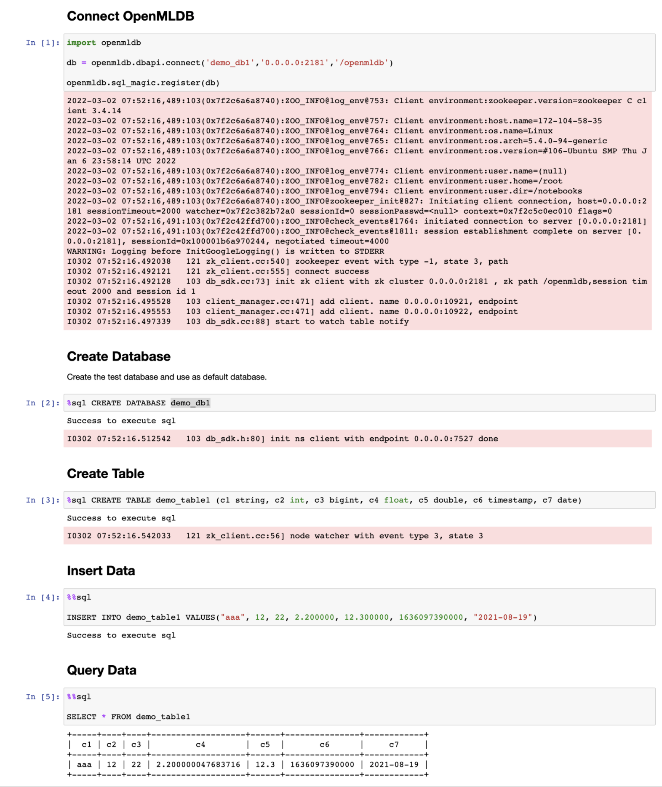

# Python SDK

## 安装 OpenMLDB Python 包

执行以下命令安装 OpenMLDB Python 包：

```Bash
pip install openmldb
```

## 使用 OpenMLDB DBAPI

本节演示 OpenMLDB DBAPI 的基本使用。

### 创建连接

参数 db_name 必须存在，需在创建连接前创建数据库。或者先创建无数据库的连接，再通过 `execute("USE <db>")` 命令设置使用数据库 `db`。

```Python
import openmldb.dbapi
#连接集群版 OpenMLDB
db = openmldb.dbapi.connect(zk="$zkcluster", zkPath="$zkpath")

#连接单机版 OpenMLDB
db = openmldb.dbapi.connect(host="$host", port="$port")

cursor = db.cursor()
```

#### Option 详解

连接集群版 `zk` 和 `zkPath` 参数必需。

连接单机版 `host` 和 `port` 参数必需。

```{note}
通过 OpenMLDB DBAPI/URL 启动 Python 客户端均可使用 Python SDK，可选配置项与 JAVA 客户端的配置项基本一致，请参考 [JAVA SDK Option详解](./java_sdk#sdk-option详解)。
```

### 创建数据库

创建数据库 `db1`：

```Python
cursor.execute("CREATE DATABASE db1")
cursor.execute("USE db1")
```

### 创建表

创建表 `t1`：

```Python
cursor.execute("CREATE TABLE t1 (col1 bigint, col2 date, col3 string, col4 string, col5 int, index(key=col3, ts=col1))")
```

### 插入数据到表中

插入一条数据到表中：

```Python
cursor.execute("INSERT INTO t1 VALUES(1000, '2020-12-25', 'guangdon', 'shenzhen', 1)")
```

### 执行 SQL 查询

```Python
result = cursor.execute("SELECT * FROM t1")
print(result.fetchone())
print(result.fetchmany(10))
print(result.fetchall())
```

### SQL 批请求式查询

```Python
#Batch Request 模式，接口入参依次为“SQL”, “Common_Columns”, “Request_Columns”
result = cursor.batch_row_request("SELECT * FROM t1", ["col1","col2"], ({"col1": 2000, "col2": '2020-12-22', "col3": 'fujian', "col4":'xiamen', "col5": 2}))
print(result.fetchone())
```

### 删除表

删除表 `t1`：

```Python
cursor.execute("DROP TABLE t1")
```

### 删除数据库

删除数据库 `db1`：

```Python
cursor.execute("DROP DATABASE db1")
```

### 关闭连接

```Python
cursor.close()
```

## 使用 OpenMLDB SQLAlchemy

本节演示 OpenMLDB SQLAlchemy 的基本使用。

### 创建连接

```
create_engine('openmldb:///db_name?zk=zkcluster&zkPath=zkpath')
```

参数 db_name 必须存在，需在创建连接前创建数据库。或者先创建无数据库的连接，再通过 `execute("USE <db>")` 命令设置使用数据库 `db`。

```Python
import sqlalchemy as db

 连接集群版OpenMLDB
engine = db.create_engine('openmldb:///?zk=127.0.0.1:2181&zkPath=/openmldb')

 连接单机版OpenMLDB
 engine = db.create_engine('openmldb:///?host=127.0.0.1&port=6527')

connection = engine.connect()
```

### 创建数据库

使用 `connection.execute()` 接口创建数据库：

```Python
try:
    connection.execute("CREATE DATABASE db1")
    connection.execute("USE db1")
except Exception as e:
    print(e)
```

### 创建表

使用 `connection.execute()` 接口创建一张表：

```Python
try:
    connection.execute("CREATE TABLE t1 ( col1 bigint, col2 date, col3 string, col4 string, col5 int, index(key=col3, ts=col1))")
except Exception as e:
    print(e)
```

### 插入数据到表中

使用 `connection.execute(ddl)` 接口执行SQL的插入语句，可以向表中插入数据：

```Python
try:
    connection.execute("INSERT INTO t1 VALUES(1000, '2020-12-25', 'guangdon', 'shenzhen', 1);")
except Exception as e:
    print(e)
```

使用 `connection.execute(ddl, data)` 接口执行带 planceholder 的 SQL 的插入语句，可以动态指定插入数据，也可插入多行：

```Python
try:
    insert = "INSERT INTO t1 VALUES(1002, '2020-12-27', ?, ?, 3);"
    connection.execute(insert, ({"col3":"fujian", "col4":"fuzhou"}))
    connection.execute(insert, [{"col3":"jiangsu", "col4":"nanjing"}, {"col3":"zhejiang", "col4":"hangzhou"}])
except Exception as e:
    print(e)
```

### 执行 SQL 批式查询

使用 `connection.execute(sql)` 接口执行 SQL 批式查询语句:

```Python
try:
    rs = connection.execute("SELECT * FROM t1")
    for row in rs:
        print(row)
    rs = connection.execute("SELECT * FROM t1 WHERE col3 = ?;", ('hefei'))
    rs = connection.execute("SELECT * FROM t1 WHERE col3 = ?;",[('hefei'), ('shanghai')])
except Exception as e:
    print(e)
```

### 执行 SQL 请求式查询

使用 `connection.execute(sql, request)` 接口执行 SQL 请求式查询，可以把输入数据放到 execute 函数的第二个参数中：

```Python
try:
    rs = connection.execute("SELECT * FROM t1", ({"col1":9999, "col2":'2020-12-27', "col3":'zhejiang', "col4":'hangzhou', "col5":100}))
except Exception as e:
    print(e)
```

### 删除表

使用 `connection.execute(ddl)` 接口删除一张表：

```Python
try:
    connection.execute("DROP TABLE t1")
except Exception as e:
    print(e)
```

### 删除数据库

使用 `connection.execute(ddl)` 接口删除一个数据库：

```Python
try:
    connection.execute("DROP DATABASE db1")
except Exception as e:
    print(e)
```

## 使用 Notebook Magic Function

OpenMLDB Python SDK 支持了 Notebook magic function 拓展，使用下面语句注册函数。

```Python
import openmldb
db = openmldb.dbapi.connect(database='demo_db',zk='0.0.0.0:2181',zkPath='/openmldb')
openmldb.sql_magic.register(db)
```

然后可以在 Notebook 中使用 line magic function `%sql` 和 block magic function `%%sql`。



## 常见问题

- 使用 SQLAlchemy 出现 `ImportError: dlopen(.._sql_router_sdk.so, 2): initializer function 0xnnnn not in mapped image for `，怎么办？

> 除了 import openmldb 外，您可能还 import 了其他第三方库，可能导致加载的顺序产生混乱。由于系统的复杂度，可以尝试使用 virtual env 环境（比如 conda），避免干扰。并且，在 import sqlalchemy 前 import openmldb，并保证这两个 import 在最前。
>
> 如果仍然无法解决，建议使用 request http 连接 apiserver 的方式连接 OpenMLDB。

- Python SDK 遇到以下问题，如何解决？

```Plain
[libprotobuf FATAL /Users/runner/work/crossbow/crossbow/vcpkg/buildtrees/protobuf/src/23fa7edd52-3ba2225d30.clean/src/google/protobuf/stubs/common.cc:87] This program was compiled against version 3.6.1 of the Protocol Buffer runtime library, which is not compatible with the installed version (3.15.8).  Contact the program author for an update. ...
```

> 该问题可能是因为别的库引入了 protobuf 的其他版本。可以尝试使用 virtual env 环境（比如 conda）.
