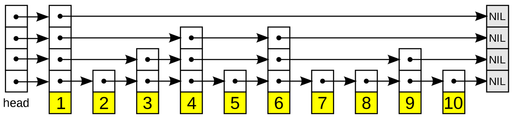
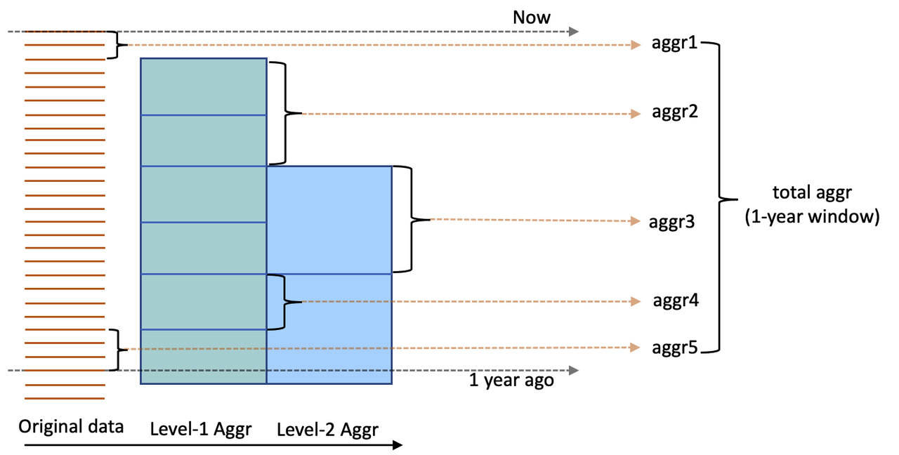
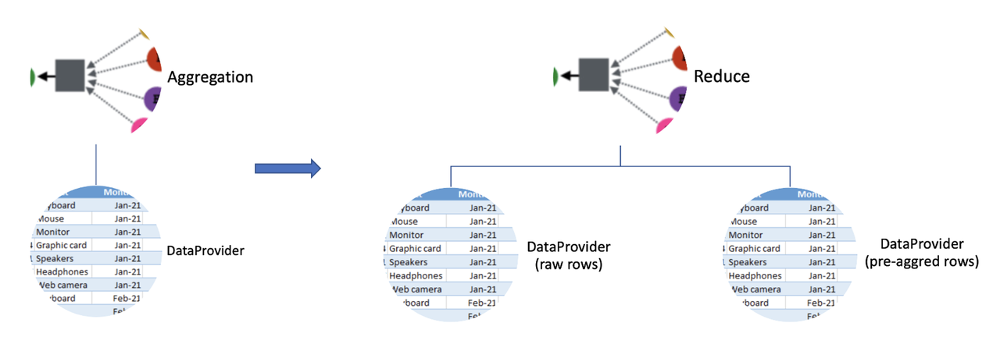
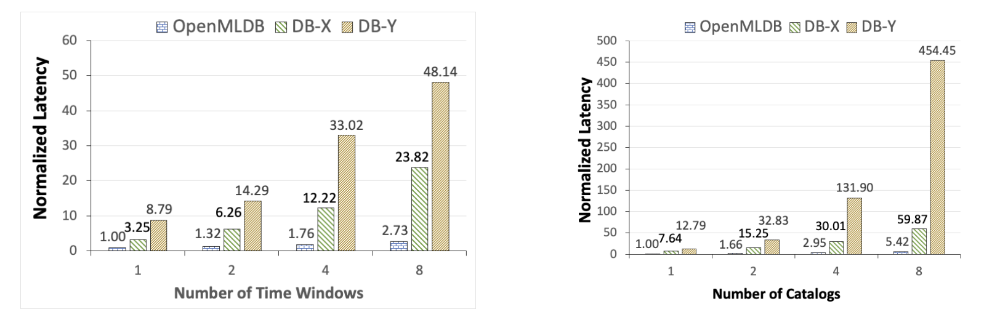
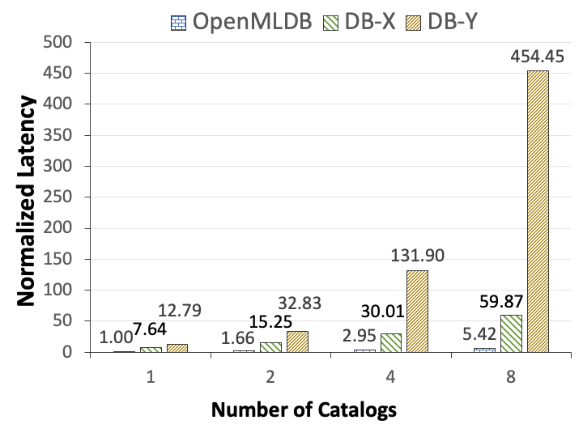

# 实时引擎核心数据结构和优化解析

[实时引擎性能测试报告（第一版）](https://openmldb.feishu.cn/wiki/wikcnZRB9VRkqgD1vDFu1F9AaTh)显示 OpenMLDB 的实时 SQL 引擎可以达到毫秒级的延迟。本篇文章将介绍 OpenMLDB 如何在实时计算中达到毫秒级延迟的核心技术架构。实时引擎包含两个关键技术：双层跳表索引（针对时序数据优化）和查询预聚合技术。本文将详细介绍这两个关键技术。

## 背景介绍

OpenMLDB 内部整合了批处理和实时两套 SQL 引擎，分别用于应对机器学习的离线开发和在线推理场景，并且保证线上线下的一致性。其中，默认基于内存的实时 SQL 引擎经过了充分的性能优化，可以达到毫秒级的计算延迟。本文将会深度解析实时引擎的内部架构和优化技术。其主要包含两个核心优化技术：

- 双层跳表结构（double-layer skip list）：专门为时序数据访存优化设计的内存索引数据结构
- 预聚合技术（pre-aggregation）：针对窗口内数据量巨大的场景下，为减少重复计算的性能优化技术

## 双层跳表索引

### 跳表

跳表 (skip list) 由 William Pugh 在 1990 年提出，其论文为：[Skip Lists: A Probabilistic Alternative to Balanced Trees](https://15721.courses.cs.cmu.edu/spring2018/papers/08-oltpindexes1/pugh-skiplists-cacm1990.pdf)。跳表采用的是概率均衡而非严格均衡策略，从而相对于平衡树，大大简化和加速了元素的插入和删除。跳表可以看做是在链表的基础数据结构上进行了扩展，通过添加多级索引，来达到快速定位查找的操作。其既有链表的灵活数据管理优势，同时对于数据查找和插入的时间复杂度均为 O(logn)。



上图 (source: [https://en.wikipedia.org/wiki/Skip_list](https://en.wikipedia.org/wiki/Skip_list)) 显示了一个具有四级索引的跳表结构。可以看到，在底层的已排序的数据上，每一个值都有一个对应的指针数组。查找某个具体值时，搜索会从顶层最稀疏的索引开始，通过索引内的向右的指针以及向下的指针数组，逐级往下查找，直到查找到所需要的值。关于跳表的操作和实现的详细解读，可以参照：[https://en.wikipedia.org/wiki/Skip_list](https://en.wikipedia.org/wiki/Skip_list)

目前，许多开源产品都采用了跳表作为其核心数据结构，来实现快速的查找和插入操作，比如：

- Redis 中的有序集合 `zset`
- LevelDB, RocksDB, HBase 中的 `Memtable`
- Apache Lucene 中的 `TermDictionary` 和 `Posting List`

### 双层跳表

在开发机器学习应用的过程中，很多特征是和时序窗口的计算相关。如反欺诈场景中需要统计一个特定卡号最近一段时间内（比如三天内）的交易总次数、平均交易金额等。在很多实时场景需求中（比如风控、反欺诈、实时推荐等），对延时会有非常高的要求，一般对于特征算的延迟要求会小于 20 毫秒。如何以毫秒级的延迟访问特定维度值一段时间内的历史数据，是这类数据库所面临的技术挑战。
为了达到高效的访问时序数据，OpenMLDB 实现了一个分布式的内存存储引擎，核心索引数据结构采用了双层跳表（double-layer skip list），其基于跳表结构做了延伸优化。如下图所示：

```{image} images/core_data_structure/2.png
:alt: double-layer skip list
:class: bg-primary
:width: 600px
:align: center
```

可以看到，这个索引结构针对每一个被索引列维护了两层的跳表：

- 第一层跳表中的 key 对应于索引列的具体值，value 是一个指针指向二级跳表下已经被聚合在一起的所有对应于 key 值的行的集合。该索引需要优化的是类似数据库中的分组操作（即 `group by`）。对应于特征工程，即为快速找到数据表中某一特定键值（比如某个用户）的所有相关记录。
- 第二层跳表的 key 一般是时间戳，value 是对应的这一行数据。数据行按照时间戳从大到小的时间降序排序。这一级的跳表优化的即是基于特定时间窗口内的聚合计算，需要高效的找到窗口内的所有数据。

按照如上的上层跳表结构，对于时间窗口的聚合计算，首先从第一层跳表定位到对应的 key，其时间复杂度为 `O(logn)`。一般情况下，计算特征的时间窗口都是从当前时间开始回溯，那么由于第二层跳表本身就是按照时间戳倒排序的，从第一个节点开始遍历指定范围的窗口数据即可。如果不是从当前时间开始回溯的时间窗口，则通过 `O(logn)` 的时间复杂度进行查找。由此可见，这种双层跳表的索引结构非常适合在特征工程中基于时间窗口的聚合操作，其典型场景下的时间复杂度近似为 `O(logn)`。

## 预聚合技术

在一些典型场景中（比如画像系统），时序特征的窗口内数据量可能很大（比如窗口的时间跨度横跨三年），我们把这种时序特征称之为“长窗口”特征。对于长窗口的特征计算，传统的实时计算模式，需要遍历所有的窗口数据，并对所有数据进行聚合计算，随着数据量增大计算时间线性增加，很难满足在线性能要求。另一方面，多次相邻特征计算，很大概率会包含重复计算（即窗口重叠），浪费了计算资源。
为了改善长窗口的性能，我们引入了预聚合技术。通过预聚合，聚合特征的部分结果，会在数据插入的时候，提前计算好；线上实时特征计算时，只需要把计算好的预聚合结果进行规约，就可以快速得到最终的聚合特征。预聚合数据相比原始数据，数据量极大地降低，可以达到毫秒级的计算延迟。
预聚合逻辑如下图所示：



基于原始数据，我们会构造多层预聚合，预聚合是基于上一层的预聚合结果进行的再次预聚合。例如第一层预聚合可以为小时级别的预聚合，第二层可以为基于第一层预聚合结果的天级别的预聚合。当我们需要计算一个长窗口特征时，如上图所示，计算最近一年的数据的聚合特征，我们可以利用已经聚合好的特征，通过累计以下所有预聚合和实时数据结果得到：

- 第二层预聚合特征 `aggr3`
- 第一层预聚合特征 `aggr2` 以及 `aggr4`
- 原始数据实时计算特征 `aggr1` 以及 `aggr5`

预聚合技术的具体实现主要分成预聚合模块和 SQL 引擎的执行计划优化。预聚合模块负责数据插入的时候触发预聚合的计算，即多层预聚合表的生成。SQL 引擎预聚合优化需要根据预聚合表的信息，对 SQL 计划进行改造，优先利用预聚合信息计算窗口聚合。如下图所示，左图显示了没有预聚合的基于原始数据的实时计算；右图显示了 SQL 执行计划被改造成了基于原始数据和预聚合数据的优化计划：



## 性能表现

关于 OpenMLDB 的具体性能表现测试，详细情况可以参考相关引用报告，以下选取最主要的几个测试场景进行陈述。

### 性能比较

由于 OpenMLDB 是一个基于内存的时序数据库，所以我们首先选取了两个广泛使用的商用级内存数据库进行比较。我们选取了典型的和时序窗口有关的特征计算脚本，通过变化查询的复杂度（时间窗口个数以及数据表格的列数），来观察三个数据库的不同性能表现（这里使用归一化以后的延迟数字）。注意，该测试场景下因为窗口内数据量级在百级别，因此并没有打开预聚合优化。

 

从上图可以看到，OpenMLDB 在典型的特征抽取负载中，对比于 DB-X，DB-Y 都有显著的性能优势。当查询更为复杂时，比如当时间窗口或者表格列数增加到 8，OpenMLDB 可以达到 1-2 个数量级的显著性能优势。

关于本实验的具体配置，数据集，以及性能比对等详细信息，可以参照这篇 VLDB 的学术论文：

- Cheng Chen, et al. [Optimizing in-memory database engine for AI-powered on-line decision augmentation using persistent memory.](http://vldb.org/pvldb/vol14/p799-chen.pdf) International Conference on Very Large Data Bases (VLDB) 2021.

### 预聚合技术的性能提升

对于窗口内数据特别多的情况，我们考察打开预聚合以后的性能提升。我们同样设计了一个典型的基于时序窗口的特征计算查询，通过变化窗口内的数据条数，来观察预聚合优化打开和关闭情况下的性能。

 

根据上图：当窗口内数据量达到百万级别的情况下，开启预聚合技术以后，其对于延迟和吞吐的改进。可以看到，如果没有预聚合技术，其延迟可能会达到秒级别，当开启预聚合以后，延迟可以降到 10 毫秒以下。对于吞吐性能也类似，开启预聚合优化以后，可以显著改进吞吐性能达到两个数量级以上。
