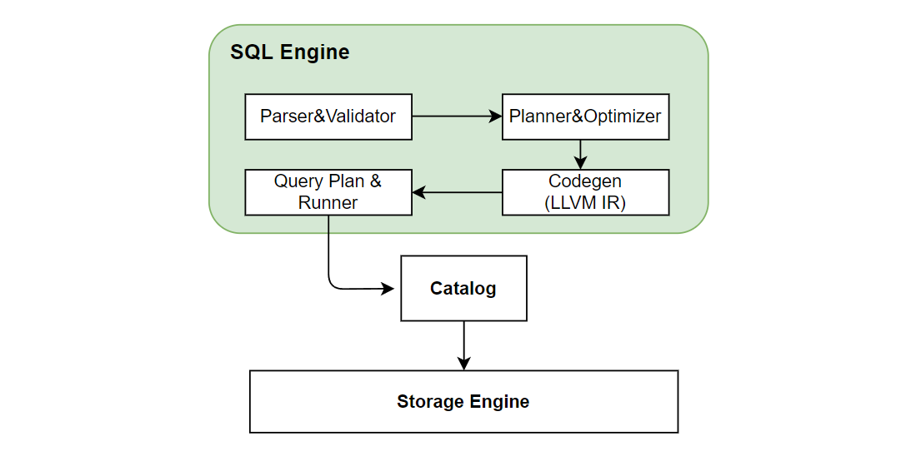
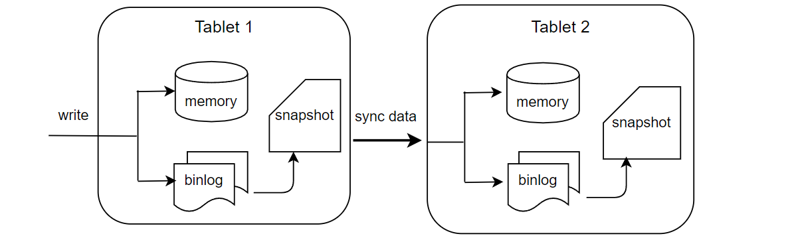

# 在线模块架构

## 1. 概览

OpenMLDB 在线架构的主要模块有 Apache ZooKeeper, nameserver 以及 tablet集群（一个tablet进一步包含了SQL engine 和 storage engine）。下图显示了这些模块之间的关系。其中 tablets 是整个 OpenMLDB 存储和计算的核心模块，也是消耗资源最多的模块。ZooKeeper 和 nameserver 主要用于辅助功能，如元数据的管理和高可用等。本文将会详细介绍各个模块的作用。

## 2. Apache ZooKeeper
OpenMLDB 依赖 ZooKeeper 做服务发现和元数据存储和管理功能。ZooKeeper 和 OpenMLDB SDK，tablets, namesever 之间都会存在交互，用于分发和更新元数据。

## 3. Nameserver
Nameserver 主要用来做 tablet 管理以及故障转移（failover）。当一个 tablet 节点宕机后，nameserver 就会触发一系列任务来执行故障转移，当节点恢复后会重新把数据加载到该节点中。同时，为了保证 nameserver 本身的高可用，nameserver 在部署时会部署多个实例，并采用primary/secondary 节点的部署模式————同一时刻只会有一个 primary 节点。多个 nameserver 通过 ZooKeeper 实现 primary 节点的抢占。因此，如果当前 primary 节点意外离线，则 secondary 节点会借助 ZooKeeper 重新选出一个 primary 节点。

## 4. Tablets
 OpenMLDB 使用Tablet模块执行SQL、存储数据。该模块是整个 OpenMLDB 功能实现的核心以及资源占用的瓶颈。从功能上看，Tablet进一步包含了 SQL engine 和 storage engine 两个模块。Tablet 也是 OpenMLDB 部署资源时可调配的最小单元。一个 tablet 不能被拆分到多个物理节点；但是一个物理节点上可以有多个 tablets。
### 4.1 SQL Engine
SQL engine 负责执行 SQL 查询计算。SQL engine 收到 SQL 查询的请求后的执行过程如下图所示：

SQL 引擎通过 [ZetaSQL](https://github.com/4paradigm/zetasql) 把 SQL 解析成AST语法树。因为我们加入了 `LAST JOIN`，`WINDOW UNION` 等专门针对特征工程设计的特殊 SQL 语法，所以对开源的 ZetaSQL 做了优化。经过如上图一系列的编译转化、优化，以及基于 LLVM 的 codegen 之后，最终生成执行计划。SQL 引擎基于执行计划，通过 catalog 获取存储层数据做最终的 SQL 执行运算。在分布式版本中，会生成分布式的执行计划，会把执行任务发到其他 tablet 节点上执行。目前 SQL 引擎采用 push 的模式，将任务分发到数据所在的节点执行，而不是将数据拉回来。这样做的好处可以减少数据传输。

### 4.2 Storage Engine

Storage engine 负责 OpenMLDB 数据的存储，以及支持相应的高可用相关的功能。
:::{note}
OpenMLDB 支持基于内存或者磁盘的两种存储引擎，本文针对自研的内存存储引擎进行介绍。磁盘存储引擎基于 RocksDB，原理上也保持一致，可以参考 [RocksDB](https://github.com/facebook/rocksdb)。
:::
#### 数据分布
OpenMLDB 集群版是一个分布式的数据库，一张表的数据会进行分片，并且建立多个副本，最终分布在不同的节点中。这里展开说明两个重要的概念：副本和分片。

- 副本（replication）：为了保证高可用以及提升分布式查询的效率，数据表将会被存放多个拷贝，这些拷贝就叫做副本。

- 分片（partition）：一张表（或者具体为一个副本）在具体存储时，会进一步被切割为多个分片用于分布式计算。分片数量可以在创建表时指定，但是一旦创建好，分片数就不能动态修改了。分片是存储引擎主从同步以及扩缩容的最小单位。一个分片可以灵活的在不同的 tablet 之间实现迁移。同时一个表的不同分片可以并行计算，提升分布式计算的性能。OpenMLDB 会自动尽量使得每一个 tablet 上的分片数目尽量平衡，以提升系统的整体性能。一张表的多个分片可能会分布在不同 tablet 上，分片的角色分为主分片（leader）和从分片（follower）。当获得计算请求时，请求将会被发送到数据对应的主分片上进行计算；从分片用于保证高可用性。

如下图显示了一个数据表，在两个副本的情况下，基于四个分片，在三个 tablets 上的存储布局。实际使用中，如果某一个或者几个 tablet 的负载过高，可以基于分片，进行数据迁移，来改善系统的负载平衡和整体的吞吐。

#### 数据持久化及主从同步
目前版本的 OpenMLDB 的在线数据全部保存在内存中，为了实现高可用会把数据通过 binlog 以及 snapshot 的形式持久化到硬盘中。

如上图所示，服务端收到 SDK 的写请求后会同时写内存和 binlog。binlog 是用来做主从同步的，数据写到 binlog 后会有一个后台线程异步的把数据从 binlog 中读出来然后同步到从节点中。从节点收到同步请求后同样进行写内存和 binlog操作。Snapshot 可以看作是内存数据的一个镜像，不过出于性能考虑，snapshot 并不是从内存 dump 出来，而是由 binlog 和上一个 snapshot 合并生成。在合并的过程中会删除掉过期的数据。OpenMLDB会记录主从同步和合并到 snapshot 中的 offset, 如果一个 binlog 文件中的数据全部被同步到从节点并且也合并到了 snapshot 中，这个 binlog 文件就会被后台线程删除。

