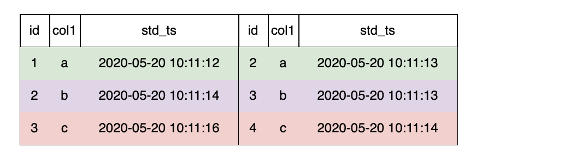

# JOIN Clause

OpenMLDB目前仅支持`LAST JOIN`一种**JoinType**。

LAST JOIN可以看作一种特殊的LEFT JOIN。在满足JOIN条件的前提下，左表的每一行拼取一条符合条件的最后一行。LAST JOIN分为无排序拼接，和排序拼接。

- 无排序拼接是指：未对右表作排序，直接拼接。
- 排序拼接是指：在先对右表排序，然后再拼接。

## Syntax

```
JoinClause
         ::= TableRef JoinType 'JOIN' TableRef [OrderClause] 'ON' Expression 
JoinType ::= 'LAST'       
```

## SQL语句模版

```sql
SELECT ... FROM table_ref LAST JOIN table_ref;
```

## 边界说明

| SELECT语句元素 | 状态            | 说明                                                         |
| :------------- | --------------- | :----------------------------------------------------------- |
| JOIN Clause    | 仅支持LAST JOIN | 表示数据来源多个表JOIN。OpenMLDB目前仅支持LAST JOIN。在Online Serving时，需要遵循[Online Serving下LAST JOIN的使用规范](../deployment_manage/ONLINE_SERVING_REQUIREMENTS.md#online-serving下last-join的使用规范) |

### LAST JOIN without ORDER BY

#### Example: **LAST JOIN无排序拼接**

```sql
-- desc: 简单拼表查询 without ORDER BY

SELECT t1.col1 as t1_col1, t2.col1 as t2_col2 from t1 LAST JOIN t2 ON t1.col1 = t2.col1
```

`LAST JOIN`无排序拼接时，拼接第一条命中的数据行


以左表第二行为例，符合条件的右表是无序的，命中条件的有2条，选择最后一条`5, b, 2020-05-20 10:11:12`


最后的拼表结果如上图所示。

### LAST JOIN with ORDER BY

#### Example: LAST JOIN排序拼接 

```SQL
-- desc: 简单拼表查询 with ORDER BY
SELECT t1.col1 as t1_col1, t2.col1 as t2_col2 from t1 LAST JOIN t2 ORDER BY ts.std_ts ON t1.col1 = t2.col1
```

`LAST JOIN`时配置 `Order By` ，则右表按Order排序，拼接最后一条命中的数据行。


以左表第二行为例，符合条件的右表有2条，按`std_ts`排序后，选择最后一条`3, b, 2020-05-20 10:11:13`



最后的拼表结果如上图所示。
