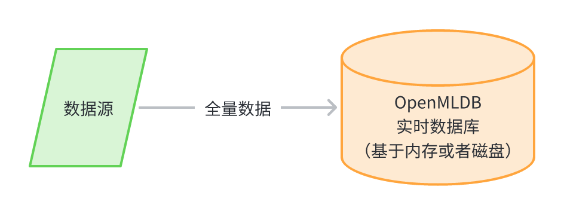
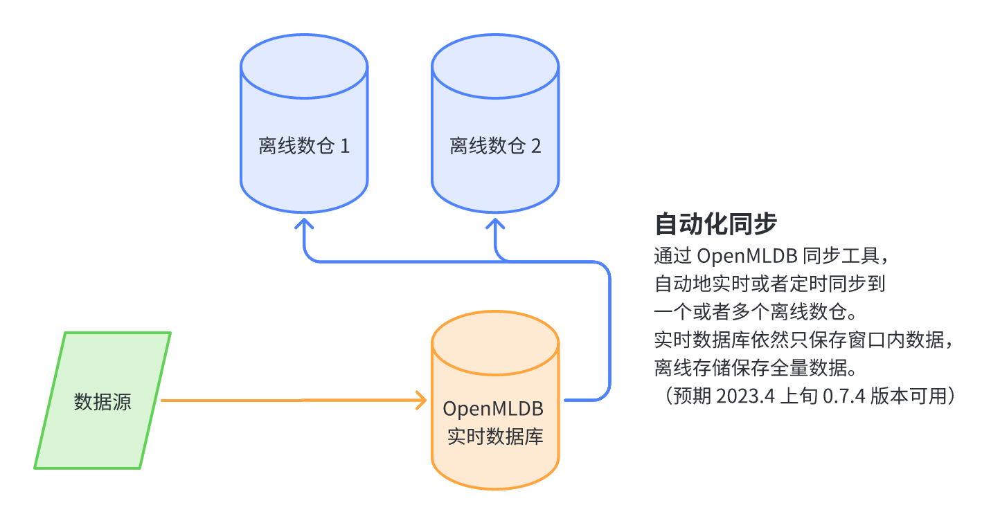
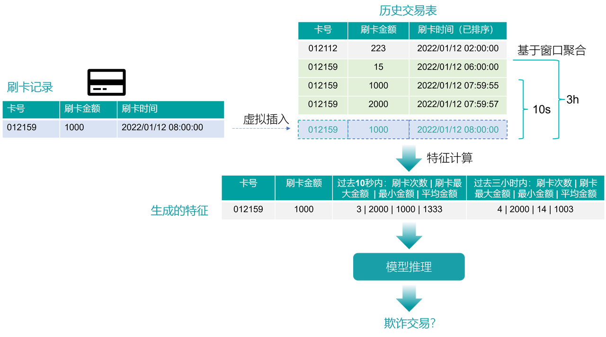

# 实时决策系统中 OpenMLDB 的常见架构整合方式

OpenMLDB 提供了一个线上线下一致性的实时特征计算平台。对于如何在实际业务系统中整合 OpenMLDB，构建完整的机器学习平台，OpenMLDB 提供了灵活的支持。本文关注基于 OpenMLDB，在企业级业务系统中使用的常见架构。我们主要关注存储和计算两个方面：

- 离在线数据存储架构：如何合理的进行离线和在线数据的存储，并维持离在线数据的一致性。
- 实时决策应用架构：如何基于 OpenMLDB 的实时请求计算模式构建线上应用，包含常见的事中决策和实时查询应用架构。

## 离在线数据的存储架构

由于不同的性能和数据量的需求，在一般情况下，OpenMLDB 的离线和在线数据在物理上是分开存储：

- **在线数据存储：** OpenMLDB 提供了一个高效的实时数据库（基于内存或者磁盘），主要目的为存储在线数据用于实时特征计算，而非全量数据。其主要特点为：
  - 针对时序数据的毫秒级访问，默认基于内存
  - 具备数据过期自动淘汰的能力（TTL），TTL 可以根据表格粒度进行设置，用于线数据库仅存放必需的时间窗口内的数据
  - 默认基于内存的存储引擎虽然性能较高，但是可能存在内存消耗量较大的问题，可以在满足性能要求的前提下使用基于磁盘的存储引擎
- **离线数仓**：OpenMLDB 本身并不提供独立的离线存储引擎，可以灵活支持不同的离线数仓和架构形式。

以下讨论常见的离线和在线数据的存储架构。

### 全量数据存储于实时数据库（不推荐）



用户可以选择把全量数据存储于 OpenMLDB 的实时数据库，此种使用方式带来的优势是使用简单，并且物理上仅有一份数据，也节省了管理维护成本。但此种方式在实际使用中较少使用，主要有以下潜在问题：

- 全量数据一般较大，而 OpenMLDB 为了保证线上性能，默认使用了基于内存的存储引擎，基于内存存储全量数据会带来较大的硬件成本负担。
- OpenMLDB 虽然也提供了基于磁盘的存储引擎，但是磁盘存储会带来 3-7x 左右的性能下降，可能无法满足某些在线业务场景需求。
- 离线和在线数据存储于同一个物理介质，可能会对线上实时计算的性能和稳定性带来较大的负面影响。

因此在实际中，为了充分发挥 OpenMLDB 的实时计算能力，我们并不推荐存储全量数据在 OpenMLDB，而是和离线数仓配合使用。

### 离在线数据存储分离管理架构


目前在实际使用场景中，大部分用户基于此种离在线存储分离管理的架构。基于此种架构，数据会同时写入到离线数仓和实时数据库。OpenMLDB 的实时数据库会设置表格级别的数据过期（TTL）。此种设置会对应于所需要的特征脚本内的时间窗口的大小，即实时数据库只存储用于实时特征计算的必要的数据，而非全量数据。相关注意点：

- 实际企业架构中，数据源一般基于 Kafka 等消息队列的订阅机制。不同的应用会去分别消费数据。在此种架构下，写入到 OpenMLDB 的实时数据库的通路，以及存储到离线数仓的通路，可以认为是两个独立的消费者。
- 如果并非基于消息队列的订阅机制，也可以认为在 OpenMLDB 上游有一个或者多个数据接收程序，用于实现和管理 OpenMLDB 的在线存储以及离线存储。
- OpenMLDB 实时数据库的过期时间需要正确的被设置，使得实时数据库内存储的数据可以被用于正确的实时特征计算。
- 此种架构的主要缺点是管理稍复杂，从用户视角看到了离线和在线两份数据需要本单独管理。

### 离在线数据存储统一视图架构（预期 v0.7.4 支持）


我们预期会在 0.7.4 版本推出一个自动化的从实时数据库到离线数仓的同步机制。在此种架构下，虽然在物理上我们依然有实时数据库和离线数仓两个存储引擎，但是在用户视角上，可以仅关注一个写入通路。用户只需要将新的数据写入 OpenMLDB 实时数据库，设置好实时到离线的同步机制，OpenMLDB 即可以自动化地将数据实时或者定时地同步到一个或者多个离线数仓。OpenMLDB 的实时数据库依然依靠数据过期机制仅保存用于线上特征计算的数据，而离线数仓会保留所有全量数据。该功能预期在 2023 年 4 月上旬的 0.7.4 版本会加入。

## 实时决策应用架构

### 实时请求计算模式

在了解实时决策应用架构前，需要先了解 OpenMLDB 线上实时计算引擎提供的基于请求的实时计算模式，其主要包含三个步骤：

1. 客户端通过 REST APIs 或者 OpenMLDB SDKs 发送计算请求（request），该请求可选带有当前事件的状态信息数据，比如当前刷卡事件的刷卡金额、商铺 ID 等。
2. OpenMLDB 实时引擎接受该请求，根据已经部署上线的特征计算逻辑，进行按需（on-demand）的实时特征计算
3. OpenMLDB 将实时计算结果返回给发起请求的客户端，完成本次实时计算请求

本文将从实际应用场景出发，阐述基于 OpenMLDB 的实时请求计算模式的常见应用搭建架构。我们会介绍两种常见的应用架构。

### 事中决策应用架构

OpenMLDB 的默认计算模式为支持事中决策的应用，其字面意义即为在事件发生过程中的决策行为。因此其主要特点为，**当前事件产生的行为数据也会被纳入决策考量中**。其最典型的例子即为信用卡反欺诈：当一笔信用卡交易发生时，反欺诈系统会在交易真正落实之前进行决策，同时把当前的刷卡行为数据（比如当前刷卡的金额、时间、地点等），连同近期一段时间窗口内的数据进行一起考量决策。该架构在反欺诈、风控等领域被广泛采用。

我们来看一个具体的例子。下图显示了当一个刷卡交易发生时，整个系统发生的功能逻辑。可以看到，系统中维护了历史交易记录，当一个新的交易行为发生时，当前的行为数据会被**虚拟插入表格中**，连同近期的交易记录一起，做特征计算，再给到模型推理，最后判断是否为欺诈交易。



注意，上图中显示了新来的刷卡记录数据被**虚拟插入**到历史交易表，这是因为在 OpenMLDB 的请求模式中，系统默认就会把请求所带的事中数据虚拟地插入到表格中，参与到整体特征计算中（如果特殊情况下不需要当前请求行信息参与决策，可以使用 EXCLUDE CURRENT_ROW 关键字，详见 “附录：EXCLUDE CURRENT_ROW 语义解释”）。同时，在普遍情况下，当前请求行对于后续的决策也是有用的，因此其在完成当前的特征计算以后，应该被真正的物理插入到数据库。为了构建一个如上业务流程的事中决策系统，我们下面列举一个典型的架构流程图。


该架构基于 OpenMLDB SDK，做到了严格的事中决策，该流程包含两个阶段：

1. 上图中的步骤1、2、3，实际构成了一次 OpenMLDB 的实时请求，并且本次请求附带了本次事件发生时候的必需的数据（卡号、刷卡金额、时间戳）。
2. 完成实时请求以后，客户端通过 OpenMLDB SDK 额外发起了一次数据插入请求，把当前的交易行为数据插入到 OpenMLDB，以供后续的实时请求计算使用。

以上基于 OpenMLDB SDK 的严格事中决策架构，是 OpenMLDB 默认并且所推荐的架构。在实际的企业应用架构中，由于外围耦合架构或者内部权限的复杂性，也会存在一些变种。比如，数据写入的通路被完全分离开来，使用 Kafka 或者其他方式进行单独的数据写入。但是，该架构如果没有做额外的强制性保障，可能会存在读写顺序上的问题，从而导致窗口内数据重复或者缺少计算。因此，一般情况下，我们还是推荐使用上图的严格的事中决策架构。

### 实时查询应用架构

在一些推荐类应用场景中，往往需要在某一个时间点做一次实时计算的查询，该查询本身不带有具备意义的数据。比如当用户进行商品浏览时，需要在用户打开浏览器时，实时查询过去十分钟内平台上符合该用户兴趣的最热门的商品数据，进行商品排序推荐。在此类场景下，用户的请求和相关物料数据的写入可以完全解耦开，同时用户的请求并不带有具备意义的数据，仅仅是为了触发一次实时计算请求，可以使用 SQL 关键字 `EXCLUDE CURRENT_ROW` 达到该目的。


可以看到，在上面的架构中，实时请求（只读）和数据的写入通路被解耦开。

- 对于数据写入通路，用户可以通过流式（比如 Kafka connector）或者 OpenMLDB SDK 的方式，将相关物料数据不断的写入到 OpenMLDB 的数据库内
- 对于实时请求部分，主要有两个特点：
  - 请求完成以后不再需要额外的步骤写入实时数据（相关数据由数据写入通路完成，请求本身不带有具备意义的数据）
  - 由于 OpenMLDB 默认的请求计算行为会进行虚拟的数据插入，但是在这种架构下，实时请求所带的数据不再具备意义。因此，我们需要使用扩展的 SQL 关键字 `EXCLUDE CURRENT_ROW`，来达到该目的。

### 其他扩展架构

除了上面介绍的两种架构，OpenMLDB 也可以扩展为支持离线特征线上查询架构，以及支持流式特征等架构。我们将在后续的文章中逐步介绍其他实际中应用到的企业级架构。

## 附录：EXCLUDE CURRENT_ROW 说明

OpenMLDB 的请求模式默认会把当前数据行虚拟插入到表格，一起参与窗口计算。如果不需要当前行的数据参与计算，可以使用 `EXCLUDE CURRENT_ROW` 。该语法把当前请求行的数据排除在窗口计算以外，但是请求行提供的 `PARTITION BY KEY` 和 `ORDER BY KEY` 依然需要被使用，用于定位请求的具体数据和时间窗口。

以下使用一个具体例子来说明其语义。假设其用于存储交易记录的数据表格 `txn` 的 schema 如下。

| **Column** | card_id | amout  | txn_time  |
| ---------- | ------- | ------ | --------- |
| **Type**   | string  | double | timestamp |

我们使用如下加上了 `EXCLUDE CURRENT_ROW` 的SQL：

```SQL
SELECT card_id, sum(amount) OVER (w1) AS w1_amount_sum FROM txn 
    WINDOW w1 AS (PARTITION BY card_id ORDER BY txn_time 
    ROWS BETWEEN 2 PRECEDING AND CURRENT ROW EXCLUDE CURRENT_ROW);
```

该语句定义了一个以 `card_id` 为 key，根据 `txn_time` 进行排序，并且基于当前请求行往前包括两行的一个窗口；同时，因为定义了 `EXCLUDE CURRENT_ROW`，当前请求行实际不进入窗口进行计算。

简化期间，我们假设该表格仅存在以下两条数据：

```SQL
 --------- ----------- --------------- 
  card_id   amount      txn_time       
 --------- ----------- --------------- 
  aaa       22.000000   1636097890000  
  aaa       20.000000   1636097290000  
 --------- ----------- --------------- 
```

我们发送实时计算请求，其中包含的请求数据为：

| **Column** | card_id            | amount                     | txn_time             |
| ---------- | ------------------ | -------------------------- | -------------------- |
| **Value**  | aaa                | 23.0                       | 1637000000000        |
| 说明       | 用于定位窗口的 key | 该列信息实际不进入窗口计算 | 用于定位窗口的时间戳 |

如果不使用 `EXCLUDE CURRENT_ROW`，则当前请求行，以及数据库里已经包含的两行均会进入窗口中，参与实时计算，其返回结果为 "aaa, 65.0"。但是，由于其部署的 SQL 中带有 `EXCLUDE CURRENT_ROW`，则当前行不进入窗口计算，所以其返回值实际为 "aaa, 42.0"。注意，虽然当前行的值 `amount` 并不进入窗口进行计算，但是其 `card_id` （用于标记分类的 key），以及 `txn_time` （用于标记时间戳信息），依然需要被正确设置，用于寻找正确的窗口数据。