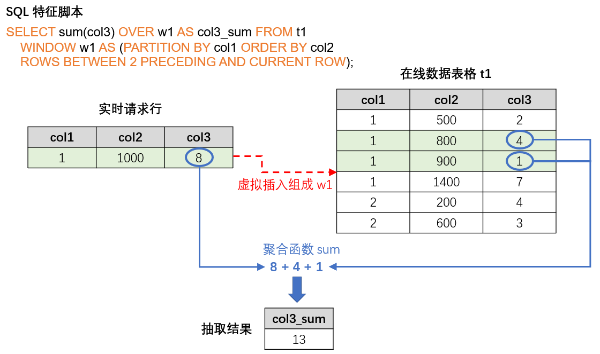

# 集群版使用流程及执行模式

OpenMLDB 针对线上线下的特征工程全流程，在不同阶段提供了不同的执行模式。尤其在生产环境下所使用的集群版，针对不同阶段详细地划分了不同的执行模式。本文集中说明在集群版 OpenMLDB 中，从特征开发到上线的全流程，及其相应的执行模式。

## 1. OpenMLDB 使用流程概览

### 1.1 特征工程开发上线全流程

以下为使用OpenMLDB进行特征工程的开发和上线的典型流程：

1. 离线数据导入：导入离线数据用于离线特征工程开发和调试。
2. 离线开发：开发特征工程脚本，调试到效果满意为止。注意在这个步骤里会牵涉到机器学习模型的联合调试（比如 XGBoost, LightGBM 等），本篇文章内容主要集中于与 OpenMLDB 相关的特征工程开发。
3. 特征方案部署：得到满意的特征脚本以后，部署上线。
4. 冷启动在线数据导入：在正式上线之前需要导入在线存储引擎的必需的窗口内数据。比如特征方案是对于过去三个月内的数据做特征聚合计算，那么冷启动就需要导入之前三个月的数据。
4. 实时数据接入：系统上线以后，随着时间推移，需要汇入最新数据来维持窗口计算逻辑，因此需要进行实时数据接入。
5. 在线数据预览（可选）：可以通过支持的 SQL 命令进行线上数据的预览检查。
6. 实时请求服务：方案部署且数据正确接入后，即得到一个可以响应在线请求的实时特征计算服务。

### 1.2 集群版执行模式概览

由于离线和线上场景的操作数据对象不同，其底层的存储和计算节点亦不同。因此，OpenMLDB 设置了几种不同的执行模式来支持完成以上步骤。以下表格总结了各个步骤所使用的执行模式，稍后将会详细介绍关于执行模式的重要概念。

| 步骤                    | 执行模式   | 开发工具                                  | 说明                                                                                                            |
| ----------------------- |--------|---------------------------------------|---------------------------------------------------------------------------------------------------------------|
| 1. 离线数据导入         | 离线模式   | CLI                                   | - `LOAD DATA` command                                                                                    |
| 2. 离线特征开发         | 离线模式   | CLI                                   | - 支持 OpenMLDB 所有的 SQL 语法 - 部分 SQL （如 `SELECT`）非阻塞式异步运行方式                                                 |
| 3. 特征方案部署         | 离线模式   | CLI                                   | - `DEPLOY` 命令                                                                                                 |
| 4. 冷启动在线数据导入   | 在线预览模式 | CLI，导入工具                              | - CLI 使用 `LOAD DATA` 命令 - 也可使用独立导入工具 `openmldb-import`                                                   |
| 5. 实时数据接入         | 在线预览模式 | connector, REST APIs, Java/Python SDK | - 第三方数据源调用 OpenMLDB 的相关数据插入 API(connector)，引入实时数据 - 或使用Java/Python SDK工具，在对请求行的计算完成后，插入主表                 |
| 6. 在线数据预览（可选） | 在线预览模式 | CLI, Java/Python SDK                  | - 目前不支持 `LAST JOIN`, `ORDER BY` |
| 7. 实时特征计算         | 在线请求模式 | REST APIs, Java/Python SDK            | - 支持 OpenMLDB 所有的 SQL 语法 - REST APIs 以及 Java SDK 支持单行或者批请求 - Python SDK 仅支持单行请求                     |

从以上的总结表格上可以看到，执行模式分为 `离线模式`，`在线预览模式`，以及`在线请求模式`。后续我们将对这几种模式展开详细介绍。下图总结示意了全流程开发和对应的执行模式。

### 1.3 单机版执行模式说明

虽然本文集中讲解集群版，但是有必要也简单介绍单机版的执行模式。单机版的执行模式相对简单，其离线数据和在线数据的存储和计算节点统一，因此单机版并不区分离线模式和在线模式。即我们可以直观的理解为，在 CLI 下，单机版并没有执行模式的概念，绝大多数OpenMLDB支持的 SQL 语法均可以在 CLI 下直接运行（对于部分SQL命令的参数，单机版支持的选项与集群版略有不同，详见[OpenMLDB支持的SQL](../openmldb_sql)）。因此，单机版特别适合用于快速试用或进行 SQL 实践。但是，在实时特征计算阶段，单机版和集群版一样，依然运行于在线请求模式下。

:::{note}
如果仅在非生产环境试用 OpenMLDB或进行SQL学习实践，强烈建议使用单机版，可以获得更快捷方便的部署体验
:::

## 2. 离线模式

如前所述，集群版的离线数据导入、离线特征开发、特征方案部署上线均在离线模式下执行。离线模式的作用是对离线数据进行管理和计算。涉及的计算节点由[针对特征工程优化的 OpenMLDB Spark 发行版](./openmldbspark_distribution.md)支持，存储节点支持使用 HDFS 等常见存储系统。

离线模式有以下主要特点：

- 离线模式支持所有 OpenMLDB 提供的 SQL 语法，包括扩展优化的 `LAST JOIN`, `WINDOW UNION` 等复杂 SQL 语法。
- 离线模式中，部分 SQL 命令以基于非阻塞式的异步方式执行，包括 `LOAD DATA`, `SELECT`, 以及`SELECT INTO` 命令。
- 非阻塞式执行的 SQL 由内部的 TaskManager 进行管理，可以通过 `SHOW JOBS`, `SHOW JOB`, `STOP JOB` 命令进行查看和管理。

:::{tip}
和很多关系型数据库系统不同，`SELECT`命令在离线模式下默认为异步执行，如需设置为同步执行，见[设置离线模式下命令的同步执行](../openmldb_sql/ddl/SET_STATEMENT.md#id4)因此在离线特征开发阶段，如果使用异步执行，强烈建议使用`SELECT INTO`语句进行开发调试，可以将结果导出到文件，方便查看。
:::

用于特征方案部署的命令`DEPLOY`亦在离线模式下执行。其部署规范对于 SQL 还有一定的限制，详细可以参阅 [OpenMLDB SQL上线规范和要求](../openmldb_sql/deployment_manage/ONLINE_REQUEST_REQUIREMENTS.md)。

离线模式可以通过以下方式设置：

- CLI： `SET @@execute_mode='offline'`；CLI 启动以后的默认模式也为离线模式。
- REST APIs, Java/Python SDK：不支持离线模式

## 3. 在线预览模式

冷启动在线数据导入、实时数据接入、以及在线数据预览在在线预览模式下执行。在线预览模式的作用是对线上数据进行管理和预览。线上数据的存储和计算由 tablet支持。

在线预览模式有以下主要特点：

- 在线数据导入（`LOAD DATA`），可以选择本地（load_mode='local'）或者集群（load_mode='cluster'）导入。本地导入为同步执行，集群导入为非阻塞式的异步执行（和离线模式下一样）。其他操作均为同步执行。
- 在线预览模式目前不支持`Last Join`和`Order By`。
- 在线模式服务端均为单线程执行SQL，对于大数据处理，会比较慢，有可能会触发超时，可以通过在客户端配置`--request_timeout`来提高超时时间。
- 为了防止影响线上服务，在线预览模式控制了最大访问的条数和pk个数，可以通过`--max_traverse_cnt`和`--max_traverse_pk_cnt`来设置；
同时，通过`--scan_max_bytes_size`来限制结果的大小。详细配置可参考[配置文件](../deploy/conf.md)。

在线预览模式通过以下形式进行设置：

- CLI： `SET @@execute_mode='online'`
- REST APIs, Java/Python SDK：默认只支持在线模式下执行，无需进行设置。

## 4. 在线请求模式

在部署特征脚本以及接入线上数据以后，实时特征计算服务就已经准备就绪，可以通过在线请求模式来进行实时特征抽取。REST APIs 以及 SDK 支持在线请求模式。在线请求模式是 OpenMLDB 特有的支撑线上实时计算的模式，和常见数据库的 SQL 查询非常不同。

在线请求模式需要三个输入：

- SQL 特征脚本，即为特征部署上线过程中所使用的 SQL 脚本，规定了做特征抽取的计算逻辑。
- 在线数据，即为冷启动导入或者实时接入的线上数据。一般为配合 SQL 的窗口计算的最新数据。比如 SQL 脚本的聚合函数会定义一个最近三个月的时间窗口，那么在线存储就需要保留相应的最新三个月数据。
- 实时请求行（a request row），包含了当前正在发生的实时行为，用于实时特征抽取。比如反欺诈场景下的刷卡信息，或者是推荐场景下的搜索关键字等。

基于上述输入，对于每一个实时请求行，在线请求模式都会返回一条特征抽取的结果。其计算逻辑为：请求行会依据 SQL 脚本的逻辑（如 `PARTITION BY`, `ORDER BY` 等）被虚拟地插入在线数据表格的正确位置中，然后只针对该行进行特征聚合计算，返回唯一对应的抽取结果。下图直观地解释了在线请求模式的运算过程。

在线请求模式通过以下形式支持：

- CLI：不支持
- REST APIs：支持单行或者多行 request rows 的请求，详见：[REST APIs](../quickstart/rest_api.md)
- Java SDK：支持单行或者多行 request rows 的请求，详见：[Java SDK 快速上手](../quickstart/java_sdk.md)
- Python SDK：仅支持单行的 request row 请求，详见：[Python SDK 快速上手](../quickstart/python_sdk.md)
