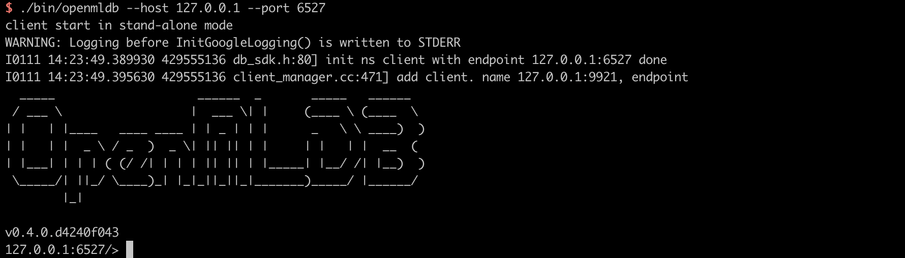

# 单机版使用流程

## 准备

本文基于 OpenMLDB CLI 进行开发和部署，首先需要下载样例数据并且启动 OpenMLDB CLI。推荐使用准备好的 Docker 镜像来快速体验。

- Docker（最低版本：18.03）

### 拉取镜像

执行以下命令拉取 OpenMLDB 镜像，并启动 Docker 容器：

```bash
docker run -it 4pdosc/openmldb:0.8.2 bash
```

成功启动容器以后，本教程中的后续命令默认均在容器内执行。

如果你需要从容器外访问容器内的 OpenMLDB 服务端，请参考 [CLI/SDK-容器 onebox](../reference/ip_tips.md#clisdk-容器onebox)。

### 下载样例数据

执行以下命令下载后续流程中使用的样例数据：

```bash
curl https://openmldb.ai/demo/data.csv --output /work/taxi-trip/data/data.csv
```

### 启动服务端和客户端

- 启动单机版 OpenMLDB 服务端

```SQL
./init.sh standalone
```

- 启动单机版 OpenMLDB CLI 客户端

```SQL
cd taxi-trip
/work/openmldb/bin/openmldb --host 127.0.0.1 --port 6527
```

下图显示了以上 docker 内命令正确执行以及 OpenMLDB CLI 成功启动以后的画面：



## 使用流程

单机版 OpenMLDB 的工作流程一般包含：建立数据库和表、数据准备、离线特征计算、SQL 方案上线、在线实时特征计算五个阶段。

以下演示的命令如无特别说明，默认均集群版 OpenMLDB CLI 下执行）。

### 1. 创建数据库和表

```sql
CREATE DATABASE demo_db;
USE demo_db;
CREATE TABLE demo_table1(c1 string, c2 int, c3 bigint, c4 float, c5 double, c6 timestamp, c7 date);
```

### 2. 数据准备

导入之前下载的样例数据作为训练数据，用于离线和在线特征计算。

注意，单机版中一张表的数据没有离线在线隔离，所以该表将同时用于离线和在线特征计算。你也可以手动为离线和在线导入不同的数据，即导入两张表。为简化起见，本教程的单机版使用了同一份数据做离线和在线计算。

执行以下命令导入数据：

```sql

LOAD DATA INFILE 'data/data.csv' INTO TABLE demo_table1;

```

预览数据：

```sql

SELECT * FROM demo_table1 LIMIT 10;

 ----- ---- ---- ---------- ----------- --------------- ------------

  c1    c2   c3   c4         c5          c6              c7

 ----- ---- ---- ---------- ----------- --------------- ------------

  aaa   12   22   2.200000   12.300000   1636097390000   2021-08-19

  aaa   11   22   1.200000   11.300000   1636097290000   2021-07-20

  dd    18   22   8.200000   18.300000   1636097990000   2021-06-20

  aa    13   22   3.200000   13.300000   1636097490000   2021-05-20

  cc    17   22   7.200000   17.300000   1636097890000   2021-05-26

  ff    20   22   9.200000   19.300000   1636098000000   2021-01-10

  bb    16   22   6.200000   16.300000   1636097790000   2021-05-20

  bb    15   22   5.200000   15.300000   1636097690000   2021-03-21

  bb    14   22   4.200000   14.300000   1636097590000   2021-09-23

  ee    19   22   9.200000   19.300000   1636097000000   2021-01-10

 ----- ---- ---- ---------- ----------- --------------- ------------

```

### 3. 离线特征计算

执行 SQL进行特征抽取，并且将生成的特征存储在一个文件中，供后续的模型训练使用。

```sql

SELECT c1, c2, sum(c3) OVER w1 AS w1_c3_sum FROM demo_table1 WINDOW w1 AS (PARTITION BY demo_table1.c1 ORDER BY demo_table1.c6 ROWS BETWEEN 2 PRECEDING AND CURRENT ROW) INTO OUTFILE '/tmp/feature.csv';

```

### 4. SQL 方案上线

将探索好的 SQL 方案部署到线上，注意部署上线的 SQL 方案需要与对应的离线特征计算的 SQL 方案保持一致。

```sql
DEPLOY demo_data_service SELECT c1, c2, sum(c3) OVER w1 AS w1_c3_sum FROM demo_table1 WINDOW w1 AS (PARTITION BY demo_table1.c1 ORDER BY demo_table1.c6 ROWS BETWEEN 2 PRECEDING AND CURRENT ROW);
```

上线后可以通过命令 `SHOW DEPLOYMENTS` 查看已部署的 SQL 方案；

```sql
SHOW DEPLOYMENTS;

 --------- -------------------

  DB        Deployment

 --------- -------------------

  demo_db   demo_data_service

 --------- -------------------

1 row in set

```

```{note}

本教程的单机版使用了同一份数据做离线和在线特征计算。如果用户希望使用另一份数据集，需要在部署之前导入新的数据集，并在部署中使用新数据集的表。

```

### 5. 退出 CLI

```sql
quit;
```

至此已经完成了全部基于 OpenMLDB CLI 的开发部署工作，并且已经回到了操作系统命令行下。

### 6. 实时特征计算

实时线上服务可以通过如下 Web API 提供服务：

```bash

http://127.0.0.1:8080/dbs/demo_db/deployments/demo_data_service

​        ___________/      ____/              _____________/

​              |               |                        |

​        APIServer地址     Database名字            Deployment名字

```

实时请求接受 JSON 格式的输入数据。以下将给出一个例子：把一行数据放到请求的 `input` 域中。

```bash

curl http://127.0.0.1:8080/dbs/demo_db/deployments/demo_data_service -X POST -d'{"input": [["aaa", 11, 22, 1.2, 1.3, 1635247427000, "2021-05-20"]]}'

```

如下为该查询预期的返回结果（计算得到的特征被存放在 `data` 域）：

```json

{"code":0,"msg":"ok","data":{"data":[["aaa",11,22]]}}

```

说明：

- api server 执行请求，可以支持批请求，通过 `input` 字段支持数组。每行 input 单独进行 request 计算。详细参数格式请参考 [REST API](../quickstart/sdk/rest_api.md)。

- request 结果说明请参考[实时特征计算的结果说明](../quickstart/openmldb_quickstart.md#实时特征计算的结果说明)。