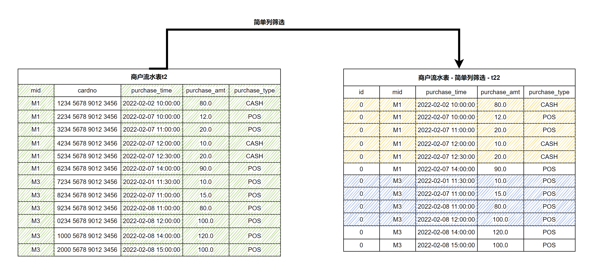
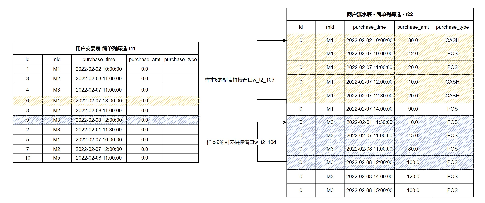

# 基于 SQL 的特征开发（下）

## 1. 准备知识

在[深入浅出特征工程 -- 基于 OpenMLDB 的实践指南（上）](https://zhuanlan.zhihu.com/p/467625760)中，我们介绍了特征工程的基础概念、实践工具，以及基于单表的特征脚本开发。本文将基于主表和副表，详细介绍更加复杂和强大的基于多表的特征脚本开发。同时，我们依然依托 OpenMLDB 所提供的 SQL 语法进行特征工程脚本示例，关于 OpenMLDB 的更多信息可以访问 [OpenMLDB 的 GitHub repo](https://github.com/4paradigm/OpenMLDB)，以及 [文档网站](https://openmldb.ai/docs/zh/main/)。

如果你想运行本篇教程中的 SQL，请按照以下两个步骤做准备：

- 推荐使用 OpenMLDB docker 镜像在**单机版**下运行本教程，运行方式参考 [OpenMLDB 快速上手](../quickstart/openmldb_quickstart.md)。如果使用集群版，请使用离线模式（`SET @@execute_mode='offline'` ）。集群版 CLI 仅支持离线模式和在线预览模式。而在线预览模式仅支持简单的数据预览功能，因此无法运行教程中大部分的 SQL。
- 本教程相关的所有数据以及导入操作脚本可以在 [这里下载](https://openmldb.ai/download/tutorial_sql/tutoral_sql_data.zip)。

本文将用到主表和副表进行举例说明。样例数据是上篇使用的反欺诈交易数据集，包含一张主表：用户交易表（t1）和一张副表：商户流水表（t2）。
在关系型数据库设计中，为了避免数据冗余以及保证数据一致性，一般都会按照一定的设计原则（数据库设计范式），把数据存入多个数据表中。在特征工程中，为了获得足够的有效信息，需要在多个表中取出数据，因此需要基于多表进行特征工程。

**主表：用户交易表 t1**

| Field      | Type      | Description             |
| ---------- | --------- |-------------------------|
| id         | BIGINT    | 样本ID,每一条样本拥有唯一ID        |
| uid        | STRING    | 用户ID                    |
| mid        | STRING    | 商户ID                    |
| cardno     | STRING    | 卡号                      |
| trans_time | TIMESTAMP | 交易时间                    |
| trans_amt  | DOUBLE    | 交易金额                    |
| trans_type | STRING    | 交易类型                    |
| province   | STRING    | 省份                      |
| city       | STRING    | 城市                      |
| label      | BOOL      | 样本label， `true`或`false` |

**副表：商户流水表 t2**

| Field         | Type      | Description            |
| ------------- | --------- | ---------------------- |
| mid           | STRING    | 商户ID                 |
| card          | STRING    | 卡号                   |
| purchase_time | TIMESTAMP | 消费时间               |
| purchase_amt  | DOUBLE    | 消费金额               |
| purchase_type | STRING    | 消费类型：现金、信用卡 |

在传统关系数据库中，为了取得多表的信息，最常用的方式是使用 join 进行拼接。 但是数据库的 join 并不能非常高效的满足特征工程的需求。 最主要的原因是我们的主表样本表有一个用于模型训练的 label 列，其每一个值只能对应一行数据记录。我们希望在 join 以后，结果表格的行数和主表的行数保持一致。

## 2. 副表单行特征

## 2.1 LAST JOIN

OpenMLDB 目前支持`LAST JOIN`来进行类似数据库的 join 操作。LAST JOIN 可以看作一种特殊的 LEFT JOIN。在满足 JOIN 条件的前提下，左表的每一行拼取右表符合条件的最后一行。LAST JOIN分为无序拼接和有序拼接。
用简单的表为例，假设表 s1，s2 的 schema 均为

```sql
(id int, col1 string, std_ts timestamp)
```

那么，可以进行如下JOIN操作：

```sql
SELECT * FROM s1 LAST JOIN s2 ORDER BY s2.std_ts ON s1.col1 = s2.col1;
```

如下图，`LAST JOIN`时配置 `ORDER BY`，则右表按 `std_ts` 排序，拼接最后一条命中的数据行。以左表第二行为例，符合条件的右表有 2 条，按`std_ts`排序后，选择最后一条`3, b, 2020-05-20 10:11:13` 。


## 3. 副表多行聚合特征

OpenMLDB 针对副表拼接场景，扩展了标准的 WINDOW 语法，新增了 [WINDOW UNION](../openmldb_sql/dql/WINDOW_CLAUSE.md#1window--union) 的特性，支持从副表拼接多条数据形成副表窗口。在副表拼接窗口的基础上，可以方便构建副表多行聚合特征。同样地，构造副表多行聚合特征也需要完成两个步骤：

- 步骤一：定义副表拼接窗口。
- 步骤二：在副表拼接窗口上构造副表多行聚合特征。

### 3.1 步骤一： 定义副表拼接窗口

主表的每一个样本行都可以从副表中按某列拼接多行数据，并允许定义拼接数据的时间区间或者条数区间。我们通过特殊的窗口语法 WINDOW UNION 来定义副表拼接条件和区间范围。为了便于理解，我们将这种窗口称之为**副表拼接窗口**。

副表拼接窗口的语法定义为：

```sql
window window_name as (UNION other_table PARTITION BY key_col ORDER BY order_col ROWS_RANGE｜ROWS BETWEEN StartFrameBound AND EndFrameBound)
```

其中，不可或缺的语法元素包括：

- `UNION other_table`： `other_table` 是指进行 WINDOW UNION 的副表。 主表和副表需要保持schema一致。大部分情况下，主表和副表的schema都是不同的。因此，我们可以通过对主表和副表进行列筛选和默认列配置来保证参与窗口计算的主表和副表schema一致。列筛选还可以去掉无用列，只在关键列上做 WINDOW UNION 和聚合。

- `PARTITION BY key_col`: 表示按列 `key_col` 从副表拼接匹配数据。

- `ORDER BY order_col`: 表示副表拼接数据集按照`order_col`列进行排序。

- `ROWS_RANGE BETWEEN StartFrameBound AND EndFrameBound`: 表示副表拼接窗口的时间区间

  - `StartFrameBound`表示该时间窗口的上界。

    - `UNBOUNDED PRECEDING`：无上界。
    - `time_expression PRECEDING`：如果是时间区间，可以定义时间偏移，如`30d preceding`表示窗口上界为当前行的时间的前30天。

  - `EndFrameBound`表示该时间窗口的下界。

    - `CURRENT ROW`：当前行。
    - `time_expression PRECEDING`：如果是时间区间，可以定义时间偏移，如`1d PRECEDING`。这表示窗口下界为当前行的时间的前1天。

- `ROWS BETWEEN StartFrameBound AND EndFrameBound`: 表示副表拼接窗口的条数区间

  - `StartFrameBound`表示该窗口的上界。

    - `UNBOUNDED PRECEDING`：无上界。
    - `number PRECEDING`：如果是条数区间，可以定义条数。如，`100 PRECEDING`表示窗口上界为的当前行的前100行。

  - `EndFrameBound`表示该窗口的下界。

    - `CURRENT ROW`： 当前行
    - `number PRECEDING`：如果是条数窗口，可以定义条数。如，`1 PRECEDING`表示窗口上界为的当前行的前1行。
    

```{note}
- 配置窗口区间界时，请注意:
  - OpenMLDB 目前无法支持当前行以后的时间作为上界和下界。如`1d FOLLOWING`。换言之，我们只能处理历史时间窗口。这也基本满足大部分的特征工程的应用场景。
  - OpenMLDB 的下界时间必须>=上界时间
  - OpenMLDB 的下界的条数必须<=上界条数
- `INSTANCE_NOT_IN_WINDOW`：表示主表除了当前行以外，其他数据不进入窗口。
- 更多语法和特性可以参考 [OpenMLDB窗口UNION参考手册](../openmldb_sql/dql/WINDOW_CLAUSE.md)。

```

#### 示例

以下通过具体例子来展示 WINDOW UNION 的定义方式。

对于上文的用户交易表 t1，我们需要定义在商户流水表 t2 的副表上拼接窗口，该拼接基于 `mid` 进行。
由于 t1 和 t2 的schema不同，所以我们首先分别从 t1 和 t2 抽取相同的列，对于在某个表中不存在的列，可以配置缺省值。
其中，`mid` 列用于两个表的拼接，所以是必须的； 其次，作为时间戳的列（t1 中的 `trans_time`，t2 中的 `purchase_time`）包含时序信息， 在定义时间窗口时候也是必须的；其余列按照聚合函数需要，进行必要的筛选保留。

以下 SQL 和示意图展示了从 t1 抽取必要列，生成 t11的方法。

```sql
(select id, mid, trans_time as purchase_time, 0.0 as purchase_amt, "" as purchase_type from t1) as t11
```


以下 SQL 和示意图展示了从 t2 抽取必要列，生成 t22。

```sql
(select 0L as id, mid, purchase_time, purchase_amt, purchase_type from t2) as t22
```



可以看到，抽取以后生成的表格 t11 和 t22，已经具有了相同的 schema，两者可以进行逻辑上的 UNION 操作。但是在 OpenMLDB 中，WINDOW UNION 并不是真的为了进行传统数据库中的 UNION 操作，而是为了对于 t11 中的每一个样本行，去构建副表 t22 上的时间窗口。
我们按照商户ID `mid` ，对 t11 中的每一行数据，从 t22 中获取对应的拼接数据，然后按消费时间(`purchase_time`) 排序，构造副表拼接窗口。 比如定义一个 `w_t2_10d` 的窗口：不包含主表除了当前行以外的数据行，加上副表通过 `mid` 拼接上的十天以内的数据，示意图如下所示。 可以看到，黄色和蓝色阴影部分，分别定义了样本 6 和样本 9 的副表拼接窗口。



该窗口定义的 SQL 脚本如下所示（注意，这还不是一个完整的 SQL）：

```sql
(SELECT id, mid, trans_time as purchase_time, 0.0 as purchase_amt, "" as purchage_type FROM t1) as t11
window w_t2_10d as (
UNION (SELECT 0L as id, mid, purchase_time, purchase_amt, purchase_type FROM t2) as t22 
PARTITION BY mid ORDER BY purchase_time
ROWS_RANGE BETWEEN 10d PRECEDING AND 1 PRECEDING INSTANCE_NOT_IN_WINDOW)
```

### 3.2 步骤二：构建副表多行聚合特征

对于副表拼接窗口进行多行聚合函数加工，构造多行副表聚合特征，使得最后生成的行数和主表相同。以简单聚合函数为例，我们可以构造样本的副表拼接特征：商户的最近10天的零售总额`w10d_merchant_purchase_amt_sum`，商户的最近10天消费总次数`w10d_merchant_purchase_count`。以下 SQL 基于 [3.1](#31-步骤一-定义副表拼接窗口) 中所定义的副表拼接窗口，构建多行聚合特征。

```sql
SELECT 
id, 
-- 样本商户最近10天零售总额
sum(purchase_amt) over w_t2_10d as w10d_merchant_purchase_amt_sum,
-- 样本商户最近10天交易次数
count(purchase_amt) over w_t2_10d as w10d_merchant_purchase_count 
FROM   
(SELECT id, mid, trans_time as purchase_time, 0.0 as purchase_amt, "" as purchase_type FROM t1) as t11
window w_t2_10d as (
UNION (SELECT 0L as id, mid, purchase_time, purchase_amt, purchase_type FROM t2) as t22 
PARTITION BY mid ORDER BY purchase_time
ROWS_RANGE BETWEEN 10d PRECEDING AND 1 PRECEDING INSTANCE_NOT_IN_WINDOW)
```

## 4. 特征组构建

一般而言，一个完整特征抽取脚本将抽取几十、上百，甚至几百个特征。我们可以根据特征类型、特征关联的表和窗口将这些特征分成若干组，然后将每一组特征放置到不同的SQL子查询里； 最后将这些子查询按主表ID拼接在一起。本节，我们将接着前面的例子，演示如何将各种特征拼接在一起形成一个特征大宽表。

首先，我们将特征分成3组：

| 特征组 | 特征组描述                                                   |
| ------ | ------------------------------------------------------------ |
| 1      | 样本用户（主表）和样本商户（副表）单行特征                   |
| 2      | 样本用户（主表）最近30天窗口聚合特征以及最近用户7天窗口聚合特征 |
| 3      | 样本商户（副表）最近30天的聚合特征                           |

然后，我们使用OpenMLDB SQL将同一组特征构建在同一个子查询中：

- 特征组 1

```sql
  -- 主表单行特征
  SELECT 
  -- 列直取
  id, uid, trans_type, 
  -- 单行时间特征：day of week
  dayofweek(trans_time) as f_trans_day_of_week, 
  -- 单行时间特征：交易日
  day(trans_time) as f_trans_day, 
  -- 单行时间特征：交易小时
  hour(trans_time) as f_trans_hour, 
  -- 单行时间特征：交易分钟
  minute(trans_time),
  -- 单行数学特征：交易额向上取整后取对数
  log(ceiling(trans_amt)) as f_trans_amt_log,
  -- 单行字符串特征:卡号前四位
  substr(cardno, 1, 4),
  -- 副表特征
  t2.purchase_time as f_purchase_time, 
  t2.purchase_amt as f_purchase_amt, 
  t2.purchase_type as f_purchase_type
  
  FROM t1 LAST JOIN t2 ORDER BY t2.purchase_time ON t1.mid = t2.mid
```

- 特征组 2

```sql
  -- 主表窗口特征
  SELECT 
  id as out2id,
  -- 最近30天POS交易总金额
  sum_where(trans_amt, trans_type = "POS") over w30d as w30d_sum_pos_trans_amt,
  -- 最近30天的最大POS交易金额
  max_where(trans_amt, trans_type = "POS") over w30d as w30d_max_pos_trans_amt,
  -- 最近30天的单次平均POS交易金额
  avg_where(trans_amt, trans_type = "POS") over w30d as w30d_avg_pos_trans_amt,
  -- 最近30天的POS交易总次数
  count_where(trans_amt, trans_type = "POS") over w30d as w30d_count_pos_trans_amt,
  
  -- 最近一周总交易金额总额
  sum(trans_amt) over w7d as w7d_sum_trans_amt,
  -- 最近一周的总交易次数
  count(trans_amt) over w7d as w7d_count_trans_amt,
  from t1
  -- 最近30天的窗口
  window w30d as (PARTITION BY uid ORDER BY trans_time ROWS_RANGE BETWEEN 30d PRECEDING AND CURRENT ROW),
  -- 最近一周的窗口
  w7d as (PARTITION BY uid ORDER BY trans_time ROWS_RANGE BETWEEN 7d PRECEDING AND CURRENT ROW)
```

- 特征组 3

```sql
-- 副表聚合特征
  SELECT 
  id as out3id,
  -- 样本商户最近一周零售总额
  sum(purchase_amt) over w7d_merchant as w7d_merchant_purchase_amt_sum,
  -- 样本商户最近一周交易次数
  count(purchase_amt) over w7d_merchant as w7d_merchant_purchase_count,
  -- 主表商户最近一周的流水
  FROM (select id, mid, cardno as card, trans_time as purchase_time, 0.0 as purchase_amt, "" as purchase_type from t1) as t11
   window w7d_merchant as (UNION (select 0L as id, mid, card, purchase_time, purchase_amt, purchase_type from t2) as t22 PARTITION BY mid ORDER BY purchase_time ROWS_RANGE BETWEEN 30d PRECEDING AND 1 PRECEDING INSTANCE_NOT_IN_WINDOW)
```

最后，将这三组特征，按主表ID拼接在一起：

```sql
SELECT * FROM 
-- 特征组1
(
  -- 主表单行特征
  SELECT 
  -- 列直取
  id, uid, trans_type, 
  -- 单行时间特征：day of week
  dayofweek(trans_time) as f_trans_day_of_week, 
  -- 单行时间特征：交易日
  day(trans_time) as f_trans_day, 
  -- 单行时间特征：交易小时
  hour(trans_time) as f_trans_hour, 
  -- 单行时间特征：交易分钟
  minute(trans_time),
  -- 单行数学特征：交易额向上取整后取对数
  log(ceiling(trans_amt)) as f_trans_amt_log,
  -- 单行字符串特征:卡号前四位
  substr(cardno, 1, 4),
  
  -- 副表特征
  t2.purchase_time as f_purchase_time, 
  t2.purchase_amt as f_purchase_amt, 
  t2.purchase_type as f_purchase_type
  
  FROM t1 LAST JOIN t2 ORDER BY t2.purchase_time ON t1.mid = t2.mid
) as out1 LAST JOIN 
-- 特征组2
(
  -- 主表窗口特征
  SELECT 
  id as out2id,
  -- 最近30天POS交易总金额
  sum_where(trans_amt, trans_type = "POS") over w30d as w30d_sum_pos_trans_amt,
  -- 最近30天的最大POS交易金额
  max_where(trans_amt, trans_type = "POS") over w30d as w30d_max_pos_trans_amt,
  -- 最近30天的单次平均POS交易金额
  avg_where(trans_amt, trans_type = "POS") over w30d as w30d_avg_pos_trans_amt,
  -- 最近30天的POS交易总次数
  count_where(trans_amt, trans_type = "POS") over w30d as w30d_count_pos_trans_amt,
  
  -- 最近一周总交易金额总额
  sum(trans_amt) over w7d as w7d_sum_trans_amt,
  -- 最近一周的总交易次数
  count(trans_amt) over w7d as w7d_count_trans_amt 
  from t1
  -- 最近30天的窗口
  window w30d as (PARTITION BY uid ORDER BY trans_time ROWS_RANGE BETWEEN 30d PRECEDING AND CURRENT ROW),
  -- 最近一周的窗口
  w7d as (PARTITION BY uid ORDER BY trans_time ROWS_RANGE BETWEEN 7d PRECEDING AND CURRENT ROW)
) as out2 ON out1.id = out2.out2id LAST JOIN
-- 特征组3
(
   -- 副表聚合特征
   SELECT
   id as out3id,
   -- 样本商户最近一周零售总额
   sum(purchase_amt) over w7d_merchant as w7d_merchant_purchase_amt_sum,
   -- 样本商户最近一周交易次数
   count(purchase_amt) over w7d_merchant as w7d_merchant_purchase_count
   -- 主表商户最近一周的流水
   FROM (select id, mid, cardno as card, trans_time as purchase_time, 0.0 as purchase_amt, "" as purchase_type from t1) as t11
   window w7d_merchant as (UNION (select 0L as id, mid, card, purchase_time, purchase_amt, purchase_type from t2) as t22 PARTITION BY mid ORDER BY purchase_time ROWS_RANGE BETWEEN 30d PRECEDING AND 1 PRECEDING INSTANCE_NOT_IN_WINDOW)
) as out3 ON out1.id = out3.out3id;
```
