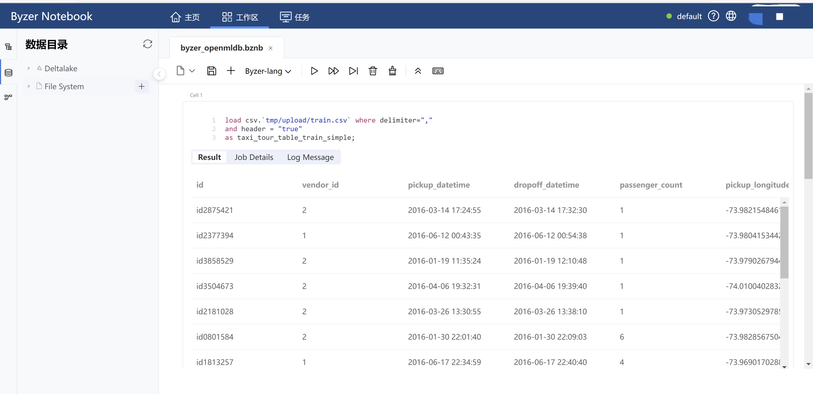

#  OpenMLDB + Byzer: 基于 SQL 打造端到端机器学习应用

本文示范如何使用[OpenMLDB](https://github.com/4paradigm/OpenMLDB)和 [Byzer](https://www.byzer.org/home) 联合完成一个完整的机器学习应用。OpenMLDB在本例中接收Byzer发送的指令和数据，完成数据的实时特征计算，并经特征工程处理后的数据集返回Byzer，供其进行后续的机器学习训练和预测。

## 1. 准备工作

### 1.1 安装 OpenMLDB 引擎

1. 本例使用的是运行在Docker容器中的OpenMLDB集群版。安装步骤详见[OpenMLDB快速上手](../quickstart/openmldb_quickstart.md)。
2. 本例中，Byzer引擎需要从容器外部访问OpenMLDB服务，需要修改OpenMLDB的原始IP配置，修改方式详见[IP配置文档](../reference/ip_tips.md)。

### 1.2 安装 Byzer 引擎和Byzer Notebook 

1. Byzer 引擎的安装步骤详见[Byzer Language官方文档](https://docs.byzer.org/#/byzer-lang/zh-cn/)

2. 本例需要使用 Byzer 提供的[OpenMLDB 插件](https://github.com/byzer-org/byzer-extension/tree/master/byzer-openmldb)完成与 OpenMLDB 的消息传递。在Byzer中使用插件必须配置`streaming.datalake.path`项，详见[Byzer引擎配置说明-常用参数](https://docs.byzer.org/#/byzer-lang/zh-cn/installation/configuration/byzer-lang-configuration)。

3. 本文使用 Byzer Notebook 进行演示，Byzer 引擎安装完成后，请安装Byzer Notebook（您也可以使用[VSCode中的Byzer插件](https://docs.byzer.org/#/byzer-lang/zh-cn/installation/vscode/byzer-vscode-extension-installation)连接您的Byzer 引擎）。关于Byzer Notebook，详见[Byzer Notebook官方文档](https://docs.byzer.org/#/byzer-notebook/zh-cn/)。其界面如下。

   

### 1.3 准备数据集

本文使用的是Kaggle出租车行车时间数据集，若您的Byzer数据湖中没有该数据集，可以从以下网址获得：[Kaggle出租车行车时间预测问题](https://www.kaggle.com/c/nyc-taxi-trip-duration/overview)。将数据集下载到本地后，需要将其导入Byzer Notebook。

## 2. 机器学习全流程

### 2.1 加载原始数据集

将原始数据集导入到 Byzer Notebook 数据目录的File System后，自动生成了`tmp/upload`存储路径。使用Byzer Lang的`load`命令加载该数据集。

```sql
load csv.`tmp/upload/train.csv` where delimiter=","
and header = "true"
as taxi_tour_table_train_simple;
```

### 2.2 将数据导入 OpenMLDB

安装 OpenMLDB 插件

```sql
!plugin app add - "byzer-openmldb-3.0";
```

使用该插件连接 OpenMLDB 引擎。在Byzer Notebook中运行该代码块前，请确保OpenMLDB引擎已启动，并创建了名为`db1`的数据库。

```sql
run command as FeatureStoreExt.`` where
zkAddress="172.17.0.2:7527"
and `sql-0`='''
SET @@execute_mode='offline';
'''
and `sql-1`='''
SET @@job_timeout=20000000;
'''
and `sql-2`='''
CREATE TABLE t1(id string, vendor_id int, pickup_datetime timestamp, dropoff_datetime timestamp, passenger_count int, pickup_longitude double, pickup_latitude double, dropoff_longitude double, dropoff_latitude double, store_and_fwd_flag string, trip_duration int);
'''
and `sql-3`='''
LOAD DATA INFILE 'tmp/upload/train.csv'
INTO TABLE t1 options(format='csv',header=true,mode='append');
'''
and db="db1"
and action="ddl";
```

```{note}
1. zkAddress的端口号应与配置IP时的conf文件夹下各相关文件保持一致
2. 可以通过 $BYZER_HOME\conf 路径下的 \byzer.properties.override 文件中的属性`streaming.plugin.clzznames`检查byzer-openmldb-3.0插件是否成功安装。如果成功安装了该插件，可以看到主类名`tech.mlsql.plugins.openmldb.ByzerApp`。
3. 若未成功安装，可以手动下载jar包再以[离线方式](https://docs.byzer.org/#/byzer-lang/zh-cn/extension/installation/offline_install)安装配置。
```


### 2.3 进行实时特征计算

本例借用[OpenMLDB + LightGBM：出租车行程时间预测](./taxi_tour_duration_prediction.md)2.3节中设计的特征进行特征计算，并将处理后的数据集导出为本地csv文件。

```sql
run command as FeatureStoreExt.`` where
zkAddress="172.17.0.2:7527"
and `sql-0`='''
SET @@execute_mode='offline';
'''
and `sql-1`='''
SET @@job_timeout=20000000;
'''
and `sql-2`='''
SELECT trp_duration, passanger_count,
sum(pickup_latitude) OVER w AS vendor_sum_pl,
max(pickup_latitude) OVER w AS vendor_max_pl,
min(pickup_latitude) OVER w AS vendor_min_pl,
avg(pickup_latitude) OVER W AS vendor_avg_pl,
sum(pickup_latitude) OVER w2 AS pc_sum_pl,
max(pickup_latitude) OVER w2 AS pc_max_pl,
min(pickup_latitude) OVER w2 AS pc_min_pl,
avg(pickup_latitude) OVER w2 AS pc_avg_pl,
count(vendor_id) OVER w2 AS pc_cnt,
count(vendor_id) OVER w AS vendor_cnt
FROM t1
WINDOW w AS(PARTITION BY vendor_id ORDER BY ickup_datetime ROWS_RANGE BETWEEN 1d PRECEDING AND CURRENT ROW),
w2 AS(PARTITION BY passenger_count ORDER BY pickup_datetime ROWS_RANGE BETWEEN 1d PRECEDING AND CURRENT ROW) INTO OUTFILE '/tmp/feature_data';
'''
and db="db1"
and action="ddl";
```


### 2.4 数据向量化

在Byzer Notebook中将所有int 类型字段都转化为 double。

```sql
select *, 
cast(passenger_count as double) as passenger_count_d,
cast(pc_cnt as double) as pc_cnt_d,
cast(vendor_cnt as double) as vendor_cnt_d
from feature_data
as new_feature_data;
```

接着把所有字段合并成一个向量。

```sql
select vec_dense(array(
passenger_count_d,
vendor_sum_pl,
vendor_max_pl,
vendor_min_pl,
vendor_avg_pl,
pc_sum_pl,
pc_max_pl,
pc_min_pl,
pc_avg_pl,
pc_cnt_d,
vendor_cnt
)) as features,cast(trip_duration as double) as label
from new_feature_data
as trainning_table;

```


### 2.5 模型训练

使用Byzer Lang的`train`命令和其[内置的线性回归算法](https://docs.byzer.org/#/byzer-lang/zh-cn/ml/algs/linear_regression)训练模型，并将训练好的模型保存到/model/tax-trip路径下。

```sql
train trainning_table as LinearRegression.`/model/tax-trip` where

keepVersion="true"

and evaluateTable="trainning_table"
and `fitParam.0.labelCol`="label"
and `fitParam.0.featuresCol`= "features"
and `fitParam.0.maxIter`="50";

```

```{note}
可以使用`!show et/params/LinearRegression;`命令查看Byzer内置的线性回归模型的相关参数。 
```

### 2.6 特征部署

将特征计算逻辑部署到OpenMLDB上：将最满意的一次特征计算的代码拷贝后修改执行模式为online即可。本例使用的是前文展示的特征工程中的代码，仅作展示，或许并非表现最优。

```sql
run command as FeatureStoreExt.`` where
zkAddress="172.17.0.2:7527"
and `sql-0`='''
SET @@execute_mode='online';
'''
and `sql-1`='''
SET @@job_timeout=20000000;
'''
and `sql-2`='''
SELECT trp_duration, passanger_count,
sum(pickup_latitude) OVER w AS vendor_sum_pl,
max(pickup_latitude) OVER w AS vendor_max_pl,
min(pickup_latitude) OVER w AS vendor_min_pl,
avg(pickup_latitude) OVER W AS vendor_avg_pl,
sum(pickup_latitude) OVER w2 AS pc_sum_pl,
max(pickup_latitude) OVER w2 AS pc_max_pl,
min(pickup_latitude) OVER w2 AS pc_min_pl,
avg(pickup_latitude) OVER w2 AS pc_avg_pl,
count(vendor_id) OVER w2 AS pc_cnt,
count(vendor_id) OVER w AS vendor_cnt
FROM t1
WINDOW w AS(PARTITION BY vendor_id ORDER BY ickup_datetime ROWS_RANGE BETWEEN 1d PRECEDING AND CURRENT ROW),
w2 AS(PARTITION BY passenger_count ORDER BY pickup_datetime ROWS_RANGE BETWEEN 1d PRECEDING AND CURRENT ROW) INTO OUTFILE '/tmp/feature_data_test';
'''
and db="db1"
and action="ddl";

```

导入在线数据，本例使用的是原始数据集中的test集。生产环境中可以接入实时数据源。

```sql
run command as FeatureStoreExt.`` where
zkAddress="172.17.0.2:7527"
and `sql-0`='''
SET @@execute_mode='online';
'''
and `sql-1`='''
SET @@job_timeout=20000000;
'''
and `sql-2`='''
CREATE TABLE t1(id string, vendor_id int, pickup_datetime timestamp, dropoff_datetime timestamp, passenger_count int, pickup_longitude double, pickup_latitude double, dropoff_longitude double, dropoff_latitude double, store_and_fwd_flag string, trip_duration int);
'''
and `sql-3`='''
LOAD DATA INFILE 'tmp/upload/test.csv'
INTO TABLE t1 options(format='csv',header=true,mode='append');
'''
and db="db1"
and action="ddl";
```


### 2.7 模型部署

在Byzer Notebook中将之前保存的、训练好的模型注册为一个可以直接使用的函数。

```sql
register LinearRegression.`/model/tax-trip` as tax_trip_model_predict;
```

### 2.8 预测

将经OpenMLDB处理后的在线数据集的所有int类型字段转成double。

```sql
select *, 
cast(passenger_count as double) as passenger_count_d,
cast(pc_cnt as double) as pc_cnt_d,
cast(vendor_cnt as double) as vendor_cnt_d
from feature_data_test
as new_feature_data_test;
```

再进行向量化。

```sql
select vec_dense(array(
passenger_count_d,
vendor_sum_pl,
vendor_max_pl,
vendor_min_pl,
vendor_avg_pl,
pc_sum_pl,
pc_max_pl,
pc_min_pl,
pc_avg_pl,
pc_cnt_d,
vendor_cnt
)) as features,
from new_feature_data_test
as testing_table;
```

使用处理后的测试集进行预测。

```sql
select tax_trip_model_predict(testing_table) as predict_label;
```


