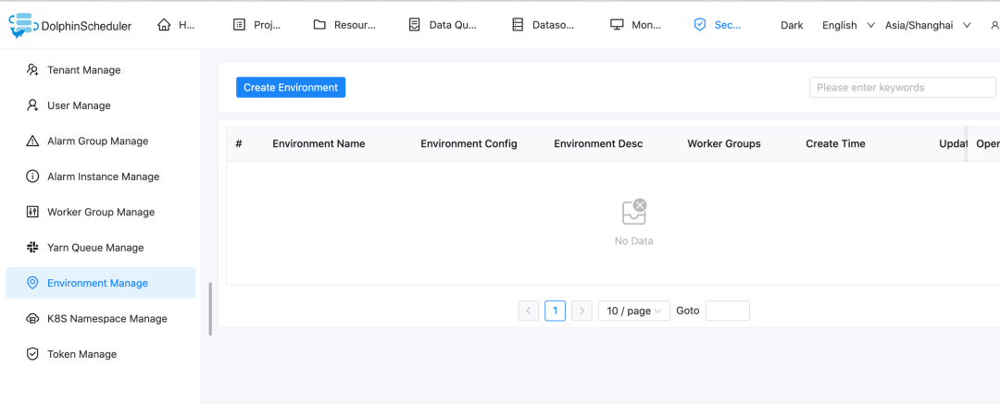
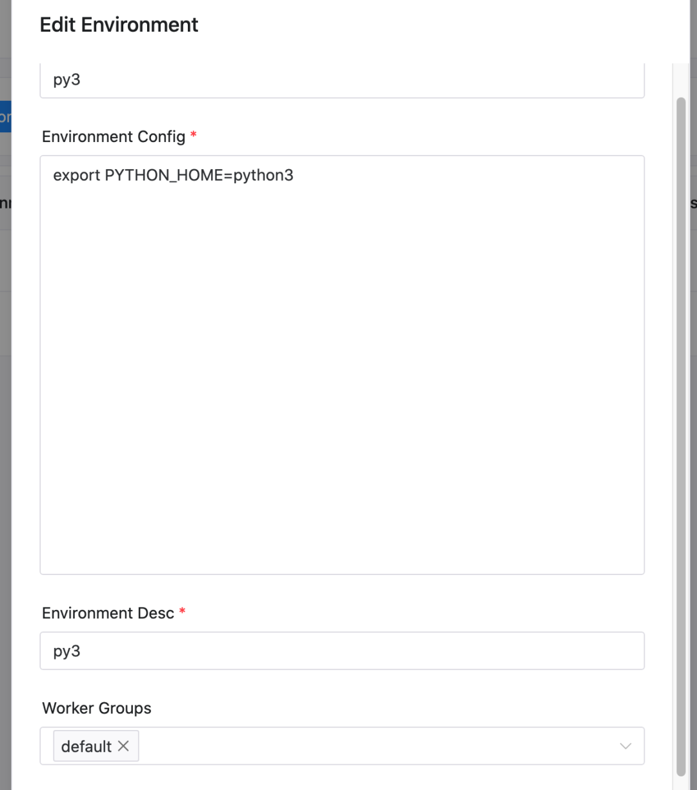
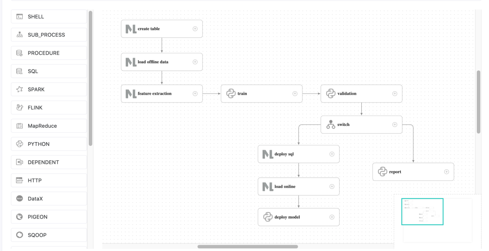
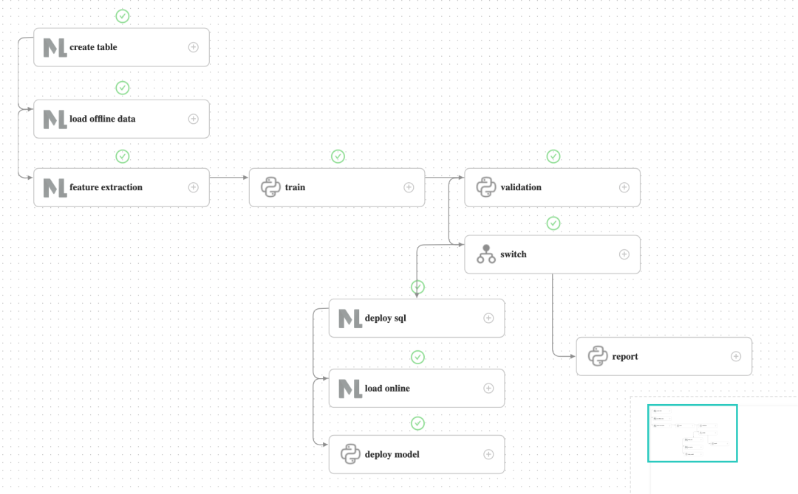

# DolphinScheduler OpenMLDB Task：打造端到端MLOps工作流

## 导读
在机器学习从开发到上线的业务闭环中，数据处理、特征开发、模型训练往往要耗费大量的时间和人力。为给 AI 模型构建及应用上线提供便利，简化机器学习建模工程化的流程，我们开发了 DolphinScheduler OpenMLDB Task，将特征平台能力融入 DolphinScheduler 的工作流，链接特征工程与调度环节，打造端到端 MLOps 工作流，帮助开发者专注于业务价值的探索。本文将为大家简要介绍并实际演示 DolphinScheduler OpenMLDB Task 的操作流程。

```{seealso}
[DolphinScheduler OpenMLDB Task 官方文档](https://dolphinscheduler.apache.org/zh-cn/docs/dev/user_doc/guide/task/openmldb.html)
```

## 场景和功能
### DolphinScheduler OpenMLDB Task 为什么诞生


作为提供生产级数据及特征开发全栈解决方案的开源机器学习数据库，OpenMLDB 提升易用性、降低使用门槛的关键点来自上下游的连通。如上图所示，接入数据源可以使得 DataOps 内的数据更加简单轻松地流入 OpenMLDB，而 OpenMLDB 供给的特征也需要顺滑地进入 ModelOps，接受训练。为了减少每个开发者手动完成接入带来的巨大的工作量，提升 OpenMLDB 使用的便捷度，我们也开发了 OpenMLDB 接入 Deployment 和 Monitoring的功能。本次想和大家重点介绍的就是 OpenMLDB 接入 DolphinScheduler 工作流的框架。DolphinScheduler OpenMLDB Task 可以更简单地操作 OpenMLDB，同时 OpenMLDB 任务也被 Workflow 管理，更加自动化。

### DolphinScheduler OpenMLDB Task 可以做什么

OpenMLDB 希望能达成开发即上线的目标，让开发回归本质，而不是在工程化落地中耗费过多心思。通过编写 OpenMLDB Task，我们可以实现 OpenMLDB 的离线导入、特征抽取、SQL 部署上线、在线导入等需求，也可以在DolphinScheduler 中编写一个完整的使用 OpenMLDB 的训练上线流程。


比如我们设想的最简易的用户操作流程，如上图所示，流程中的1-4步正对应离线导入、特征抽取、SQL 部署上线和在线导入，均可以通过 DolphinScheduler OpenMLDB Task 编写。

除了OpenMLDB中的SQL上线，实时预测还需要模型上线。所以接下来，我们将基于 kaggle 比赛中的 TalkingData 广告欺诈检测场景，为大家演示如何使用 DolphinScheduler OpenMLDB Task 编排一个完整的机器学习训练上线的流程。TalkingData 比赛详情见[talkingdata-adtracking-fraud-detection](https://www.kaggle.com/competitions/talkingdata-adtracking-fraud-detection/discussion)。

## 实践演示
### 环境配置

**运行 OpenMLDB 镜像**

推荐在我们提供的 OpenMLDB 镜像内进行演示测试：
```
docker run -it 4pdosc/openmldb:0.5.2 bash
```
```{attention}
DolphinScheduler 需要操作系统的用户，并且该用户需要有 sudo 权限。所以推荐在 OpenMLDB 容器内下载并启动 DolphinScheduler。否则，请准备有sudo权限的操作系统用户。
```

在容器中，可以直接运行以下命令启动 OpenMLDB cluster。
```
./init.sh
```

**运行 Predict Server**

我们将完成一个导入数据，离线训练，训练成功后模型上线的工作流。模型上线的部分，可以使用简单的predict server，见[predict server source](https://raw.githubusercontent.com/4paradigm/OpenMLDB/main/demo/talkingdata-adtracking-fraud-detection/predict_server.py)。你可以将它下载至本地，并运行至后台：
```
python3 predict_server.py --no-init > predict.log 2>&1 &
```

**运行 DolphinScheduler**

DolphinScheduler 支持 OpenMLDB Task 的版本，请下载[dolphinscheduler-bin](https://github.com/4paradigm/OpenMLDB/releases/download/v0.5.1/apache-dolphinscheduler-dev-SNAPSHOT-bin.tar.gz)。注意，由于目前 DolphinScheduler 官方尚未发布最新的包含 OpenMLDB Task 的 release 版本（仅有 `dev` 版本），所以我们直接提供了一个可供下载版本。稍后 DolphinScheduler 更新发布以后则无须分开下载。

启动 DolphinScheduler standalone，步骤如下，更多请参考[官方文档](https://dolphinscheduler.apache.org/en-us/docs/3.0.0/user_doc/guide/installation/standalone.html)。
```
tar -xvzf apache-dolphinscheduler-*-bin.tar.gz
cd apache-dolphinscheduler-*-bin
sh ./bin/dolphinscheduler-daemon.sh start standalone-server
```

浏览器访问地址 http://localhost:12345/dolphinscheduler/ui 即可登录系统UI。默认的用户名和密码是 admin/dolphinScheduler123。

DolphinScheduler 的 worker server 需要 OpenMLDB Python SDK, DolphinScheduler standalone 的 worker 即本机，所以只需在本机安装OpenMLDB Python SDK。我们的OpenMLDB镜像中已经安装了。如果你在别的环境中，请运行：

```
pip3 install openmldb
```

**下载工作流配置并配置 Python 环境**

工作流可以手动创建，为了简化演示，我们直接提供了 json 工作流文件，[点击下载](https://github.com/4paradigm/OpenMLDB/releases/download/v0.5.1/workflow_openmldb_demo.json)，稍后可以直接导入到 DolphinScheduler 环境中，并做简单的修改，即可完成全工作流。

Python task 需要显式设置 Python 环境，最简单的办法是在bin/env/dolphinscheduler_env.sh中修改`PYTHON_HOME`，再启动 DolphinScheduler 。请填写python3的绝对路径，而不是相对路径。
```{caution}
注意，在 DolphinScheduler standalone 运行前，配置的临时环境变量`PYTHON_HOME`不会影响work server中的环境。
```
如果你已经启动 DolphinScheduler ，也可以在启动后的web页面中进行环境设置，设置方法如下。**注意，这样的情况下，需要确认工作流中的task都使用该环境。**




### Demo 演示

#### 1. 初始配置


在 DolphinScheduler Web中创建租户，进入租户管理界面，填写有 sudo 权限的操作系统用户，queue 可以使用 default。docker容器内可直接使用root用户。

再绑定租户到用户，简单起见，我们直接绑定到 admin 用户。进入用户管理页面，点击编辑admin用户。

绑定后，用户状态类似下图。


#### 2. 创建工作流
DolphinScheduler 中，需要先创建项目，再在项目中创建工作流。

所以，首先创建一个test项目，如下图所示，点击创建项目并进入项目。


进入项目后，导入下载好的工作流文件。如下图所示，在工作流定义界面点击导入工作流。


导入后，工作流列表中将出现该工作流，类似下图。


点击该工作流名字，可查看工作流的详细内容，如下图所示。


**注意**，此处需要一点修改，因为导入工作流后task 的 ID 会有变化。特别的，switch task 中的上游和下游 id 都不会存在，需要手动改一下。


如上图所示，switch task中的设置中有不存在的id。请将成功和失败的“分支流转”和“前置检查条件”修改为当前工作流的task。
正确结果如下图所示：


修改完成后，直接保存该工作流。导入的工作流中 tenant 默认会是 default，也是**可以运行**的。如果你想指定自己的租户，请在保存工作流时选择租户，如下图所示。


#### 3. 上线运行

工作流保存后，需要先上线再运行。上线后，运行按钮才会点亮。如下图所示。


点击运行后，等待工作流完成。可在工作流实例(Workflow Instance)界面，查看工作流运行详情，如下图所示。


为演示成功上线的流程，validation 并未进行实际验证，直接返回验证成功并流入deploy分支。运行 deploy 的分支，deploy  sql 及之后的 task 都成功后，predict server 接收到最新的模型。

predict server同时提供了在线预测服务，通过`curl /predict`请求。我们简单地构造一个实时请求，发送至predict server。
```
curl -X POST 127.0.0.1:8881/predict -d '{"ip": 114904,
       "app": 11,
       "device": 1,
       "os": 15,
       "channel": 319,
       "click_time": 1509960088000,
       "is_attributed": 0}'
```
返回结果如下：

