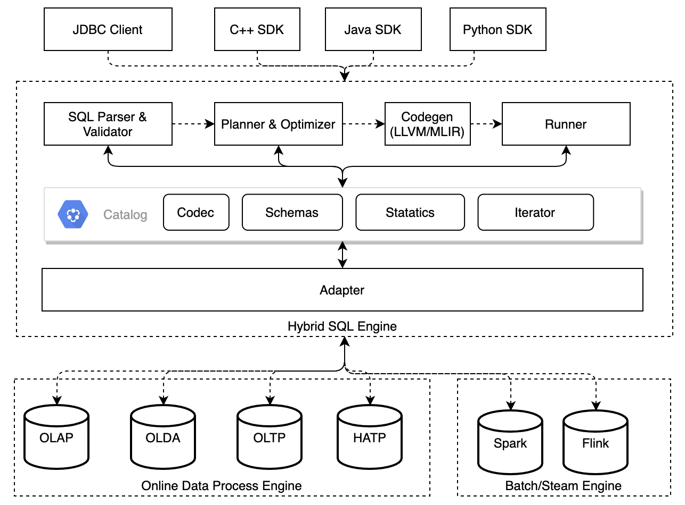

[](https://github.com/4paradigm/HybridSE/actions/workflows/hybridse-ci.yml?query=branch%3Amain++)
[](https://github.com/4paradigm/HybridSE/releases/latest)
[](https://github.com/4paradigm/HybridSE/milestones)
[](https://github.com/4paradigm/HybridSE/blob/main/LICENSE)
[](https://codecov.io/gh/4paradigm/HybridSE)

- [**Slack Channel**](https://hybridsql-ws.slack.com/archives/C01R7LAF6AY)
- [**Discussions**](https://github.com/4paradigm/HybridSE/discussions)
- [English README](README.md)

# 介绍

HybridSE(Hybrid SQL Engine)是基于C++和LLVM实现的高性能混合SQL执行引擎，为AI应用、OLAD数据库、HTAP系统、SparkSQL、Flink Streaming SQL等提供一致性的SQL加速优化。



HybridSE是一个模块化的SQL编译器和执行器，提供了SQL语法校验、逻辑计划生成和优化、表达式优化、离线或在线物理计划生成、Native代码生成以及单机或分布式Runner实现等功能。开发者使用HybridSE可以快速实现一个支持SQL的高性能数据库，也可以用HybridSE来优化离线SQL执行引擎的性能。相比与MySQL、SparkSQL等内置实现的SQL执行引擎，HybridSE不仅性能更优，而且针对AI场景进行了语法拓展和优化，更加适应现代SQL引擎的需求，HybridSE的特性如下。

- __高性能__

  基于LLVM JIT即时编译技术，针对不同硬件环境动态生成二进制码，内置数十种SQL编译优化过程，还有更灵活的内存管理，保证性能在所有SQL引擎中处于前列。

- __拓展性强__

  HybridSE模块化的设计，对外可生成不同阶段的逻辑计划和物理计划，加上丰富完善的多编程语言SDK，无论是实时的OLAD数据库，还是离线的分布式OLAP系统、流式SQL系统都可以使用HybridSE进行SQL优化和加速。

- __针对机器学习优化__

  提供机器学习场景常用的特殊拼表操作以及定制化UDF/UDAF支持，基本满足生产环境下机器学习特征抽取和上线的应用需求。

- __离线在线一致性__

  同一套SQL语法解析和CodeGen代码生成逻辑，保证使用HybridSE的离线和在线系统落地时计算语意一致，SQL中内置UDF/UDAF语法也避免跨语言系统的函数一致性问题。


# 快速开始

## 依赖

+ [git](https://git-scm.com)
+ [docker](https://docs.docker.com/engine/install/)

## 准备开发环境

```bash
git clone --recursive https://github.com/4paradigm/HybridSE.git
cd HybridSE
docker run -v `pwd`:/HybridSE -it ghcr.io/4paradigm/hybridsql:0.3.0
cd /HybridSE
# init enviroment before build
./tools/init_env.profile.sh
```

建议开发者使用我们提供的镜像编译和安装库。若需要使用自己的开发环境，请确保相关依赖库正确安装。编译环境和依赖库可参考 [HybridSQL-docker](https://github.com/4paradigm/HybridSQL-docker/blob/main/README.md)

## 编译

```bash
cd /HybridSE
mkdir -p build && cd build
cmake ..
# just compile the core library
make -j$(nproc) hybridse_core
```

## 安装

```bash
cd /HybridSE
mkdir -p build && cd build
cmake ..  -DCMAKE_INSTALL_PREFIX="CONFIG_YOUR_HYRBIDSE_INSTALL_DIR"
make -j$(nproc) install
```

更详细的编译和安装配置可参见文档：[快速开始HybridSE](https://github.com/4paradigm/HybridSQL-docs/blob/feat/hybridse-quick-start-doc/hybridse/usage/quick_start.md)

## 测试

```bash
cd /HybridSE
mkdir -p build & cd buid
cmake .. -DTESTING_ENABLE=ON
export SQL_CASE_BASE_DIR=/HybridSE 
make -j$(nproc) && make -j$(nproc) test
```

## 运行 simple engine demo

```bash
cd /HybridSE
mkdir build
cd build
cmake ..
make -j$(nproc) hybridse_proto && make -j$(nproc) simple_engine_demo
./src/simple_engine_demo
```
`simple_engine_demo`是基于HyrbidSE实现的内存表SQL引擎。更多细节可参见文档：[如何实现一个简单引擎](https://github.com/4paradigm/HybridSQL-docs/blob/feat/simple_engine_demo_doc/hybridse/usage/simple_engine_demo.md)

## 运行 ToyDB

+ 编译 ToyDB

  ```bash
  cd /HybridSE
  mkdir build 
  cmake .. -DEXAMPLES_ENABLE=ON 
  make -j$(nproc) hybridse_proto && make -j$(nproc) toydb
  ```

+ 启动 ToyDB

  ```
  cd /HybridSE/examples/toydb/onebox
  bash start_all.sh
  bash start_cli.sh
  ```

ToyDB是基于HybridSE开发的简易单机内存数据库. 它支持基本的数据库操作和SQL查询语句。详细使用可参见：[ToyDB快速开始](https://github.com/4paradigm/HybridSQL-docs/blob/feat/hybridse-quick-start-doc/hybridse/usage/toydb_usage/toydb_quickstart.md)


## 生态项目

| 项目                                                    | 状态   | 描述                                             |
| :------------------------------------------------------ | :----- | :----------------------------------------------- |
| [FEDB](https://github.com/4paradigm/fedb)               | 开源   | 面向在线推理和决策应用的NewSQL数据库                 |
| [SparkFE](https://github.com/4paradigm/SparkFE) | 开源   | 面向特征工程场景的基于LLVM优化的高性能Spark原生执行引擎      |
| NativeFlink                                             | 开发中 | 基于HybridSE开发的高性能批流一体FlinkSQL执行引擎 |

## 未来规划

### ANSI SQL兼容

HybridSE已经兼容主流的DDL、DML语法，并将逐步增强对ANSI SQL语法的兼容性，从而简化用户从其他SQL引擎迁移的成本。

- [2021H1&H2]完善Window的标准语法，支持Where, Group By, Join等操作
- [2021H1&H2]针对AI场景扩展特有的语法特性和UDAF函数

### 性能优化

HybridSE内置数十种SQL表达式和逻辑计划优化，提供标准的优化Pass实现接口，未来将会接入更多的SQL优化从而提升系统性能。

- [2021H1]面向批式数据处理和请求式数据处理场景支持逻辑和物理计划优化
- [2021H1]支持高性能分布式执行计划生成和代码生成
- [2021H2]基于LLVM的表达式编译和生成代码优化
- [2021H2]更多经典SQL表达式优化过程支持

### 生态集成

HybridSE可拓展适配NoSQL、OLAP、OLTP等系统，已支持SparkSQL和FEDB底层替换，未来将兼容接入更多开源生态系统。

* [2021H2]适配流式等主流开源SQL计算框架等，如优化FlinkSQL性能等
* [2021H2]适配多种行编码格式和列编码格式，兼容Apache Arrow格式和生态
* [2021H2]支持主流编程语言接口，包括C++, Java, Python, Go, Rust SDK等

## 反馈与参与

- Bug、疑惑、修改欢迎提在[Github Issue](https://github.com/4paradigm/HybridSE/issues)
- 想了解更多或者有想法可以参与到[Discussions](https://github.com/4paradigm/HybridSE/discussions)和[slack](https://hybridsql-ws.slack.com/archives/C01R7LAF6AY)交流

## 许可证

[Apache License 2.0](https://github.com/4paradigm/HybridSE/blob/main/LICENSE)
