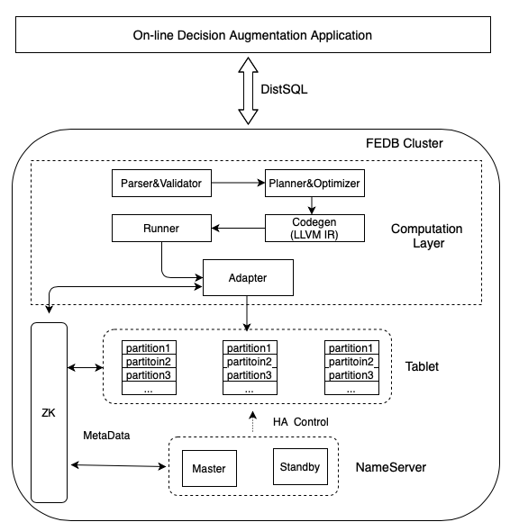

# rtidb部署文档

## 系统架构



## 整体架构介绍

rtidb集群使用master/slave模式，master会控制整个集群数据分布以及数据高可用。数据副本之间
实时通过binlog同步

### master 高可用

master会通过zk 选主，一个master多个备节点，当一个主master挂掉后，其他备节点会成master

### 数据高可用

rtidb会通过多副本和自动主从切换实现数据高可用

## 机器列表

假设有3台机器
* host1
* host2
* host3

## zookeeper 

使用zk做master选主操作, 以及slave存活检测

### zookeeper 部署

在每台机器上面都部署一个zookeeper 节点
#### zoo.conf

```
clientPort=2181
initLimit=5
syncLimit=2
server.1=host1:6181:6281
server.2=host2:6181:6281
server.3=host3:6181:6281
```

#### myid

每台机器需要有一个myid配置,分别配置为一个数字id,比如host1  myid内容为1

## rtidb master部署

在每天机器上面都部署一个NameServer(Master)

## rtidb tablet部署

在每台机器上面都部署一个TabletServer(Slave)

### 目录结构

* bin 存放rtidb二进制文件以及相关启动脚本
* binlogs 存储table的binlogs文件
* snapshots 存储table的内存快照
* logs 存储rtidb运行日志文件
* conf 存放rtidb配置文件

### bin/start_nameserver.sh

rtidb nameserver启动脚本，运行目录需要在bin下面，启动命令为
```
cd bin && sh start_nameserver.sh
```

### bin/start_tablet.sh

rtidb tablet启动脚本，运行目录需要在bin下面，启动命令为
```
cd bin && sh start_tablet.sh
```

### bin/stop_nameserver.sh

rtidb nameserver 停止脚本，运行目录在bin下面，停止命令为
```
cd bin && sh stop_nameserver.sh
```

### bin/stop_tablet.sh

rtidb tablet 停止脚本，运行目录在bin下面，停止命令为
```
cd bin && sh stop_tablet.sh
```

### rtidb 配置文件

#### 配置 rtidb启动端口号以及监听ip地址

这里只允许ip地址，不允许域名

```
--endpoint=0.0.0.0:9527
```

#### 配置日志

```
# 配置日志存储路径，如果是自定义路径，请写绝对路径
--log_dir=./logs

# 配置日志级别, info 或者 warning
--log_level=info
```
