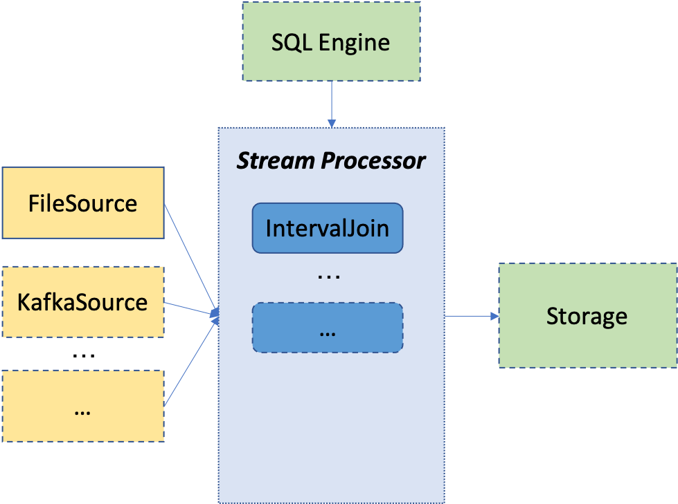

# Stream Engine

## Architecture



This is a stream engine of OpenMLDB, specialized for parallel stream aggregation, e.g., interval join.
Currently it only supports the `Interval Join` op, leaving the support of other operations as future work.
In addition, it only supports `FileSource` and parameter-based configuration.

## Compile and Run
### Compile
```bash
# in the OpenMLDB root directory
make stream
```

### Run the main program
```bash
# in the OpenMLDB root directory
./build/bin/interval_join

# show all the config
./build/bin/interval_join --help
```