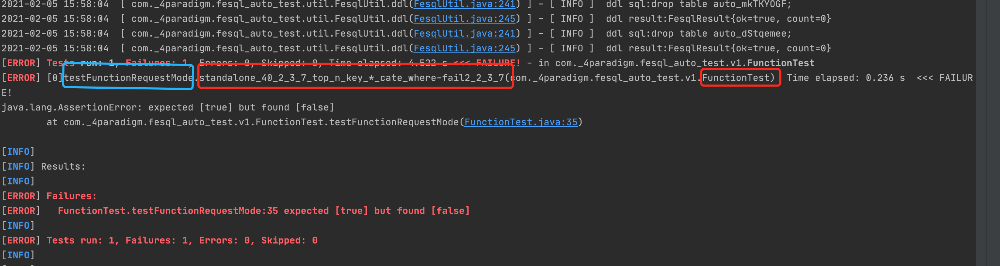

### 测试执行
- java case执行
    + 批量执行case
        1. 下载docker镜像：
         ```shell
         docker run -it --name java_sdk_test ghcr.io/4paradigm/centos6_gcc7_hybridsql:0.1.1
         ```
        2. clone代码：
         ```shell
         git clone https://gitlab.4pd.io/FeatureEngineering/HybridSQL-test.git
         ```
        3. 默认是master分支，如有需要请切换分支
        4. 执行命令，进行测试
        ```shell
        source /root/.bashrc && bash steps/openmldb-sdk-test-java.sh -b SRC -c test_all.xml -d standalone -l "0"
        ```
        5. 脚本参数说明
        
        | 参数 | 说明 |
        | :--- | :--- |
        |-b|SRC表示从源码进行编译，会从github上下载代码然后进行编译，PKG表示直接从github上下载压缩包部署|
        |-c|执行的suite_xml,决定了跑哪些case|
        |-d|部署模式，有cluster和standalone两种，默认cluster|
        |-l|测试的case级别，有0，1，2，3，4，5六个级别，默认为0，也可以同时跑多个级别的case，例如：1,2,3,4,5|
    + 执行单个case
        1. 普通的mvn测试函数过滤mvn test -Dtest=SelectTest#testSelectRequestMode
        2. 支持yaml路径过滤-DcasePath="/function/select/test_select_sample.yaml"
        3. 支持case Desc过滤-DcaseDesc="查询所有列"
        4. 支持case Desc过滤-DcaseId=1
        5. 支持环境过滤 -DcaseEnv=cluster, -DcaseEnv=standalone
        6. 可以配置caseName来过滤,caseName在错误信息里面就能看到，直接复制下来过滤重新跑就好
        ```shell
        mvn test -Dtest=FunctionTest#testFunctionRequestMode -DcaseName="standalone_40_2_3_7_top_n_key_*_cate_where-fail2_2_3_7"
        ```
        
- python case执行
    + 批量执行case
        1. 下载docker镜像：
         ```shell
         docker run -it --name java_sdk_test ghcr.io/4paradigm/centos6_gcc7_hybridsql:0.1.1
         ```
        2. clone代码：
         ```shell
         git clone https://gitlab.4pd.io/FeatureEngineering/HybridSQL-test.git
         ```
        3. 默认是master分支，如有需要请切换分支
        4. 执行命令，进行测试
        ```shell
        source /root/.bashrc && bash steps/openmldb-sdk-test-python.sh -b SRC -d standalone -l "0"
        ```
        5. 脚本参数说明

      | 参数 | 说明 |
      | :--- | :--- |
      |-b|SRC表示从源码进行编译，会从github上下载代码然后进行编译，PKG表示直接从github上下载压缩包部署|
      |-d|部署模式，有cluster和standalone两种，默认cluster|
      |-l|测试的case级别，有0，1，2，3，4，5六个级别，默认为0，也可以同时跑多个级别的case，例如：1,2,3,4,5|
    + 执行单个case
        1. 使用pytest的-k参数，-k需要测试的指定关键词
        ```shell
        pytest -s -k test_function test/test_select.py
        ```